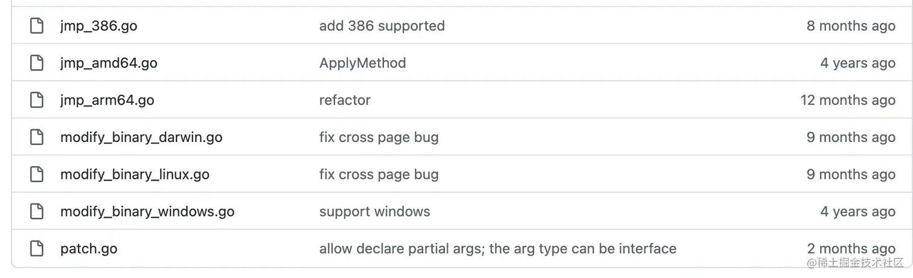
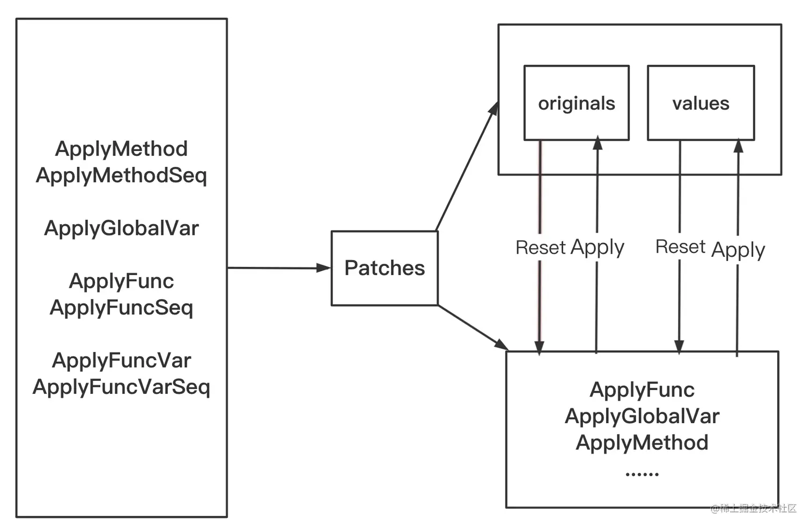

# gomonkey

<font style="color:#595959;"> gomonkey 提供了在运行时热替换原有实现（包含变量，函数，方法等）的能力，从 Test Double 的角度看，其实 gomonkey 起到的作用跟 gomock 有点像，但还不完全一样。</font>

* gomock 是基于 interface 生成另一套 mock 实现，我们单测的时候需要依赖这个 mock 的实现，采用依赖注入的方式来调整其他部分对于该接口的依赖；
* gomonkey 则是直接在运行时，通过热替换的方式，把变量/函数/方法的内容给替换了，在 Reset 回来前，我们直接调用老函数，老的方法，其实已经是新的，被替换的实现了。

<font style="color:#595959;">而 goconvey 和这两个则不在一个维度，大体分类上说，gomock 和 gomonkey 都属于在 Test Double 方面提供能力，也就是我们通常说的，广义的 mock，有了这两个库，你就可以自定义一套实现来进行替换了。</font>

<font style="color:#595959;">goconvey 则是一个【测试框架】，提供了 Convey 和 So 来搭配使用，树形结构方便构造各种场景。它本身是不会提供 mock 能力的，你可以基于 goconvey 来组织你的单测，在需要 mock 的时候选用 gomock，gomonkey 或者其他我们介绍过的实现。</font>

<font style="color:#595959;">好了，这里是一点概念的拆解，我们下来进入正题，看看 gomonkey 能带来什么能力，怎么用。</font>

# Monkey Patching

<font style="color:#595959;">要聊 gomonkey，先来了解一下它支持的【Monkey Patching】到底是什么，在 Golang 中如何落地。先来看看 </font>[维基百科](https://link.juejin.cn/?target=https%3A%2F%2Fen.wikipedia.org%2Fwiki%2FMonkey_patch)<font style="color:#595959;"> 中的解释：</font>

> <font style="color:#595959;">A monkey patch is a way for a program to extend or modify supporting system software locally (affecting only the running instance of the program).</font>
>
> <font style="color:#595959;">The definition of the term varies depending upon the community using it. In Ruby,\[2] Python,\[3] and many other dynamic programming languages, the term monkey patch only refers to dynamic modifications of a class or module at runtime, motivated by the intent to patch existing third-party code as a workaround to a bug or feature which does not act as desired.</font>

<font style="color:#595959;">monkey patch 就是在运行时，动态修改一些变量/函数/方法/模块 的行为的能力。对于有些三方的库，我们没有权限去调整代码逻辑，而这又会对我们测试带来影响，所以，我们通过【运行时替换】的方法来改掉这些实体的行为。</font>

<font style="color:#595959;">虽然变量我们有时候也会涉及，但其实 mock 的主体还是函数，所以简化一下诉求就变成：在运行时将原本需要调用的函数替换成另一个函数。</font>

# 实战用法

<font style="color:#595959;">使用前我们还是用 go get 添加一下依赖：</font>

```plain
go get github.com/agiledragon/gomonkey/v2@v2.2.0
```

<font style="color:#595959;">有一点一定要注意，golang编译器在编译时会进行内联优化，即把简短的函数在调用它的地方展开，从而消除调用目标函数的开销。但因为内联消除了调用目标函数时的跳转操作，使得go monkey填充在目标函数入口处的指令无法执行，因而也无法实现函数体的运行时替换，使go monkey失效。所以，执行测试 case 前一定要注意加上 -gcflags=all=-l</font>

```plain
go test -gcflags=all=-l
```

<font style="color:#595959;">官方的</font>[示例](https://link.juejin.cn/?target=https%3A%2F%2Fgithub.com%2Fagiledragon%2Fgomonkey%2Ftree%2Fmaster%2Ftest)<font style="color:#595959;"> 其实就是他们的单测case，这是很好的示范，把单测写好，写对，用它直接来做文档，比很多时候文档和 code 不 match 好的多。官方案例还是稍微有点复杂的，建议大家先看下我们下面的简单的用法，再过一下官方通过 goconvey 的实践。</font>

## 函数打桩

<font style="color:#595959;">给函数打桩是最常见的场景，ApplyFunc 接口定义如下：</font>

```plain
func ApplyFunc(target, double interface{}) *Patches
func (this *Patches) ApplyFunc(target, double interface{}) *Patches
```

<font style="color:#595959;">ApplyFunc第一个参数是函数名，第二个参数是桩函数。测试完成后，patches 对象通过 Reset 成员方法删除所有测试桩。</font>

<font style="color:#595959;">这里我们看一个最简单的示例，有时候我们希望 fake.Exec（fake包下的Exec函数）返回固定的值，就可以插桩来指定。最后通过 defer 来 Reset 就好。</font>[gomonkey/test/apply\_func\_test.go ](https://github.com/agiledragon/gomonkey/blob/master/test/apply_func_test.go)

```go
var (
	outputExpect = "xxx-vethName100-yyy"
)

// 在 package fake下，返回值为string类型
func Exec(cmd string, args ...string) (string, error) {
    ... // 逻辑运算
    return string_val
}

func TestApplyFunc(t *testing.T) {
    Convey("TestApplyFunc", t, func() {
    
        Convey("one func for succ", func() {
            patches := ApplyFunc(fake.Exec, func(_ string, _ ...string) (string, error) {
                return outputExpect, nil	// 指定想要的返回值
            })
            defer patches.Reset()
            output, err := fake.Exec("", "")
            So(err, ShouldEqual, nil)
            So(output, ShouldEqual, outputExpect)
        })
    })
})
```

<font style="color:#595959;">此外，gomonkey 还支持对函数打一个特定的桩序列：</font>

```go
func TestApplyFuncSeq(t *testing.T) {
    Convey("TestApplyFuncSeq", t, func() {

		Convey("default times is 1", func() {
			info1 := "hello cpp"
			info2 := "hello golang"
			info3 := "hello gomonkey"
			outputs := []OutputCell{
				{Values: Params{info1, nil}},
				{Values: Params{info2, nil}},
				{Values: Params{info3, nil}},
			}
			patches := ApplyFuncSeq(fake.ReadLeaf, outputs)
			defer patches.Reset()

			runtime.GC()

			output, err := fake.ReadLeaf("")
			So(err, ShouldEqual, nil)
			So(output, ShouldEqual, info1)
			output, err = fake.ReadLeaf("")
			So(err, ShouldEqual, nil)
			So(output, ShouldEqual, info2)
			output, err = fake.ReadLeaf("")
			So(err, ShouldEqual, nil)
			So(output, ShouldEqual, info3)
		})
    })
}
```

## 方法打桩

<font style="color:#595959;">这里要用到 ApplyMethod 的能力，签名如下</font>

```plain
func ApplyMethod(target reflect.Type, methodName string, double interface{}) *Patches
func (this *Patches) ApplyMethod(target reflect.Type, methodName string, double interface{}) *Patches
```

<font style="color:#595959;">第一个参数是目标类的指针变量的反射类型，可以用 reflect.TypeOf 来获取。第二个参数是字符串形式的方法名，第三个参数是桩函数。测试完成后，patches 对象通过 Reset 成员方法删除所有测试桩。</font>

<font style="color:#595959;">我们在 fake 包定义下面的结构：</font>

```plain
type Slice []int

func NewSlice() Slice {
    return make(Slice, 0)
}

func (this* Slice) Add(elem int) error {}

func (this* Slice) Remove(elem int) error {}

func (this *Slice) Append(elems ...int) int {}
```

<font style="color:#595959;">一个类型 Slice，以及下面的 Add, Remove, Append 三个方法。具体的实现省略。</font>

<font style="color:#595959;">现在我们要针对 Add 方法来打桩，就可以这样：</font>

```plain
slice := fake.NewSlice()
var s *fake.Slice

patches := ApplyMethod(reflect.TypeOf(s), "Add", func(_ *fake.Slice, _ int) error {
	return nil
})
defer patches.Reset()
```

<font style="color:#595959;">注意，使用ApplyMethod时，reflect.TypeOf(caller)的caller入参和func(\_ caller)的caller入参必须和原方法一致，原方法采用的是结构体调用，那么caller就必须为结构体，反之就都得为指针。</font>

<font style="color:#595959;">官方完整示例如下:</font>

```plain
func TestApplyMethod(t *testing.T) {
  slice := fake.NewSlice()
  var s *fake.Slice
  Convey("TestApplyMethod", t, func() {

    Convey("for succ", func() {
      err := slice.Add(1)
      So(err, ShouldEqual, nil)
      patches := ApplyMethod(reflect.TypeOf(s), "Add", func(_ *fake.Slice, _ int) error {
        return nil
      })
      defer patches.Reset()
      err = slice.Add(1)
      assert.Equal(t, nil, err)
      err = slice.Remove(1)
      assert.Equal(t, nil, err)
      assert.Equal(t, 0, len(slice))
    })

    //多方法
    Convey("two methods", func() {
      err := slice.Add(3)
      assert.Equal(t, nil, err)
      defer slice.Remove(3)
      patches := ApplyMethod(reflect.TypeOf(s), "Add", func(_ *fake.Slice, _ int) error {
        return fake.ErrElemExsit
      })
      defer patches.Reset()
      patches.ApplyMethod(reflect.TypeOf(s), "Remove", func(_ *fake.Slice, _ int) error {
        return fake.ErrElemNotExsit
      })
      err = slice.Add(2)
      assert.Equal(t, fake.ErrElemExsit, err)
      err = slice.Remove(1)
      assert.Equal(t, fake.ErrElemNotExsit, err)
      assert.Equal(t, 1, len(slice))
      assert.Equal(t, 3, slice[0])
    })

    //方法and函数
    Convey("one func and one method", func() {
      err := slice.Add(4)
      assert.Equal(t, nil, err)
      defer slice.Remove(4)
      patches := ApplyFunc(fake.Exec, func(_ string, _ ...string) (string, error) {
        return outputExpect, nil
      })
      defer patches.Reset()
      patches.ApplyMethod(reflect.TypeOf(s), "Remove", func(_ *fake.Slice, _ int) error {
        return fake.ErrElemNotExsit
      })
      output, err := fake.Exec("", "")
      assert.Equal(t, nil, err)
      assert.Equal(t, outputExpect, output)
      err = slice.Remove(1)
      assert.Equal(t, fake.ErrElemNotExsit, err)
      assert.Equal(t, 1, len(slice))
      assert.Equal(t, 4, slice[0])
    })
  })
}
```

<font style="color:#595959;">类似的，gomonkey 也支持对成员方法打特定的桩序列：</font>

```plain
func TestApplyMethodSeq(t *testing.T) {
  e := &fake.Etcd{}
  Convey("default times is 1", t, func() {
    info1 := "hello cpp"
    info2 := "hello golang"
    info3 := "hello gomonkey"
    outputs := []OutputCell{
      {Values: Params{info1, nil}},
      {Values: Params{info2, nil}},
      {Values: Params{info3, nil}},
    }
    patches := ApplyMethodSeq(reflect.TypeOf(e), "Retrieve", outputs)
    defer patches.Reset()
    output, err := e.Retrieve("")
    assert.Equal(t, nil, err)
    assert.Equal(t, info1, output)
    output, err = e.Retrieve("")
    assert.Equal(t, nil, err)
    assert.Equal(t, info2, output)
    output, err = e.Retrieve("")
    assert.Equal(t, nil, err)
    assert.Equal(t, info3, output)
  })
}
```

## 方法打桩升级

<font style="color:#595959;">在 ApplyMethod 中我们可以看到，每次 reflect.TypeOf，以及签名要传 receiver 还是添加了很多不必要的代码。为此，作者对 gomonkey 再度升级。退出了 ApplyMethodFunc，从而支持了：为 method 打桩时可以不传入 reflect.TypeOf 类型参数，也可以不传入 receiver 参数。</font>

<font style="color:#595959;">比上面 TestApplyMethod 示例代码 ApplyMethod 的第三个函数参数 func(\_ \*fake.Slice, \_ int) error 少了第一个子参数 \*fake.Slice，而简化成 func(\_ int) error。</font>

```plain
func TestApplyMethodFunc(t *testing.T) {
    slice := fake.NewSlice()
    var s *fake.Slice
    Convey("TestApplyMethodFunc", t, func() {
        Convey("for succ", func() {
            err := slice.Add(1)
            So(err, ShouldEqual, nil)
            patches := ApplyMethodFunc(s, "Add", func(_ int) error {
                return nil
            })
            defer patches.Reset()
            err = slice.Add(1)
            So(err, ShouldEqual, nil)
            err = slice.Remove(1)
            So(err, ShouldEqual, nil)
            So(len(slice), ShouldEqual, 0)
        })
    })
}
```

## 指定返回值

<font style="color:#595959;">如果你觉得 ApplyFunc 或 ApplyMethod 还需要写代码 hardcode 一个返回值，那其实可以直接用 </font><code><font style="color:#333;background-color:#f8f8f8;">ApplyMethodReturn</font></code><font style="color:#595959;"> 这个来解决，ApplyMethodReturn 接口从第三个参数开始就是桩的返回值。</font>

```plain
func TestApplyMethodReturn(t *testing.T) {
    e := &fake.Etcd{}
    Convey("TestApplyMethodReturn", t, func() {
        Convey("declares the values to be returned", func() {
            info := "hello cpp"
            patches := ApplyMethodReturn(e, "Retrieve", info, nil)
            defer patches.Reset()
            for i := 0; i < 10; i++ {
                output, err := e.Retrieve("")
                So(err, ShouldEqual, nil)
                So(output, ShouldEqual, info)
            }
        })
    })
}
```

<font style="color:#595959;">同样的还有 ApplyFuncReturn, 从第二个参数开始就是桩的返回值。</font>

```plain
func TestApplyFuncReturn(t *testing.T) {
    Convey("TestApplyFuncReturn", t, func() {
        Convey("declares the values to be returned", func() {
            info := "hello cpp"
            patches := ApplyFuncReturn(fake.ReadLeaf, info, nil)
            defer patches.Reset()
            for i := 0; i < 10; i++ {
                output, err := fake.ReadLeaf("")
                So(err, ShouldEqual, nil)
                So(output, ShouldEqual, info)
            }
        })
    })
}
```

## 全局变量打桩

<font style="color:#595959;">这个很简单，直接 ApplyGlobalVar 就ok，直接参考代码就好。</font>

```plain
var num = 10

func TestApplyGlobalVar(t *testing.T) {
  Convey("TestApplyGlobalVar", t, func() {

    Convey("change", func() {
      patches := ApplyGlobalVar(&num, 150)
      defer patches.Reset()
      assert.Equal(t, num, 150)
    })

    Convey("recover", func() {
      assert.Equal(t, num, 10)
    })
  })
}
```

# 原理浅析

<font style="color:#595959;">简单说下大体原理。在 Golang </font>[runtime](https://link.juejin.cn/?target=https%3A%2F%2Fgithub.com%2Fgolang%2Fgo%2Fblob%2Fe9d9d0befc634f6e9f906b5ef7476fbd7ebd25e3%2Fsrc%2Fruntime%2Fruntime2.go%23L75-L78)<font style="color:#595959;"> 中，函数值是这样表示的：</font>

```plain
type funcval struct {
	fn uintptr
	// variable-size, fn-specific data here
}
```

<font style="color:#595959;">回忆下我们之前提过的 </font>[uintptr](https://juejin.cn/post/7127600972573966373)<font style="color:#595959;">，它是一个用来存放指针值的 int 类型。所以这里 fn 就保存了内存中函数的地址。下面一行注释指的是 fn-专属数据可变大小，这是闭包这一特性的实现方式，通过在funcval中存放捕获的变量，由于变量的个数未知，所以是varible-size，具体大小由编译器分配。</font>

<font style="color:#595959;">我们用下面这段代码来测试一下</font>

```plain
package main

import (
	"fmt"
	"unsafe"
)

func a() int { return 1 }

func main() {
	fmt.Printf("%p\n", a)
	fn := a
	fmt.Printf("0x%x\n", *(*uintptr)(unsafe.Pointer(&fn)))
	fmt.Printf("0x%x\n", **(**uintptr)(unsafe.Pointer(&fn)))
}
```

<font style="color:#595959;">打印结果如下：</font>

```plain
0x482100
0x4a1a50
0x482100
```

<font style="color:#595959;">注：%p 打印的是指针。</font>

<font style="color:#595959;">我们会发现，函数值fn并没有直接持有函数a的地址。fn实际上是\*funcval类型(指针)，它除了包含函数a的地址，还包括了额外的上下文信息。这一层 funcval 存在的意义就是为了支持闭包（一个函数能够捕获变量，使得这个变量可以脱离它的生命周期而作用）。</font>

<font style="color:#595959;">这里我们不展开闭包的话题，从函数值的结构可以看出来，既然我们可以通过 funcval 拿到函数的地址，就可以把这里的 </font><code><font style="color:#333;background-color:#f8f8f8;">fn uintptr</font></code><font style="color:#595959;"> 替换成替换函数的机器码，这样就能做到，调用目标函数时直接执行 gomonkey 填充的跳转指令。</font>

<font style="color:#595959;">底层 gomonkey 是结合了汇编命令，对应不同操作系统下的内存修改系统调用来做到的。感兴趣的同学可以看下这几个文件。</font>



* jmp\_amd64.go: 这里面就是构造汇编指令的语句
* patch.go：就是gomonkey的核心代码
* modify\_binary\_xxx.go：这三个文件对应不同操作系统下的内存修改系统调用，因此会有所区别。



<font style="color:#595959;">从开发者的角度，我们只需要关注 patch.go 里面的内容即可。gomonkey 对外提供的函数都是对 Patch 的成员方法的包装：</font>

```plain
type Patches struct {
	originals    map[uintptr][]byte              // 原函数
	values       map[reflect.Value]reflect.Value // 原变量的值	
	valueHolders map[reflect.Value]reflect.Value
}

func create() *Patches {
	return &Patches{originals: make(map[uintptr][]byte), values: make(map[reflect.Value]reflect.Value), valueHolders: make(map[reflect.Value]reflect.Value)}
}

func NewPatches() *Patches {
	return create()
}

func (this *Patches) ApplyFunc(target, double interface{}) *Patches {
	t := reflect.ValueOf(target)
	d := reflect.ValueOf(double)
	return this.ApplyCore(t, d)
}


func (this *Patches) ApplyCore(target, double reflect.Value) *Patches {
        //检查两者是否都为func，以及type是否相同
	this.check(target, double)
	assTarget := *(*uintptr)(getPointer(target))
	original := replace(assTarget, uintptr(getPointer(double)))
	if _, ok := this.originals[assTarget]; !ok {
                //保存原来的函数，用于恢复
		this.originals[assTarget] = original
	}
	this.valueHolders[double] = double
	return this
}

func replace(target, double uintptr) []byte {
        //target 指向函数入口地址，double指向替换函数的funcVal结构地址
        //构造汇编指令，跳转到double指向的函数位置
	code := buildJmpDirective(double)

        //拷贝原函数体,这里只需要拷贝长度为我们插入汇编指令长度的原函数体即可
	bytes := entryAddress(target, len(code))
	original := make([]byte, len(bytes))
        
        //保存到original中，等待Reset
	copy(original, bytes)
        
        //修改内存，插入汇编指令
	modifyBinary(target, code)
	return original
}

func (this *Patches) Reset() {
        // 恢复函数
	for target, bytes := range this.originals {
		modifyBinary(target, bytes)
		delete(this.originals, target)
	}
        // 恢复变量
	for target, variable := range this.values {
		target.Elem().Set(variable)
	}
}
```

<font style="color:#595959;">ApplyFunc 包含三步：</font>

* 生成跳转汇编代码；
* 保存原函数的函数体；
* 用新的汇编代码完成替换

<font style="color:#595959;">在执行的最后我们 Reset 回来，就可以用 Patch 保存的 originals 和 values 来恢复，这里的 Reset 一次调用就对所有插桩进行恢复。</font>

<font style="color:#595959;">不过需要注意，map并不线程安全，如果在单测并发执行时（为了加快单测执行速度），会出现问题，用 gomonkey 的时候要小心。</font>

# 结语

<font style="color:#595959;">国人能写出 gomonkey 这样厉害的库，以及适配 arm64 架构还是非常牛逼的。目前 gomonkey 配合 goconvey 一起来写单测其实是很成熟的做法，上面我们介绍的只是最常用的场景，gomonkey 支持的功能全集可以说包含了所有日常能涉及的打桩场景。这里我们不过多涉及，建议大家多尝试一下不同的功能。感兴趣的同学可以继续了解一下作者对新用法的介绍：</font>

* [你该刷新gomonkey的惯用法了](https://link.juejin.cn/?target=https%3A%2F%2Fwww.jianshu.com%2Fp%2F25d49af216b7)
* [gomonkey用户如何对泛型打桩](https://link.juejin.cn/?target=https%3A%2F%2Fwww.jianshu.com%2Fp%2F8a52eae7f786)
* [gomonkey用户如何对桩计数](https://link.juejin.cn/?target=https%3A%2F%2Fwww.jianshu.com%2Fp%2F4f37a584c7e1)
* [gomonkey 1.0 正式发布！](https://link.juejin.cn/?target=https%3A%2F%2Fwww.jianshu.com%2Fp%2F633b55d73ddd)

<font style="color:#595959;">感谢阅读！欢迎在评论区交流！</font>

> 来自: [解析 Golang 测试（8）- gomonkey 实战今天我们的主角是 gomonkey，一个用来做 monkey p - 掘金](https://juejin.cn/post/7133520098123317256)


> 更新: 2025-03-12 10:51:47  
> 原文: <https://www.yuque.com/thinkspace/ovoe4b/ggest8eehc8473xm>