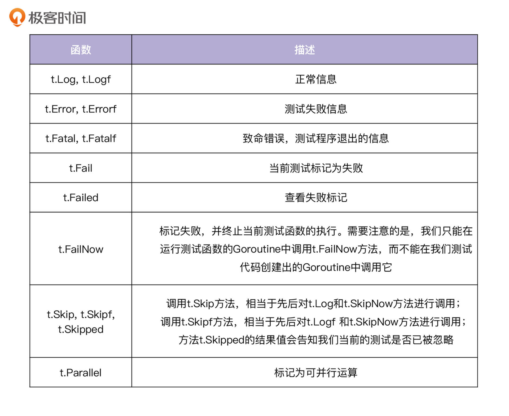

# 原生支持

Go 语言提供了 go test 命令行工具，使用该工具可以很方便地进行测试。

目前 go test 支持的测试类型有：

* 单元测试、性能测试、示例测试、模糊测试

其中单元测试是指对软件中的最小可测试单元进行检查和验证，比如对一个函数的测试。

## 一、单元测试

编写一个单元测试并执行是非常方便的，只需要遵守一定的规则。

* 测试文件名必须以\_test.go结尾
* 测试函数名必须以TestXxx开始
* 在命令行下使用go test 即可启动测试
* 函数参数必须是 `*testing.T`，可以使用该类型来记录错误或测试状态

### 1、源代码文件

源代码文件hello.go中包含一个Add()方法：

```plain
package hello

func Add(a int, b int) int {
    return a + b
}
```

### 2、测试文件

测试文件hello\_test.go中包含了一个测试方法TestAdd():

```plain
func TestAdd(t *testing.T) {
    var a = 1
    var b = 2
    var expect = 3

    if expect != Add(a, b) {
       t.Errorf("test failed")
    }
}
```

### 3、执行测试

```plain
bash-3.2$ go test
PASS
ok      git.xiaojukeji.com/gulfstream/driver-center-go/test     0.328s
```

### 4、testing.T

我们可以调用 `testing.T` 的 `Error` 、`Errorf` 、`FailNow` 、`Fatal` 、`FatalIf` 方法，来说明测试不通过；调用 `Log` 、`Logf` 方法来记录测试信息。函数列表和相关描述如下表所示：



## 二、GoMock

* https://geektutu.com/post/quick-gomock.html


> 更新: 2024-10-03 22:01:22  
> 原文: <https://www.yuque.com/thinkspace/ovoe4b/qn3cdhfoy2mxq6ob>