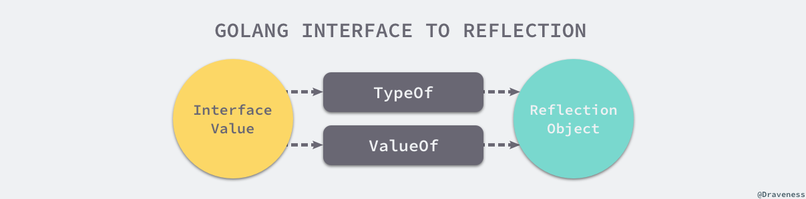
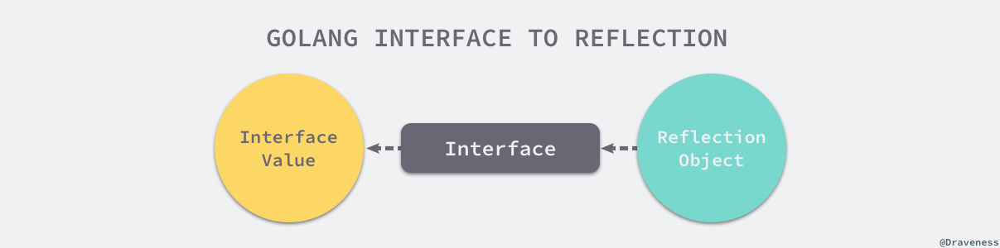
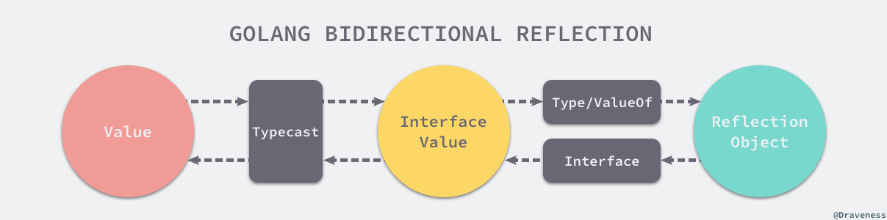
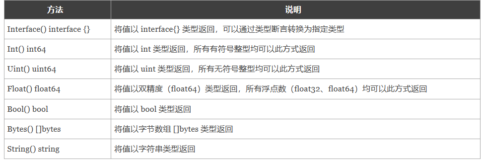
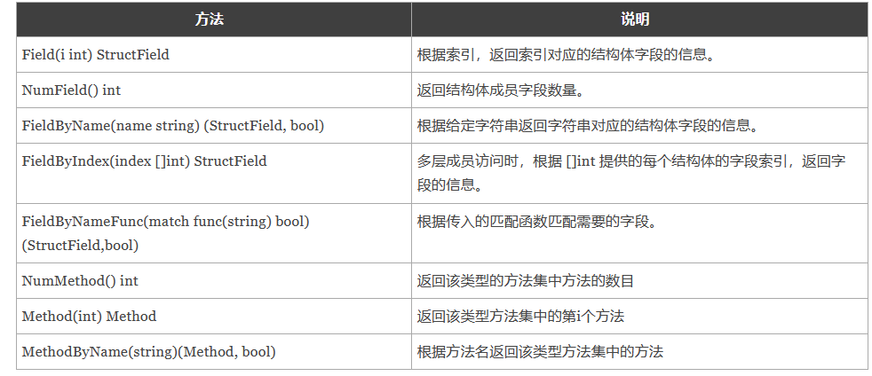

# Go 反射

`[reflect](https://golang.org/pkg/reflect/)` 实现了运行时的反射能力，能够让程序操作不同类型的对象(1)。反射包中有两对非常重要的函数和类型，两个函数分别是：

* `[reflect.TypeOf](https://draveness.me/golang/tree/reflect.TypeOf)` 能获取类型信息；
* `[reflect.ValueOf](https://draveness.me/golang/tree/reflect.ValueOf)` 能获取数据的运行时表示；

两个类型是 `[reflect.Type](https://draveness.me/golang/tree/reflect.Type)` 和 `[reflect.Value](https://draveness.me/golang/tree/reflect.Value)`，它们与函数是一一对应的关系：


类型 `[reflect.Type](https://draveness.me/golang/tree/reflect.Type)` 是反射包定义的一个接口，我们可以使用 `[reflect.TypeOf](https://draveness.me/golang/tree/reflect.TypeOf)` 函数获取任意变量的类型，`[reflect.Type](https://draveness.me/golang/tree/reflect.Type)` 接口中定义了一些有趣的方法，`MethodByName` 可以获取当前类型对应方法的引用、`Implements` 可以判断当前类型是否实现了某个接口：

```plain
type Type interface {
    Align() int
    FieldAlign() int
    Method(int) Method
    MethodByName(string) (Method, bool)
    NumMethod() int
    ...
    Implements(u Type) bool
    ...
}
```

反射包中 `[reflect.Value](https://draveness.me/golang/tree/reflect.Value)` 的类型与 `[reflect.Type](https://draveness.me/golang/tree/reflect.Type)` 不同，它被声明成了结构体。这个结构体没有对外暴露的字段，但是提供了获取或者写入数据的方法：

```plain
type Value struct {
    // 包含过滤的或者未导出的字段
}

func (v Value) Addr() Value
func (v Value) Bool() bool
func (v Value) Bytes() []byte
...
```

反射包中的所有方法基本都是围绕着 `[reflect.Type](https://draveness.me/golang/tree/reflect.Type)` 和 `[reflect.Value](https://draveness.me/golang/tree/reflect.Value)` 两个类型设计的。我们通过 `[reflect.TypeOf](https://draveness.me/golang/tree/reflect.TypeOf)`、`[reflect.ValueOf](https://draveness.me/golang/tree/reflect.ValueOf)` 可以将一个普通的变量转换成反射包中提供的 `[reflect.Type](https://draveness.me/golang/tree/reflect.Type)` 和 `[reflect.Value](https://draveness.me/golang/tree/reflect.Value)`，随后就可以使用反射包中的方法对它们进行复杂的操作。

## 一、三大法则

1. 从 `interface{}` 变量可以反射出反射对象；
2. 从反射对象可以获取 `interface{}` 变量；
3. 要修改反射对象，其值必须可设置；

### 1、从 `interface{}` 变量可以反射出反射对象

当我们执行 `reflect.ValueOf(1)` 时，虽然看起来是获取了基本类型 `int` 对应的反射类型，但是由于 `[reflect.TypeOf](https://draveness.me/golang/tree/reflect.TypeOf)`、`[reflect.ValueOf](https://draveness.me/golang/tree/reflect.ValueOf)` 两个方法的入参都是 `interface{}` 类型，所以在方法执行的过程中发生了类型转换。



我们可以通过以下例子简单介绍它们的作用，`[reflect.TypeOf](https://draveness.me/golang/tree/reflect.TypeOf)` 获取了变量 `author` 的类型，`[reflect.ValueOf](https://draveness.me/golang/tree/reflect.ValueOf)` 获取了变量的值 `draven`。如果我们知道了一个变量的类型和值，那么就意味着我们知道了这个变量的全部信息。

```plain
import (
    "fmt"
    "reflect"
)

func main() {
    author := "draven"
    fmt.Println("TypeOf author:", reflect.TypeOf(author))
    fmt.Println("ValueOf author:", reflect.ValueOf(author))
}
```

```plain
$ go run main.go
TypeOf author: string
ValueOf author: draven
```

有了变量的类型之后，我们可以通过 `Method` 方法获得类型实现的方法，通过 `Field` 获取类型包含的全部字段。对于不同的类型，我们也可以调用不同的方法获取相关信息：

* 结构体：获取字段的数量并通过下标和字段名获取字段 `StructField`；
* 哈希表：获取哈希表的 `Key` 类型；
* 函数或方法：获取入参和返回值的类型；
* …

总而言之，使用 `[reflect.TypeOf](https://draveness.me/golang/tree/reflect.TypeOf)` 和 `[reflect.ValueOf](https://draveness.me/golang/tree/reflect.ValueOf)` 能够获取 Go 语言中的变量对应的反射对象。一旦获取了反射对象，我们就能得到跟当前类型相关数据和操作，并可以使用这些运行时获取的结构执行方法。

### 2、从反射对象可以获取 `interface{}` 变量

既然能够将接口类型的变量转换成反射对象，那么一定需要其他方法将反射对象还原成接口类型的变量，`[reflect](https://golang.org/pkg/reflect/)` 中的 `[reflect.Value.Interface](https://draveness.me/golang/tree/reflect.Value.Interface)` 就能完成这项工作：



不过调用 `[reflect.Value.Interface](https://draveness.me/golang/tree/reflect.Value.Interface)` 方法只能获得 `interface{}` 类型的变量，如果想要将其还原成最原始的状态还需要经过如下所示的显式类型转换：

```plain
v := reflect.ValueOf(1)
v.Interface().(int)
```

从反射对象到接口值的过程是从接口值到反射对象的镜面过程，两个过程都需要经历两次转换：



当然不是所有的变量都需要类型转换这一过程。如果变量本身就是 `interface{}` 类型的，那么它不需要类型转换，因为类型转换这一过程一般都是隐式的，所以我不太需要关心它，只有在我们需要将反射对象转换回基本类型时才需要显式的转换操作。

### 3、要修改反射对象，其值必须可设置

如果我们想要更新一个 `[reflect.Value](https://draveness.me/golang/tree/reflect.Value)`，那么它持有的值一定是可以被更新的，假设我们有以下代码：

```plain
func main() {
    i := 1
    v := reflect.ValueOf(i)
    v.SetInt(10)
    fmt.Println(i)
}
$ go run reflect.go
panic: reflect: reflect.flag.mustBeAssignable using unaddressable value
```

运行上述代码会导致程序崩溃并报出 “reflect: reflect.flag.mustBeAssignable using unaddressable value” 错误，仔细思考一下就能够发现出错的原因：由于 Go 语言的函数调用都是传值的，所以我们得到的反射对象跟最开始的变量没有任何关系，那么直接修改反射对象无法改变原始变量，程序为了防止错误就会崩溃。

想要修改原变量只能使用如下的方法：

```plain
func main() {
    i := 1
    v := reflect.ValueOf(&i)
    v.Elem().SetInt(10)
    fmt.Println(i)
}
$ go run reflect.go10
```

1. 调用 `[reflect.ValueOf](https://draveness.me/golang/tree/reflect.ValueOf)` 获取变量指针；
2. 调用 `[reflect.Value.Elem](https://draveness.me/golang/tree/reflect.Value.Elem)` 获取指针指向的变量；
3. 调用 `[reflect.Value.SetInt](https://draveness.me/golang/tree/reflect.Value.SetInt)` 更新变量的值：

由于 Go 语言的函数调用都是值传递的，所以我们只能只能用迂回的方式改变原变量：先获取指针对应的 `[reflect.Value](https://draveness.me/golang/tree/reflect.Value)`，再通过 `[reflect.Value.Elem](https://draveness.me/golang/tree/reflect.Value.Elem)` 方法得到可以被设置的变量。

## 二、**reflect包**

### 1、**<font style="color:rgb(216,57,49);">type name和type kind</font>**

在反射中关于类型还划分为两种：`类型（Type）`和`种类（Kind）`。因为在Go语言中我们可以使用type关键字构造很多自定义类型，而`种类（Kind）`就是指底层的类型，但在反射中，当需要区分指针、结构体等大品种的类型时，就会用到`种类（Kind）`。 举个例子，我们定义了两个指针类型和两个结构体类型，通过反射查看它们的类型和种类。

```plain
package main

import (
        "fmt"
        "reflect"
)

func reflectType(x interface{}) {
    t := reflect.TypeOf(x)
    fmt.Printf("type:%v kind:%v\n", t.Name(), t.Kind())
}

func main() {
    type person struct {
        name string
        age  int
    }
    type book struct{ title string }
    var d = person{
        name: "沙河小王子",
        age:  18,
    }
    var e = book{title: "《跟小王子学Go语言》"}
    reflectType(d) // type:person kind:struct
    reflectType(e) // type:book kind:struct
}
```

Go语言的反射中像数组、切片、Map、指针等类型的变量，它们的`.Name()`都是返回`空`。

在`reflect`包中定义的Kind类型如下：

```plain
type Kind uint
const (
    Invalid Kind = iota  // 非法类型
    Bool                 // 布尔型
    Int                  // 有符号整型
    Int8                 // 有符号8位整型
    Int16                // 有符号16位整型
    Int32                // 有符号32位整型
    Int64                // 有符号64位整型
    Uint                 // 无符号整型
    Uint8                // 无符号8位整型
    Uint16               // 无符号16位整型
    Uint32               // 无符号32位整型
    Uint64               // 无符号64位整型
    Uintptr              // 指针
    Float32              // 单精度浮点数
    Float64              // 双精度浮点数
    Complex64            // 64位复数类型
    Complex128           // 128位复数类型
    Array                // 数组
    Chan                 // 通道
    Func                 // 函数
    Interface            // 接口
    Map                  // 映射
    Ptr                  // 指针
    Slice                // 切片
    String               // 字符串
    Struct               // 结构体
    UnsafePointer        // 底层指针
)
```

### 2、获取原始值

`reflect.Value`类型提供的获取原始值的方法如下：



**<font style="color:rgb(216,57,49);">通过反射获取值</font>**

```plain
func reflectValue(x interface{}) {
        v := reflect.ValueOf(x)
        k := v.Kind()
        switch k {
        case reflect.Int64:
                // v.Int()从反射中获取整型的原始值，然后通过int64()强制类型转换
                fmt.Printf("type is int64, value is %d\n", int64(v.Int()))
        case reflect.Float32:
                // v.Float()从反射中获取浮点型的原始值，然后通过float32()强制类型转换
                fmt.Printf("type is float32, value is %f\n", float32(v.Float()))
        case reflect.Float64:
                // v.Float()从反射中获取浮点型的原始值，然后通过float64()强制类型转换
                fmt.Printf("type is float64, value is %f\n", float64(v.Float()))
        }
}
func main() {
        var a float32 = 3.14
        var b int64 = 100
        reflectValue(a) // type is float32, value is 3.140000
        reflectValue(b) // type is int64, value is 100
}
```

### 3、**<font style="color:rgb(216,57,49);">isNil()和isValid()</font>**

`reflect.Value`类型提供了\*\*<font style="color:rgb(216,57,49);">isNil()和isValid()两个方法</font>\*\*

```plain
func (v Value) IsNil() bool
func (v Value) IsValid() bool
```

`IsNil()`报告v持有的值是否为nil。v持有的值的分类必须是通道、函数、接口、映射、指针、切片之一；否则IsNil函数会导致panic。

`IsValid()`返回v是否持有一个值。如果v是Value零值会返回假，此时v除了IsValid、String、Kind之外的方法都会导致panic。

**<font style="color:rgb(216,57,49);">举个例子</font>**

`IsNil()`常被用于判断指针是否为空；`IsValid()`常被用于判定返回值是否有效。

```plain
func main() {
    // *int类型空指针
    var a *int
    fmt.Println("var a *int IsNil:", reflect.ValueOf(a).IsNil())
    // nil值
    fmt.Println("nil IsValid:", reflect.ValueOf(nil).IsValid())
    // 实例化一个匿名结构体
    b := struct{}{}
    // 尝试从结构体中查找"abc"字段
    fmt.Println("不存在的结构体成员:", reflect.ValueOf(b).FieldByName("abc").IsValid())
    // 尝试从结构体中查找"abc"方法
    fmt.Println("不存在的结构体方法:", reflect.ValueOf(b).MethodByName("abc").IsValid())
    // map
    c := map[string]int{}
    // 尝试从map中查找一个不存在的键
    fmt.Println("map中不存在的键：", reflect.ValueOf(c).MapIndex(reflect.ValueOf("娜扎")).IsValid())
}

var a *int IsNil: true
nil IsValid: false
不存在的结构体成员: false
不存在的结构体方法: false
map中不存在的键： false
```

### 4、结构体反射

（1）与结构体相关的方法

任意值通过`reflect.TypeOf()`获得反射对象信息后，如果它的类型是结构体，可以通过反射值对象（`reflect.Type`）的`NumField()`和`Field()`方法获得结构体成员的详细信息。

`reflect.Type`中与获取结构体成员相关的的方法如下表所示。



（2）StructField类型

`StructField`类型用来描述结构体中的一个字段的信息。

`StructField`的定义如下：

```plain
type StructField struct {
    // Name是字段的名字。PkgPath是非导出字段的包路径，对导出字段该字段为""。
    // 参见http://golang.org/ref/spec#Uniqueness_of_identifiers
    Name    string
    PkgPath string
    Type      Type      // 字段的类型
    Tag       StructTag // 字段的标签
    Offset    uintptr   // 字段在结构体中的字节偏移量
    Index     []int     // 用于Type.FieldByIndex时的索引切片
    Anonymous bool      // 是否匿名字段
}
```

（3）结构体反射示例

当我们使用反射得到一个结构体数据之后可以通过索引依次获取其字段信息，也可以通过字段名去获取指定的字段信息。

```plain
type student struct {
    Name  string `json:"name"`
    Score int    `json:"score"`
}

func main() {
    stu1 := student{
        Name:  "小王子",
        Score: 90,
    }

    t := reflect.TypeOf(stu1)
    fmt.Println(t.Name(), t.Kind()) // student struct
    // 通过for循环遍历结构体的所有字段信息
    for i := 0; i < t.NumField(); i++ {
        field := t.Field(i)
        fmt.Printf("name:%s index:%d type:%v json tag:%v\n", field.Name, field.Index, field.Type, field.Tag.Get("json"))
    }

    // 通过字段名获取指定结构体字段信息
    if scoreField, ok := t.FieldByName("Score"); ok {
        fmt.Printf("name:%s index:%d type:%v json tag:%v\n", scoreField.Name, scoreField.Index, scoreField.Type, scoreField.Tag.Get("json"))
    }
}

student struct
name:Name index:[0] type:string json tag:name
name:Score index:[1] type:int json tag:score
name:Score index:[1] type:int json tag:score
```

接下来编写一个函数`printMethod(s interface{})`来遍历打印s包含的方法。

```plain
// 给student添加两个方法 Study和Sleep(注意首字母大写)
func (s student) Study() string {
    msg := "好好学习，天天向上。"
    fmt.Println(msg)
    return msg
}

func (s student) Sleep() string {
    msg := "好好睡觉，快快长大。"
    fmt.Println(msg)
    return msg
}

func printMethod(x interface{}) {
    t := reflect.TypeOf(x)
    v := reflect.ValueOf(x)

    fmt.Println(t.NumMethod())
    for i := 0; i < v.NumMethod(); i++ {
        methodType := v.Method(i).Type()
        fmt.Printf("method name:%s\n", t.Method(i).Name)
        fmt.Printf("method:%s\n", methodType)
        // 通过反射调用方法传递的参数必须是 []reflect.Value 类型
        var args = []reflect.Value{}
        v.Method(i).Call(args)
    }
}
```

## 参考

* https://draveness.me/golang/docs/part2-foundation/ch04-basic/golang-reflect/#%E7%AC%AC%E4%B8%89%E6%B3%95%E5%88%99
* https://www.liwenzhou.com/posts/Go/reflect/


> 更新: 2024-10-03 22:01:45  
> 原文: <https://www.yuque.com/thinkspace/ovoe4b/ehpxp75ccyn71qdw>