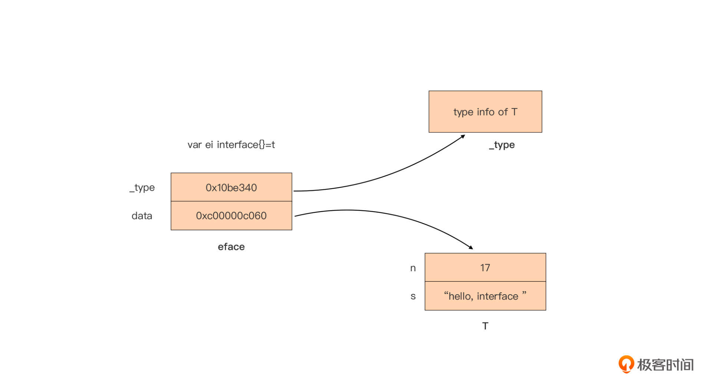
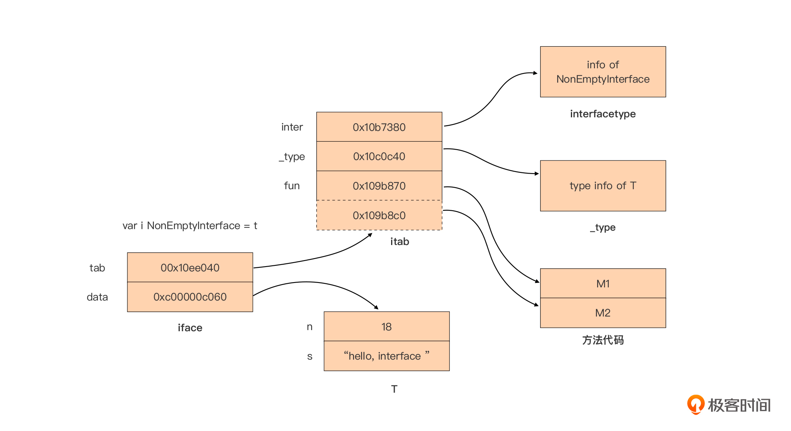

# Go 接口

## **一、接口类型变量的内部表示**
在运行时层面，接口类型变量有两种内部表示：iface和eface，这两种表示分别用于不同的接口类型变量，我们可以在$GOROOT/src/runtime/runtime2.go中找到接口类型变量在运行时的表示：

```plain
// $GOROOT/src/runtime/runtime2.go
type iface struct {
    tab  *itab
    data unsafe.Pointer
}
type eface struct {
    _type *_type
    data  unsafe.Pointer
}
```

+ eface用于表示没有方法的空接口（empty interface）类型变量，也就是interface{}类型的变量；
+ iface用于表示其余拥有方法的接口interface类型变量。

这两个结构的共同点是它们都有两个指针字段，并且第二个指针字段的功能相同，都是指向当前赋值给该接口类型变量的动态类型变量的值。

那它们的不同点在哪呢？就在于eface表示的空接口类型并没有方法列表，因此它的第一个指针字段指向一个_type类型结构，这个结构为该接口类型变量的动态类型的信息，它的定义是这样的：

```plain
// $GOROOT/src/runtime/type.go
type _type struct {
    size       uintptr
    ptrdata    uintptr // size of memory prefix holding all pointers
    hash       uint32
    tflag      tflag
    align      uint8
    fieldAlign uint8
    kind       uint8
    // function for comparing objects of this type
    // (ptr to object A, ptr to object B) -> ==?
    equal func(unsafe.Pointer, unsafe.Pointer) bool
    // gcdata stores the GC type data for the garbage collector.
    // If the KindGCProg bit is set in kind, gcdata is a GC program.
    // Otherwise it is a ptrmask bitmap. See mbitmap.go for details.
    gcdata    *byte
    str       nameOff
    ptrToThis typeOff
}
```

而iface除了要存储动态类型信息之外，还要存储接口本身的信息（接口的类型信息、方法列表信息等）以及动态类型所实现的方法的信息，因此iface的第一个字段指向一个itab类型结构。itab结构的定义如下：

```plain
// $GOROOT/src/runtime/runtime2.go
type itab struct {
    inter *interfacetype
    _type *_type
    hash  uint32 // copy of _type.hash. Used for type switches.
    _     [4]byte
    fun   [1]uintptr // variable sized. fun[0]==0 means _type does not implement inter.
}
```

这里我们也可以看到，itab结构中的第一个字段inter指向的interfacetype结构，存储着这个接口类型自身的信息。你看一下下面这段代码表示的interfacetype类型定义， 这个interfacetype结构由类型信息（typ）、包路径名（pkgpath）和接口方法集合切片（mhdr）组成。

```plain
// $GOROOT/src/runtime/type.go
type interfacetype struct {
    typ     _type
    pkgpath name
    mhdr    []imethod
}
```

itab结构中的字段_type则存储着这个接口类型变量的动态类型的信息，字段fun则是动态类型已实现的接口方法的调用地址数组。

下面我们再结合例子用图片来直观展现eface和iface的结构。首先我们看一个用eface表示的空接口类型变量的例子：

```plain
type T struct {
    n int
    s string
}
func main() {
    var t = T {
        n: 17,
        s: "hello, interface",
    }

    var ei interface{} = t // Go运行时使用eface结构表示ei
}
```

这个例子中的空接口类型变量ei在Go运行时的表示是这样的：



我们看到空接口类型的表示较为简单，图中上半部分_type字段指向它的动态类型T的类型信息，下半部分的data则是指向一个T类型的实例值。

我们再来看一个更复杂的用iface表示非空接口类型变量的例子：

```plain
type T struct {
    n int
    s string
}
func (T) M1() {}
func (T) M2() {}
type NonEmptyInterface interface {
    M1()
    M2()
}
func main() {
    var t = T{
        n: 18,
        s: "hello, interface",
    }
    var i NonEmptyInterface = t
}
```

和eface比起来，iface的表示稍微复杂些。我也画了一幅表示上面NonEmptyInterface接口类型变量在Go运行时表示的示意图：



 由上面的这两幅图，我们可以看出，每个接口类型变量在运行时的表示都是由两部分组成的，针对不同接口类型我们可以简化记作：eface(_type, data)和iface(tab, data)。

 而且，虽然eface和iface的第一个字段有所差别，但tab和_type可以统一看作是动态类型的类型信息。Go语言中每种类型都会有唯一的_type信息，无论是内置原生类型，还是自定义类型都有。Go运行时会为程序内的全部类型建立只读的共享_type信息表，因此拥有相同动态类型的同类接口类型变量的_type/tab信息是相同的。

 而接口类型变量的data部分则是指向一个动态分配的内存空间，这个内存空间存储的是赋值给接口类型变量的动态类型变量的值。未显式初始化的接口类型变量的值为nil，也就是这个变量的_type/tab和data都为nil。

 也就是说，我们判断两个接口类型变量是否相同，只需要判断_type/tab是否相同，以及data指针指向的内存空间所存储的数据值是否相同就可以了。这里要注意不是data指针的值相同噢。

 Go语言提供了println预定义函数，可以用来输出eface或iface的两个指针字段的值。在编译阶段，编译器会根据要输出的参数的类型将println替换为特定的函数，这些函数都定义在$GOROOT/src/runtime/print.go文件中，而针对eface和iface类型的打印函数实现如下：

```plain
// $GOROOT/src/runtime/print.go
func printeface(e eface) {
    print("(", e._type, ",", e.data, ")")
}
func printiface(i iface) {
    print("(", i.tab, ",", i.data, ")")
}
```

下面我们就来使用println函数输出各类接口类型变量的内部表示信息，并结合输出结果，解析接口类型变量的等值比较操作。

### **1、nil接口变量**
我们前面提过，未赋初值的接口类型变量的值为nil，这类变量也就是nil接口变量，我们来看这类变量的内部表示输出的例子：

```plain
func printNilInterface() {
        // nil接口变量
        var i interface{} // 空接口类型
        var err error     // 非空接口类型
        println(i)
        println(err)
        println("i = nil:", i == nil)
        println("err = nil:", err == nil)
        println("i = err:", i == err)
}
```

运行这个函数，输出结果是这样的：

```plain
(0x0,0x0)
(0x0,0x0)
i = nil: true
err = nil: true
i = err: true
```

我们看到，无论是空接口类型还是非空接口类型变量，一旦变量值为nil，那么它们内部表示均为(0x0,0x0)，也就是类型信息、数据值信息均为空。因此上面的变量i和err等值判断为true。

### **2、空接口类型变量**
下面是空接口类型变量的内部表示输出的例子：

```plain
func printEmptyInterface() {
      var eif1 interface{} // 空接口类型
      var eif2 interface{} // 空接口类型
      var n, m int = 17, 18

      eif1 = n
      eif2 = m
      println("eif1:", eif1)
      println("eif2:", eif2)
      println("eif1 = eif2:", eif1 == eif2) // false

      eif2 = 17
      println("eif1:", eif1)
      println("eif2:", eif2)
      println("eif1 = eif2:", eif1 == eif2) // true
      eif2 = int64(17)
      println("eif1:", eif1)
      println("eif2:", eif2)
      println("eif1 = eif2:", eif1 == eif2) // false
 }
```

这个例子的运行输出结果是这样的：

```plain
eif1: (0x10ac580,0xc00007ef48)
eif2: (0x10ac580,0xc00007ef40)
eif1 = eif2: false
eif1: (0x10ac580,0xc00007ef48)
eif2: (0x10ac580,0x10eb3d0)
eif1 = eif2: true
eif1: (0x10ac580,0xc00007ef48)
eif2: (0x10ac640,0x10eb3d8)
eif1 = eif2: false
```

从输出结果中我们可以总结一下：对于空接口类型变量，只有_type和data所指数据内容一致的情况下（注意：不是数据指针的值一致），两个空接口类型变量之间才能划等号。另外，Go在创建eface时一般会为data重新分配新内存空间，将动态类型变量的值复制到这块内存空间，并将data指针指向这块内存空间。因此我们多数情况下看到的data指针值都是不同的。

### **3、非空接口类型变量**
这里，我们也直接来看一个非空接口类型变量的内部表示输出的例子：

```plain
type T int
func (t T) Error() string {
    return "bad error"
}
func printNonEmptyInterface() {
    var err1 error // 非空接口类型
    var err2 error // 非空接口类型
    err1 = (*T)(nil)
    println("err1:", err1)
    println("err1 = nil:", err1 == nil)
    err1 = T(5)
    err2 = T(6)
    println("err1:", err1)
    println("err2:", err2)
    println("err1 = err2:", err1 == err2)
    err2 = fmt.Errorf("%d\n", 5)
    println("err1:", err1)
    println("err2:", err2)
    println("err1 = err2:", err1 == err2)
}
```

这个例子的运行输出结果如下：

```plain
err1: (0x10ed120,0x0)
err1 = nil: false
err1: (0x10ed1a0,0x10eb310)
err2: (0x10ed1a0,0x10eb318)
err1 = err2: false
err1: (0x10ed1a0,0x10eb310)
err2: (0x10ed0c0,0xc000010050)
err1 = err2: false
```

我们看到上面示例中每一轮通过println输出的err1和err2的tab和data值，要么data值不同，要么tab与data值都不同。

和空接口类型变量一样，只有tab和data指的数据内容一致的情况下，两个非空接口类型变量之间才能划等号。这里我们要注意err1下面的赋值情况：

```plain
err1 = (*T)(nil)
```

针对这种赋值，println输出的err1是（0x10ed120, 0x0），也就是非空接口类型变量的类型信息并不为空，数据指针为空，因此它与nil（0x0,0x0）之间不能划等号。

### **4、空接口类型变量与非空接口类型变量的等值比较**
下面是非空接口类型变量和空接口类型变量之间进行比较的例子：

```plain
func printEmptyInterfaceAndNonEmptyInterface() {
        var eif interface{} = T(5)
        var err error = T(5)
        println("eif:", eif)
        println("err:", err)
        println("eif = err:", eif == err)
        err = T(6)
        println("eif:", eif)
        println("err:", err)
        println("eif = err:", eif == err)
}
```

这个示例的输出结果如下：

```plain
eif: (0x10b3b00,0x10eb4d0)
err: (0x10ed380,0x10eb4d8)
eif = err: true
eif: (0x10b3b00,0x10eb4d0)
err: (0x10ed380,0x10eb4e0)
eif = err: false
```

你可以看到，空接口类型变量和非空接口类型变量内部表示的结构有所不同（第一个字段：_type vs. tab)，两者似乎一定不能相等。但Go在进行等值比较时，类型比较使用的是eface的_type和iface的tab._type，因此就像我们在这个例子中看到的那样，当eif和err都被赋值为T(5)时，两者之间是划等号的。


> 更新: 2024-10-03 22:03:06  
> 原文: <https://www.yuque.com/thinkspace/ovoe4b/pcg4thlbw1m2kp6k>