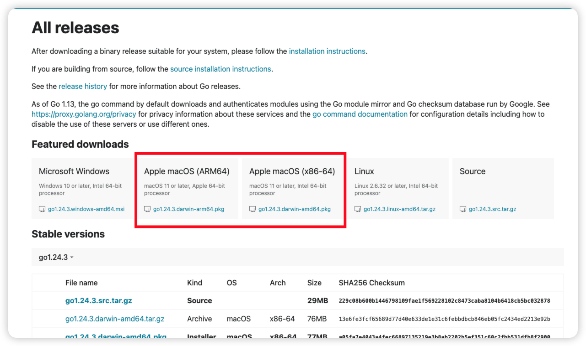
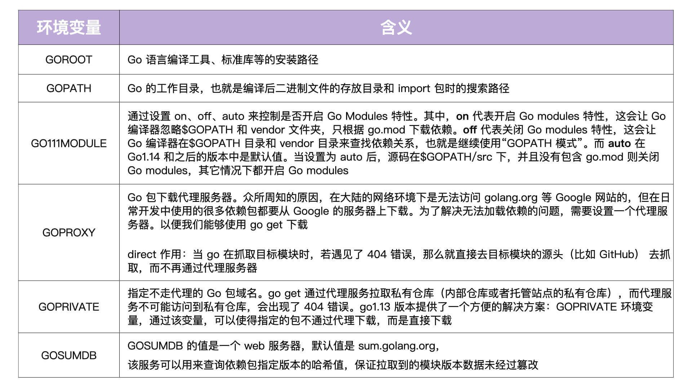
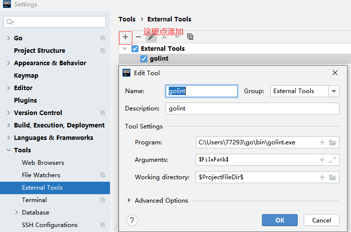
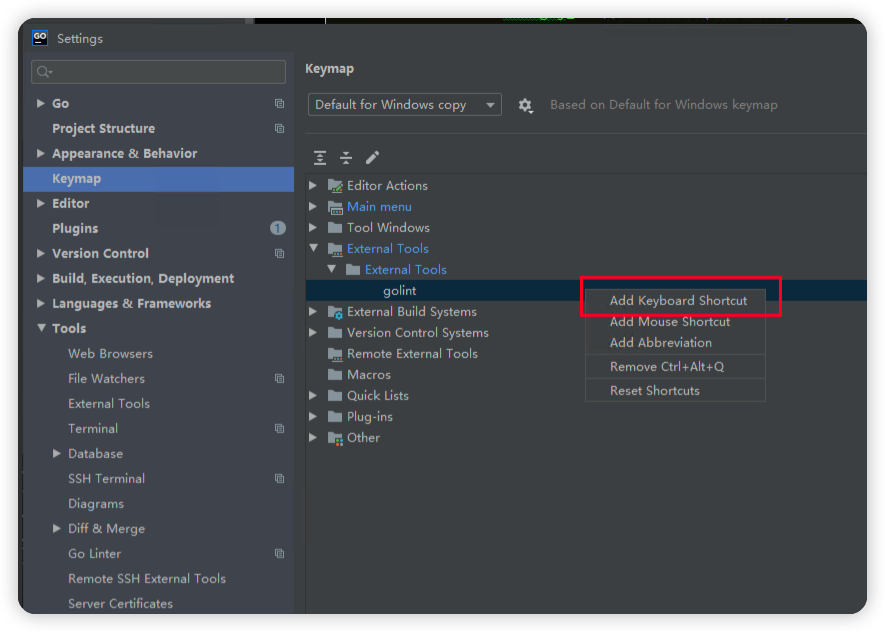

# Go 环境搭建

## 一、Go 编译环境安装

### 1、Linux 安装 Go 环境

安装 Go 语言相对来说比较简单，我们只需要下载源码包、设置相应的环境变量即可。

* 下载地址·：https://golang.google.cn/dl/

首先，我们从 Go 语言官方网站下载对应的 Go 安装包以及源码包，这里我下载的是 go1.18.3 版本：

```plain
$ wget -P /tmp/ https://golang.google.cn/dl/go1.18.3.linux-amd64.tar.gz
```

接着，我们完成解压和安装，命令如下：

```plain
$ mkdir -p $HOME/go
$ tar -xvzf /tmp/go1.18.3.linux-amd64.tar.gz -C $HOME/go
$ mv $HOME/go/go $HOME/go/go1.18.3
```

接着，我们执行以下命令，将下列环境变量追加到$HOME/.bashrc 文件中。

```plain
$ tee -a $HOME/.bashrc <<'EOF'
# Go envs
export GOVERSION=go1.18.3 # Go 版本设置
export GO_INSTALL_DIR=$HOME/go # Go 安装目录
export GOROOT=$GO_INSTALL_DIR/$GOVERSION # GOROOT 设置
export GOPATH=$HOME/workspace/golang # GOPATH 设置
export PATH=$GOROOT/bin:$GOPATH/bin:$PATH # 将 Go 语言自带的和通过 go install 安装的二进制文件加入到 PATH 路径中
export GO111MODULE="on" # 开启 Go moudles 特性
export GOPROXY=https://goproxy.cn,direct # 安装 Go 模块时，代理服务器设置
export GOPRIVATE=
export GOSUMDB=off # 关闭校验 Go 依赖包的哈希值
EOF
```

### 2、Mac 安装 Go 环境

<https://golang.google.cn/dl/>，下载安装即可。环境变量可以参考Linux的。



Go 语言是通过一系列的环境变量来控制 Go 编译器行为的。因此，我们一定要理解每一个环境变量的含义。



因为 Go 以后会用 Go modules 来管理依赖，所以我建议你将 `GO111MODULE` 设置为 on。

在使用模块的时候，`$GOPATH` 是无意义的，不过它还是会把下载的依赖储存在 `$GOPATH/pkg/mod` 目录中，也会把 go install 的二进制文件存放在 `$GOPATH/bin` 目录中。 另外，我们还要将`$GOPATH/bin`、`$GOROOT/bin` 加入到 Linux 可执行文件搜索路径中。这样一来，我们就可以直接在 bash shell 中执行 go 自带的命令，以及通过 go install 安装的命令。

执行 go version 命令可以成功输出 Go 的版本，就说明 Go 编译环境安装成功。具体的命令如下：

```plain
$ go version
go version go1.18.3 linux/amd64
```

## 二、配置Golint

<font style="color:rgb(143,149,158);">首先在我们下载的位置，通过右键</font>**<font style="color:rgb(143,149,158);">git bash here</font>**<font style="color:rgb(143,149,158);"> 打开git控制台，下载golang 的 lint：</font><font style="color:rgb(143,149,158);">https://github.com/golang/lint</font>

```plain
mkdir -p $GOPATH/src/golang.org/x/
cd $GOPATH/src/golang.org/x/
git clone https://github.com/golang/lint.git  
git clone https://github.com/golang/tools.git
```

<font style="color:rgb(143,149,158);"> 到目录$GOPATH/src/</font><font style="color:rgb(143,149,158);">golang.org/x/lint/golint</font><font style="color:rgb(143,149,158);">中运行</font>

```plain
go install
```

<font style="color:rgb(143,149,158);"> 安装成功后我们会在</font><code><font style="color:rgb(143,149,158);">$</font>``**<font style="color:rgb(143,149,158);">gopath\bin</font>**</code><font style="color:rgb(143,149,158);"> 目录下面看到我们的</font>**<font style="color:rgb(143,149,158);">golint.exe</font>**<font style="color:rgb(143,149,158);">执行程序，这个目录是我们安装go包的目录路径。</font>

在 Goland 中配置Golint

<font style="color:rgb(143,149,158);">打开goland Idea，选择项目栏</font>**<font style="color:rgb(143,149,158);">File</font>**<font style="color:rgb(143,149,158);"> 下拉选中 </font>**<font style="color:rgb(143,149,158);">Setting</font>**<font style="color:rgb(143,149,158);">，打开设置控制面板：</font>



<font style="color:rgb(143,149,158);">选中</font>**<font style="color:rgb(143,149,158);">keymap > External Tools > External Tools > golint</font>**<font style="color:rgb(143,149,158);">进行快捷键配置</font>



<font style="color:rgb(143,149,158);"> 之后选择我们需要检测的go文件，按住我们之前设置的快捷键，就可以进行检测了。</font>

## 三、VsCode Go环境

<https://learn.microsoft.com/zh-cn/azure/developer/go/configure-visual-studio-code>

如果因为网络问题安装Go Tools失败，可以手动安装：

### 1、gopls

参考：<https://github.com/golang/tools/blob/master/gopls/README.md>

```plain
go install golang.org/x/tools/gopls@v0.16.2
```

下表展示了给定 Go 版本对应的 gopls版本。如[<font style="color:rgb(9, 105, 218);">gopls@v0.7.5</font>](https://github.com/golang/tools/releases/tag/gopls%2Fv0.7.5)<font style="color:rgb(9, 105, 218);"> 支持Go 1.12以上的版本。</font>

| **<font style="color:rgb(31, 35, 40);">Go Version</font>** | **<font style="color:rgb(31, 35, 40);">Final gopls version with support (without warnings)</font>** |
| --- | --- |
| <font style="color:rgb(31, 35, 40);">Go 1.12</font> | [<font style="color:rgb(9, 105, 218);">gopls@v0.7.5</font>](https://github.com/golang/tools/releases/tag/gopls%2Fv0.7.5) |
| <font style="color:rgb(31, 35, 40);">Go 1.15</font> | [<font style="color:rgb(9, 105, 218);">gopls@v0.9.5</font>](https://github.com/golang/tools/releases/tag/gopls%2Fv0.9.5) |
| <font style="color:rgb(31, 35, 40);">Go 1.17</font> | [<font style="color:rgb(9, 105, 218);">gopls@v0.11.0</font>](https://github.com/golang/tools/releases/tag/gopls%2Fv0.11.0) |
| <font style="color:rgb(31, 35, 40);">Go 1.18</font> | [<font style="color:rgb(9, 105, 218);">gopls@v0.14.2</font>](https://github.com/golang/tools/releases/tag/gopls%2Fv0.14.2) |
| <font style="color:rgb(31, 35, 40);">Go 1.20</font> | [<font style="color:rgb(9, 105, 218);">gopls@v0.15.3</font>](https://github.com/golang/tools/releases/tag/gopls%2Fv0.15.3) |

### 2、staticcheck

参考：<https://github.com/dominikh/go-tools/releases>

```plain
go install honnef.co/go/tools/cmd/staticcheck@v0.4.7
```

| **<font style="color:rgb(31, 35, 40);">Go Version</font>** | **<font style="color:rgb(31, 35, 40);">推荐安装的版本</font>** |
| --- | --- |
| <font style="color:rgb(31, 35, 40);">Go 1.22</font> | v0.4.7 |

## 参考

* https://www.cnblogs.com/phpper/p/13833218.html


> 更新: 2025-05-26 10:43:11  
> 原文: <https://www.yuque.com/thinkspace/ovoe4b/qq2n2pylgzrgmnpu>