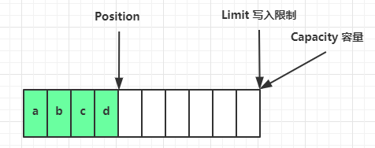
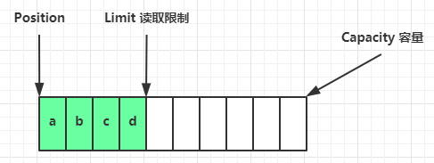
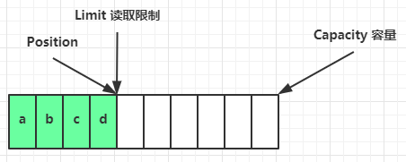
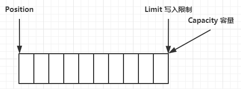
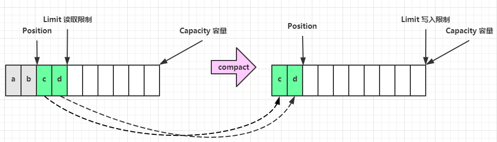
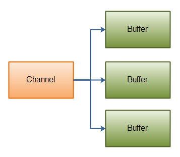
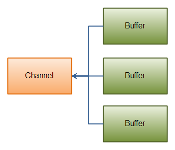

# Java NIO Buffer

> Buffer 是**非线程安全的**

## 一、ByteBuffer 使用步骤

* 向 buffer 写入数据，例如调用` channel.read(buffer)`
* 调用 `flip()` 切换至**读模式**
* 从 buffer 读取数据，例如调用` buffer.get()`
* 调用` clear()` 或 `compact()` 切换至**写模式**
* 重复 1~4 步骤

## 二、ByteBuffer 结构

ByteBuffer 有以下重要属性

* `capacity`
* `position`
* `limit`

一开始


写模式下，`position` 是写入位置，`limit` 等于容量，下图表示写入了 4 个字节后的状态



`flip` 动作发生后，`position` 切换为读取位置，`limit` 切换为读取限制



读取 4 个字节后，状态



`clear` 动作发生后，状态



`compact` 方法，是把未读完的部分向前压缩，然后切换至写模式



## 三、ByteBuffer 常见方法

### 1、分配空间

> <font style="color:rgb(102, 102, 102);">要想获得一个Buffer对象首先要进行分配。 每一个Buffer类都有一个allocate方法。</font>

```java
Bytebuffer buf = ByteBuffer.allocate(16);
```

### 2、向 Buffer 写入数据

<font style="color:rgb(102, 102, 102);"></font>

<font style="color:rgb(102, 102, 102);">写数据到Buffer有两种方式：</font>

<font style="color:rgb(102, 102, 102);"></font>

* <font style="color:rgb(102, 102, 102);">从Channel写到Buffer。</font>
* <font style="color:rgb(102, 102, 102);">通过Buffer的put()方法写到Buffer里。</font>

调用 channel 的 read 方法

```java
int readBytes = channel.read(buf);
```

调用 buffer 自己的 put 方法

```java
buf.put((byte)127);
```

<font style="color:rgb(102, 102, 102);">put方法有很多版本，允许你以不同的方式把数据写入到Buffer中。例如， 写到一个指定的位置，或者把一个字节数组写入到Buffer。</font>

<font style="color:rgb(102, 102, 102);"></font>

### 3、flip() 方法

<code><font style="color:rgb(102, 102, 102);">flip</font></code><font style="color:rgb(102, 102, 102);">方法将Buffer从写模式切换到读模式。调用</font><code><font style="color:rgb(102, 102, 102);">flip()</font></code><font style="color:rgb(102, 102, 102);">方法会将 position 设回 0，并将 limit 设置成之前position 的值。</font>

<font style="color:rgb(102, 102, 102);">换句话说，position 现在用于标记读的位置，limit 表示之前写进了多少个byte、char等。</font>

### 4、从 buffer 读取数据

<font style="color:rgb(102, 102, 102);"></font>

<font style="color:rgb(102, 102, 102);">从Buffer中读取数据有两种方式：</font>

<font style="color:rgb(102, 102, 102);"></font>

* <font style="color:rgb(102, 102, 102);">从 Buffer 读取数据到 Channel。</font>
* <font style="color:rgb(102, 102, 102);">使用</font><code><font style="color:rgb(102, 102, 102);">get()</font></code><font style="color:rgb(102, 102, 102);">方法从 Buffer 中读取数据。</font>

<font style="color:rgb(102, 102, 102);"></font>

<font style="color:rgb(102, 102, 102);">从Buffer读取数据到 Channel 的例子：</font>

```java
int writeBytes = channel.write(buf);
```

<font style="color:rgb(102, 102, 102);">使用</font><code><font style="color:rgb(102, 102, 102);">get()</font></code><font style="color:rgb(102, 102, 102);">方法从Buffer中读取数据的例子</font>

```java
byte b = buf.get();
```

<font style="color:rgb(102, 102, 102);"></font>

<font style="color:rgb(102, 102, 102);">get方法有很多版本，允许你以不同的方式从Buffer中读取数据。例如，从指定position读取，或者从Buffer中读取数据到字节数组。</font>

### 5、rewind() 方法

`get` 方法会让 `position` 读指针向后走，如果想重复读取数据

```
- 可以调用 `rewind `方法将 `position` 重新置为 0
- 或者调用 `get(int i)` 方法获取索引 `i` 的内容，它不会移动读指针
```

***

<code><font style="color:rgb(102, 102, 102);">Buffer.rewind()</font></code><font style="color:rgb(102, 102, 102);"> 将 position 设回 0，所以你可以重读 Buffer 中的所有数据。limit 保持不变，仍然表示能从Buffer 中读取多少个元素（byte、char等）。</font>

***

### 6、mark 和 reset

mark 是在读取时，做一个标记，即使 position 改变，只要调用 reset 就能回到 mark 的位置

```java
buffer.mark();

//call buffer.get() a couple of times, e.g. during parsing.

buffer.reset();  //set position back to mark.
```

> **注意** ：rewind 和 flip 都会清除 mark 位置

### 7、clear() 与 compact()

<font style="color:rgb(102, 102, 102);"></font>

<font style="color:rgb(102, 102, 102);">一旦读完 Buffer 中的数据，需要让 Buffer 准备好再次被写入。可以通过 </font><code><font style="color:rgb(102, 102, 102);">clear()</font></code><font style="color:rgb(102, 102, 102);"> 或 </font><code><font style="color:rgb(102, 102, 102);">compact()</font></code><font style="color:rgb(102, 102, 102);">方法来完成。</font>

<font style="color:rgb(102, 102, 102);"></font>

<font style="color:rgb(102, 102, 102);">如果调用的是</font><code><font style="color:rgb(102, 102, 102);">clear()</font></code><font style="color:rgb(102, 102, 102);">方法，position 将被设回 0，limit 被设置成 capacity 的值。换句话说，Buffer 被清空了。Buffer中的数据</font>**<font style="color:rgb(102, 102, 102);">并未清除</font>**<font style="color:rgb(102, 102, 102);">，只是这些标记告诉我们可以从哪里开始往Buffer里写数据。</font>

<font style="color:rgb(102, 102, 102);"></font>

<font style="color:rgb(102, 102, 102);">如果Buffer中有一些未读的数据，调用</font><code><font style="color:rgb(102, 102, 102);">clear()</font></code><font style="color:rgb(102, 102, 102);">方法，数据将“被遗忘”，意味着不再有任何标记会告诉你哪些数据被读过，哪些还没有。</font>

<font style="color:rgb(102, 102, 102);"></font>

<font style="color:rgb(102, 102, 102);">如果 Buffer 中仍有未读的数据，且后续还需要这些数据，但是此时想要先先写些数据，那么使用</font><code><font style="color:rgb(102, 102, 102);">compact()</font></code><font style="color:rgb(102, 102, 102);">方法。</font><code><font style="color:rgb(102, 102, 102);">compact()</font></code><font style="color:rgb(102, 102, 102);">方法将所有未读的数据拷贝到 Buffer 起始处。然后将 position 设到最后一个未读元素正后面。limit 属性依然像</font><code><font style="color:rgb(102, 102, 102);">clear()</font></code><font style="color:rgb(102, 102, 102);">方法一样，设置成capacity。现在Buffer准备好写数据了，但是不会覆盖未读的数据。</font>

### 8、字符串与 ByteBuffer 互转

```java
ByteBuffer buffer1 = StandardCharsets.UTF_8.encode("你好");
ByteBuffer buffer2 = Charset.forName("utf-8").encode("你好");


CharBuffer buffer3 = StandardCharsets.UTF_8.decode(buffer1);
System.out.println(buffer3.toString());
```

## 四、Scattering Reads

<font style="color:rgb(102, 102, 102);">Java NIO开始支持 </font><code><font style="color:rgb(102, 102, 102);">scatter</font></code><font style="color:rgb(102, 102, 102);">/</font><code><font style="color:rgb(102, 102, 102);">gather</font></code><font style="color:rgb(102, 102, 102);">，</font><code><font style="color:rgb(102, 102, 102);">scatter</font></code><font style="color:rgb(102, 102, 102);">/</font><code><font style="color:rgb(102, 102, 102);">gather</font></code><font style="color:rgb(102, 102, 102);"> 用于描述从</font><code><font style="color:rgb(102, 102, 102);">Channel</font></code><font style="color:rgb(102, 102, 102);"> 中读取或者写入到</font><code><font style="color:rgb(102, 102, 102);">Channel</font></code><font style="color:rgb(102, 102, 102);">的操作。</font>

<font style="color:rgb(102, 102, 102);">  
</font><font style="color:rgb(102, 102, 102);">分散（</font>`<font style="color:rgb(102, 102, 102);">scatter</font>`<font style="color:rgb(102, 102, 102);">）从</font>`<font style="color:rgb(102, 102, 102);">Channel</font>`<font style="color:rgb(102, 102, 102);">中读取是指在读操作时将读取的数据写入多个</font>`<font style="color:rgb(102, 102, 102);">buffer</font>`<font style="color:rgb(102, 102, 102);">中。因此，</font>`<font style="color:rgb(102, 102, 102);">Channel</font>`<font style="color:rgb(102, 102, 102);">将从</font>`<font style="color:rgb(102, 102, 102);">Channel</font>`<font style="color:rgb(102, 102, 102);">中读取的数据“分散（</font>`<font style="color:rgb(102, 102, 102);">scatter</font>`<font style="color:rgb(102, 102, 102);">）”到多个Buffer中。</font>

<font style="color:rgb(102, 102, 102);">  
</font><font style="color:rgb(102, 102, 102);">聚集（</font>`<font style="color:rgb(102, 102, 102);">gather</font>`<font style="color:rgb(102, 102, 102);">）写入Channel是指在写操作时将多个buffer的数据写入同一个Channel，因此，Channel 将多个Buffer中的数据“聚集（gather）”后发送到Channel。</font>

<font style="color:rgb(102, 102, 102);"></font>

<code><font style="color:rgb(102, 102, 102);">scatter</font></code><font style="color:rgb(102, 102, 102);"> / </font><code><font style="color:rgb(102, 102, 102);">gather</font></code><font style="color:rgb(102, 102, 102);">经常用于需要将传输的数据分开处理的场合，例如传输一个由消息头和消息体组成的消息，你可能会将消息体和消息头分散到不同的</font><code><font style="color:rgb(102, 102, 102);">buffer</font></code><font style="color:rgb(102, 102, 102);">中，这样你可以方便的处理消息头和消息体。</font>

<font style="color:rgb(102, 102, 102);"></font>

### 1、Scattering Reads

Scattering Reads是指数据从一个channel读取到多个buffer中。如下图描述：



<font style="color:rgb(102, 102, 102);">代码示例如下：</font>

```java
ByteBuffer header = ByteBuffer.allocate(128);
ByteBuffer body   = ByteBuffer.allocate(1024);

ByteBuffer[] bufferArray = { header, body };

channel.read(bufferArray);
```

<font style="color:rgb(102, 102, 102);">注意</font><code><font style="color:rgb(102, 102, 102);">buffer</font></code><font style="color:rgb(102, 102, 102);">首先被插入到数组，然后再将数组作为</font><code><font style="color:rgb(102, 102, 102);">channel.read() </font></code><font style="color:rgb(102, 102, 102);">的输入参数。</font><code><font style="color:rgb(102, 102, 102);">read()</font></code><font style="color:rgb(102, 102, 102);">方法按照</font><code><font style="color:rgb(102, 102, 102);">buffer</font></code><font style="color:rgb(102, 102, 102);">在数组中的顺序将从</font><code><font style="color:rgb(102, 102, 102);">channel</font></code><font style="color:rgb(102, 102, 102);">中读取的数据写入到</font><code><font style="color:rgb(102, 102, 102);">buffer</font></code><font style="color:rgb(102, 102, 102);">，当一个</font><code><font style="color:rgb(102, 102, 102);">buffer</font></code><font style="color:rgb(102, 102, 102);">被写满后，</font><code><font style="color:rgb(102, 102, 102);">channel</font></code><font style="color:rgb(102, 102, 102);">紧接着向另一个</font><code><font style="color:rgb(102, 102, 102);">buffer</font></code><font style="color:rgb(102, 102, 102);">中写。</font>

<font style="color:rgb(102, 102, 102);">Scattering Reads 在移动下一个</font><code><font style="color:rgb(102, 102, 102);">buffer</font></code><font style="color:rgb(102, 102, 102);">前，必须填满当前的</font><code><font style="color:rgb(102, 102, 102);">buffer</font></code><font style="color:rgb(102, 102, 102);">，这也意味着它不适用于动态消息(译者注：消息大小不固定)。换句话说，如果存在消息头和消息体，消息头必须完成填充（例如 128byte），Scattering Reads才能正常工作。</font>

### 2、Gathering Writes

<font style="color:rgb(102, 102, 102);"></font>

<font style="color:rgb(102, 102, 102);">Gathering Writes 是指数据从多个</font><code><font style="color:rgb(102, 102, 102);">buffer</font></code><font style="color:rgb(102, 102, 102);">写入到同一个</font><code><font style="color:rgb(102, 102, 102);">channel</font></code><font style="color:rgb(102, 102, 102);">。如下图描述：</font>



<font style="color:rgb(102, 102, 102);">代码示例如下：</font>

```java
ByteBuffer header = ByteBuffer.allocate(128);
ByteBuffer body   = ByteBuffer.allocate(1024);

//write data into buffers

ByteBuffer[] bufferArray = { header, body };

channel.write(bufferArray);
```

<code><font style="color:rgb(102, 102, 102);">buffers</font></code><font style="color:rgb(102, 102, 102);">数组是</font><code><font style="color:rgb(102, 102, 102);">write()</font></code><font style="color:rgb(102, 102, 102);">方法的入参，</font><code><font style="color:rgb(102, 102, 102);">write()</font></code><font style="color:rgb(102, 102, 102);">方法会按照</font><code><font style="color:rgb(102, 102, 102);">buffer</font></code><font style="color:rgb(102, 102, 102);">在数组中的顺序，将数据写入到</font><code><font style="color:rgb(102, 102, 102);">channel</font></code><font style="color:rgb(102, 102, 102);">，注意只有</font><code><font style="color:rgb(102, 102, 102);">position</font></code><font style="color:rgb(102, 102, 102);">和</font><code><font style="color:rgb(102, 102, 102);">limit</font></code><font style="color:rgb(102, 102, 102);">之间的数据才会被写入。因此，如果一个</font><code><font style="color:rgb(102, 102, 102);">buffer</font></code><font style="color:rgb(102, 102, 102);">的容量为128byte，但是仅仅包含58byte的数据，那么这58byte的数据将被写入到</font><code><font style="color:rgb(102, 102, 102);">channel</font></code><font style="color:rgb(102, 102, 102);">中。因此与 Scattering Reads 相反，Gathering Writes 能较好的处理动态消息。</font>


> 更新: 2022-04-09 16:53:14  
> 原文: <https://www.yuque.com/thinkspace/ulag78/xuuu9a>