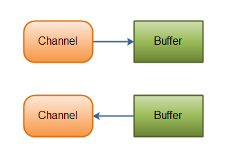
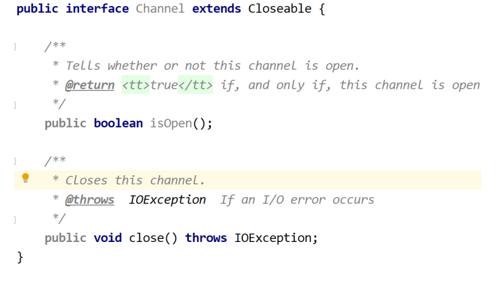
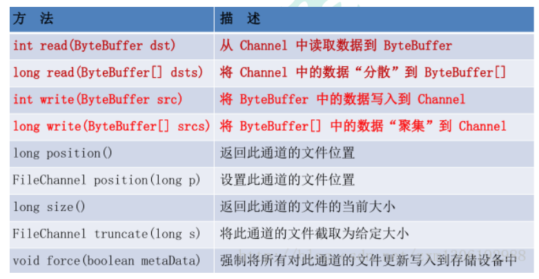

# Java NIO Channel

## 一、Channel 简述

Java NIO的通道类似流，但又有些不同：

* <font style="color:rgb(102, 102, 102);">既可以从通道中读取数据，又可以写数据到通道。但流的读写通常是单向的。</font>
* <font style="color:rgb(102, 102, 102);">通道可以异步地读写。</font>
* <font style="color:rgb(102, 102, 102);">通道中的数据总是要先读到一个 Buffer，或者总是要从一个 Buffer 中写入。</font>

<font style="color:rgb(102, 102, 102);"></font>

<font style="color:rgb(102, 102, 102);">正如上面所说，从通道读取数据到缓冲区，从缓冲区写入数据到通道。如下图所示：</font>

NIO 中通过 `channel` 封装了对数据源的操作，通过 `channel` 我们可以操作数据源，但又不必关心数据源的具体物理结构。这个数据源可能是多种的。比如，可以是文件， 也可以是网络 `socket`。Channel 用于在字节缓冲区和位于通道另一侧的实体（通常是一个文件或套接字）之间有效地传输数据。

### 1、Channel 接口源码



## 二、Channel 实现

下面是 Java NIO 中最重要的 Channel 的实现：

* `FileChannel`
* `DatagramChannel`
* `SocketChannel`
* `ServerSocketChannel`

（1）`FileChannel` 从文件中读写数据。

（2）`DatagramChannel` 能通过 UDP 读写网络中的数据。

（3）`SocketChannel` 能通过 TCP 读写网络中的数据。

（4）`ServerSocketChannel` 可以监听新进来的 TCP连接，像 Web 服务器那样。对每一个新进来的连接都会创建一个 `SocketChannel`。

正如你所看到的，这些通道涵盖了 UDP 和 TCP 网络 IO，以及文件 IO

## 三、FileChannel

### 1、FileChannel 介绍与示例

`FileChannel` 类可以实现常用的 `read`，`write` 以及 `scatter`/`gather` 操作，同时它也提供了很多专用于文件的新方法。这些方法中的许多都是我们所熟悉的文件操作。



下面是一个使用 FileChannel 读取数据到 Buffer 中的示例：

```java
RandomAccessFile aFile = new RandomAccessFile("data/nio-data.txt", "rw");
FileChannel inChannel = aFile.getChannel();

ByteBuffer buf = ByteBuffer.allocate(48);

//向 Buffer写入
int bytesRead = inChannel.read(buf);
while (bytesRead != -1) {

    System.out.println("Read " + bytesRead);
    buf.flip(); //切换到读模式

    while(buf.hasRemaining()){
   	 	System.out.print((char) buf.get());
	}
    buf.clear();    //切换到写模式
    bytesRead = inChannel.read(buf);
}
aFile.close();
```

### 2、Buffer 通常的操作

* 将数据写入缓冲区
* 调用 `buffer.flip()` 反转读写模式
* 从缓冲区读取数据
* 调用 `buffer.clear()` 或 `buffer.compact()` 清除缓冲区内容。

### 3、FileChannel 操作详解

#### （1）打开 FileChannel

在使用 `FileChannel` 之前，必须先打开它。但是，我们不能直接打开 FileChannel，必须通过 FileInputStream、FileOutputStream 或者 RandomAccessFile 来获取 FileChannel，它们都有 getChannel 方法

* 通过 FileInputStream 获取的 channel 只能读
* 通过 FileOutputStream 获取的 channel 只能写
* 通过 RandomAccessFile 是否能读写根据构造 RandomAccessFile 时的读写模式决定

下面是通过 `RandomAccessFile` 打开 `FileChannel` 的示例：

```java
RandomAccessFile aFile = new RandomAccessFile("d:\\01.txt", "rw");
FileChannel inChannel = aFile.getChannel();
```

#### （2）从 FileChannel 读取数据

调用多个 `read()` 方法之一从 `FileChannel` 中读取数据。如：

```java
ByteBuffer buf = ByteBuffer.allocate(48);
int bytesRead = inChannel.read(buf);
```

首先，分配一个 Buffer。从 `FileChannel` 中读取的数据将被读到 Buffer 中。然后，调 用 `FileChannel.read()`方法。该方法将数据从 `FileChannel` 读取到 Buffer 中。`read()` 方法返回的 int 值表示了有多少字节被读到了 Buffer 中。如果返回`-1`，表示到了文件 末尾。

#### （3）向 FileChannel 写数据

使用 `FileChannel.write()` 方法向 FileChannel 写数据，该方法的参数是一个 Buffer。 如：

```java
RandomAccessFile aFile = new RandomAccessFile("d:\\01.txt", "rw");
FileChannel inChannel = aFile.getChannel();
String newData = "New String to write to file..." + 

ByteBuffer buf1 = ByteBuffer.allocate(48);
buf1.clear();
buf1.put(newData.getBytes());

buf1.flip()

while(buf1.hasRemaining()) {
 	inChannel.write(buf1);
}
inChannel.close();
```

注意 `FileChannel.write()`是在 while 循环中调用的。因为 `write()`方法无法保证一次向 `FileChannel`写入全部内容，因此需要重复调用` write()`方法，直到 Buffer 中已经没 有尚未写入通道的字节。

#### （4）关闭 FileChannel

用完 FileChannel 后必须将其关闭。如：

```java
inChannel.close();
```

#### （5）position 方法

有时可能需要在 `FileChannel` 的某个特定位置进行数据的读/写操作。可以通过调用 `position()`方法获取 `FileChannel` 的当前位置。也可以通过调用 `position(long pos)`方法设置 FileChannel 的当前位置。 这里有两个例子:

```java
long pos = channel.position(); 
channel.position(pos +123);
```

* 如果将位置设置在文件结束符之后，然后试图从文件通道中读取数据，读方法将返回 `-1` （文件结束标志）。
* 如果将位置设置在文件结束符之后，然后向通道中写数据，文件将撑大到当前位置并写入数据。这可能导致“文件空洞”，磁盘上物理文件中写入的数据间有空隙。

#### （6）size 方法

FileChannel 实例的 `size()`方法将返回该实例所关联文件的大小。如:

```java
 long fileSize = channel.size()  
```

#### （7） truncate 方法

可以使用 `FileChannel.truncate()`方法截取一个文件。截取文件时，文件将中指定长度后面的部分将被删除。如：

```java
 channel.truncate(1024);
```

这个例子截取文件的前 1024 个字节。

#### （8）force 方法

`FileChannel.force()`方法将通道里尚未写入磁盘的数据强制写到磁盘上。出于性能方 面的考虑，操作系统会将数据缓存在内存中，所以无法保证写入到 FileChannel 里的 数据一定会即时写到磁盘上。要保证这一点，需要调用 `force()`方法。

`force()`方法有一个 boolean 类型的参数，指明是否同时将文件元数据（权限信息等） 写到磁盘上。

#### （9）transferTo 和 transferFrom 方法

####

通道之间的数据传输： 如果两个通道中有一个是 FileChannel，那你可以直接将数据从一个 channel 传输到 另外一个 channel

* **transferFrom() 方法**

FileChannel 的 `transferFrom()`方法可以将数据从源通道传输到 FileChannel 中（译者注：这个方法在 JDK 文档中的解释为将字节从给定的可读取字节通道传输到此通道的文件中）。下面是一个 FileChannel 完成文件间的复制的例子：

```java
RandomAccessFile aFile = new RandomAccessFile("d:\\01.txt", "rw");
FileChannel fromChannel = aFile.getChannel();

RandomAccessFile bFile = new RandomAccessFile("d:\\02.txt", "rw");
 FileChannel toChannel = bFile.getChannel();

long position = 0;
long count = fromChannel.size();
toChannel.transferFrom(fromChannel, position, count);
aFile.close();
bFile.close();
System.out.println("over!")
```

方法的输入参数 position 表示从 position 处开始向目标文件写入数据，count 表示最多传输的字节数。如果源通道的剩余空间小于 count 个字节，则所传输的字节数要小于请求的字节数。

此外要注意，在 SoketChannel 的实现中，SocketChannel 只会传输此刻准备好的数据（可能不足 count 字节）。因此，SocketChannel 可能不会将请求的所有数据(count 个字节)全部传输到 FileChannel 中。

* **transferTo() 方法**

`transferTo()`方法将数据从 FileChannel 传输到其他的 channel 中。 下面是一个` transferTo()`方法的例子 :

```java
RandomAccessFile aFile = new RandomAccessFile("d:\\02.txt", "rw");
FileChannel fromChannel = aFile.getChannel();
RandomAccessFile bFile = new RandomAccessFile("d:\\03.txt", "rw");
FileChannel toChannel = bFile.getChannel();
long position = 0;
long count = fromChannel.size();
fromChannel.transferTo(position, count, toChannel);
aFile.close();
bFile.close();
System.out.println("over!")
```

## 四、SocketChannel

### 1、SocketChannel 介绍

<font style="color:rgb(102, 102, 102);">Java NIO 中的</font><code><font style="color:rgb(102, 102, 102);">SocketChannel</font></code><font style="color:rgb(102, 102, 102);">是一个连接到TCP网络套接字的通道。</font>

<font style="color:rgb(102, 102, 102);">可以通过以下2种方式创建</font><code><font style="color:rgb(102, 102, 102);">SocketChannel</font></code><font style="color:rgb(102, 102, 102);">：</font>

<font style="color:rgb(102, 102, 102);"></font>

* <font style="color:rgb(102, 102, 102);">打开一个</font><code><font style="color:rgb(102, 102, 102);">SocketChannel</font></code><font style="color:rgb(102, 102, 102);">并连接到互联网上的某台服务器。</font>
* <font style="color:rgb(102, 102, 102);">一个新连接到达</font><code><font style="color:rgb(102, 102, 102);">ServerSocketChannel</font></code><font style="color:rgb(102, 102, 102);">时，会创建一个</font><code><font style="color:rgb(102, 102, 102);">SocketChannel</font></code><font style="color:rgb(102, 102, 102);">。</font>

<font style="color:rgb(102, 102, 102);"></font>

#### （1）<font style="color:rgb(102, 102, 102);">打开 SocketChannel</font>

<font style="color:rgb(102, 102, 102);"></font>

<font style="color:rgb(102, 102, 102);">下面是</font><code><font style="color:rgb(102, 102, 102);">SocketChannel</font></code><font style="color:rgb(102, 102, 102);">的打开方式：</font>

```c
SocketChannel socketChannel = SocketChannel.open();
socketChannel.connect(new InetSocketAddress("http://jenkov.com", 80));
```

#### （2）关闭 SocketChannel

<font style="color:rgb(102, 102, 102);"></font>

<font style="color:rgb(102, 102, 102);">当用完</font><code><font style="color:rgb(102, 102, 102);">SocketChannel</font></code><font style="color:rgb(102, 102, 102);">之后调用</font><code><font style="color:rgb(102, 102, 102);">SocketChannel.close()</font></code><font style="color:rgb(102, 102, 102);">关闭</font><code><font style="color:rgb(102, 102, 102);">SocketChannel</font></code><font style="color:rgb(102, 102, 102);">：</font>

```c
socketChannel.close();
```

#### （3）从 SocketChannel 读取数据

<font style="color:rgb(102, 102, 102);"></font>

<font style="color:rgb(102, 102, 102);">要从</font><code><font style="color:rgb(102, 102, 102);">SocketChannel</font></code><font style="color:rgb(102, 102, 102);">中读取数据，调用一个</font><code><font style="color:rgb(102, 102, 102);">read()</font></code><font style="color:rgb(102, 102, 102);">的方法之一。以下是例子：</font>

```c
ByteBuffer buf = ByteBuffer.allocate(48);
int bytesRead = socketChannel.read(buf);
```

<font style="color:rgb(102, 102, 102);">首先，分配一个Buffer。从</font><code><font style="color:rgb(102, 102, 102);">SocketChannel</font></code><font style="color:rgb(102, 102, 102);">读取到的数据将会放到这个</font><code><font style="color:rgb(102, 102, 102);">Buffer</font></code><font style="color:rgb(102, 102, 102);">中。</font>

<font style="color:rgb(102, 102, 102);">然后，调用</font><code><font style="color:rgb(102, 102, 102);">SocketChannel.read()</font></code><font style="color:rgb(102, 102, 102);">。该方法将数据从</font><code><font style="color:rgb(102, 102, 102);">SocketChannel</font></code><font style="color:rgb(102, 102, 102);"> 读到</font><code><font style="color:rgb(102, 102, 102);">Buffer</font></code><font style="color:rgb(102, 102, 102);">中。</font><code><font style="color:rgb(102, 102, 102);">read()</font></code><font style="color:rgb(102, 102, 102);">方法返回的 int值表示读了多少字节进</font><code><font style="color:rgb(102, 102, 102);">Buffer</font></code><font style="color:rgb(102, 102, 102);">里。如果返回的是</font><code><font style="color:rgb(102, 102, 102);">-1</font></code><font style="color:rgb(102, 102, 102);">，表示已经读到了流的末尾（连接关闭了）。</font>

<font style="color:rgb(102, 102, 102);"></font>

#### （4）写入 SocketChannel

<font style="color:rgb(102, 102, 102);"></font>

<font style="color:rgb(102, 102, 102);">写数据到</font><code><font style="color:rgb(102, 102, 102);">SocketChannel</font></code><font style="color:rgb(102, 102, 102);">用的是</font><code><font style="color:rgb(102, 102, 102);">SocketChannel.write()</font></code><font style="color:rgb(102, 102, 102);">方法，该方法以一个</font><code><font style="color:rgb(102, 102, 102);">Buffer</font></code><font style="color:rgb(102, 102, 102);">作为参数。示例如下：</font>

```c
String newData = "New String to write to file..." + System.currentTimeMillis();

ByteBuffer buf = ByteBuffer.allocate(48);
buf.clear();
buf.put(newData.getBytes());

buf.flip();

while(buf.hasRemaining()) {
    channel.write(buf);
}
```

<font style="color:rgb(102, 102, 102);">注意</font><code><font style="color:rgb(102, 102, 102);">SocketChannel.write()</font></code><font style="color:rgb(102, 102, 102);">方法的调用是在一个</font><code><font style="color:rgb(102, 102, 102);">while</font></code><font style="color:rgb(102, 102, 102);">循环中的。</font><code><font style="color:rgb(102, 102, 102);">Write()</font></code><font style="color:rgb(102, 102, 102);">方法无法保证能写多少字节到</font><code><font style="color:rgb(102, 102, 102);">SocketChannel</font></code><font style="color:rgb(102, 102, 102);">。所以，我们重复调用</font><code><font style="color:rgb(102, 102, 102);">write()</font></code><font style="color:rgb(102, 102, 102);">直到</font><code><font style="color:rgb(102, 102, 102);">Buffer</font></code><font style="color:rgb(102, 102, 102);">没有要写的字节为止。</font>

<font style="color:rgb(102, 102, 102);"></font>

#### （5）非阻塞模式

<font style="color:rgb(102, 102, 102);"></font>

<font style="color:rgb(102, 102, 102);">可以设置 </font><code><font style="color:rgb(102, 102, 102);">SocketChannel</font></code><font style="color:rgb(102, 102, 102);"> 为非阻塞模式（non-blocking mode）.设置之后，就可以在异步模式下调用</font><code><font style="color:rgb(102, 102, 102);">connect()</font></code><font style="color:rgb(102, 102, 102);">, </font><code><font style="color:rgb(102, 102, 102);">read()</font></code><font style="color:rgb(102, 102, 102);"> 和 </font><code><font style="color:rgb(102, 102, 102);">write()</font></code><font style="color:rgb(102, 102, 102);">了。</font>

<font style="color:rgb(102, 102, 102);"></font>

* **connect()**

<font style="color:rgb(102, 102, 102);">如果</font><code><font style="color:rgb(102, 102, 102);">SocketChannel</font></code><font style="color:rgb(102, 102, 102);">在非阻塞模式下，此时调用</font><code><font style="color:rgb(102, 102, 102);">connect()</font></code><font style="color:rgb(102, 102, 102);">，该方法可能在连接建立之前就返回了。为了确定连接是否建立，可以调用</font><code><font style="color:rgb(102, 102, 102);">finishConnect()</font></code><font style="color:rgb(102, 102, 102);">的方法。像这样：</font>

```c
socketChannel.configureBlocking(false);
socketChannel.connect(new InetSocketAddress("http://jenkov.com", 80));

while(! socketChannel.finishConnect() ){
    //wait, or do something else...
}
```

* **write()**

<font style="color:rgb(102, 102, 102);">非阻塞模式下，</font><code><font style="color:rgb(102, 102, 102);">write()</font></code><font style="color:rgb(102, 102, 102);">方法在尚未写出任何内容时可能就返回了。所以需要在循环中调用</font><code><font style="color:rgb(102, 102, 102);">write()</font></code><font style="color:rgb(102, 102, 102);">。前面已经有例子了，这里就不赘述了。</font>

<font style="color:rgb(102, 102, 102);"></font>

* **read()**

<font style="color:rgb(102, 102, 102);">非阻塞模式下,</font><code><font style="color:rgb(102, 102, 102);">read()</font></code><font style="color:rgb(102, 102, 102);">方法在尚未读取到任何数据时可能就返回了。所以需要关注它的 int 返回值，它会告诉你读取了多少字节。</font>

<font style="color:rgb(102, 102, 102);"></font>

> <font style="color:rgb(102, 102, 102);">非阻塞模式与选择器搭配会工作的更好，通过将一或多个</font><code><font style="color:rgb(102, 102, 102);">SocketChannel</font></code><font style="color:rgb(102, 102, 102);">注册到</font><code><font style="color:rgb(102, 102, 102);">Selector</font></code><font style="color:rgb(102, 102, 102);">，可以询问选择器哪个通道已经准备好了读取，写入等。</font>

### 2、<font style="color:rgb(102, 102, 102);">ServerSocketChannel</font>

<font style="color:rgb(102, 102, 102);">Java NIO 中的 </font><code><font style="color:rgb(102, 102, 102);">ServerSocketChannel</font></code><font style="color:rgb(102, 102, 102);">是一个可以监听新进来的TCP连接的通道, 就像标准IO中的</font><code><font style="color:rgb(102, 102, 102);">ServerSocket</font></code><font style="color:rgb(102, 102, 102);"> 一样。</font><code><font style="color:rgb(102, 102, 102);">ServerSocketChannel</font></code><font style="color:rgb(102, 102, 102);">类在 </font><code><font style="color:rgb(102, 102, 102);">java.nio.channels</font></code><font style="color:rgb(102, 102, 102);">包中。</font>

<font style="color:rgb(102, 102, 102);"></font>

<font style="color:rgb(102, 102, 102);">这里有个例子：</font>

```c
ServerSocketChannel serverSocketChannel = ServerSocketChannel.open();

serverSocketChannel.socket().bind(new InetSocketAddress(9999));

while(true){
    SocketChannel socketChannel =
            serverSocketChannel.accept();

    //do something with socketChannel...
}
```

#### （1）打开 ServerSocketChannel

<font style="color:rgb(102, 102, 102);"></font>

<font style="color:rgb(102, 102, 102);">通过调用 </font><code><font style="color:rgb(102, 102, 102);">ServerSocketChannel.open()</font></code><font style="color:rgb(102, 102, 102);"> 方法来打开 </font><code><font style="color:rgb(102, 102, 102);">ServerSocketChannel</font></code><font style="color:rgb(102, 102, 102);">.如：</font>

```c
ServerSocketChannel serverSocketChannel = ServerSocketChannel.open();
```

#### （2）关闭 ServerSocketChannel

<font style="color:rgb(102, 102, 102);"></font>

<font style="color:rgb(102, 102, 102);">通过调用</font><code><font style="color:rgb(102, 102, 102);">ServerSocketChannel.close()</font></code><font style="color:rgb(102, 102, 102);"> 方法来关闭 </font><code><font style="color:rgb(102, 102, 102);">ServerSocketChannel</font></code><font style="color:rgb(102, 102, 102);">. 如：</font>

```c
serverSocketChannel.close();
```

#### （3）监听新进来的连接

<font style="color:rgb(102, 102, 102);"></font>

<font style="color:rgb(102, 102, 102);">通过 </font><code><font style="color:rgb(102, 102, 102);">ServerSocketChannel.accept()</font></code><font style="color:rgb(102, 102, 102);"> 方法监听新进来的连接。当 </font><code><font style="color:rgb(102, 102, 102);">accept()</font></code><font style="color:rgb(102, 102, 102);">方法返回的时候,它返回一个包含新进来的连接的 </font><code><font style="color:rgb(102, 102, 102);">SocketChannel</font></code><font style="color:rgb(102, 102, 102);">。因此,</font><code><font style="color:rgb(102, 102, 102);"> accept()</font></code><font style="color:rgb(102, 102, 102);">方法会一直阻塞到有新连接到达。</font>

<font style="color:rgb(102, 102, 102);"></font>

<font style="color:rgb(102, 102, 102);">通常不会仅仅只监听一个连接,在</font><code><font style="color:rgb(102, 102, 102);">while</font></code><font style="color:rgb(102, 102, 102);">循环中调用 </font><code><font style="color:rgb(102, 102, 102);">accept()</font></code><font style="color:rgb(102, 102, 102);">方法. 如下面的例子：</font>

```c
while(true){
    SocketChannel socketChannel =
            serverSocketChannel.accept();

    //do something with socketChannel...
}
```

<font style="color:rgb(102, 102, 102);">当然,也可以在</font><code><font style="color:rgb(102, 102, 102);">while</font></code><font style="color:rgb(102, 102, 102);">循环中使用除了</font><code><font style="color:rgb(102, 102, 102);">true</font></code><font style="color:rgb(102, 102, 102);">以外的其它退出准则。</font>

<font style="color:rgb(102, 102, 102);"></font>

#### （4）非阻塞模式

<code><font style="color:rgb(102, 102, 102);">ServerSocketChannel</font></code><font style="color:rgb(102, 102, 102);">可以设置成非阻塞模式。在非阻塞模式下，</font><code><font style="color:rgb(102, 102, 102);">accept()</font></code><font style="color:rgb(102, 102, 102);"> 方法会立刻返回，如果还没有新进来的连接,返回的将是</font><code><font style="color:rgb(102, 102, 102);">null</font></code><font style="color:rgb(102, 102, 102);">。 因此，需要检查返回的</font><code><font style="color:rgb(102, 102, 102);">SocketChannel</font></code><font style="color:rgb(102, 102, 102);">是否是</font><code><font style="color:rgb(102, 102, 102);">null</font></code><font style="color:rgb(102, 102, 102);">.如：</font>

```c
ServerSocketChannel serverSocketChannel = ServerSocketChannel.open();

serverSocketChannel.socket().bind(new InetSocketAddress(9999));
serverSocketChannel.configureBlocking(false);

while(true){
    SocketChannel socketChannel =
            serverSocketChannel.accept();

    if(socketChannel != null){
        //do something with socketChannel...
    }
}
```

### 3、<font style="color:rgb(102, 102, 102);">DatagramChannel</font>

<font style="color:rgb(102, 102, 102);">Java NIO 中的 </font><code><font style="color:rgb(102, 102, 102);">DatagramChannel</font></code><font style="color:rgb(102, 102, 102);"> 是一个能收发UDP包的通道。因为UDP是无连接的网络协议，所以不能像其它通道那样读取和写入。它发送和接收的是数据包。</font>

<font style="color:rgb(102, 102, 102);"></font>

#### （1）打开 DatagramChannel

<font style="color:rgb(102, 102, 102);">下面是 </font><code><font style="color:rgb(102, 102, 102);">DatagramChannel</font></code><font style="color:rgb(102, 102, 102);"> 的打开方式：</font>

```c
DatagramChannel channel = DatagramChannel.open();
channel.socket().bind(new InetSocketAddress(9999));
```

<font style="color:rgb(102, 102, 102);">这个例子打开的 </font><code><font style="color:rgb(102, 102, 102);">DatagramChannel</font></code><font style="color:rgb(102, 102, 102);">可以在UDP端口</font><code><font style="color:rgb(102, 102, 102);">9999</font></code><font style="color:rgb(102, 102, 102);">上接收数据包。</font>

<font style="color:rgb(102, 102, 102);"></font>

#### （2）接收数据

<font style="color:rgb(102, 102, 102);">通过</font><code><font style="color:rgb(102, 102, 102);">receive()</font></code><font style="color:rgb(102, 102, 102);">方法从</font><code><font style="color:rgb(102, 102, 102);">DatagramChannel</font></code><font style="color:rgb(102, 102, 102);">接收数据，如：</font>

```c
ByteBuffer buf = ByteBuffer.allocate(48);
buf.clear();
channel.receive(buf);
```

<code><font style="color:rgb(102, 102, 102);">receive()</font></code><font style="color:rgb(102, 102, 102);">方法会将接收到的数据包内容复制到指定的</font><code><font style="color:rgb(102, 102, 102);">Buffer</font></code><font style="color:rgb(102, 102, 102);">. 如果</font><code><font style="color:rgb(102, 102, 102);">Buffer</font></code><font style="color:rgb(102, 102, 102);">容不下收到的数据，多出的数据将被丢弃。</font>

<font style="color:rgb(102, 102, 102);"></font>

#### （3）发送数据

<font style="color:rgb(102, 102, 102);"></font>

<font style="color:rgb(102, 102, 102);">通过</font><code><font style="color:rgb(102, 102, 102);">send()</font></code><font style="color:rgb(102, 102, 102);">方法从</font><code><font style="color:rgb(102, 102, 102);">DatagramChannel</font></code><font style="color:rgb(102, 102, 102);">发送数据，如:</font>

```c
String newData = "New String to write to file..." + System.currentTimeMillis();

ByteBuffer buf = ByteBuffer.allocate(48);
buf.clear();
buf.put(newData.getBytes());
buf.flip();

int bytesSent = channel.send(buf, new InetSocketAddress("jenkov.com", 80));
```

<font style="color:rgb(102, 102, 102);">这个例子发送一串字符到”jenkov.com”服务器的UDP端口</font><code><font style="color:rgb(102, 102, 102);">80</font></code><font style="color:rgb(102, 102, 102);">。 因为服务端并没有监控这个端口，所以什么也不会发生。也不会通知你发出的数据包是否已收到，因为UDP在数据传送方面没有任何保证。</font>

<font style="color:rgb(102, 102, 102);"></font>

#### （4）连接到特定的地址

<font style="color:rgb(102, 102, 102);"></font>

<font style="color:rgb(102, 102, 102);">可以将</font><code><font style="color:rgb(102, 102, 102);">DatagramChannel</font></code><font style="color:rgb(102, 102, 102);">“连接”到网络中的特定地址的。由于UDP是无连接的，连接到特定地址并不会像TCP通道那样创建一个真正的连接。而是锁住</font><code><font style="color:rgb(102, 102, 102);">DatagramChannel</font></code><font style="color:rgb(102, 102, 102);">，让其只能从特定地址收发数据。</font>

<font style="color:rgb(102, 102, 102);">这里有个例子:</font>

```c
channel.connect(new InetSocketAddress("jenkov.com", 80));
```

<font style="color:rgb(102, 102, 102);">当连接后，也可以使用</font><code><font style="color:rgb(102, 102, 102);">read()</font></code><font style="color:rgb(102, 102, 102);">和</font><code><font style="color:rgb(102, 102, 102);">write()</font></code><font style="color:rgb(102, 102, 102);">方法，就像在用传统的通道一样。只是在数据传送方面没有任何保证。这里有几个例子：</font>

```c
int bytesRead = channel.read(buf);
int bytesWritten = channel.write(but);
```


> 更新: 2024-08-27 19:56:06  
> 原文: <https://www.yuque.com/thinkspace/ulag78/ham8zt>