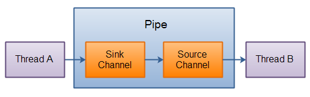

# Java NIO Pipe

<font style="color:rgb(102, 102, 102);"></font>

<font style="color:rgb(102, 102, 102);">Java NIO 管道是 2 个线程之间的单向数据连接。Pipe 有一个</font><code><font style="color:rgb(102, 102, 102);">source</font></code><font style="color:rgb(102, 102, 102);">通道和一个</font><code><font style="color:rgb(102, 102, 102);">sink</font></code><font style="color:rgb(102, 102, 102);">通道。数据会被写到</font><code><font style="color:rgb(102, 102, 102);">sink</font></code><font style="color:rgb(102, 102, 102);">通道，从</font><code><font style="color:rgb(102, 102, 102);">source</font></code><font style="color:rgb(102, 102, 102);">通道读取。</font>

<font style="color:rgb(102, 102, 102);"></font>

<font style="color:rgb(102, 102, 102);">这里是 Pipe 原理的图示：</font>



## 一、创建管道

<font style="color:rgb(102, 102, 102);">通过</font><code><font style="color:rgb(102, 102, 102);">Pipe.open()</font></code><font style="color:rgb(102, 102, 102);">方法打开管道。例如：</font>

```c
Pipe pipe = Pipe.open();
```

## 二、向管道写数据

<font style="color:rgb(102, 102, 102);">要向管道写数据，需要访问 sink 通道。像这样：</font>

```c
Pipe.SinkChannel sinkChannel = pipe.sink();
```

<font style="color:rgb(102, 102, 102);">通过调用 SinkChannel 的</font><code><font style="color:rgb(102, 102, 102);">write()</font></code><font style="color:rgb(102, 102, 102);">方法，将数据写入 SinkChannel ,像这样：</font>

```c
String newData = "New String to write to file..." + System.currentTimeMillis();
ByteBuffer buf = ByteBuffer.allocate(48);
buf.clear();
buf.put(newData.getBytes());

buf.flip();

while(buf.hasRemaining()) {
    sinkChannel.write(buf);
}
```

## 三、从管道读取数据

<font style="color:rgb(102, 102, 102);">从读取管道的数据，需要访问 source 通道，像这样：</font>

```c
Pipe.SourceChannel sourceChannel = pipe.source();
```

<font style="color:rgb(102, 102, 102);">调用 source 通道的</font><code><font style="color:rgb(102, 102, 102);">read()</font></code><font style="color:rgb(102, 102, 102);">方法来读取数据，像这样：</font>

```c
ByteBuffer buf = ByteBuffer.allocate(48);

int bytesRead = sourceChannel.read(buf);
```

<code><font style="color:rgb(102, 102, 102);">read()</font></code><font style="color:rgb(102, 102, 102);">方法返回的 int 值会告诉我们多少字节被读进了缓冲区。</font>


> 更新: 2022-04-09 16:53:15  
> 原文: <https://www.yuque.com/thinkspace/ulag78/vlqxgn>