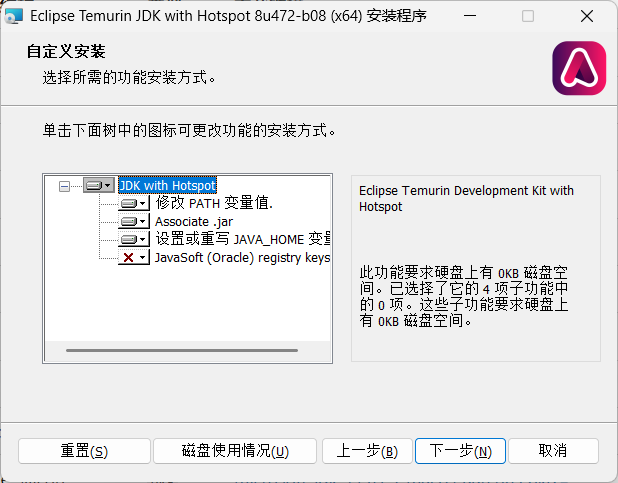
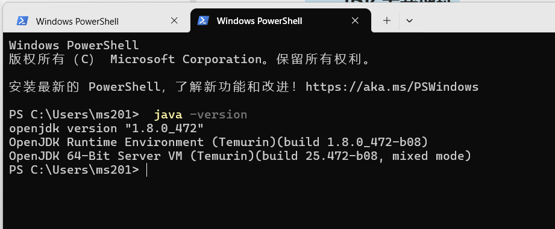

# Java 安装

## **一、JDK 下载地址**

<https://adoptium.net/zh-CN/temurin/releases?version=8>

## 二、Windows下安装

<font style="color:rgb(31, 41, 55);background-color:rgb(249, 250, 251);">1、安装完JDK后，需要设置一个</font><code><font style="color:rgb(75, 85, 99);background-color:rgb(229, 231, 235);">JAVA_HOME</font></code><font style="color:rgb(31, 41, 55);background-color:rgb(249, 250, 251);">的环境变量，它指向JDK的安装目录。在Windows下，类似：</font>

```shell
C:\Program Files\Java\jdk-23
```

<font style="color:rgb(31, 41, 55);background-color:rgb(249, 250, 251);">2、然后，把</font><code><font style="color:rgb(75, 85, 99);background-color:rgb(229, 231, 235);">JAVA_HOME</font></code><font style="color:rgb(31, 41, 55);background-color:rgb(249, 250, 251);">的</font><code><font style="color:rgb(75, 85, 99);background-color:rgb(229, 231, 235);">bin</font></code><font style="color:rgb(31, 41, 55);background-color:rgb(249, 250, 251);">目录附加到系统环境变量</font><code><font style="color:rgb(75, 85, 99);background-color:rgb(229, 231, 235);">PATH</font></code><font style="color:rgb(31, 41, 55);background-color:rgb(249, 250, 251);">上。在Windows下，它长这样：</font>

> <font style="color:rgb(31, 41, 55);background-color:rgb(249, 250, 251);">把</font><code><font style="color:rgb(75, 85, 99);background-color:rgb(229, 231, 235);">JAVA_HOME</font></code><font style="color:rgb(31, 41, 55);background-color:rgb(249, 250, 251);">的</font><code><font style="color:rgb(75, 85, 99);background-color:rgb(229, 231, 235);">bin</font></code><font style="color:rgb(31, 41, 55);background-color:rgb(249, 250, 251);">目录添加到</font><code><font style="color:rgb(75, 85, 99);background-color:rgb(229, 231, 235);">PATH</font></code><font style="color:rgb(31, 41, 55);background-color:rgb(249, 250, 251);">中是为了在任意文件夹下都可以运行</font><code><font style="color:rgb(75, 85, 99);background-color:rgb(229, 231, 235);">java</font></code><font style="color:rgb(31, 41, 55);background-color:rgb(249, 250, 251);">。</font>

<font style="color:#DF2A3F;background-color:rgb(249, 250, 251);"></font>

<font style="color:#DF2A3F;background-color:rgb(249, 250, 251);">注意：使用上面链接下载的JDK会勾选以</font><font style="color:#DF2A3F;">下选项</font><font style="color:#DF2A3F;background-color:rgb(249, 250, 251);">自动配置</font><code><font style="color:#DF2A3F;background-color:rgb(229, 231, 235);">JAVA_HOME</font></code><font style="color:#DF2A3F;">和</font><code><font style="color:#DF2A3F;background-color:rgb(229, 231, 235);">PATH</font></code><font style="color:#DF2A3F;">。</font>



打开PowerShell窗口，输入命令`java -version`验证是否安装成功。



## **三、Ubuntu 下安装 JDK**

### **1、通过 APT 安装**

```plain
sudo apt update
sudo apt search jdk
sudo apt install openjdk-8-jdk
java -version
```

### **2、手动安装**

#### **（1）下载解压**

```plain
wget  https://github.com/AdoptOpenJDK/openjdk11-binaries/releases/download/jdk-11.0.11%2B9/OpenJDK11U-jdk_x64_linux_hotspot_11.0.11_9.tar.gz
tar -zxvf OpenJDK11U-jdk_x64_linux_hotspot_11.0.11_9.tar.gz
```

#### **（2）配置环境变量**

```plain
sudo vim  /etc/profile
末尾添加
export JAVA_HOME=/usr/lib/jvm/java-8-openjdk-amd64  # 替换为Java解压缩后的目录路径
export JRE_HOME=${JAVA_HOME}/jre 
export CLASSPATH=.:
${JAVA_HOME}/lib:$
{JRE_HOME}/lib 
export PATH=
${JAVA_HOME}/bin:$
PATH
#最后执行以下命令让修改生效：
source /etc/profile
```


> 更新: 2025-11-13 10:53:22  
> 原文: <https://www.yuque.com/thinkspace/ulag78/oubzt8zffvuru34e>