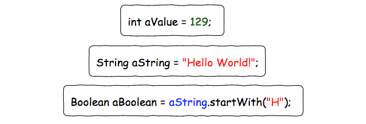
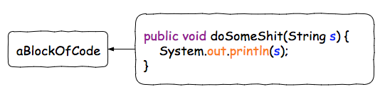
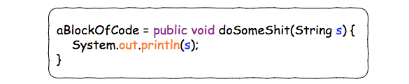
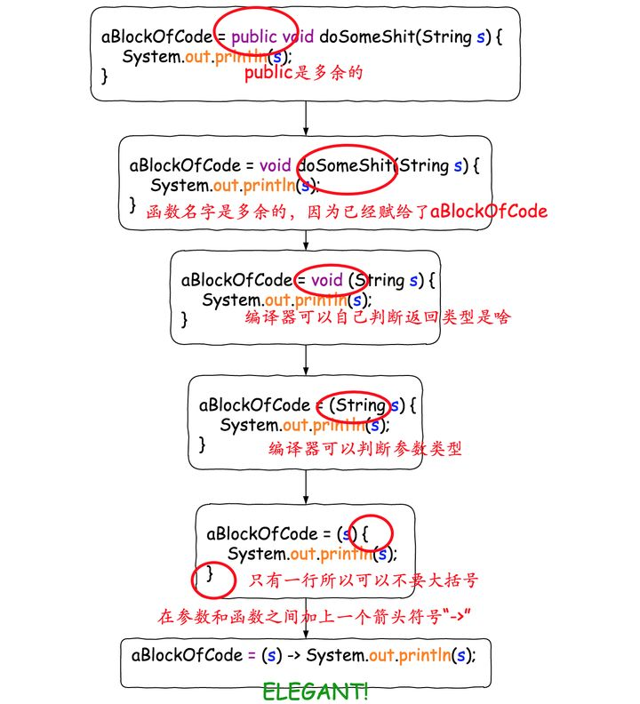
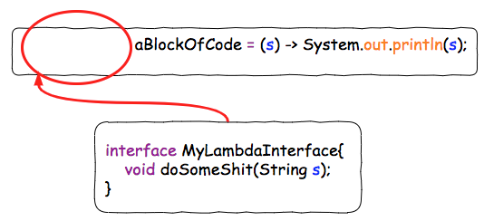
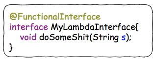
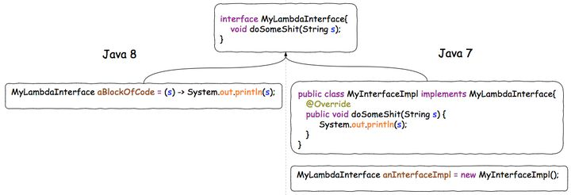
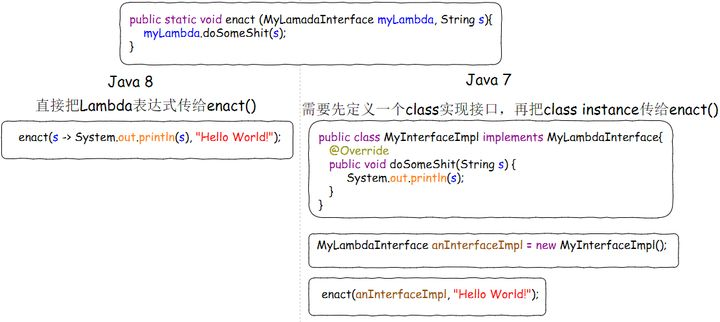

# Lambda 表达式

## 一、什么是 Lambda

<font style="color:rgb(18, 18, 18);">我们知道，对于一个Java变量，我们可以赋给其一个</font>**<font style="color:rgb(18, 18, 18);">“值”</font>**<font style="color:rgb(18, 18, 18);">。</font>



<font style="color:rgb(18, 18, 18);">如果你想把</font>**<font style="color:rgb(18, 18, 18);">“一块代码”</font>**<font style="color:rgb(18, 18, 18);">赋给一个Java变量，应该怎么做呢？</font>

<font style="color:rgb(18, 18, 18);">比如，我想把右边那块代码，赋给一个叫做aBlockOfCode的Java变量：</font>



<font style="color:rgb(18, 18, 18);">在Java 8之前，这个是做不到的。但是Java 8问世之后，利用Lambda特性，就可以做到了。</font>



<font style="color:rgb(18, 18, 18);">当然，这个并不是一个很简洁的写法。所以，为了使这个赋值操作更加elegant, 我们可以移除一些没用的声明。</font>



这样，我们就成功的非常优雅的把“一块代码”赋给了一个变量。**而“这块代码”，或者说“这个被赋给一个变量的函数”，就是一个Lambda表达式**。

但是这里仍然有一个问题，就是变量`aBlockOfCode`的类型应该是什么？

在 Java 8里面，\*\*所有的Lambda的类型都是一个接口，而Lambda表达式本身，也就是”那段代码“，需要是这个接口的实现。\*\*这是我认为理解Lambda的一个关键所在，简而言之就是，**Lambda表达式本身就是一个接口的实现**。直接这样说可能还是有点让人困扰，我们继续看看例子。我们给上面的 `aBlockOfCode`加上一个类型：



这种只有\*\*<font style="color:#F5222D;">一个</font>\*\*\*\*接口函数需要被实现的接口类型，我们叫它”函数式接口“。\*\*为了避免后来的人在这个接口中增加接口函数导致其有多个接口函数需要被实现，变成"非函数接口”，我们可以在这个上面加上一个声明`@FunctionalInterface`, 这样别人就无法在里面添加新的接口函数了：



<font style="color:rgb(18, 18, 18);">这样，我们就得到了一个完整的Lambda表达式声明：</font>


## 二、Lambda 的作用

**<font style="color:rgb(18, 18, 18);">最直观的作用就是使得代码变得异常简洁。</font>**

<font style="color:rgb(18, 18, 18);">我们可以对比一下Lambda表达式和传统的Java对同一个接口的实现：</font>



<font style="color:rgb(18, 18, 18);">这两种写法本质上是等价的。但是显然，Java 8中的写法更加优雅简洁。并且，由于Lambda可以直接赋值给一个变量，</font>**<font style="color:rgb(18, 18, 18);">我们就可以直接把Lambda作为参数传给函数, 而传统的Java必须有明确的接口实现的定义，初始化才行：</font>**



<font style="color:rgb(18, 18, 18);">有些情况下，这个接口实现只需要用到一次。传统的Java 7必须要求你定义一个“污染环境”的接口实现</font><code><font style="color:rgb(18, 18, 18);">MyInterfaceImpl</font></code><font style="color:rgb(18, 18, 18);">，而相较之下Java 8的Lambda, 就显得干净很多。</font>

## 三、方法引用

<font style="color:rgb(102, 102, 102);">使用</font><code><font style="color:rgb(102, 102, 102);">Lambda</font></code><font style="color:rgb(102, 102, 102);">表达式，我们就可以不必编写</font><code><font style="color:rgb(221, 0, 85);background-color:rgb(250, 250, 250);">FunctionalInterface</font></code><font style="color:rgb(102, 102, 102);">接口的实现类，从而简化代码：</font>

```java
enact(s->System.out.println(s),"hello world");
```

<font style="color:rgb(102, 102, 102);">实际上，除了 Lambda 表达式，我们还可以直接传入方法引用。例如：</font>

```java
public class Main {
    public static void main(String[] args) {
        String[] array = new String[] { "Apple", "Orange", "Banana", "Lemon" };
        Arrays.sort(array, Main::cmp);
        System.out.println(String.join(", ", array));
    }

    static int cmp(String s1, String s2) {
        return s1.compareTo(s2);
    }
}
```

<font style="color:rgb(102, 102, 102);">上述代码在</font><code><font style="color:rgb(221, 0, 85);background-color:rgb(250, 250, 250);">Arrays.sort()</font></code><font style="color:rgb(102, 102, 102);">中直接传入了静态方法</font><code><font style="color:rgb(221, 0, 85);background-color:rgb(250, 250, 250);">cmp</font></code><font style="color:rgb(102, 102, 102);">的引用，用</font><code><font style="color:rgb(221, 0, 85);background-color:rgb(250, 250, 250);">Main::cmp</font></code><font style="color:rgb(102, 102, 102);">表示。</font>

<font style="color:rgb(102, 102, 102);">因此，所谓方法引用，是指如果某个方法签名和接口恰好一致，就可以直接传入方法引用。</font>

<font style="color:rgb(102, 102, 102);">因为</font><code><font style="color:rgb(221, 0, 85);background-color:rgb(250, 250, 250);">Comparator<String></font></code><font style="color:rgb(102, 102, 102);">接口定义的方法是</font><code><font style="color:rgb(221, 0, 85);background-color:rgb(250, 250, 250);">int compare(String, String)</font></code><font style="color:rgb(102, 102, 102);">，和静态方法</font><code><font style="color:rgb(221, 0, 85);background-color:rgb(250, 250, 250);">int cmp(String, String)</font></code><font style="color:rgb(102, 102, 102);">相比，除了方法名外，方法参数一致，返回类型相同，因此，我们说两者的方法签名一致，可以直接把方法名作为Lambda表达式传入：</font>

```java
Arrays.sort(array, Main::cmp);
```

<font style="color:rgb(102, 102, 102);">注意：在这里，方法签名只看参数类型和返回类型，不看方法名称，也不看类的继承关系。</font>

## 参考

* [Lambda 表达式有何用处？如何使用？](https://www.zhihu.com/question/20125256/answer/324121308)
* [深入浅出 Java 8 Lambda 表达式](http://blog.oneapm.com/apm-tech/226.html)
* [Lambda基础](https://www.liaoxuefeng.com/wiki/1252599548343744/1305158055100449)


> 更新: 2024-09-18 13:03:37  
> 原文: <https://www.yuque.com/thinkspace/ulag78/nsz5r0>