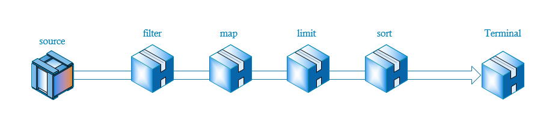

# Stream API 使用

## 一、什么是 Stream API

<code><font style="color:rgb(232, 62, 140);background-color:rgb(246, 246, 246);">Stream</font></code><font style="color:rgb(51, 51, 51);">被翻译为流，它的工作过程像将一瓶水导入有很多过滤阀的管道一样，水每经过一个过滤阀，便被操作一次，比如过滤，转换等，最后管道的另外一头有一个容器负责接收剩下的水。</font>

<font style="color:rgb(51, 51, 51);">示意图如下：</font>



<font style="color:rgb(51, 51, 51);">首先通过</font><code><font style="color:rgb(232, 62, 140);background-color:rgb(246, 246, 246);">source</font></code><font style="color:rgb(51, 51, 51);">产生流，然后依次通过一些中间操作，比如过滤，转换，限制等，最后结束对流的操作。</font>

<code><font style="color:rgb(232, 62, 140);background-color:rgb(246, 246, 246);">Stream</font></code><font style="color:rgb(51, 51, 51);">也可以理解为一个更加高级的迭代器，主要的作用便是遍历其中每一个元素。</font>

<font style="color:rgb(51, 51, 51);"></font>

## 二、为什么需要 Stream

<code><font style="color:rgb(232, 62, 140);background-color:rgb(246, 246, 246);">Stream</font></code><font style="color:rgb(51, 51, 51);">作为Java 8的一大亮点，它专门针对集合的各种操作提供各种非常便利，简单，高效的API,</font><code><font style="color:rgb(232, 62, 140);background-color:rgb(246, 246, 246);">Stream API</font></code><font style="color:rgb(51, 51, 51);">主要是通过</font><code><font style="color:rgb(232, 62, 140);background-color:rgb(246, 246, 246);">Lambda</font></code><font style="color:rgb(51, 51, 51);">表达式完成，极大的提高了程序的效率和可读性，同时</font><code><font style="color:rgb(232, 62, 140);background-color:rgb(246, 246, 246);">Stram API</font></code><font style="color:rgb(51, 51, 51);">中自带的并行流使得并发处理集合的门槛再次降低，使用</font><code><font style="color:rgb(232, 62, 140);background-color:rgb(246, 246, 246);">Stream API</font></code><font style="color:rgb(51, 51, 51);">编程无需多写一行多线程的大门就可以非常方便的写出高性能的并发程序。使用</font><code><font style="color:rgb(232, 62, 140);background-color:rgb(246, 246, 246);">Stream API</font></code><font style="color:rgb(51, 51, 51);">能够使你的代码更加优雅。</font>

<font style="color:rgb(51, 51, 51);">流的另一特点是可无限性，使用</font><code><font style="color:rgb(232, 62, 140);background-color:rgb(246, 246, 246);">Stream</font></code><font style="color:rgb(51, 51, 51);">，你的数据源可以是无限大的。</font>

<font style="color:rgb(51, 51, 51);">在没有</font><code><font style="color:rgb(232, 62, 140);background-color:rgb(246, 246, 246);">Stream</font></code><font style="color:rgb(51, 51, 51);">之前，我们想提取出所有年龄大于18的学生，我们需要这样做：</font>

```java
List<Student> students=new ArrayList<>();
for(Student student:students){
 
    if(student.getAge()>18){
        result.add(student);
    }
}
return result;
```

<font style="color:rgb(51, 51, 51);">使用</font><code><font style="color:rgb(232, 62, 140);background-color:rgb(246, 246, 246);">Stream</font></code><font style="color:rgb(51, 51, 51);">,我们可以参照上面的流程示意图来做，首先产生</font><code><font style="color:rgb(232, 62, 140);background-color:rgb(246, 246, 246);">Stream</font></code><font style="color:rgb(51, 51, 51);">,然后</font><code><font style="color:rgb(232, 62, 140);background-color:rgb(246, 246, 246);">filter</font></code><font style="color:rgb(51, 51, 51);">过滤，最后归并到容器中。</font>

<font style="color:rgb(51, 51, 51);">转换为代码如下：</font>

```java
return students.stream().filter(s->s.getAge()>18).collect(Collectors.toList());
```

* <font style="color:rgb(51, 51, 51);">首先</font><code><font style="color:rgb(232, 62, 140);background-color:rgb(246, 246, 246);">stream()</font></code><font style="color:rgb(51, 51, 51);">获得流</font>
* <font style="color:rgb(51, 51, 51);">然后</font><code><font style="color:rgb(232, 62, 140);background-color:rgb(246, 246, 246);">filter(s->s.getAge()>18)</font></code><font style="color:rgb(51, 51, 51);">过滤</font>
* <font style="color:rgb(51, 51, 51);">最后</font><code><font style="color:rgb(232, 62, 140);background-color:rgb(246, 246, 246);">collect(Collectors.toList())</font></code><font style="color:rgb(51, 51, 51);">归并到容器中</font>

<font style="color:rgb(51, 51, 51);"></font>

<font style="color:rgb(51, 51, 51);">是不是很像在写</font><code><font style="color:rgb(232, 62, 140);background-color:rgb(246, 246, 246);">sql</font></code><font style="color:rgb(51, 51, 51);">?</font>

<font style="color:rgb(51, 51, 51);"></font>

## 三、创建 Stream

<font style="color:rgb(51, 51, 51);"></font>

### 1、使用 Stream.of()

<font style="color:rgb(102, 102, 102);">创建</font><code><font style="color:rgb(221, 0, 85);background-color:rgb(250, 250, 250);">Stream</font></code><font style="color:rgb(102, 102, 102);">最简单的方式是直接用</font><code><font style="color:rgb(221, 0, 85);background-color:rgb(250, 250, 250);">Stream.of()</font></code><font style="color:rgb(102, 102, 102);">静态方法，传入可变参数即创建了一个能输出确定元素的</font><code><font style="color:rgb(221, 0, 85);background-color:rgb(250, 250, 250);">Stream</font></code><font style="color:rgb(102, 102, 102);">：</font>

```java
public class Main {
    public static void main(String[] args) {
        Stream<String> stream = Stream.of("A", "B", "C", "D");
        // forEach()方法相当于内部循环调用，
        // 可传入符合Consumer接口的void accept(T t)的方法引用：
        stream.forEach(System.out::println);
    }
}
```

<font style="color:rgb(102, 102, 102);">虽然这种方式基本上没啥实质性用途，但测试的时候很方便。</font>

<font style="color:rgb(102, 102, 102);"></font>

### 2、基于数组或 Collection

<font style="color:rgb(102, 102, 102);">第二种创建</font><code><font style="color:rgb(221, 0, 85);background-color:rgb(250, 250, 250);">Stream</font></code><font style="color:rgb(102, 102, 102);">的方法是基于一个数组或者</font><code><font style="color:rgb(221, 0, 85);background-color:rgb(250, 250, 250);">Collection</font></code><font style="color:rgb(102, 102, 102);">，这样该</font><code><font style="color:rgb(221, 0, 85);background-color:rgb(250, 250, 250);">Stream</font></code><font style="color:rgb(102, 102, 102);">输出的元素就是数组或者</font><code><font style="color:rgb(221, 0, 85);background-color:rgb(250, 250, 250);">Collection</font></code><font style="color:rgb(102, 102, 102);">持有的元素：</font>

```java
public class Main {
    public static void main(String[] args) {
        Stream<String> stream1 = Arrays.stream(new String[] { "A", "B", "C" });
        Stream<String> stream2 = List.of("X", "Y", "Z").stream();
        stream1.forEach(System.out::println);
        stream2.forEach(System.out::println);
    }
}
```

<font style="color:rgb(102, 102, 102);">把数组变成</font><code><font style="color:rgb(221, 0, 85);background-color:rgb(250, 250, 250);">Stream</font></code><font style="color:rgb(102, 102, 102);">使用</font><code><font style="color:rgb(221, 0, 85);background-color:rgb(250, 250, 250);">Arrays.stream()</font></code><font style="color:rgb(102, 102, 102);">方法。对于</font><code><font style="color:rgb(221, 0, 85);background-color:rgb(250, 250, 250);">Collection</font></code><font style="color:rgb(102, 102, 102);">（</font><code><font style="color:rgb(221, 0, 85);background-color:rgb(250, 250, 250);">List</font></code><font style="color:rgb(102, 102, 102);">、</font><code><font style="color:rgb(221, 0, 85);background-color:rgb(250, 250, 250);">Set</font></code><font style="color:rgb(102, 102, 102);">、</font><code><font style="color:rgb(221, 0, 85);background-color:rgb(250, 250, 250);">Queue</font></code><font style="color:rgb(102, 102, 102);">等），直接调用</font><code><font style="color:rgb(221, 0, 85);background-color:rgb(250, 250, 250);">stream()</font></code><font style="color:rgb(102, 102, 102);">方法就可以获得</font><code><font style="color:rgb(221, 0, 85);background-color:rgb(250, 250, 250);">Stream</font></code><font style="color:rgb(102, 102, 102);">。</font>

<font style="color:rgb(102, 102, 102);">上述创建</font><code><font style="color:rgb(221, 0, 85);background-color:rgb(250, 250, 250);">Stream</font></code><font style="color:rgb(102, 102, 102);">的方法都是把一个现有的序列变为</font><code><font style="color:rgb(221, 0, 85);background-color:rgb(250, 250, 250);">Stream</font></code><font style="color:rgb(102, 102, 102);">，它的元素是固定的。</font>

<font style="color:rgb(102, 102, 102);"></font>

### 3、基于 Supplier

<font style="color:rgb(102, 102, 102);"></font>

<font style="color:rgb(102, 102, 102);">创建</font><code><font style="color:rgb(221, 0, 85);background-color:rgb(250, 250, 250);">Stream</font></code><font style="color:rgb(102, 102, 102);">还可以通过</font><code><font style="color:rgb(221, 0, 85);background-color:rgb(250, 250, 250);">Stream.generate()</font></code><font style="color:rgb(102, 102, 102);">方法，它需要传入一个</font><code><font style="color:rgb(221, 0, 85);background-color:rgb(250, 250, 250);">Supplier</font></code><font style="color:rgb(102, 102, 102);">对象：</font>

```java
Stream<String> s = Stream.generate(Supplier<String> sp);
```

<font style="color:rgb(102, 102, 102);">基于</font><code><font style="color:rgb(221, 0, 85);background-color:rgb(250, 250, 250);">Supplier</font></code><font style="color:rgb(102, 102, 102);">创建的</font><code><font style="color:rgb(221, 0, 85);background-color:rgb(250, 250, 250);">Stream</font></code><font style="color:rgb(102, 102, 102);">会不断调用</font><code><font style="color:rgb(221, 0, 85);background-color:rgb(250, 250, 250);">Supplier.get()</font></code><font style="color:rgb(102, 102, 102);">方法来不断产生下一个元素，这种</font><code><font style="color:rgb(221, 0, 85);background-color:rgb(250, 250, 250);">Stream</font></code><font style="color:rgb(102, 102, 102);">保存的不是元素，而是算法，它可以用来表示无限序列。</font>

<font style="color:rgb(102, 102, 102);">例如，我们编写一个能不断生成自然数的</font><code><font style="color:rgb(221, 0, 85);background-color:rgb(250, 250, 250);">Supplier</font></code><font style="color:rgb(102, 102, 102);">，它的代码非常简单，每次调用</font><font style="color:rgb(221, 0, 85);background-color:rgb(250, 250, 250);">get()</font><font style="color:rgb(102, 102, 102);">方法，就生成下一个自然数：</font>

```java
public class Main {
    public static void main(String[] args) {
        Stream<Integer> natual = Stream.generate(new NatualSupplier());
        // 注意：无限序列必须先变成有限序列再打印:
        natual.limit(20).forEach(System.out::println);
    }
}

class NatualSupplier implements Supplier<Integer> {
    int n = 0;
    public Integer get() {
        n++;
        return n;
    }
}
```

<font style="color:rgb(102, 102, 102);">上述代码我们用一个</font><font style="color:rgb(221, 0, 85);background-color:rgb(250, 250, 250);">Supplier<Integer></font>\`\`<font style="color:rgb(102, 102, 102);">模拟了一个无限序列（当然受</font><code><font style="color:rgb(221, 0, 85);background-color:rgb(250, 250, 250);">int</font></code><font style="color:rgb(102, 102, 102);">范围限制不是真的无限大）。如果用</font><code><font style="color:rgb(221, 0, 85);background-color:rgb(250, 250, 250);">List</font></code><font style="color:rgb(102, 102, 102);">表示，即便在</font><code><font style="color:rgb(221, 0, 85);background-color:rgb(250, 250, 250);">int</font></code><font style="color:rgb(102, 102, 102);">范围内，也会占用巨大的内存，而</font><code><font style="color:rgb(221, 0, 85);background-color:rgb(250, 250, 250);">Stream</font></code><font style="color:rgb(102, 102, 102);">几乎不占用空间，因为每个元素都是实时计算出来的，用的时候再算。</font>

<font style="color:rgb(102, 102, 102);">对于无限序列，如果直接调用</font><code><font style="color:rgb(221, 0, 85);background-color:rgb(250, 250, 250);">forEach()</font></code><font style="color:rgb(102, 102, 102);">或者</font><code><font style="color:rgb(221, 0, 85);background-color:rgb(250, 250, 250);">count()</font></code><font style="color:rgb(102, 102, 102);">这些最终求值操作，会进入死循环，因为永远无法计算完这个序列，所以正确的方法是先把无限序列变成有限序列，例如，用</font><code><font style="color:rgb(221, 0, 85);background-color:rgb(250, 250, 250);">limit()</font></code><font style="color:rgb(102, 102, 102);">方法可以截取前面若干个元素，这样就变成了一个有限序列，对这个有限序列调用</font><code><font style="color:rgb(221, 0, 85);background-color:rgb(250, 250, 250);">forEach()</font></code><font style="color:rgb(102, 102, 102);">或者</font><code><font style="color:rgb(221, 0, 85);background-color:rgb(250, 250, 250);">count()</font></code><font style="color:rgb(102, 102, 102);">操作就没有问题。</font>

<font style="color:rgb(102, 102, 102);"></font>

<font style="color:rgb(102, 102, 102);"></font>

## 参考

* <https://www.cnblogs.com/dengchengchao/p/11855723.html>
* <https://www.liaoxuefeng.com/wiki/1252599548343744/1322402873081889>


> 更新: 2022-04-09 16:53:12  
> 原文: <https://www.yuque.com/thinkspace/ulag78/kyias9>