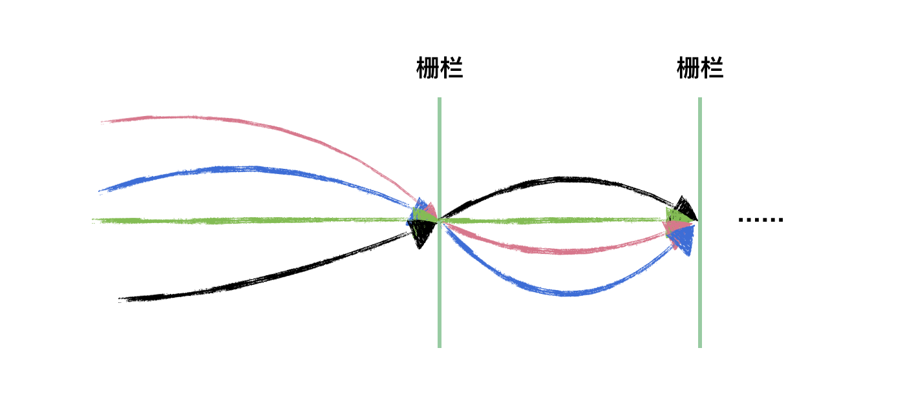
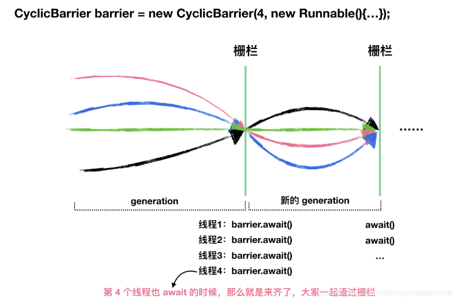

# CyclicBarrier 使用

## 一、什么是 CyclicBarrier
从字面上的意思可以知道，这个类的中文意思是“循环栅栏”。大概的意思就是一个可循环利用的屏障。

它的作用就是会让所有线程都等待完成后才会继续下一步行动。

现实生活中我们经常会遇到这样的情景，在进行某个活动前需要等待人全部都齐了才开始。例如吃饭时要等全家人都上座了才动筷子，旅游时要等全部人都到齐了才出发，比赛时要等运动员都上场后才开始。

在JUC包中为我们提供了一个同步工具类能够很好的模拟这类场景，它就是CyclicBarrier类。利用CyclicBarrier类可以实现一组线程相互等待，当所有线程都到达某个屏障点后再进行后续的操作。

CyclicBarrier字面意思是“可重复使用的栅栏”，CyclicBarrier 相比 CountDownLatch 来说，要简单很多，其源码没有什么高深的地方，它是 ReentrantLock 和 Condition 的组合使用。

看如下示意图，CyclicBarrier 和 CountDownLatch 是不是很像，只是 CyclicBarrier 可以有不止一个栅栏，因为它的栅栏（Barrier）可以重复使用（Cyclic）。  


## 二、使用 CyclicBarrier
### 1、构造方法
```java
//parties 是参与线程的个数
//第二个构造方法有一个 Runnable 参数，这个参数的意思是最后一个到达线程要做的任务
public CyclicBarrier(int parties)
public CyclicBarrier(int parties, Runnable barrierAction)
```

### 2、重要方法
```java
//线程调用 await() 表示自己已经到达栅栏
//BrokenBarrierException 表示栅栏已经被破坏，破坏的原因可能是其中一个线程 await() 时被中断或者超时
public int await() throws InterruptedException, BrokenBarrierException
public int await(long timeout, TimeUnit unit) throws InterruptedException, BrokenBarrierException, TimeoutException
```


### 案例
一个线程组的线程需要等待所有线程完成任务后再继续执行下一次任务。

```java
public class CyclicBarrierDemo {

static class TaskThread extends Thread {
    
    CyclicBarrier barrier;
    
    public TaskThread(CyclicBarrier barrier) {
        this.barrier = barrier;
    }
    
    @Override
    public void run() {
        try {
            Thread.sleep(1000);
            System.out.println(getName() + " 到达栅栏 A");
            barrier.await();
            System.out.println(getName() + " 冲破栅栏 A");
            
            Thread.sleep(2000);
            System.out.println(getName() + " 到达栅栏 B");
            barrier.await();
            System.out.println(getName() + " 冲破栅栏 B");
        } catch (Exception e) {
            e.printStackTrace();
        }
    }
}

public static void main(String[] args) {
    int threadNum = 5;
    CyclicBarrier barrier = new CyclicBarrier(threadNum, new Runnable() {
        
        @Override
        public void run() {
            System.out.println(Thread.currentThread().getName() + " 完成最后任务");
        }
    });
    
    for(int i = 0; i < threadNum; i++) {
        new TaskThread(barrier).start();
    }
}
```

打印结果

```plain
Thread-1 到达栅栏 A
Thread-3 到达栅栏 A
Thread-0 到达栅栏 A
Thread-4 到达栅栏 A
Thread-2 到达栅栏 A
Thread-2 完成最后任务
Thread-2 冲破栅栏 A
Thread-1 冲破栅栏 A
Thread-3 冲破栅栏 A
Thread-4 冲破栅栏 A
Thread-0 冲破栅栏 A
Thread-4 到达栅栏 B
Thread-0 到达栅栏 B
Thread-3 到达栅栏 B
Thread-2 到达栅栏 B
Thread-1 到达栅栏 B
Thread-1 完成最后任务
Thread-1 冲破栅栏 B
Thread-0 冲破栅栏 B
Thread-4 冲破栅栏 B
Thread-2 冲破栅栏 B
Thread-3 冲破栅栏 B
```

从打印结果可以看出，所有线程会等待全部线程到达栅栏之后才会继续执行，并且最后到达的线程会完成 Runnable 的任务。  


## 三、CyclicBarrier 使用场景
可以用于多线程计算数据，最后合并计算结果的场景。

## 四、与 CountDownLatch 的区别
+ CountDownLatch 是一次性的，CyclicBarrier 是可循环利用的
+ CountDownLatch 参与的线程的职责是不一样的，有的在倒计时，有的在等待倒计时结束。CyclicBarrier 参与的线程职责是一样的。
+ CyclicBarrier 的源码实现和 CountDownLatch 大相径庭，CountDownLatch 基于 AQS 的共享模式的使用，而 CyclicBarrier 基于 Condition 来实现的。因为 CyclicBarrier 的源码相对来说简单许多，读者只要熟悉了前面关于 Condition 的分析，那么这里的源码是毫无压力的，就是几个特殊概念罢了。


## 参考


+ [https://www.cnblogs.com/crazymakercircle/p/13906379.html](https://www.cnblogs.com/crazymakercircle/p/13906379.html)


> 更新: 2022-06-24 00:29:23  
> 原文: <https://www.yuque.com/thinkspace/ulag78/dwpxz0>