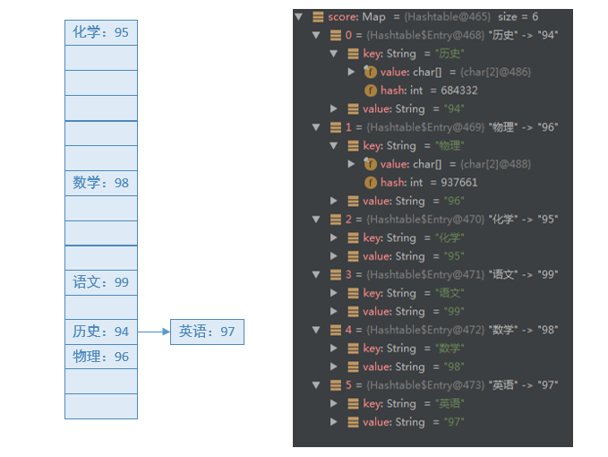
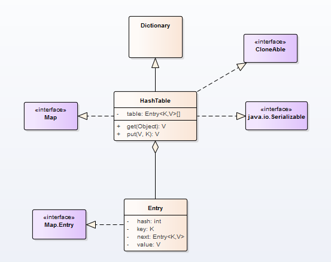

# Java 集合之 Hashtable

## 一、概述

本文来对Map家族的另外一个常用集合HashTable进行介绍。HashTable和HashMap两种集合非常相似，经常被各种面试官问到两者的区别。

### HashMap 与 Hashtable 的区别

* **线程是否安全**： HashMap 是非线程安全的，Hashtable 是线程安全的,因为 Hashtable 内部的方法基本都经过synchronized 修饰。（如果你要保证线程安全的话就使用 ConcurrentHashMap 吧！）；
* **效率**： 因为线程安全的问题，HashMap 要比 Hashtable 效率高一点。另外，Hashtable 基本被淘汰，不要在代码中使用它； - **对 Null key 和 Null value 的支持**： HashMap 可以存储 null 的 key 和 value，但 null 作为键只能有一个，null 作为值可以有多个；Hashtable 不允许有 null 键和 null 值，否则会抛出 NullPointerException。
* **初始容量大小和每次扩充容量大小的不同** ：
  * 创建时如果不指定容量初始值，Hashtable 默认的初始大小为 11，之后每次扩充，容量变为原来的 2n+1。HashMap 默认的初始化大小为 16。之后每次扩充，容量变为原来的 2 倍。
  * 创建时如果给定了容量初始值，那么 Hashtable 会直接使用你给定的大小，而 HashMap 会将其扩充为 2 的幂次方大小（HashMap 中的tableSizeFor()方法保证，下面给出了源代码）。也就是说 HashMap 总是使用 2 的幂作为哈希表的大小,后面会介绍到为什么是 2 的幂次方。
* **底层数据结构**： JDK1.8 以后的 HashMap 在解决哈希冲突时有了较大的变化，当链表长度大于阈值（默认为 8）（将链表转换成红黑树前会判断，如果当前数组的长度小于 64，那么会选择先进行数组扩容，而不是转换为红黑树）时，将链表转化为红黑树，以减少搜索时间。Hashtable 没有这样的机制。

## 二、原理

HashTable类中，保存实际数据的，依然是Entry对象。其数据结构与HashMap是相同的。



HashTable类继承自`Dictionary`类，实现了三个接口，分别是`Map`，`Cloneable`和`java.io.Serializable`，如下图所示。\


HashTable中的主要方法，如put，get，remove和rehash等，与HashMap中的功能相同，这里不作赘述。

## 三、源码分析

HashTable的主要方法的源码实现逻辑，与HashMap中非常相似，有一点重大区别就是所有的操作都是通过synchronized锁保护的。只有获得了对应的锁，才能进行后续的读写等操作。

### put 方法

put方法的主要逻辑如下：

* 先获取`synchronized`锁。
* put方法不允许null值，如果发现是null，则直接抛出异常。
* 计算key的哈希值和index
* 遍历对应位置的链表，如果发现已经存在相同的hash和key，则更新value，并返回旧值。
* 如果不存在相同的key的Entry节点，则调用addEntry方法增加节点。
* addEntry方法中，如果需要则进行扩容，之后添加新节点到链表头部。

```java
public synchronized V put(K key, V value) {
        // Make sure the value is not null
        if (value == null) {
            throw new NullPointerException();
        }
        // Makes sure the key is not already in the hashtable.
        Entry<?,?> tab[] = table;
        int hash = key.hashCode();
        int index = (hash & 0x7FFFFFFF) % tab.length;
        @SuppressWarnings("unchecked")
        Entry<K,V> entry = (Entry<K,V>)tab[index];
        for(; entry != null ; entry = entry.next) {
            if ((entry.hash == hash) && entry.key.equals(key)) {
                V old = entry.value;
                entry.value = value;
                return old;
            }
        }
        addEntry(hash, key, value, index);
        return null;
    }
```

```java
private void addEntry(int hash, K key, V value, int index) {
        modCount++;

        Entry<?,?> tab[] = table;
        if (count >= threshold) {
            // Rehash the table if the threshold is exceeded
            rehash();

            tab = table;
            hash = key.hashCode();
            index = (hash & 0x7FFFFFFF) % tab.length;
        }

        // Creates the new entry.
        @SuppressWarnings("unchecked")
        Entry<K,V> e = (Entry<K,V>) tab[index];
        tab[index] = new Entry<>(hash, key, value, e);
        count++;
    }
```

### get 方法

get方法的主要逻辑如下

* 先获取synchronized锁。
* 计算key的哈希值和index。
* 在对应位置的链表中寻找具有相同hash和key的节点，返回节点的value。
* 如果遍历结束都没有找到节点，则返回null。

```java
public synchronized V get(Object key) {
        Entry<?,?> tab[] = table;
        int hash = key.hashCode();
        int index = (hash & 0x7FFFFFFF) % tab.length;
        for (Entry<?,?> e = tab[index] ; e != null ; e = e.next) {
            if ((e.hash == hash) && e.key.equals(key)) {
                return (V)e.value;
            }
        }
        return null;
    }
```

### rehash 扩容方法

rehash扩容方法主要逻辑如下：

* 数组长度增加2n+1（如果超过上限，则设置成上限值）。
* 更新哈希表的扩容门限值。
* 遍历旧表中的节点，计算在新表中的index，插入到对应位置链表的头部。

```java
  protected void rehash() {
        int oldCapacity = table.length;
        Entry<?,?>[] oldMap = table;

        // overflow-conscious code
        int newCapacity = (oldCapacity << 1) + 1;
        if (newCapacity - MAX_ARRAY_SIZE > 0) {
            if (oldCapacity == MAX_ARRAY_SIZE)
                // Keep running with MAX_ARRAY_SIZE buckets
                return;
            newCapacity = MAX_ARRAY_SIZE;
        }
        Entry<?,?>[] newMap = new Entry<?,?>[newCapacity];

        modCount++;
        threshold = (int)Math.min(newCapacity * loadFactor, MAX_ARRAY_SIZE + 1);
        table = newMap;

        for (int i = oldCapacity ; i-- > 0 ;) {
            for (Entry<K,V> old = (Entry<K,V>)oldMap[i] ; old != null ; ) {
                Entry<K,V> e = old;
                old = old.next;

                int index = (e.hash & 0x7FFFFFFF) % newCapacity;
                e.next = (Entry<K,V>)newMap[index];
                newMap[index] = e;
            }
        }
    }
```

### remove 方法

remove方法主要逻辑如下：

* 先获取synchronized锁。
* 计算key的哈希值和index。
* 遍历对应位置的链表，寻找待删除节点，如果存在，用e表示待删除节点，pre表示前驱节点。如果不存在，返回null。
* 更新前驱节点的next，指向e的next。返回待删除节点的value值。

## 总结

HashTable相对于HashMap的最大特点就是线程安全，所有的操作都是被synchronized锁保护的


> 更新: 2022-06-23 23:11:38  
> 原文: <https://www.yuque.com/thinkspace/ulag78/wbpug9>