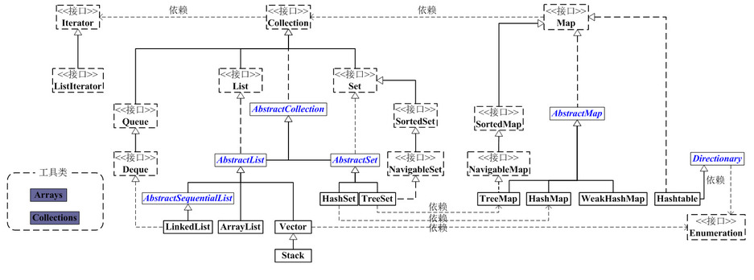
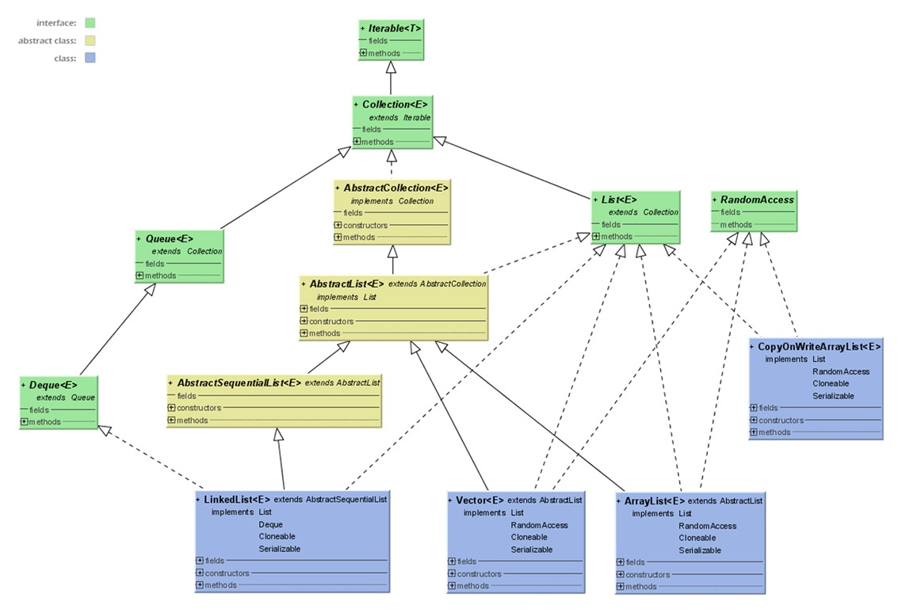
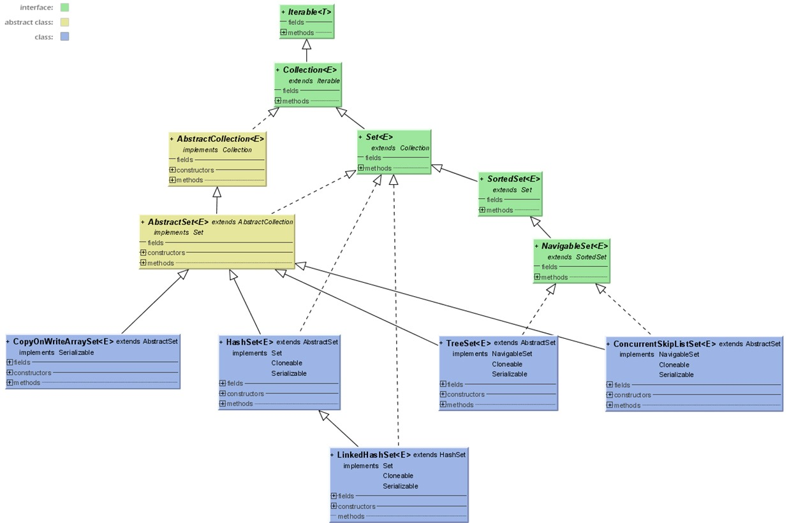
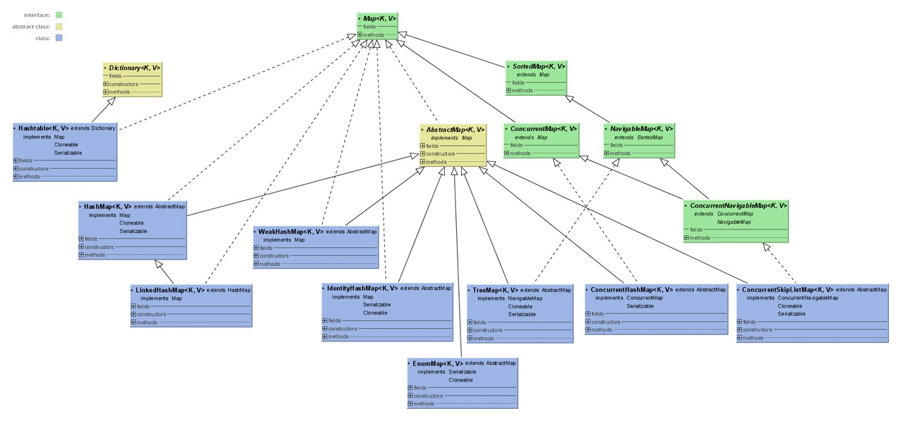
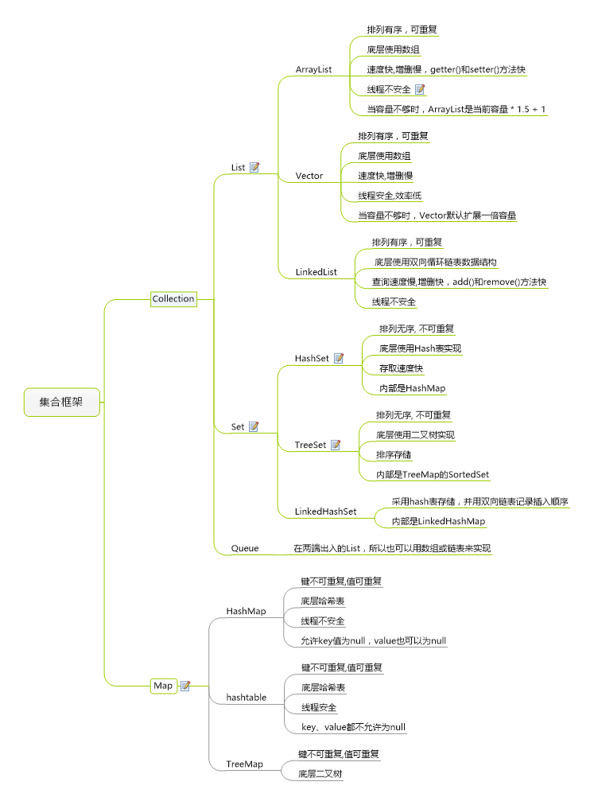

# Java 集合总述

## 一、前言

Java 集合是 java 提供的工具包，工具包位置是`java.util.*`，包含了常用的数据结构：集合、链表、队列、栈、数组、映射等。

Java 集合主要可以划分为4个部分

* `List` 列表
* `Set` 集合
* `Map` 映射
* 工具类( `Iterator` 迭代器、`Enumeration` 枚举类、`Arrays` 和 `Collections`)

Java集合工具包框架图(如下)：

看上面的框架图，先抓住它的主干，即 `Collection` 和 `Map` 。

## 二、Collection 接口

* 是 `List`、`Set` 和 `Queue` 接口的父接口
* 定义了可用于操作 `List`、`Set` 和 `Queue` 的方法-增删改查

Collection接口API中定义的方法：<https://devdocs.io/openjdk~8/java/util/collection>

## 三、List 接口

* `List` 是元素有序并且可以重复的集合，被称为序列
* `List` 可以精确的控制每个元素的插入位置，或删除某个位置元素
* `List` 接口的常用子类：
  * `ArrayList`
  * `LinkedList`
  * `Vector`
  * `Stack`

下图是List的JDK源码UML图。

## 四、Set 接口

* `Set` 接口中不能加入重复元素，无序
* `Set` 接口常用子类：
  * 散列存放：`HashSet`
  * 有序存放：`TreeSet`
  * 下图是 `Set`的 JDK 源码 UML 图。

## 五、Map 和 HashMap

### 1、Map 接口

* `Map` 提供了一种映射关系，其中的元素是以键值对（`key-value`）的形式存储的，能够实现根据`key` 快速查找 `value`
* `Map`中的键值对以 `Entry` 类型的对象实例形式存在
* 键（`key`值）不可重复，`value` 值可以
* 每个建最多只能映射到一个值
* `Map` 接口提供了分别返回`key`值集合、`value`值集合以及`Entry`（键值对）集合的方法
* `Map`支持泛型，形式如：`Map`

### 2、HashMap 类

* `HashMap` 是 `Map` 的一个重要实现类，也是最常用，基于哈希表实现
* `HashMap` 中的 `Entry` 对象是无序排列的
* `Key` 值和 `Value` 值都可以为 `null` ,但是一个 `HashMap` 只能有一个 `key` 值为 `null` 的映射（`key` 值不可重复）

下图是Map的JDK源码UML图

## 六、其他接口

### 1、Comparable 和 Comparator

* **Comparable** 接口——可比较的
  * 实现该接口表示：这个类的实例可以比较大小，可以进行自然排序。
  * 定义了默认的比较规则
  * 其实现类要实现 `compareTo()` 方法
  * `compareTo()` 方法返回正数表示大，负数表示小，0 表示相等
* **Comparator** 接口——比较工具接口
  * 用于定义临时比较规则，而不是默认比较规则
  * 其实现类需要实现`compare()`方法
  * `Comparable`和`Comparator`都是Java集合框架的成员

### 2、Iterator 接口

* 集合输出的标准操作，标准做法，使用 `Iterator` 接口
* 操作原理：`Iterator`是专门的迭代输出接口，迭代输出就是将元素一个个进行判断，判断其是否有内容，如果有内容则把内容取出。

## 七、总结

### 1、集合的作用

* 在类的内部，对数据进行组织；
* 简单而快速的搜索大数量的条目；
* 有的集合接口，提供了一系列排列有序的元素，并且可以在序列中间快速的插入或者删除有关元素；
* 有的集合接口，提供了映射关系，可以通过关键字（key）去快速查找对应的唯一对象，而这个关键字可以是任意类型。

### 2、集合与数组

* 数组的长度固定，集合长度可变
* 数组只能通过下标访问元素，类型固定，而有的集合可以通过任意类型查找所映射的具体对象。

### 3、集合框架思维导图

> 更新: 2022-06-17 14:43:19  
> 原文: <https://www.yuque.com/thinkspace/ulag78/crzwaw>