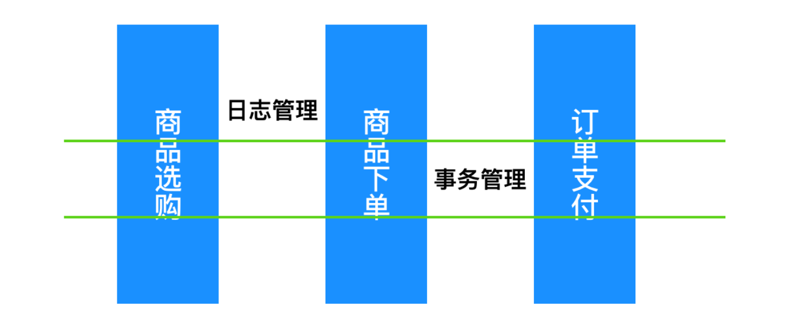
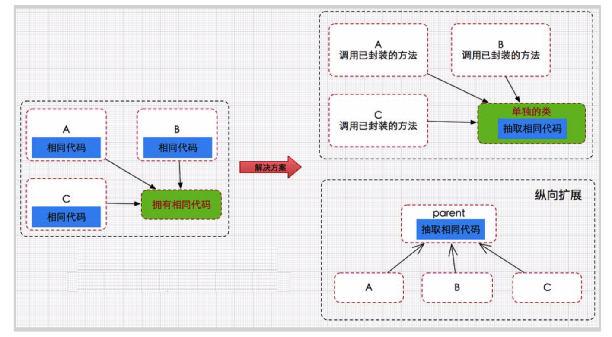
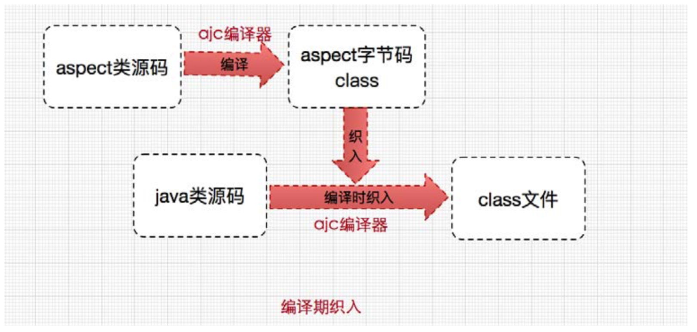
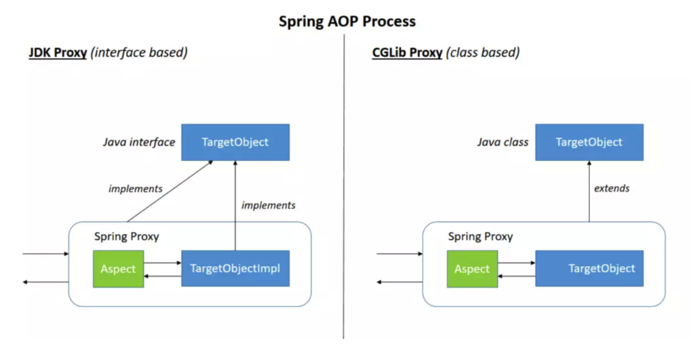

# Spring AOP

## 一、关于 AOP

<font style="color:rgb(51, 51, 51);">面向切面编程(</font><code><font style="color:rgb(51, 51, 51);">Aspect-oriented Programming</font></code><font style="color:rgb(51, 51, 51);">，俗称</font><code><font style="color:rgb(51, 51, 51);">AOP</font></code><font style="color:rgb(51, 51, 51);">)提供了一种面向对象编程(Object-oriented Programming，俗称OOP)的补充，面向对象编程最核心的单元是类(class)，然而面向切面编程最核心的单元是切面(Aspects)。与面向对象的顺序流程不同，AOP采用的是横向切面的方式，注入与主业务流程无关的功能，例如事务管理和日志管理。</font>



<font style="color:rgb(51, 51, 51);">Spring的一个关键组件是AOP框架。 虽然Spring IoC容器不依赖于AOP（意味着你不需要在IOC中依赖AOP），但AOP为Spring IoC提供了非常强大的中间件解决方案。</font>

<font style="color:rgb(51, 51, 51);">AOP 是一种编程范式，最早由 AOP 联盟的组织提出的，通过</font>**<font style="color:rgb(51, 51, 51);">预编译方式和运行期动态代理</font>**<font style="color:rgb(51, 51, 51);">实现程序功能的统一维护的一种技术。它是 OOP的延续。利用 AOP 可以对业务逻辑的各个部分进行隔离，从而使得业务逻辑各部分之间的耦合度降低，提高程序的可重用性，同时提高了开发的效率</font>

<font style="color:rgb(51, 51, 51);">我们之间的开发流程都是使用顺序流程，那么使用 AOP 之后，你就可以横向抽取重复代码，什么叫横向抽取呢？或许下面这幅图你能理解，先来看一下传统的软件开发存在什么样风险。</font>

**<font style="color:rgb(51, 51, 51);">纵向继承体系</font>**<font style="color:rgb(51, 51, 51);">：</font>



<font style="color:rgb(51, 51, 51);">在改进方案之前，我们或许都遇到过 IDEA 对你输出 Duplicate Code 的时候，这个时候的类的设计是很糟糕的，代码写的也很冗余，基本上 if...else... 完成所有事情，这个时候就需要把相同的代码抽取出来成为公共的方法，降低耦合性。这种提取代码的方式是纵向抽取，纵向抽取的代码之间的关联关系非常密切。</font>\ <font style="color:rgb(51, 51, 51);">横向抽取也是代码提取的一种方式，不过这种方式不会修改主要业务逻辑代码，只是在此基础上添加一些与主要的业务逻辑无关的功能，AOP 采取横向抽取机制，补充了传统纵向继承体系(OOP)无法解决的重复性代码优化(性能监视、事务管理、安全检查、缓存)，将业务逻辑和系统处理的代码(关闭连接、事务管理、操作日志记录)解耦。</font>

## <font style="color:rgb(51, 51, 51);">二、AOP 的概念</font>

<font style="color:rgb(51, 51, 51);">在深入学习SpringAOP 之前，让我们先对AOP的几个基本术语有个大致的概念，这些概念不是很容易理解，比较抽象，可以知道有这么几个概念，下面一起来看一下：</font>

* <font style="color:rgb(232, 62, 140);background-color:rgb(246, 246, 246);">切面(Aspect)</font><font style="color:rgb(51, 51, 51);">： Aspect 声明类似于 Java 中的类声明，事务管理是AOP一个最典型的应用。在AOP中，切面一般使用</font><font style="color:rgb(51, 51, 51);"> </font><font style="color:rgb(232, 62, 140);background-color:rgb(246, 246, 246);">@Aspect</font><font style="color:rgb(51, 51, 51);"> </font><font style="color:rgb(51, 51, 51);">注解来使用，在XML 中，可以使用</font><font style="color:rgb(51, 51, 51);"> </font>**<font style="color:rgb(232, 62, 140);background-color:rgb(246, 246, 246);"><aop:aspect></font>**<font style="color:rgb(51, 51, 51);"> </font><font style="color:rgb(51, 51, 51);">来定义一个切面。</font>
* <font style="color:rgb(232, 62, 140);background-color:rgb(246, 246, 246);">连接点(Join Point)</font><font style="color:rgb(51, 51, 51);">: 一个在程序执行期间的某一个操作，就像是执行一个方法或者处理一个异常。在Spring AOP中，一个连接点就代表了一个方法的执行。</font>
* <font style="color:rgb(232, 62, 140);background-color:rgb(246, 246, 246);">通知(Advice):</font><font style="color:rgb(51, 51, 51);">在切面中(类)的某个连接点(方法出)采取的动作，会有四种不同的通知方式：</font><font style="color:rgb(51, 51, 51);"> </font>**<font style="color:rgb(51, 51, 51);">around(环绕通知)，before(前置通知)，after(后置通知)， exception(异常通知)，return(返回通知)</font>**<font style="color:rgb(51, 51, 51);">。许多AOP框架（包括Spring）将建议把通知作为为拦截器，并在连接点周围维护一系列拦截器。</font>
* <font style="color:rgb(232, 62, 140);background-color:rgb(246, 246, 246);">切入点(Pointcut):</font><font style="color:rgb(51, 51, 51);">表示一组连接点，通知与切入点表达式有关，并在切入点匹配的任何连接点处运行(例如执行具有特定名称的方法)。</font>**<font style="color:rgb(51, 51, 51);">由切入点表达式匹配的连接点的概念是AOP的核心，Spring默认使用AspectJ切入点表达式语言。</font>**
* <font style="color:rgb(232, 62, 140);background-color:rgb(246, 246, 246);">介绍(Introduction):</font><font style="color:rgb(51, 51, 51);"> </font><font style="color:rgb(51, 51, 51);">introduction可以为原有的对象增加新的属性和方法。例如，你可以使用introduction使bean实现IsModified接口，以简化缓存。</font>
* <font style="color:rgb(232, 62, 140);background-color:rgb(246, 246, 246);">目标对象(Target Object):</font><font style="color:rgb(51, 51, 51);"> </font><font style="color:rgb(51, 51, 51);">由一个或者多个切面代理的对象。也被称为"切面对象"。由于Spring AOP是使用运行时代理实现的，因此该对象始终是代理对象。</font>
* <font style="color:rgb(232, 62, 140);background-color:rgb(246, 246, 246);">AOP代理(AOP proxy):</font><font style="color:rgb(51, 51, 51);"> </font><font style="color:rgb(51, 51, 51);">由AOP框架创建的对象，在Spring框架中，AOP代理对象有两种：</font>**<font style="color:rgb(51, 51, 51);">JDK动态代理和CGLIB代理</font>**
* <font style="color:rgb(232, 62, 140);background-color:rgb(246, 246, 246);">织入(Weaving):</font><font style="color:rgb(51, 51, 51);"> 是指把增强应用到目标对象来创建新的代理对象的过程，它(例如 AspectJ 编译器)可以在编译时期，加载时期或者运行时期完成。与其他纯Java AOP框架一样，Spring AOP在运行时进行织入。</font>

## <font style="color:rgb(51, 51, 51);">三、AOP 的两种实现方式</font>

<font style="color:rgb(51, 51, 51);">AOP 采用了两种实现方式：静态织入(AspectJ 实现)和动态代理(Spring AOP实现)</font>

### <font style="color:rgb(51, 51, 51);">1、AspectJ</font>

<font style="color:rgb(51, 51, 51);">AspectJ 是一个采用Java 实现的AOP框架，它能够对代码进行编译(一般在编译期进行)，让代码具有AspectJ 的 AOP 功能，AspectJ 是目前实现 AOP 框架中最成熟，功能最丰富的语言。ApectJ 主要采用的是编译期静态织入的方式。在这个期间使用 AspectJ 的 acj 编译器(类似 javac)把 aspect 类编译成 class 字节码后，在 java 目标类编译时织入，即先编译 aspect 类再编译目标类。</font>



### 2、SpringAOP 实现

<font style="color:rgb(51, 51, 51);">Spring AOP 是通过动态代理技术实现的，而动态代理是基于反射设计的。Spring AOP 采用了两种混合的实现方式：JDK 动态代理和 CGLib 动态代理，分别来理解一下</font>



* <font style="color:rgb(51, 51, 51);">JDK动态代理：Spring AOP的首选方法。 每当目标对象实现一个接口时，就会使用JDK动态代理。</font>**<font style="color:rgb(51, 51, 51);">目标对象必须实现接口</font>**
* <font style="color:rgb(51, 51, 51);">CGLIB代理：如果目标对象没有实现接口，则可以使用CGLIB代理。</font>

## <font style="color:rgb(51, 51, 51);">四、Spring 对 AOP 的支持</font>

<font style="color:rgb(51, 51, 51);">Spring 提供了两种AOP 的实现：基于注解式配置和基于XML配置</font>

### <font style="color:rgb(51, 51, 51);">1、@AspectJ 支持</font>

<font style="color:rgb(51, 51, 51);">为了在Spring 配置中使用</font><font style="color:rgb(232, 62, 140);background-color:rgb(246, 246, 246);">@AspectJ</font><font style="color:rgb(51, 51, 51);"> ，你需要启用Spring支持，以根据</font><code><font style="color:rgb(51, 51, 51);">@AspectJ</font></code><font style="color:rgb(51, 51, 51);">切面配置Spring AOP，并配置自动代理。自动代理意味着，Spring 会根据自动代理为 Bean 生成代理来拦截方法的调用，并确保根据需要执行拦截。</font>

<font style="color:rgb(51, 51, 51);">可以使用XML或Java样式配置启用@AspectJ支持。 在任何一种情况下，都还需要确保AspectJ的</font><font style="color:rgb(232, 62, 140);background-color:rgb(246, 246, 246);">aspectjweaver.jar</font><font style="color:rgb(51, 51, 51);"> 第三方库位于应用程序的类路径中（版本1.8或更高版本）。</font>

**<font style="color:rgb(51, 51, 51);"></font>**

**<font style="color:rgb(51, 51, 51);">开启@AspectJ 支持</font>**

<font style="color:rgb(51, 51, 51);">使用</font><font style="color:rgb(232, 62, 140);background-color:rgb(246, 246, 246);">@Configuration</font><font style="color:rgb(51, 51, 51);"> 支持@AspectJ 的时候，需要添加 </font><font style="color:rgb(232, 62, 140);background-color:rgb(246, 246, 246);">@EnableAspectJAutoProxy</font><font style="color:rgb(51, 51, 51);"> 注解，就像下面例子展示的这样来开启 AOP代理</font>

```java
@Configuration
@EnableAspectJAutoProxy
public class AppConfig {}
```

<font style="color:rgb(51, 51, 51);">也可以使用XML配置来开启@AspectJ 支持</font>

```java
<aop:aspectj-autoproxy/>
```

<font style="color:rgb(51, 51, 51);">默认你已经添加了 aop 的schema 空间，如果没有的话，你需要手动添加</font>

```java
<?xml version="1.0" encoding="UTF-8"?>
<beans xmlns="http://www.springframework.org/schema/beans"
    xmlns:xsi="http://www.w3.org/2001/XMLSchema-instance"
    xmlns:aop="http://www.springframework.org/schema/aop" xsi:schemaLocation="
        http://www.springframework.org/schema/beans https://www.springframework.org/schema/beans/spring-beans.xsd
        http://www.springframework.org/schema/aop https://www.springframework.org/schema/aop/spring-aop.xsd">

    <!-- bean definitions here -->
</beans>
```

## <font style="color:rgb(0, 0, 0);">五、使用AOP实现异常处理</font>

### 1、<font style="color:rgb(51, 51, 51);">异常处理的乱象例举</font>

**<font style="color:rgb(51, 51, 51);">（1）乱象一：捕获异常后只输出到控制台</font>**

* <font style="color:rgb(51, 51, 51);">前端js-ajax代码</font>

```javascript
$.ajax({
    type: "GET",
    url: "/user/add",
    dataType: "json",
    success: function(data){
        alert("添加成功");
    }
});
```

* <font style="color:rgb(51, 51, 51);">后端业务代码</font>

```javascript
try {
    // do something
} catch (XyyyyException e) {
    e.printStackTrace();
}
```

* <font style="color:rgb(51, 51, 51);">问题：</font>
  * <font style="color:rgb(51, 51, 51);">后端直接将异常捕获，而且只做了日志打印。用户体验非常差。</font>
  * <font style="color:rgb(51, 51, 51);">如果没有人去经常关注日志，不会有人发现系统出现异常</font>

**<font style="color:rgb(0, 0, 0);">（2）乱象二：混乱的返回方式</font>**

* <font style="color:rgb(51, 51, 51);">前端代码</font>

```javascript
$.ajax({
    type: "GET",
    url: "/goods/add",
    dataType: "json",
    success: function(data) {
        if (data.flag) {
            alert("添加成功");
        } else {
            alert(data.message);
        }
    },
    error: function(data){
        alert("添加失败");
    }
});
```

* <font style="color:rgb(51, 51, 51);">后端代码</font>

```javascript
@RequestMapping("/goods/add")
@ResponseBody
public Map add(Goods goods) {
    Map map = new HashMap();
    try {
        // do something
        map.put(flag, true);
    } catch (Exception e) {
        e.printStackTrace();
        map.put("flag", false);
        map.put("message", e.getMessage());
    }
    reutrn map;
}
```

* <font style="color:rgb(51, 51, 51);">问题：</font>
  * <font style="color:rgb(51, 51, 51);">每个人返回的数据有每个人自己的规范，你叫flag他叫isOK，你的成功code是0，它的成功code是0000。这样导致后端书写了大量的异常返回逻辑代码，前端也随之每一个请求一套异常处理逻辑。很多重复代码。</font>
  * <font style="color:rgb(51, 51, 51);">如果是前端后端一个人开发还勉强能用，如果前后端分离，就是系统灾难。</font>

### <font style="color:rgb(0, 0, 0);">2、该如何设计异常处理</font>

**<font style="color:rgb(0, 0, 0);">（1）面向相关方友好</font>**

1. <font style="color:rgb(51, 51, 51);">后端开发人员职责单一，只需要将异常捕获并转换为自定义异常一直对外抛出。不需要去想页面跳转404，以及异常响应的数据结构的设计。</font>
2. <font style="color:rgb(51, 51, 51);">面向前端人员友好，后端返回给前端的数据应该有统一的数据结构，统一的规范。不能一个人一个响应的数据结构。而在此过程中不需要后端开发人员做更多的工作，交给全局异常处理器去处理“异常”到“响应数据结构”的转换。</font>
3. <font style="color:rgb(51, 51, 51);">面向用户友好，用户能够清楚的知道异常产生的原因。这就要求自定义异常，全局统一处理，ajax接口请求响应统一的异常数据结构，页面模板请求统一跳转到404页面。</font>
4. <font style="color:rgb(51, 51, 51);">面向</font>[运维](https://cloud.tencent.com/solution/operation?from=10680)<font style="color:rgb(51, 51, 51);">友好，将异常信息合理规范的持久化，以便查询。</font>

**<font style="color:rgb(51, 51, 51);">为什么要将系统运行时异常捕获，转换为自定义异常抛出？</font>**<font style="color:rgb(51, 51, 51);"> 答：因为用户不认识 ConnectionTimeOutException类似这种异常是什么东西，但是转换为自定义异常就要求程序员对运行时异常进行一个翻译，比如：自定义异常里面应该有message字段，后端程序员应该明确的在message字段里面用面向用户的友好语言，说明发生了什么。</font>

### <font style="color:rgb(0, 0, 0);">3、开发规范</font>

1. <font style="color:rgb(51, 51, 51);">Controller、Service、DAO层拦截异常转换为自定义异常，不允许将异常私自截留。必须对外抛出。</font>
2. <font style="color:rgb(51, 51, 51);">统一数据响应代码，使用httpstatusode，不要自定义。自定义不方便记忆。200请求成功，400用户输入错误导致的异常，500系统内部异常，999未知异常。</font>
3. <font style="color:rgb(51, 51, 51);">自定义异常里面有message属性，一定用友好的语言描述异常，并赋值给message.</font>
4. <font style="color:rgb(51, 51, 51);">不允许对父类Excetion统一catch，要分小类catch，这样能够清楚地将异常转换为自定义异常传递给前端。</font>

### <font style="color:rgb(0, 0, 0);">4、页面类异常处理</font>

<font style="color:rgb(51, 51, 51);">我们做页面模板时，Controller发生异常我们该怎么办?应该统一跳转到404页面。</font>

<font style="color:rgb(51, 51, 51);">面临的问题：</font>**<font style="color:rgb(51, 51, 51);">程序员抛出自定义异常CustomException，全局异常处理截获之后返回@ResponseBody AjaxResponse，不是ModelAndView，所以我们无法跳转到error.html页面，那我们该如何做页面的全局的异常处理？</font>**<font style="color:rgb(51, 51, 51);"> 答：</font>

1. <font style="color:rgb(51, 51, 51);">用面向切面的方式，将CustomException转换为ModelAndViewException。</font>
2. <font style="color:rgb(51, 51, 51);">全局异常处理器拦截ModelAndViewException，返回ModelAndView，即error.html页面</font>
3. <font style="color:rgb(51, 51, 51);">切入点是带@ModelView注解的Controller层方法</font>

**<font style="color:rgb(51, 51, 51);">使用这种方法处理页面类异常，程序员只需要在页面跳转的Controller上加@ModelView注解即可</font>**

**<font style="color:rgb(0, 0, 0);">（1）错误的写法</font>**

```javascript
@GetMapping("/freemarker")
public String index(Model model) {
    try{
        List<ArticleVO> articles = articleRestService.getAll();
        model.addAttribute("articles", articles);
    }catch (Exception e){
        return "error";
    }
    return "fremarkertemp";
}
```

（2）正确的写法

```javascript
@ModelView
@GetMapping("/freemarker")
public String index(Model model) {
    List<ArticleVO> articles = articleRestService.getAll();
    model.addAttribute("articles", articles);
    return "fremarkertemp";
}
```

### <font style="color:rgb(0, 0, 0);">5、用面向切面的方法处理页面全局异常</font>

<font style="color:rgb(51, 51, 51);">因为用到了面向切面编程，所以引入maven依赖包</font>

```javascript
<dependency>
    <groupId>org.springframework.boot</groupId>
    <artifactId>spring-boot-starter-aop</artifactId>
</dependency>
```

<font style="color:rgb(51, 51, 51);">新定义一个异常类ModelViewException</font>

```javascript
public class ModelViewException extends RuntimeException{

    //异常错误编码
    private int code ;
    //异常信息
    private String message;

    public static ModelViewException transfer(CustomException e) {
        return new ModelViewException(e.getCode(),e.getMessage());
    }

    private ModelViewException(int code, String message){
        this.code = code;
        this.message = message;
    }

    int getCode() {
        return code;
    }

    @Override
    public String getMessage() {
        return message;
    }

}
```

<font style="color:rgb(51, 51, 51);">ModelView 注解，只起到标注的作用</font>

```javascript
@Documented
@Retention(RetentionPolicy.RUNTIME)
@Target({ElementType.METHOD})//只能在方法上使用此注解
public @interface ModelView {

}
```

<font style="color:rgb(51, 51, 51);">以@ModelView注解为切入点，面向切面编程,将CustomException转换为ModelViewException抛出。</font>

```javascript
@Aspect
@Component
@Slf4j
public class ModelViewAspect {

    //设置切入点：这里直接拦截被@ModelView注解的方法
    @Pointcut("@annotation(club.krislin.exception.ModelView)")
    public void pointcut() { }

    /**
     * 当有ModelView的注解的方法抛出异常的时候，做如下的处理
     */
    @AfterThrowing(pointcut="pointcut()",throwing="e")
    public void afterThrowable(Throwable e) {
        log.error("切面发生了异常：", e);
        if(e instanceof  CustomException){
            throw ModelViewException.transfer((CustomException) e);
        }
    }
}
```

<font style="color:rgb(51, 51, 51);">全局异常处理器:</font>

```javascript
@ExceptionHandler(ModelViewException.class)
public ModelAndView viewExceptionHandler(HttpServletRequest req, ModelViewException e) {
    ModelAndView modelAndView = new ModelAndView();

    //将异常信息设置如modelAndView
    modelAndView.addObject("exception", e);
    modelAndView.addObject("url", req.getRequestURL());
    modelAndView.setViewName("error");

    //返回ModelAndView
    return modelAndView;
}
```


> 更新: 2024-08-28 00:39:02  
> 原文: <https://www.yuque.com/thinkspace/afrw3l/si68cz>