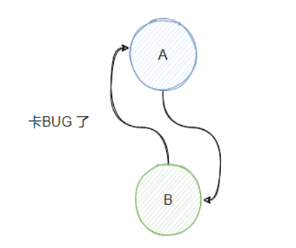
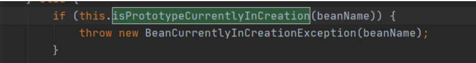
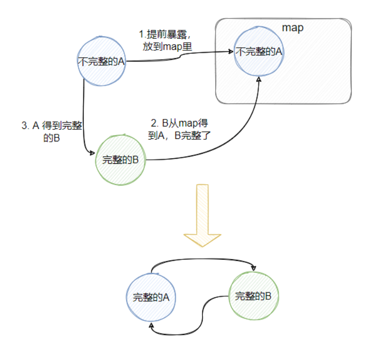
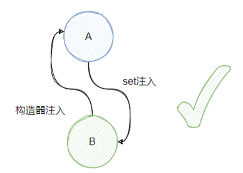
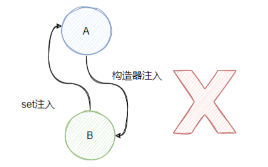

# Spring 循环依赖

## 一、什么是循环依赖

<font style="color:rgb(0, 0, 0);">很简单，看下方的代码就知晓了</font>

```java
@Service
public class A {
    @Autowired
    private B b;
}

@Service
public class B {
    @Autowired
    private A a;
}

//或者自己依赖自己
@Service
public class A {
    @Autowired
    private A a;
}
```

<font style="color:rgb(0, 0, 0);">上面这两种方式都是循环依赖，应该很好理解，当然也可以是三个 Bean 甚至更多的 Bean 相互依赖，原理都是一样的，今天我们主要分析两个 Bean 的依赖。</font>



<font style="color:black;">这种循环依赖可能会产生问题，例如 A 要依赖 B，发现 B 还没创建。</font>

<font style="color:black;">于是开始创建 B ，创建的过程发现 B 要依赖 A， 而 A 还没创建好呀，因为它要等 B 创建好。</font>

<font style="color:black;">就这样</font>**<font style="color:rgb(60, 112, 198);">它们俩就搁这卡 bug 了</font>**<font style="color:black;">。</font>

## <font style="color:black;">二、Spring 如何解决循环依赖</font>

<font style="color:black;">上面这种循环依赖在实际场景中是会出现的，所以 Spring 需要解决这个问题，那如何解决呢？</font>

<font style="color:black;">关键就是</font>**<font style="color:rgb(60, 112, 198);">提前暴露未完全创建完毕的 Bean</font>**<font style="color:black;">。</font>

<font style="color:black;">在 Spring 中，只有同时满足以下两点才能解决循环依赖的问题：</font>

1. <font style="color:rgb(1, 1, 1);">依赖的 Bean 必须都是单例</font>
2. <font style="color:rgb(1, 1, 1);">依赖注入的方式，必须</font>**<font style="color:rgb(60, 112, 198);">不全是</font>**<font style="color:rgb(1, 1, 1);">构造器注入，且 beanName 字母序在前的不能是构造器注入</font>

### <font style="color:rgb(1, 1, 1);">1、</font><font style="color:rgb(34, 34, 34);">为什么必须都是单例</font>

<font style="color:rgb(0, 0, 0);">如果从源码来看的话，循环依赖的 Bean 是原型模式，会直接抛错：</font>



<font style="color:black;">所以 Spring 只支持单例的循环依赖，</font>**<font style="color:rgb(60, 112, 198);">但是为什么呢</font>**<font style="color:black;">？</font>

<font style="color:black;">按照理解，如果两个 Bean 都是原型模式的话。</font>

<font style="color:black;">那么创建 A1 需要创建一个 B1。</font>

<font style="color:black;">创建 B1 的时候要创建一个 A2。</font>

<font style="color:black;">创建 A2 又要创建一个 B2。</font>

<font style="color:black;">创建 B2 又要创建一个 A3。</font>

<font style="color:black;">创建 A3 又要创建一个 B3.....</font>

<font style="color:black;">就又卡 BUG 了，是吧，因为原型模式都需要创建新的对象，不能跟用以前的对象。</font>

<font style="color:black;">如果是单例的话，创建 A 需要创建 B，而创建的 B 需要的是之前的个 A， 不然就不叫单例了，对吧？</font>

<font style="color:black;">也是基于这点， Spring 就能操作操作了。</font>

<font style="color:black;">具体做法就是：先创建 A，此时的 A 是不完整的（没有注入 B），用个 map 保存这个不完整的 A，再创建 B ，B 需要 A。</font>

<font style="color:black;">所以从那个 map 得到“不完整”的 A，此时的 B 就完整了，然后 A 就可以注入 B，然后 A 就完整了，B 也完整了，且它们是相互依赖的。</font>



<font style="color:rgb(0, 0, 0);">读起来好像有点绕，但是逻辑其实很清晰。</font>

### <font style="color:rgb(34, 34, 34);">2、为什么不能全是构造器注入</font>

<font style="color:black;">在 Spring 中创建 Bean 分三步:</font>

1. <font style="color:rgb(1, 1, 1);">实例化，createBeanInstance，就是 new 了个对象</font>
2. <font style="color:rgb(1, 1, 1);">属性注入，populateBean， 就是 set 一些属性值</font>
3. <font style="color:rgb(1, 1, 1);">初始化，initializeBean，执行一些 aware 接口中的方法，initMethod，AOP代理等</font>

<font style="color:black;">明确了上面这三点，再结合我上面说的“不完整的”，我们来理一下。</font>

<font style="color:black;">如果全是构造器注入，比如</font><code><font style="color:rgb(60, 112, 198);">A(B b)</font></code><font style="color:black;">，那表明在 new 的时候，就需要得到 B，此时需要 new B 。</font>

<font style="color:black;">但是 B 也是要在构造的时候注入 A ，即</font><code><font style="color:rgb(60, 112, 198);">B(A a)</font></code><font style="color:black;">，这时候 B 需要在一个 map 中找到不完整的 A ，发现找不到。</font>

<font style="color:black;">为什么找不到？因为 A 还没 new 完呢，所以找不到不完整的 A，</font>**<font style="color:rgb(60, 112, 198);">因此如果全是构造器注入的话，那么 Spring 无法处理循环依赖</font>**<font style="color:black;">。</font>

### <font style="color:rgb(34, 34, 34);">3、一个set注入，一个构造器注入一定能成功？</font>

<font style="color:black;">假设我们 A 是通过 set 注入 B，B 通过构造函数注入 A，此时是</font>**<font style="color:rgb(60, 112, 198);">成功的</font>**<font style="color:black;">。</font>

<font style="color:black;">我们来分析下：实例化 A 之后，可以在 map 中存入 A，开始为 A 进行属性注入，发现需要 B。</font>

<font style="color:black;">此时 new B，发现构造器需要 A，此时从 map 中得到 A ，B 构造完毕。</font>

<font style="color:black;">B 进行属性注入，初始化，然后 A 注入 B 完成属性注入，然后初始化 A。</font>

<font style="color:black;">整个过程很顺利，没毛病。</font>



<font style="color:black;">假设 A 是通过构造器注入 B，B 通过 set 注入 A，此时是</font>**<font style="color:rgb(60, 112, 198);">失败的</font>**<font style="color:black;">。</font>

<font style="color:black;">我们来分析下：实例化 A，发现构造函数需要 B， 此时去实例化 B。</font>

<font style="color:black;">然后进行 B 的属性注入，从 map 里面找不到 A，因为 A 还没 new 成功，所以 B 也卡住了，然后就 gg。</font>



<font style="color:black;">看到这里，仔细思考的小伙伴可能会说，可以先实例化 B 啊，往 map 里面塞入不完整的 B，这样就能成功实例化 A 了啊。</font>

<font style="color:black;">确实，思路没错</font>**<font style="color:rgb(60, 112, 198);">但是 Spring 容器是按照字母序创建 Bean 的，A 的创建永远排在 B 前面</font>**<font style="color:black;">。</font>

<font style="color:black;">现在我们总结一下：</font>

* <font style="color:rgb(1, 1, 1);">如果循环依赖都是构造器注入，则失败</font>
* <font style="color:rgb(1, 1, 1);">如果循环依赖不完全是构造器注入，则可能成功，可能失败，具体跟</font><code><font style="color:rgb(1, 1, 1);">BeanName</font></code><font style="color:rgb(1, 1, 1);">的字母序有关系。</font>

## <font style="color:rgb(1, 1, 1);">三、</font><font style="color:rgb(34, 34, 34);">Spring 解决循环依赖全流程</font>

<font style="color:black;">经过上面的铺垫，我想你对 Spring 如何解决循环依赖应该已经有点感觉了，接下来我们就来看看它到底是如何实现的。</font>

<font style="color:black;">明确了 Spring 创建 Bean 的三步骤之后，我们再来看看它为单例搞的三个 map：</font>

1. <font style="color:rgb(1, 1, 1);">一级缓存，singletonObjects，存储所有已创建完毕的单例 Bean （完整的 Bean）</font>
2. <font style="color:rgb(1, 1, 1);">二级缓存，earlySingletonObjects，存储所有仅完成实例化，但还未进行属性注入和初始化的 Bean</font>
3. <font style="color:rgb(1, 1, 1);">三级缓存，singletonFactories，存储能建立这个 Bean 的一个工厂，通过工厂能获取这个 Bean，延迟化 Bean 的生成，工厂生成的 Bean 会塞入二级缓存</font>

**<font style="color:black;">这三个 map 是如何配合的呢？</font>**

1. <font style="color:rgb(1, 1, 1);">首先，获取单例 Bean 的时候会通过 BeanName 先去 singletonObjects（一级缓存） 查找完整的 Bean，如果找到则直接返回，否则进行步骤 2。</font>
2. <font style="color:rgb(1, 1, 1);">看对应的 Bean 是否在创建中，如果不在直接返回找不到，如果是，则会去 earlySingletonObjects （二级缓存）查找 Bean，如果找到则返回，否则进行步骤 3</font>
3. <font style="color:rgb(1, 1, 1);">去 singletonFactories （三级缓存）通过 BeanName 查找到对应的工厂，如果存着工厂则通过工厂创建 Bean ，并且放置到 earlySingletonObjects 中。</font>
4. <font style="color:rgb(1, 1, 1);">如果三个缓存都没找到，则返回 null。</font>

<font style="color:black;">从上面的步骤我们可以得知，如果查询发现 Bean 还未创建，到第二步就直接返回 null，不会继续查二级和三级缓存。</font>

<font style="color:black;">返回 null 之后，说明这个 Bean 还未创建，这个时候会标记这个 Bean 正在创建中，然后再调用 createBean 来创建 Bean，而实际创建是调用方法 doCreateBean。</font>

<font style="color:black;">doCreateBean 这个方法就会执行上面我们说的三步骤：</font>

1. <font style="color:rgb(1, 1, 1);">实例化</font>
2. <font style="color:rgb(1, 1, 1);">属性注入</font>
3. <font style="color:rgb(1, 1, 1);">初始化</font>

<font style="color:black;">在实例化 Bean 之后，</font>**<font style="color:rgb(60, 112, 198);">会往 singletonFactories 塞入一个工厂，而调用这个工厂的 getObject 方法，就能得到这个 Bean</font>**<font style="color:black;">。</font>

<font style="color:black;">要注意，此时 Spring 是不知道会不会有循环依赖发生的，</font>**<font style="color:rgb(60, 112, 198);">但是它不管</font>**<font style="color:black;">，反正往 </font><code><font style="color:black;">singletonFactories </font></code><font style="color:black;">塞这个工厂，这里就是</font>**<font style="color:rgb(60, 112, 198);">提前暴露</font>**<font style="color:black;">。</font>

<font style="color:black;">然后就开始执行属性注入，这个时候 A 发现需要注入 B，所以去 getBean(B)，此时又会走一遍上面描述的逻辑，到了 B 的属性注入这一步。</font>

<font style="color:black;">此时 B 调用 getBean(A)，这时候一级缓存里面找不到，但是发现 A 正在创建中的，于是去二级缓存找，发现没找到，于是去三级缓存找，然后找到了。</font>

<font style="color:black;">并且通过上面提前在三级缓存里暴露的工厂得到 A，然后将这个工厂从三级缓存里删除，并将 A 加入到二级缓存中。</font>

<font style="color:black;">然后结果就是 B 属性注入成功。</font>

<font style="color:black;">紧接着 B 调用 initializeBean 初始化，最终返回，此时 B 已经被加到了一级缓存里 。</font>

<font style="color:black;">这时候就回到了 A 的属性注入，此时注入了 B，接着执行初始化，最后 A 也会被加到一级缓存里，且从二级缓存中删除 A。</font>

<font style="color:black;">Spring 解决依赖循环就是按照上面所述的逻辑来实现的。</font>

<font style="color:black;">重点就是在对象实例化之后，都会在三级缓存里加入一个工厂，提前对外暴露还未完整的 Bean，这样如果被循环依赖了，对方就可以利用这个工厂得到一个不完整的 Bean，破坏了循环的条件。</font>

## <font style="color:black;">为什么需要三级缓存？</font>

<font style="color:black;">上面都说了那么多了，那我们思考下，解决循环依赖需要三级缓存吗？</font>

<font style="color:black;">很明显，如果仅仅只是为了破解循环依赖，二级缓存够了，压根就不必要三级。</font>

<font style="color:black;">你思考一下，在实例化 Bean A 之后，我在二级 map 里面塞入这个 A，然后继续属性注入。</font>

<font style="color:black;">发现 A 依赖 B 所以要创建 Bean B，这时候 B 就能从二级 map 得到 A ，完成 B 的建立之后， A 自然而然能完成。</font>

<font style="color:black;">所以</font>**<font style="color:rgb(60, 112, 198);">为什么要搞个三级缓存，且里面存的是创建 Bean 的工厂呢</font>**<font style="color:black;">？</font>

<font style="color:black;">我们来看下调用工厂的 getObject 到底会做什么，实际会调用下面这个方法：</font>

```java
protected Object getEarlyBeanReference(String beanName, RootBeanDefinition mbd, Object bean) {
    Object exposedObject = bean;
    if (!mbd.isSynthetic() && hasInstantiationAwareBeanPostProcessors()) {
        for (SmartInstantiationAwareBeanPostProcessor bp : getBeanPostProcessorCache().smartInstantiationAware) {
            exposedObject = bp.getEarlyBeanReference(exposedObject, beanName);
        }
    }
    return exposedObject;
}
```

<font style="color:black;">重点就在中间的判断，如果 false，返回就是参数传进来的 bean，没任何变化。</font>

<font style="color:black;">如果是 true 说明有 InstantiationAwareBeanPostProcessors 。</font>

<font style="color:black;">且循环的是 smartInstantiationAware 类型，</font>**<font style="color:rgb(60, 112, 198);">如有这个 BeanPostProcessor 说明 Bean 需要被 aop 代理</font>**<font style="color:black;">。</font>

<font style="color:black;">我们都知道如果有代理的话，那么我们想要直接拿到的是代理对象。</font>

<font style="color:black;">也就是说如果 A 需要被代理，那么 B 依赖的 A 是已经被代理的 A，所以我们不能返回 A 给 B，而是返回代理的 A 给 B。</font>

<font style="color:black;">这个工厂的作用就是判断这个对象是否需要代理，如果否则直接返回，如果是则返回代理对象。</font>

<font style="color:black;">看到这明白的小伙伴肯定会问，那跟三级缓存有什么关系，我可以在要放到二级缓存的时候判断这个 Bean 是否需要代理，如果要直接放代理的对象不就完事儿了。</font>

<font style="color:black;">是的，这个思路看起来没任何问题，</font>**<font style="color:rgb(60, 112, 198);">问题就出在时机</font>**<font style="color:black;">，这跟 Bean 的生命周期有关系。</font>

<font style="color:black;">正常代理对象的生成是基于后置处理器，是</font>**<font style="color:rgb(60, 112, 198);">在被代理的对象初始化后期调用生成的</font>**<font style="color:black;">，</font>**<font style="color:rgb(60, 112, 198);">所以如果你提早代理了其实是违背了 Bean 定义的生命周期</font>**<font style="color:black;">。</font>

<font style="color:black;">所以 Spring 先在一个三级缓存放置一个工厂，如果产生循环依赖，那么就调用这个工厂提早得到代理对象。</font>

<font style="color:black;">如果没产生依赖，这个工厂根本不会被调用，所以 Bean 的生命周期就是对的。</font>

<font style="color:black;">至此，我想你应该明白为什么会有三级缓存了。</font>

<font style="color:black;">也明白，其实破坏循环依赖，其实只有二级缓存就够了，但是碍于生命周期的问题，提前暴露工厂延迟代理对象的生成。</font>

<font style="color:black;">对了，不用担心三级缓存因为没有循环依赖，数据堆积的问题，最终单例 Bean 创建完毕都会加入一级缓存，此时会清理下面的二、三级缓存。</font>

## 总结

<font style="color:black;">好了，看到这里想必你应该对 Spring 的循环依赖很清晰了，并且面试的时候肯定也难不倒你了。</font>

<font style="color:black;">我稍微总结下：</font>

* <font style="color:rgb(1, 1, 1);">有构造器注入，不一定会产生问题，具体得看是否都是构造器注和 BeanName 的字母序</font>
* <font style="color:rgb(1, 1, 1);">如果单纯为了打破循环依赖，不需要三级缓存，两级就够了。</font>
* <font style="color:rgb(1, 1, 1);">三级缓存是否为延迟代理的创建，尽量不打破 Bean 的生命周期</font>


> 更新: 2024-08-28 00:32:09  
> 原文: <https://www.yuque.com/thinkspace/afrw3l/gdgm44>