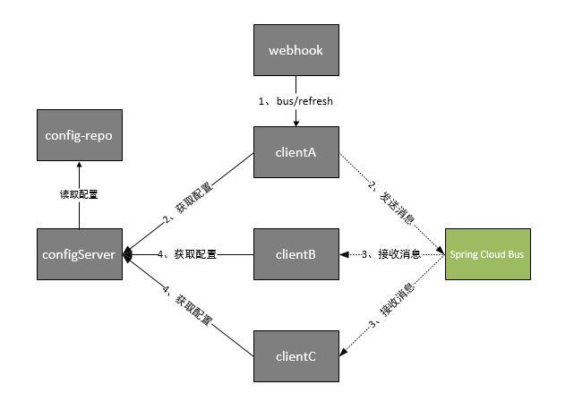

# Spring Cloud Bus

我们在 [Spring Cloud Config](https://www.yuque.com/lin546/blog/ovec0b) 中讲到，如果需要客户端获取到最新的配置信息需要执行 <code>refresh</code>，我们可以利用 Webhook 的机制每次提交代码发送请求来刷新客户端，当客户端越来越多的时候，需要每个客户端都执行一遍，这种方案就不太适合了。使用 <code>Spring Cloud Bus</code> 可以完美解决这一问题。

## 一、Spring Cloud Bus

<code>Spring Cloud Bus</code> 通过轻量消息代理连接各个分布的节点。这会用在广播状态的变化（例如配置变化）或者其他的消息指令。Spring Bus 的一个核心思想是通过分布式的启动器对 Spring Boot 应用进行扩展，也可以用来建立一个多个应用之间的通信频道。目前唯一实现的方式是用 Amqp 消息代理作为通道，同样特性的设置（有些取决于通道的设置）在更多通道的文档中。

Spring Cloud Bus 被国内很多都翻译为消息总线，也挺形象的。大家可以将它理解为管理和传播所有分布式项目中的消息既可，其实本质是利用了 MQ 的广播机制在分布式的系统中传播消息，目前常用的有 Kafka 和 RabbitMQ。利用 Bus 的机制可以做很多的事情，其中配置中心客户端刷新就是典型的应用场景之一，我们用一张图来描述 Bus 在配置中心使用的机制。

根据此图我们可以看出利用Spring Cloud Bus做配置更新的步骤:

1. 提交代码触发post给客户端A发送bus/refresh
2. 客户端A接收到请求从Server端更新配置并且发送给Spring Cloud Bus
3. Spring Cloud bus接到消息并通知给其它客户端
4. 其它客户端接收到通知，请求Server端获取最新配置
5. 全部客户端均获取到最新的配置

我们选择上一篇文章 [Spring Cloud Config 高可用](https://www.yuque.com/lin546/blog/askafl) 中的 <code>config-server</code>和<code>config-client</code>来进行改造，MQ 我们使用 `RabbitMQ` 来做示例。

> 更新: 2022-04-09 16:53:03  
> 原文: <https://www.yuque.com/thinkspace/afrw3l/yiq0zt>