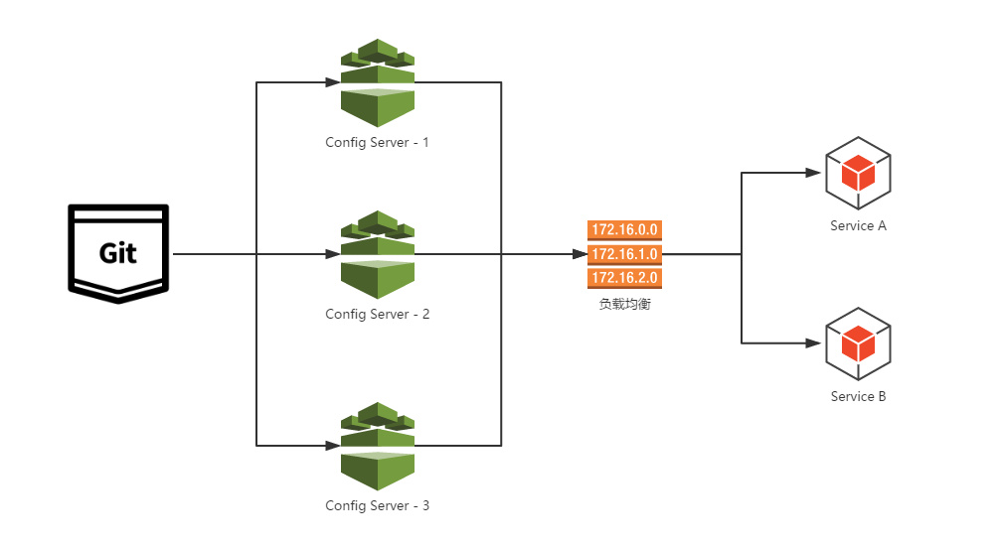
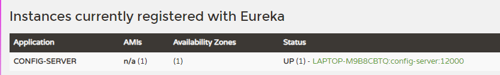
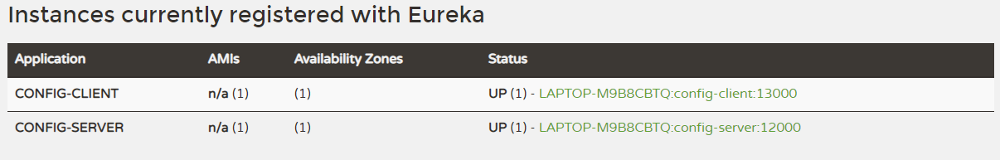
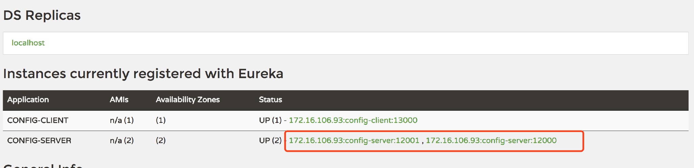

# Spring Cloud Config 高可用

## 一、传统做法

<font style="color:rgb(44, 62, 80);">通常在生产环境，Config Server 与服务注册中心一样，我们也需要将其扩展为高可用的集群。在之前实现的 </font><code><font style="color:rgb(44, 62, 80);">config-server</font></code><font style="color:rgb(44, 62, 80);"> 基础上来实现高可用非常简单，不需要我们为这些服务端做任何额外的配置，只需要遵守一个配置规则：将所有的 Config Server 都指向同一个 Git 仓库，这样所有的配置内容就通过统一的共享文件系统来维护，而客户端在指定 Config Server 位置时，只要配置 Config Server 外的均衡负载即可，就像如下图所示的结构：</font>



## 二、注册为服务

<font style="color:rgb(44, 62, 80);"></font>

<font style="color:rgb(44, 62, 80);">虽然通过服务端负载均衡已经能够实现，但是作为架构内的配置管理，本身其实也是可以看作架构中的一个微服务。所以，另外一种方式更为简单的方法就是把 config-server 也注册为服务，这样所有客户端就能以服务的方式进行访问。通过这种方法，只需要启动多个指向同一 Git 仓库位置的 config-server 就能实现高可用了。</font>

<font style="color:rgb(44, 62, 80);">配置过程也非常简单，我们基于配置中心 Git 版本的内容来改造。</font>

## 三、服务端改造

### 1、添加依赖

<font style="color:rgb(44, 62, 80);">在 pom.xml 里边添加以下依赖</font>

```xml
<dependency>
    <groupId>org.springframework.cloud</groupId>
    <artifactId>spring-cloud-starter-netflix-eureka-client</artifactId>
</dependency>
```

### 2、配置文件

<font style="color:rgb(44, 62, 80);">在 application.yml 里新增 Eureka 的配置</font>

```yaml
eureka:
  client:
    service-url:
      defaultZone: http://localhost:7000/eureka/
```

<font style="color:rgb(44, 62, 80);">这样 Server 端的改造就完成了。先启动 Eureka 注册中心，在启动 Server 端，在浏览器中访问：</font><http://localhost:7000/><font style="color:rgb(44, 62, 80);">就会看到 Server 端已经注册了到注册中心了。</font>



## 三、客户端改造

### 1、添加依赖

```xml
<dependency>
    <groupId>org.springframework.cloud</groupId>
    <artifactId>spring-cloud-starter-netflix-eureka-client</artifactId>
</dependency>
```

### 2、配置文件

<font style="color:rgb(44, 62, 80);">bootstrap.yml</font>

```yaml
spring:
  cloud:
    config:
      name: config-client
      profile: dev
      label: master
      discovery:
        enabled: true
        service-id: config-server
eureka:
  client:
    service-url:
      defaultZone: http://localhost:7000/eureka/
```

<font style="color:rgb(44, 62, 80);">主要是去掉了 </font>`spring.cloud.config.uri`<font style="color:rgb(44, 62, 80);">直接指向 Server 端地址的配置，增加了最后的三个配置：</font>

* `spring.cloud.config.discovery.enabled`<font style="color:rgb(44, 62, 80);">：开启 Config 服务发现支持</font>
* `spring.cloud.config.discovery.serviceId`<font style="color:rgb(44, 62, 80);">：指定 Server 端的 name, 也就是 Server 端</font>`spring.application.name`<font style="color:rgb(44, 62, 80);"> 的值</font>
* `eureka.client.service-url.defaultZone`<font style="color:rgb(44, 62, 80);">：指向配置中心的地址</font>

<font style="color:rgb(44, 62, 80);">这三个配置文件都需要放到 </font>`bootstrap.yml`<font style="color:rgb(44, 62, 80);">的配置中。</font>

<font style="color:rgb(44, 62, 80);">启动 Client 端，在浏览器中访问：</font><http://localhost:7000/><font style="color:rgb(44, 62, 80);"> 就会看到 Server 端和 Client 端都已经注册了到注册中心了。</font>



## 四、高可用

<font style="color:rgb(44, 62, 80);">为了模拟生产集群环境，我们启动两个 Server 端，端口分别为 12000 和 12001，提供高可用的 Server 端支持。</font>

```java
## 打包
./mvnw clean package -Dmaven.test.skip=true

## 启动两个 Server
java -jar target/spring-cloud-config-server-0.0.1-SNAPSHOT.jar --server.port=12000
java -jar target/spring-cloud-config-server-0.0.1-SNAPSHOT.jar --server.port=12001
```



<font style="color:rgb(44, 62, 80);">如上图就可发现会有两个 Server 端同时提供配置中心的服务，防止某一台 down 掉之后影响整个系统的使用。</font>

<font style="color:rgb(44, 62, 80);">我们先单独测试服务端，分别访问：</font><http://localhost:12000/config-client/dev><font style="color:rgb(44, 62, 80);"> 和 </font><http://localhost:12001/config-client/dev><font style="color:rgb(44, 62, 80);"> 返回信息：</font>

```json
{
	"name": "config-client",
	"profiles": ["dev"],
	"label": null,
	"version": "da7c009a80efd17a5a35f14026430dbb61eb0652",
	"state": null,
	"propertySources": [{
		"name": "https://gitee.com/nanmu486/spring-cloud-study.git/config-repo/config-client-dev.yml",
		"source": {
			"neo.hello": "dev update"
		}
	}]
}
```

<font style="color:rgb(44, 62, 80);">说明两个 Server 端都正常读取到了配置信息。</font>

<font style="color:rgb(44, 62, 80);">再次访问 </font><http://localhost:13000/info><font style="color:rgb(44, 62, 80);"> 返回 </font>`dev update`<font style="color:rgb(44, 62, 80);">。说明客户端已经读取到了 Server 端的内容，我们随机停掉一台 Server 端的服务，再次访问 </font><http://localhost:13000/info><font style="color:rgb(44, 62, 80);"> 依然返回 </font>`dev update`<font style="color:rgb(44, 62, 80);">，说明达到了高可用的目的。</font>


> 更新: 2022-04-09 16:53:03  
> 原文: <https://www.yuque.com/thinkspace/afrw3l/askafl>