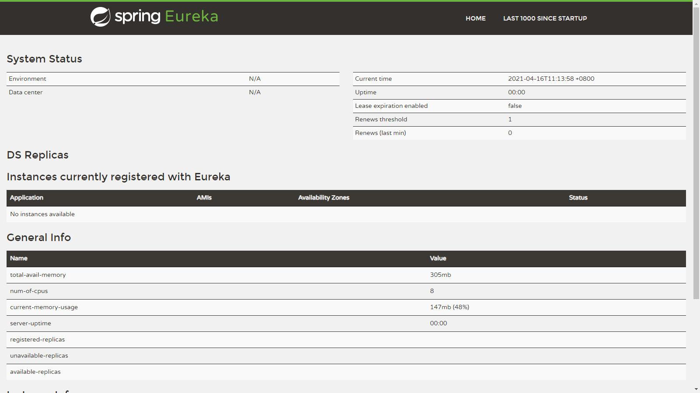
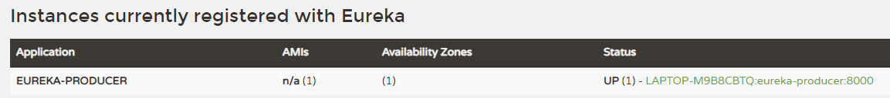

# Spring Cloud Eureka

## 一、服务注册中心

创建一个基础的 SpringBoot 工程，命名为 <font style="color:rgb(233, 105, 0);background-color:rgb(248, 248, 248);">eureka-server</font><font style="color:rgb(86, 90, 95);">，并在</font><font style="color:rgb(233, 105, 0);background-color:rgb(248, 248, 248);">pom.xml</font><font style="color:rgb(86, 90, 95);">中引入需要的依赖内容：</font>

```xml
<parent>
    <groupId>org.springframework.boot</groupId>
    <artifactId>spring-boot-starter-parent</artifactId>
    <version>2.0.1.RELEASE</version>
    <relativePath/> <!-- lookup parent from repository -->
</parent>

<properties>
    <project.build.sourceEncoding>UTF-8</project.build.sourceEncoding>
    <project.reporting.outputEncoding>UTF-8</project.reporting.outputEncoding>
    <java.version>1.8</java.version>
    <spring-cloud.version>Finchley.RC1</spring-cloud.version>
</properties>

<dependencies>
    <dependency>
        <groupId>org.springframework.cloud</groupId>
        <artifactId>spring-cloud-starter-netflix-eureka-server</artifactId>
    </dependency>

    <dependency>
        <groupId>org.springframework.boot</groupId>
        <artifactId>spring-boot-starter-test</artifactId>
        <scope>test</scope>
    </dependency>
</dependencies>

<dependencyManagement>
    <dependencies>
        <dependency>
            <groupId>org.springframework.cloud</groupId>
            <artifactId>spring-cloud-dependencies</artifactId>
            <version>${spring-cloud.version}</version>
            <type>pom</type>
            <scope>import</scope>
        </dependency>
    </dependencies>
</dependencyManagement>
```

<font style="color:rgb(86, 90, 95);">通过</font><font style="color:rgb(233, 105, 0);background-color:rgb(248, 248, 248);">@EnableEurekaServer</font><font style="color:rgb(86, 90, 95);">注解启动一个服务注册中心提供给其他应用进行对话。这一步非常的简单，只需要在一个普通的Spring Boot应用中添加这个注解就能开启此功能，比如下面的例子：</font>

```java
@EnableEurekaServer
@SpringBootApplication
public class Application {

    public static void main(String[] args) {
        new SpringApplicationBuilder(Application.class)
                    .web(true).run(args);
    }
}
```

<font style="color:rgb(86, 90, 95);">在默认设置下，该服务注册中心也会将自己作为客户端来尝试注册它自己，所以我们需要禁用它的客户端注册行为，只需要在</font><font style="color:rgb(233, 105, 0);background-color:rgb(248, 248, 248);">application.properties</font><font style="color:rgb(86, 90, 95);">配置文件中增加如下信息：</font>

```yaml
spring:
  application:
    name: eureka-server
server:
  port: 7000
eureka:
  instance:
    hostname: localhost
  client:
    register-with-eureka: false
    fetch-registry: false
    service-url:
      defaultZone: http://${eureka.instance.hostname}:${server.port}/eureka/
```

* <code>**server.port**</code><font style="color:rgb(44, 62, 80);">：为了与后续要进行注册的服务区分，这里将服务注册中心的端口设置为 7000。</font>
* <code>**eureka.client.register-with-eureka**</code><font style="color:rgb(44, 62, 80);">：表示是否将自己注册到 Eureka Server，默认为 true。</font>
* <code>**eureka.client.fetch-registry**</code><font style="color:rgb(44, 62, 80);">：表示是否从 Eureka Server 获取注册信息，默认为 true。</font>
* <code>**eureka.client.service-url.defaultZone**</code><font style="color:rgb(44, 62, 80);">：设置与 Eureka Server 交互的地址，查询服务和注册服务都需要依赖这个地址。默认是 </font>**http://localhost:8761/eureka**<font style="color:rgb(44, 62, 80);">；多个地址可使用英文逗号（,）分隔。</font>

<font style="color:rgb(86, 90, 95);">启动工程后，访问：</font><http://localhost:1001/><font style="color:rgb(86, 90, 95);">，可以看到下面的页面，其中还没有发现任何服务。</font>



## 二、创建服务提供方

<font style="color:rgb(86, 90, 95);">下面我们创建提供服务的客户端，并向服务注册中心注册自己。</font><font style="color:rgb(44, 62, 80);">我们假设服务提供者有一个</font><code><font style="color:rgb(44, 62, 80);">hello()</font></code><font style="color:rgb(44, 62, 80);">方法，可以根据传入的参数，提供输出 “hello xxx +当前时间” 的服务。</font>

### 1、引入依赖

<font style="color:rgb(86, 90, 95);">首先，创建一个基本的Spring Boot应用，在</font><font style="color:rgb(233, 105, 0);background-color:rgb(248, 248, 248);">pom.xml</font><font style="color:rgb(86, 90, 95);">中，加入如下配置：</font>

```xml
<dependency>
    <groupId>org.springframework.boot</groupId>
    <artifactId>spring-boot-starter-web</artifactId>
</dependency>
<dependency>
    <groupId>org.springframework.cloud</groupId>
    <artifactId>spring-cloud-starter-netflix-eureka-client</artifactId>
</dependency>
```

### 2、启动类

<font style="color:rgb(44, 62, 80);">保持默认生成的即可，</font>**<font style="color:rgb(44, 62, 80);"> Finchley.RC1</font>**<font style="color:rgb(44, 62, 80);"> 这个版本的 Spring Cloud 已经无需添加</font><code><font style="color:rgb(44, 62, 80);">@EnableDiscoveryClient</font></code><font style="color:rgb(44, 62, 80);">注解了。</font>

> <font style="color:rgb(44, 62, 80);">那么如果我引入了相关的 jar 包又想禁用服务注册与发现怎么办？设置</font><code><font style="color:rgb(44, 62, 80);">eureka.client.enabled=false</font></code>

```java
@SpringBootApplication
public class ClientApplication {

	public static void main(String[] args) {
		SpringApplication.run(ClientApplication.class, args);
	}
}
```

### 3、Controller

<font style="color:rgb(44, 62, 80);">提供 hello 服务。</font>

```java
@RestController
@RequestMapping("/hello")
public class HelloController {

    @GetMapping("/")
    public String hello(@RequestParam String name) {
        return "Hello, " + name + " " + new Date();
    }

}
```

### 4、配置文件

<font style="color:rgb(86, 90, 95);">我们在完成了服务内容的实现之后，再继续对</font><font style="color:rgb(233, 105, 0);background-color:rgb(248, 248, 248);">application.properties</font><font style="color:rgb(86, 90, 95);">做一些配置工作，具体如下：</font>

```yaml
spring:
  application:
    name: eureka-producer
eureka:
  client:
    service-url:
      defaultZone: http://localhost:7000/eureka/
server:
  port: 8000
```

<font style="color:rgb(86, 90, 95);">通过</font><font style="color:rgb(233, 105, 0);background-color:rgb(248, 248, 248);">spring.application.name</font><font style="color:rgb(86, 90, 95);">属性，我们可以指定微服务的名称后续在调用的时候只需要使用该名称就可以进行服务的访问。</font><font style="color:rgb(233, 105, 0);background-color:rgb(248, 248, 248);">eureka.client.serviceUrl.defaultZone</font><font style="color:rgb(86, 90, 95);">属性对应服务注册中心的配置内容，指定服务注册中心的位置。为了在本机上测试区分服务提供方和服务注册中心，使用</font><font style="color:rgb(233, 105, 0);background-color:rgb(248, 248, 248);">server.port</font><font style="color:rgb(86, 90, 95);">属性设置不同的端口。</font>

<font style="color:rgb(86, 90, 95);">启动该工程后，再次访问：</font><http://localhost:7000/>。可以如下图内容，我们定义的服务被成功注册了。



<font style="color:rgb(86, 90, 95);">当然，我们也可以通过直接访问</font><font style="color:rgb(233, 105, 0);background-color:rgb(248, 248, 248);">eureka-client</font><font style="color:rgb(86, 90, 95);">服务提供的</font><font style="color:rgb(233, 105, 0);background-color:rgb(248, 248, 248);">/hello</font><font style="color:rgb(86, 90, 95);">接口来获取当前的服务清单，只需要访问：</font>http://localhost:8000/hello/?name=xiaoming，我们可以得到如下输出返回：

```java
Hello, xiaoming Sat Apr 24 17:10:27 GMT+08:00 2021
```

<font style="color:rgb(44, 62, 80);">到此服务提供者配置就完成了。</font>


> 更新: 2022-11-25 21:38:33  
> 原文: <https://www.yuque.com/thinkspace/afrw3l/rott8u>