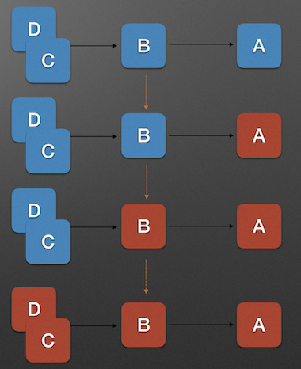
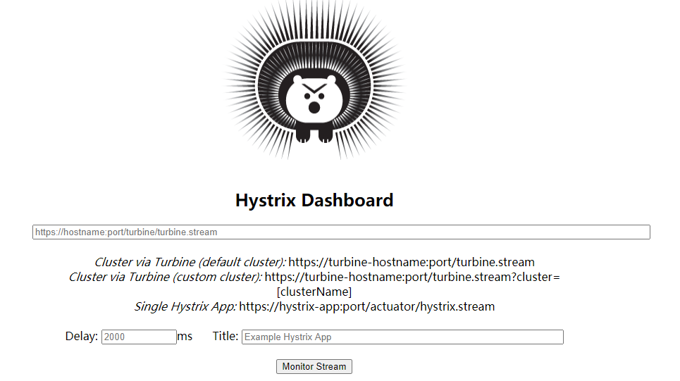
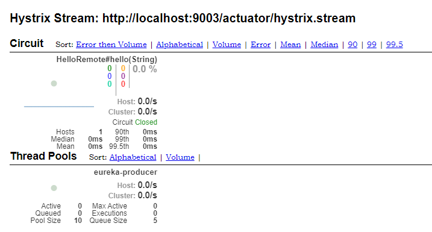
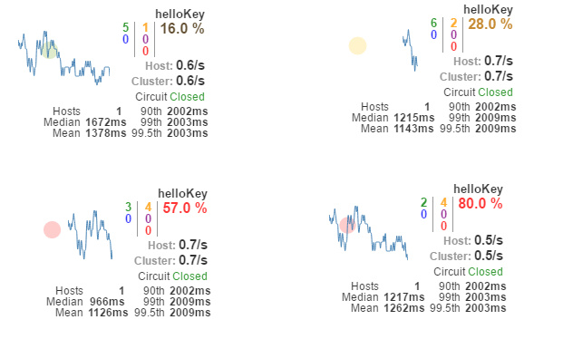
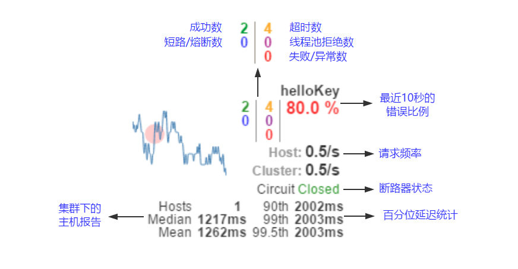

# Spring Cloud Hystrix

<font style="color:rgb(44, 62, 80);">分布式系统中经常会出现某个基础服务不可用造成整个系统不可用的情况，这种现象被称为服务雪崩效应。为了应对服务雪崩，一种常见的做法是手动服务降级。而 Hystrix 的出现，给我们提供了另一种选择。</font>


> <font style="color:rgb(113, 128, 150);">注意：在2020.0 版本中 Hystrix 模块已经被移除。</font>

## 一、服务雪崩效应

### 1、定义

<font style="color:rgb(44, 62, 80);">服务雪崩效应是一种因</font>**<font style="color:rgb(44, 62, 80);">服务提供者</font>**<font style="color:rgb(44, 62, 80);">的不可用导致</font>**<font style="color:rgb(44, 62, 80);">服务调用者</font>**<font style="color:rgb(44, 62, 80);">的不可用，并将不可用</font>**<font style="color:rgb(44, 62, 80);">逐渐放大</font>**<font style="color:rgb(44, 62, 80);">的过程。如果所示:</font>



<font style="color:rgb(44, 62, 80);">上图中，A 为服务提供者，B 为 A 的服务调用者，C 和 D 是 B 的服务调用者。当 A 的不可用，引起 B 的不可用，并将不可用逐渐放大 C 和 D 时，服务雪崩就形成了。</font>

### 2、形成的原因

<font style="color:rgb(44, 62, 80);">我把服务雪崩的参与者简化为</font>**<font style="color:rgb(44, 62, 80);">服务提供者</font>**<font style="color:rgb(44, 62, 80);">和</font>**<font style="color:rgb(44, 62, 80);">服务调用者</font>**<font style="color:rgb(44, 62, 80);">，并将服务雪崩产生的过程分为以下三个阶段来分析形成的原因:</font>

1. **<font style="color:rgb(44, 62, 80);">服务提供者不可用</font>**
2. **<font style="color:rgb(44, 62, 80);">重试加大流量</font>**
3. **<font style="color:rgb(44, 62, 80);">服务调用者不可用</font>**

#### （1）**<font style="color:rgb(44, 62, 80);">服务提供者不可用</font>**

* <font style="color:rgb(44, 62, 80);">硬件故障</font>
* <font style="color:rgb(44, 62, 80);">程序 Bug</font>
* <font style="color:rgb(44, 62, 80);">缓存击穿</font>
* <font style="color:rgb(44, 62, 80);">用户大量请求</font>

#### （2）重试加大流量

* <font style="color:rgb(44, 62, 80);">用户重试</font>
* <font style="color:rgb(44, 62, 80);">代码逻辑重试</font>

#### （3）服务调用者不可用

* <font style="color:rgb(44, 62, 80);">同步等待造成的资源耗尽</font>

### 3、应对策略

<font style="color:rgb(44, 62, 80);">针对造成服务雪崩的不同原因，可以使用不同的应对策略:</font>

1. <font style="color:rgb(44, 62, 80);">流量控制</font>
2. <font style="color:rgb(44, 62, 80);">改进缓存模式</font>
3. <font style="color:rgb(44, 62, 80);">服务自动扩容</font>
4. <font style="color:rgb(44, 62, 80);">服务调用者降级服务</font>

## 二、使用 Hystrix 预防服务雪崩

### 1、服务降级

<font style="color:rgb(44, 62, 80);">对于查询操作，我们可以实现一个 </font><code><font style="color:rgb(44, 62, 80);">fallback</font></code><font style="color:rgb(44, 62, 80);">方法，当请求后端服务出现异常的时候，可以使用 </font><code><font style="color:rgb(44, 62, 80);">fallback</font></code><font style="color:rgb(44, 62, 80);">方法返回的值。</font><code><font style="color:rgb(44, 62, 80);">fallback</font></code><font style="color:rgb(44, 62, 80);">方法的返回值一般是设置的默认值或者来自缓存。</font>

### 2、资源隔离

<font style="color:rgb(44, 62, 80);">货船为了进行防止漏水和火灾的扩散，会将货仓分隔为多个。这种资源隔离减少风险的方式被称为: Bulkheads(舱壁隔离模式)。Hystrix 将同样的模式运用到了服务调用者上。</font>

### 3、断路器模式

<font style="color:rgb(44, 62, 80);">断路器模式源于 Martin Fowler 的</font>[Circuit Breaker](https://martinfowler.com/bliki/CircuitBreaker.html)<font style="color:rgb(44, 62, 80);">一文。“断路器” 本身是一种开关装置，用于在电路上保护线路过载，当线路中有电器发生短路时，“断路器” 能够及时的切断故障电路，防止发生过载、发热、甚至起火等严重后果。</font>

<font style="color:rgb(44, 62, 80);">在分布式架构中，断路器模式的作用也是类似的，当某个服务单元发生故障（类似用电器发生短路）之后，通过断路器的故障监控（类似熔断保险丝），直接切断原来的主逻辑调用。</font>

## 三、使用 Feign Hystrix

> <font style="color:rgb(44, 62, 80);">因为熔断只是作用在服务调用这一端，因此我们根据上一篇的示例代码只需要改动 </font><code><font style="color:rgb(44, 62, 80);">eureka-consumer-feign</font></code><font style="color:rgb(44, 62, 80);"> 项目相关代码就可以。</font>

### 1、引入依赖

> 因为 Feign 中已经依赖了 Hystrix，所以在 Maven 配置上不用做任何改动。

```xml
	<parent>
		<groupId>org.springframework.boot</groupId>
		<artifactId>spring-boot-starter-parent</artifactId>
		<version>2.3.10.RELEASE</version>
		<relativePath/> 
	</parent>	
	<!-- 将 Spring Boot 修改为 2.3.10.RELEASE 以对应 Spring Cloud 版本 -->

		<spring-cloud.version>Hoxton.SR1</spring-cloud.version>
		<!-- 将 Spring Cloud 版本修改为 Hoxton.SR1 以支持Hystrix。 -->

		<dependency>
			<groupId>org.springframework.boot</groupId>
			<artifactId>spring-boot-starter-web</artifactId>
		</dependency>
		<dependency>
			<groupId>org.springframework.cloud</groupId>
			<artifactId>spring-cloud-starter-netflix-eureka-client</artifactId>
		</dependency>
		<dependency>
			<groupId>org.springframework.cloud</groupId>
			<artifactId>spring-cloud-starter-openfeign</artifactId>
		</dependency>
```

### 2、配置文件

> <font style="color:rgb(44, 62, 80);">在原来的 </font><code><font style="color:rgb(44, 62, 80);">application.yml</font></code><font style="color:rgb(44, 62, 80);"> 配置的基础上修改</font>

```yaml
spring:
  application:
    name: eureka-consumer-feign-hystrix
eureka:
  client:
    service-url:
      defaultZone: http://localhost:7000/eureka/
server:
  port: 9003
feign:
  hystrix:
    enabled: true
```

### 3、创建回调类

<font style="color:rgb(44, 62, 80);">创建 HelloRemoteHystrix 类实现 HelloRemote 中实现回调的方法</font>

```java
@Component
public class HelloRemoteHystrix implements HelloRemote {

    @Override
    public String hello(@RequestParam(value = "name") String name) {
        return "Hello World!";
    }

}
```

### 4、添加fallback 属性

<font style="color:rgb(44, 62, 80);">在</font><font style="color:rgb(44, 62, 80);">HelloRemote</font><font style="color:rgb(44, 62, 80);">类添加指定 fallback 类，在服务熔断的时候返回 fallback 类中的内容。</font>

```java
@FeignClient(name = "eureka-producer", fallback = HelloRemoteHystrix.class)
public interface HelloRemote {

    @GetMapping("/hello/")
    String hello(@RequestParam(value = "name") String name);

}
```

### 5、测试

<font style="color:rgb(44, 62, 80);">依次启动 eureka-server、eureka-producer 和刚刚的 eureka-consumer-hystrix 这三个项目。</font>

<font style="color:rgb(44, 62, 80);">访问：</font><http://localhost:9003/hello/?name=xiaoming>

<font style="color:rgb(44, 62, 80);">返回：</font><code><font style="color:rgb(0, 0, 0);">Hello, xiaoming! Tue Apr 27 19:23:27 GMT+08:00 2021</font></code>

<font style="color:rgb(44, 62, 80);">说明加入 Hystrix 后，不影响正常的访问。接下来我们手动停止 eureka-producer 项目再次测试：</font>

<font style="color:rgb(44, 62, 80);">访问：</font><http://localhost:9003/hello/?name=xiaoming>

<font style="color:rgb(44, 62, 80);">返回：</font>`Hello World!`

<font style="color:rgb(44, 62, 80);">这时候我们再次启动 eureka-producer 项目进行测试：</font>

<font style="color:rgb(44, 62, 80);">访问：</font><http://localhost:9003/hello/?name=xiaoming>

<font style="color:rgb(44, 62, 80);">返回：</font><code><font style="color:rgb(0, 0, 0);">Hello, xiaoming! Tue Apr 27 19:23:38 GMT+08:00 2021</font></code>

<font style="color:rgb(44, 62, 80);">根据返回结果说明熔断成功。</font>

## 四、Hystrix Dashboard

<font style="color:rgb(44, 62, 80);">下面我们基于之前的示例来结合 Hystrix Dashboard 实现 Hystrix 指标数据的可视化面板，这里我们将用到下之前实现的几个应用，包括：</font>

* <font style="color:rgb(44, 62, 80);">eureka-server：服务注册中心</font>
* <font style="color:rgb(44, 62, 80);">eureka-producer：服务提供者</font>
* <font style="color:rgb(44, 62, 80);">eureka-consumer-feign-hystrix：使用 Feign 和 Hystrix 实现的服务消费者</font>

###

创建一个标准的 Spring Boot 工程，命名为：hystrix-dashboard

### 1、引入依赖

```xml
<dependency>
    <groupId>org.springframework.cloud</groupId>
    <artifactId>spring-cloud-starter-netflix-hystrix</artifactId>
</dependency>
<dependency>
    <groupId>org.springframework.cloud</groupId>
    <artifactId>spring-cloud-starter-netflix-hystrix-dashboard</artifactId>
</dependency>
```

### 2、启动类

```java
@EnableHystrixDashboard
@SpringBootApplication
public class HystrixDashboardApplication {

    public static void main(String[] args) {
        SpringApplication.run(HystrixDashboardApplication.class, args);
    }
}
```

### 3、配置文件

```yaml
spring:
  application:
    name: hystrix-dashboard
server:
  port: 11000
```

<font style="color:rgb(44, 62, 80);">启动应用，然后再浏览器中输入</font><font style="color:rgb(44, 62, 80);">http://localhost:11000/hystrix</font><font style="color:rgb(44, 62, 80);">可以看到如下界面</font>

通<font style="color:rgb(44, 62, 80);">通过 Hystrix Dashboard 主页面的文字介绍，我们可以知道，Hystrix Dashboard 共支持三种不同的监控方式：</font>

* <font style="color:rgb(44, 62, 80);">默认的集群监控：通过 URL：</font>`http://turbine-hostname:port/turbine.stream`<font style="color:rgb(44, 62, 80);">开启，实现对默认集群的监控。</font>
* <font style="color:rgb(44, 62, 80);">指定的集群监控：通过 URL：</font>`http://turbine-hostname:port/turbine.stream?cluster=[clusterName]`<font style="color:rgb(44, 62, 80);">开启，实现对 clusterName 集群的监控。</font>
* <font style="color:rgb(44, 62, 80);">单体应用的监控：通过 </font><code><font style="color:rgb(0, 0, 0);">https://hystrix-app:port/actuator/hystrix.stream</font></code><font style="color:rgb(44, 62, 80);"> 开启，实现对具体某个服务实例的监控。</font>

<font style="color:rgb(44, 62, 80);">前两者都对集群的监控，需要整合 </font>**<font style="color:rgb(44, 62, 80);">Turbine </font>**<font style="color:rgb(44, 62, 80);">才能实现。这一部分我们先实现对单体应用的监控，这里的单体应用就用我们之前使用 </font>**<font style="color:rgb(44, 62, 80);">Feign </font>**<font style="color:rgb(44, 62, 80);">和 </font>**<font style="color:rgb(44, 62, 80);">Hystrix </font>**<font style="color:rgb(44, 62, 80);">实现的服务消费者——</font><code><font style="color:rgb(44, 62, 80);">eureka-consumer-feign-hystrix</font></code><font style="color:rgb(44, 62, 80);">。</font>

## 五、为服务实例添加 endpoint

<font style="color:rgb(44, 62, 80);">既然 Hystrix Dashboard 监控单实例节点需要通过访问实例的 </font><code><font style="color:rgb(44, 62, 80);">/actuator/hystrix.stream</font></code><font style="color:rgb(44, 62, 80);">接口来实现，自然我们需要为服务实例(</font><code><font style="color:rgb(44, 62, 80);">eureka-consumer-feign-hystrix</font></code><font style="color:rgb(44, 62, 80);">)添加这个 endpoint。</font>

### 1、引入依赖

<font style="color:rgb(44, 62, 80);">新增 </font><code><font style="color:rgb(44, 62, 80);">spring-boot-starter-actuator</font></code><font style="color:rgb(44, 62, 80);">监控模块以开启监控相关的端点，并确保已经引入断路器的依赖</font><code><font style="color:rgb(44, 62, 80);">spring-cloud-starter-netflix-hystrix</font></code>。

```xml
<dependency>
    <groupId>org.springframework.cloud</groupId>
    <artifactId>spring-cloud-starter-netflix-hystrix</artifactId>
</dependency>
<dependency>
    <groupId>org.springframework.boot</groupId>
    <artifactId>spring-boot-starter-actuator</artifactId>
</dependency>
```

### 2、启动类

<font style="color:rgb(44, 62, 80);">为启动类添加</font><code><font style="color:rgb(44, 62, 80);">@EnableCircuitBreaker</font></code><font style="color:rgb(44, 62, 80);">或</font><code><font style="color:rgb(44, 62, 80);">@EnableHystrix</font></code><font style="color:rgb(44, 62, 80);">注解，开启断路器功能。</font>

```java
@EnableHystrix
@EnableFeignClients
@SpringBootApplication
public class EurekaConsumerHystrixApplication {

    public static void main(String[] args) {
        SpringApplication.run(EurekaConsumerHystrixApplication.class, args);
    }
}
```

### 3、配置文件

在配置文件 `application.yml`中添加

```yaml
management:
  endpoints:
    jmx:
      exposure:
        include: hystrix.stream

```

<code><font style="color:rgb(44, 62, 80);">management.endpoints.web.exposure.include</font></code><font style="color:rgb(44, 62, 80);">这个是用来暴露 </font><code><font style="color:rgb(44, 62, 80);">endpoints</font></code><font style="color:rgb(44, 62, 80);"> 的。由于 endpoints 中会包含很多敏感信息，除了 health 和 info 两个支持 web 访问外，其他的默认不支持 web 访问。</font>

### 4、测试

<font style="color:rgb(44, 62, 80);">在 Hystrix-Dashboard 的主界面上输入 </font><code><font style="color:rgb(44, 62, 80);">eureka-consumer-feign-hystrix</font></code><font style="color:rgb(44, 62, 80);"> 对应的地址</font><http://localhost:9003/actuator/hystrix.stream><font style="color:rgb(44, 62, 80);"> 然后点击 Monitor Stream 按钮。如果页面报错：</font>`Unable to connect to Command Metric Stream.` 在 `hystrix-dashboard` 项目中加入配置：

```yaml
hystrix:
  dashboard:
    proxy-stream-allow-list: localhost
```



在对该页面介绍前，我们先看看在首页中我们没有介绍的另外两个参数：

* <font style="color:rgb(233, 105, 0);background-color:rgb(248, 248, 248);">Delay</font><font style="color:rgb(86, 90, 95);">：该参数用来控制服务器上轮询监控信息的延迟时间，默认为2000毫秒，我们可以通过配置该属性来降低客户端的网络和CPU消耗。</font>
* <font style="color:rgb(233, 105, 0);background-color:rgb(248, 248, 248);">Title</font><font style="color:rgb(86, 90, 95);">：该参数对应了上图头部标题Hystrix Stream之后的内容，默认会使用具体监控实例的URL，我们可以通过配置该信息来展示更合适的标题。</font>

### 5、界面解读



以上图来说明其中各元素的具体含义：

* <font style="color:rgb(44, 62, 80);">实心圆：它有颜色和大小之分，分别代表实例的监控程度和流量大小。如上图所示，它的健康度从绿色、黄色、橙色、红色递减。通过该实心圆的展示，我们就可以在大量的实例中快速的发现故障实例和高压力实例。</font>
* <font style="color:rgb(44, 62, 80);">曲线：用来记录 2 分钟内流量的相对变化，我们可以通过它来观察到流量的上升和下降趋势。</font>
* <font style="color:rgb(44, 62, 80);">其他一些数量指标如下图所示</font>



<font style="color:rgb(44, 62, 80);">到此单个应用的熔断监控已经完成。</font>

## 参考

* <https://www.haoyizebo.com/posts/a6cf0126/>
* <https://blog.didispace.com/spring-cloud-starter-dalston-5-1/>


> 更新: 2022-04-09 16:53:00  
> 原文: <https://www.yuque.com/thinkspace/afrw3l/zng264>