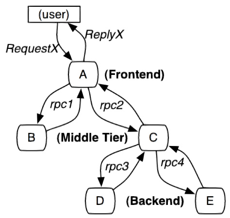
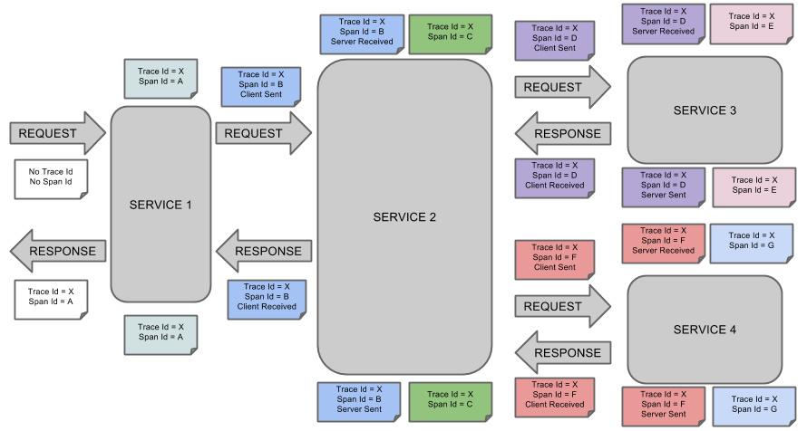
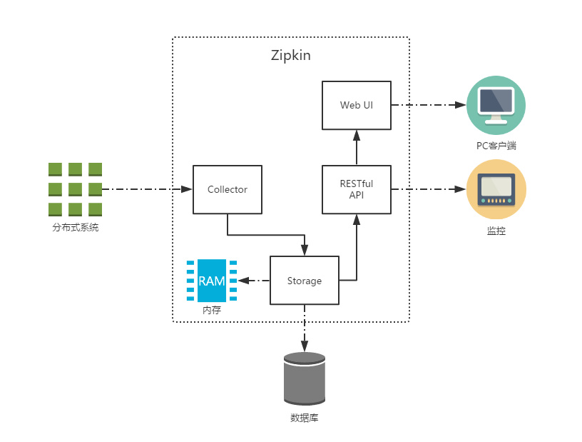
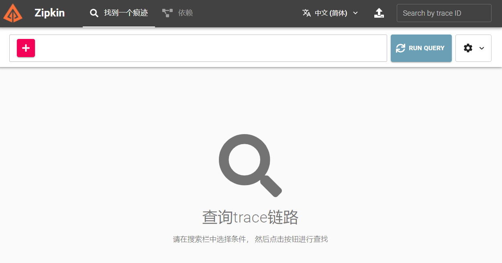
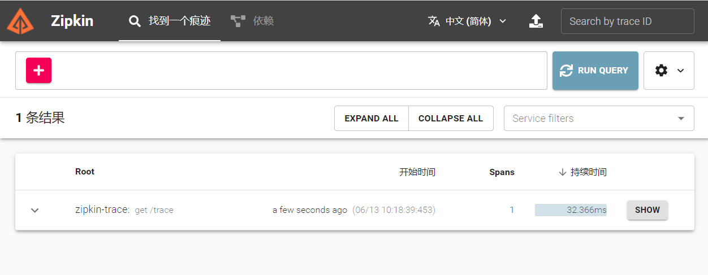

# Spring Cloud Zipkin

<font style="color:rgb(44, 62, 80);">随着业务发展，系统拆分导致系统调用链路愈发复杂一个前端请求可能最终需要调用很多次后端服务才能完成，当整个请求变慢或不可用时，我们是无法得知该请求是由某个或某些后端服务引起的，这时就需要解决如何快读定位服务故障点，以对症下药。于是就有了分布式系统调用跟踪的诞生。</font>

<font style="color:rgb(44, 62, 80);">现今业界分布式服务跟踪的理论基础主要来自于 Google 的一篇论文</font>[《Dapper, a Large-Scale Distributed Systems Tracing Infrastructure》](https://research.google.com/pubs/pub36356.html)<font style="color:rgb(44, 62, 80);">，使用最为广泛的开源实现是 Twitter 的 </font><code><font style="color:rgb(44, 62, 80);">Zipkin</font></code><font style="color:rgb(44, 62, 80);">，为了实现平台无关、厂商无关的分布式服务跟踪，CNCF 发布了布式服务跟踪标准 Open Tracing。</font>

<font style="color:rgb(44, 62, 80);"></font>

<code><font style="color:rgb(44, 62, 80);">Spring Cloud Sleuth</font></code><font style="color:rgb(44, 62, 80);"> 也为我们提供了一套完整的解决方案。在本章中，我们将详细介绍如何使用</font><code><font style="color:rgb(44, 62, 80);"> Spring Cloud Sleuth</font></code><font style="color:rgb(44, 62, 80);"> + </font><code><font style="color:rgb(44, 62, 80);">Zipkin </font></code><font style="color:rgb(44, 62, 80);">来为我们的微服务架构增加分布式服务跟踪的能力。</font>

## 一、Spring Cloud Sleuth

<font style="color:rgb(44, 62, 80);">一般的，一个分布式服务跟踪系统主要由三部分构成：</font>

* <font style="color:rgb(44, 62, 80);">数据收集</font>
* <font style="color:rgb(44, 62, 80);">数据存储</font>
* <font style="color:rgb(44, 62, 80);">数据展示</font>

<font style="color:rgb(44, 62, 80);">根据系统大小不同，每一部分的结构又有一定变化。譬如，对于大规模分布式系统，数据存储可分为实时数据和全量数据两部分，实时数据用于故障排查（Trouble Shooting），全量数据用于系统优化；数据收集除了支持平台无关和开发语言无关系统的数据收集，还包括异步数据收集（需要跟踪队列中的消息，保证调用的连贯性），以及确保更小的侵入性；数据展示又涉及到数据挖掘和分析。虽然每一部分都可能变得很复杂，但基本原理都类似。</font>



<font style="color:rgb(44, 62, 80);">服务追踪的追踪单元是从客户发起请求（</font><code><font style="color:rgb(44, 62, 80);">request</font></code><font style="color:rgb(44, 62, 80);">）抵达被追踪系统的边界开始，到被追踪系统向客户返回响应（</font><code><font style="color:rgb(44, 62, 80);">response</font></code><font style="color:rgb(44, 62, 80);">）为止的过程，称为一个</font><code>**<font style="color:rgb(44, 62, 80);">trace</font>**</code><font style="color:rgb(44, 62, 80);">。</font>

<font style="color:rgb(44, 62, 80);"></font>

<font style="color:rgb(44, 62, 80);">每个 </font><code><font style="color:rgb(44, 62, 80);">trace </font></code><font style="color:rgb(44, 62, 80);">中会调用若干个服务，为了记录调用了哪些服务，以及每次调用的消耗时间等信息，在每次调用服务时，埋入一个调用记录，称为一个</font><code>**<font style="color:rgb(44, 62, 80);">span</font>**</code><font style="color:rgb(44, 62, 80);">。这样，若干个有序的 </font><code><font style="color:rgb(44, 62, 80);">span </font></code><font style="color:rgb(44, 62, 80);">就组成了一个 </font><code><font style="color:rgb(44, 62, 80);">trace</font></code><font style="color:rgb(44, 62, 80);">。在系统向外界提供服务的过程中，会不断地有请求和响应发生，也就会不断生成 </font><code><font style="color:rgb(44, 62, 80);">trace</font></code><font style="color:rgb(44, 62, 80);">，把这些带有 </font><code><font style="color:rgb(44, 62, 80);">span </font></code><font style="color:rgb(44, 62, 80);">的 </font><code><font style="color:rgb(44, 62, 80);">trace </font></code><font style="color:rgb(44, 62, 80);">记录下来，就可以描绘出一幅系统的服务拓扑图。附带上 </font><code><font style="color:rgb(44, 62, 80);">span </font></code><font style="color:rgb(44, 62, 80);">中的响应时间，以及请求成功与否等信息，就可以在发生问题的时候，找到异常的服务；根据历史数据，还可以从系统整体层面分析出哪里性能差，定位性能优化的目标。</font>

<font style="color:rgb(44, 62, 80);"></font>

<code><font style="color:rgb(44, 62, 80);">Spring Cloud Sleuth</font></code><font style="color:rgb(44, 62, 80);"> 为服务之间调用提供链路追踪。通过 </font><code><font style="color:rgb(44, 62, 80);">Sleuth </font></code><font style="color:rgb(44, 62, 80);">可以很清楚的了解到一个服务请求经过了哪些服务，每个服务处理花费了多长。从而让我们可以很方便的理清各微服务间的调用关系。此外 </font><code><font style="color:rgb(44, 62, 80);">Sleuth </font></code><font style="color:rgb(44, 62, 80);">可以帮助我们：</font>

* <font style="color:rgb(44, 62, 80);">耗时分析: 通过 </font><code><font style="color:rgb(44, 62, 80);">Sleuth </font></code><font style="color:rgb(44, 62, 80);">可以很方便的了解到每个采样请求的耗时，从而分析出哪些服务调用比较耗时;</font>
* <font style="color:rgb(44, 62, 80);">可视化错误: 对于程序未捕捉的异常，可以通过集成 </font><code><font style="color:rgb(44, 62, 80);">Zipkin </font></code><font style="color:rgb(44, 62, 80);">服务界面上看到;</font>
* <font style="color:rgb(44, 62, 80);">链路优化: 对于调用比较频繁的服务，可以针对这些服务实施一些优化措施。</font>

<code><font style="color:rgb(44, 62, 80);">Spring Cloud Sleuth</font></code><font style="color:rgb(44, 62, 80);"> 可以结合 </font><code><font style="color:rgb(44, 62, 80);">Zipkin</font></code><font style="color:rgb(44, 62, 80);">，将信息发送到 </font><code><font style="color:rgb(44, 62, 80);">Zipkin</font></code><font style="color:rgb(44, 62, 80);">，利用 </font><code><font style="color:rgb(44, 62, 80);">Zipkin </font></code><font style="color:rgb(44, 62, 80);">的存储来存储信息，利用 </font><code><font style="color:rgb(44, 62, 80);">Zipkin UI</font></code><font style="color:rgb(44, 62, 80);"> 来展示数据。</font>

<font style="color:rgb(44, 62, 80);">这是</font><code><font style="color:rgb(44, 62, 80);"> Spring Cloud Sleuth</font></code><font style="color:rgb(44, 62, 80);"> 的概念图：</font>



## 二、Zipkin

<code><font style="color:rgb(44, 62, 80);">Zipkin </font></code><font style="color:rgb(44, 62, 80);">是 Twitter 的一个开源项目，它基于 Google Dapper 实现，它致力于收集服务的定时数据，以解决微服务架构中的延迟问题，包括数据的收集、存储、查找和展现。</font>\ <font style="color:rgb(44, 62, 80);">我们可以使用它来收集各个服务器上请求链路的跟踪数据，并通过它提供的 </font>**<font style="color:rgb(44, 62, 80);">REST API</font>**<font style="color:rgb(44, 62, 80);"> 接口来辅助我们查询跟踪数据以实现对分布式系统的监控程序，从而及时地发现系统中出现的延迟升高问题并找出系统性能瓶颈的根源。除了面向开发的 API 接口之外，它也提供了方便的 UI 组件来帮助我们直观的搜索跟踪信息和分析请求链路明细，比如：可以查询某段时间内各用户请求的处理时间等。</font>\ <code><font style="color:rgb(44, 62, 80);">Zipkin </font></code><font style="color:rgb(44, 62, 80);">提供了可插拔数据存储方式：</font><code><font style="color:rgb(44, 62, 80);">In-Memory</font></code><font style="color:rgb(44, 62, 80);">、</font><code><font style="color:rgb(44, 62, 80);">MySql</font></code><font style="color:rgb(44, 62, 80);">、</font><code><font style="color:rgb(44, 62, 80);">Cassandra </font></code><font style="color:rgb(44, 62, 80);">以及 </font><code><font style="color:rgb(44, 62, 80);">Elasticsearch</font></code><font style="color:rgb(44, 62, 80);">。接下来的测试为方便直接采用</font><code><font style="color:rgb(44, 62, 80);"> In-Memory</font></code><font style="color:rgb(44, 62, 80);"> 方式进行存储，生产推荐 </font><code><font style="color:rgb(44, 62, 80);">Elasticsearch</font></code><font style="color:rgb(44, 62, 80);">。</font>



<font style="color:rgb(44, 62, 80);">上图展示了 </font><code><font style="color:rgb(44, 62, 80);">Zipkin </font></code><font style="color:rgb(44, 62, 80);">的基础架构，它主要由 4 个核心组件构成：</font>

* <code><font style="color:rgb(44, 62, 80);">Collector</font></code><font style="color:rgb(44, 62, 80);">：收集器组件，它主要用于处理从外部系统发送过来的跟踪信息，将这些信息转换为 </font><code><font style="color:rgb(44, 62, 80);">Zipkin </font></code><font style="color:rgb(44, 62, 80);">内部处理的 </font><code><font style="color:rgb(44, 62, 80);">Span </font></code><font style="color:rgb(44, 62, 80);">格式，以支持后续的存储、分析、展示等功能。</font>
* <code><font style="color:rgb(44, 62, 80);">Storage</font></code><font style="color:rgb(44, 62, 80);">：存储组件，它主要对处理收集器接收到的跟踪信息，默认会将这些信息存储在内存中，我们也可以修改此存储策略，通过使用其他存储组件将跟踪信息存储到数据库中。</font>
* <code><font style="color:rgb(44, 62, 80);">RESTful API</font></code><font style="color:rgb(44, 62, 80);">：API 组件，它主要用来提供外部访问接口。比如给客户端展示跟踪信息，或是外接系统访问以实现监控等。</font>
* <code><font style="color:rgb(44, 62, 80);">Web UI</font></code><font style="color:rgb(44, 62, 80);">：UI 组件，基于 API 组件实现的上层应用。通过 UI 组件用户可以方便而有直观地查询和分析跟踪信息。</font>

<font style="color:rgb(44, 62, 80);"></font>

## 三、快速上手

<code><font style="color:rgb(44, 62, 80);">Zipkin</font></code><font style="color:rgb(44, 62, 80);"> 分为两端，一个是 </font><code><font style="color:rgb(44, 62, 80);">Zipkin </font></code><font style="color:rgb(44, 62, 80);">服务端，一个是 </font><code><font style="color:rgb(44, 62, 80);">Zipkin</font></code><font style="color:rgb(44, 62, 80);"> 客户端，客户端也就是微服务的应用。</font>\ <font style="color:rgb(44, 62, 80);">客户端会配置服务端的 </font><code><font style="color:rgb(44, 62, 80);">URL </font></code><font style="color:rgb(44, 62, 80);">地址，一旦发生服务间的调用的时候，会被配置在微服务里面的 </font><code><font style="color:rgb(44, 62, 80);">Sleuth </font></code><font style="color:rgb(44, 62, 80);">的监听器监听，并生成相应的 </font><code><font style="color:rgb(44, 62, 80);">Trace </font></code><font style="color:rgb(44, 62, 80);">和 </font><code><font style="color:rgb(44, 62, 80);">Span </font></code><font style="color:rgb(44, 62, 80);">信息发送给服务端。</font>\ <font style="color:rgb(44, 62, 80);">发送的方式主要有两种，一种是 </font><code><font style="color:rgb(44, 62, 80);">HTTP </font></code><font style="color:rgb(44, 62, 80);">报文的方式，还有一种是消息总线的方式如 </font><code><font style="color:rgb(44, 62, 80);">RabbitMQ</font></code><font style="color:rgb(44, 62, 80);">。</font>

<font style="color:rgb(44, 62, 80);"></font>

<font style="color:rgb(44, 62, 80);">不论哪种方式，我们都需要：</font>

* <font style="color:rgb(44, 62, 80);">一个 </font><code><font style="color:rgb(44, 62, 80);">Eureka </font></code><font style="color:rgb(44, 62, 80);">服务注册中心，这里我们就用之前的</font>`eureka`<font style="color:rgb(44, 62, 80);">项目来当注册中心。</font>
* <font style="color:rgb(44, 62, 80);">一个 </font><code><font style="color:rgb(44, 62, 80);">Zipkin </font></code><font style="color:rgb(44, 62, 80);">服务端。</font>
* <font style="color:rgb(44, 62, 80);">两个微服务应用，</font>`trace-a`<font style="color:rgb(44, 62, 80);">和 </font>`trace-b`<font style="color:rgb(44, 62, 80);">，其中</font><code><font style="color:rgb(44, 62, 80);"> </font>trace-a</code><font style="color:rgb(44, 62, 80);">中有一个 REST 接口 </font>`/trace-a`<font style="color:rgb(44, 62, 80);">，调用该接口后将触发对</font>`trace-b`<font style="color:rgb(44, 62, 80);">应用的调用。</font>

<font style="color:rgb(44, 62, 80);"></font>

<font style="color:rgb(44, 62, 80);">这里只介绍使用方式一：HTTP</font>

在Spring Cloud Sleuth 中对 Zipkin 的整合进行了自动化配置的封装，所以我们可以很轻松的引入和使用它。

### 1、Zipkin 服务端

<font style="color:rgb(44, 62, 80);">关于 </font><code><font style="color:rgb(44, 62, 80);">Zipkin </font></code><font style="color:rgb(44, 62, 80);">的服务端，在使用 </font><code><font style="color:rgb(44, 62, 80);">Spring Boot 2.x </font></code><font style="color:rgb(44, 62, 80);">版本后，官方就不推荐自行定制编译了，反而是直接提供了编译好的 </font><code><font style="color:rgb(44, 62, 80);">jar </font></code><font style="color:rgb(44, 62, 80);">包来给我们使用。并且以前的</font><code><font style="color:rgb(44, 62, 80);">@EnableZipkinServer</font></code><font style="color:rgb(44, 62, 80);">也已经被打上了</font><code><font style="color:rgb(44, 62, 80);">@Deprecated</font></code>。官方提供了一键脚本

```bash
curl -sSL https://zipkin.io/quickstart.sh | bash -s
java -jar zipkin.jar
```

如果使用 Docker 的话，直接

```plain
docker run -d -p 9411:9411 openzipkin/zipkin
```

<font style="color:rgb(44, 62, 80);">任一方式启动后，访问 </font><http://localhost:9411/zipkin/><font style="color:rgb(44, 62, 80);"> 就能看到如下界面</font>



至此服务端就OK了。

### 2、微服务应用

<font style="color:rgb(44, 62, 80);">创建两个基本的 Spring Boot 工程，名字分别为</font>`zipkin-trace`<font style="color:rgb(44, 62, 80);"> ,引入以下依赖</font>

```xml
<dependency>
			<groupId>org.springframework.boot</groupId>
			<artifactId>spring-boot-starter-web</artifactId>
		</dependency>
		<dependency>
			<groupId>org.springframework.cloud</groupId>
			<artifactId>spring-cloud-starter-netflix-eureka-client</artifactId>
		</dependency>
		<dependency>
			<groupId>org.springframework.cloud</groupId>
			<artifactId>spring-cloud-starter-sleuth</artifactId>
		</dependency>
		<dependency>
			<groupId>org.springframework.cloud</groupId>
			<artifactId>spring-cloud-starter-zipkin</artifactId>
</dependency>
```

**<font style="color:rgb(44, 62, 80);">配置文件</font>**

```yaml
spring:
  application:
    name: trace-a
  sleuth:
    web:
      client:
        enabled: true
    sampler:
      probability: 1.0 # 将采样比例设置为 1.0，也就是全部都需要。默认是 0.1
  zipkin:
    base-url: http://localhost:9411/ # 指定了 Zipkin 服务器的地址
server:
  port: 8080
eureka:
  client:
    service-url:
      defaultZone: http://localhost:7000/eureka/
```

> <font style="color:rgb(113, 128, 150);">Spring Cloud Sleuth 有一个 Sampler 策略，可以通过这个实现类来控制采样算法。采样器不会阻碍 </font><code><font style="color:rgb(113, 128, 150);">span</font></code><font style="color:rgb(113, 128, 150);"> 相关 </font><code><font style="color:rgb(113, 128, 150);">id</font></code><font style="color:rgb(113, 128, 150);"> 的产生，但是会对导出以及附加事件标签的相关操作造成影响。默认的采样比例为: </font><code><font style="color:rgb(113, 128, 150);">0.1</font></code><font style="color:rgb(113, 128, 150);">(即 10%)。不过我们可以通过</font><code><font style="color:rgb(113, 128, 150);">spring.sleuth.sampler.percentage</font></code><font style="color:rgb(113, 128, 150);">来设置，所设置的值介于 0.0 到 1.0 之间，1.0 则表示全部采集。</font>

**<font style="color:rgb(44, 62, 80);">启动类</font>**

```java
@RestController
@SpringBootApplication
public class Application {

    public static void main(String[] args) {
        SpringApplication.run(Application.class, args);
    }


    @GetMapping("/trace")
    public Mono<String> trace() {
      
        return "trace";
    }

}
```

***

**验证**

<font style="color:rgb(44, 62, 80);">访问 </font><http://localhost:8080/trace-a><font style="color:rgb(44, 62, 80);"> 可以得到返回值</font><font style="color:rgb(44, 62, 80);">Trace</font>

<font style="color:rgb(44, 62, 80);">访问 </font><http://localhost:9411/zipkin> <font style="color:rgb(44, 62, 80);">点击 RUN QUERY 会看到有一条记录</font>



## 参考

* <https://www.haoyizebo.com/posts/6d06094e/>


> 更新: 2022-04-09 16:53:04  
> 原文: <https://www.yuque.com/thinkspace/afrw3l/xchfg1>