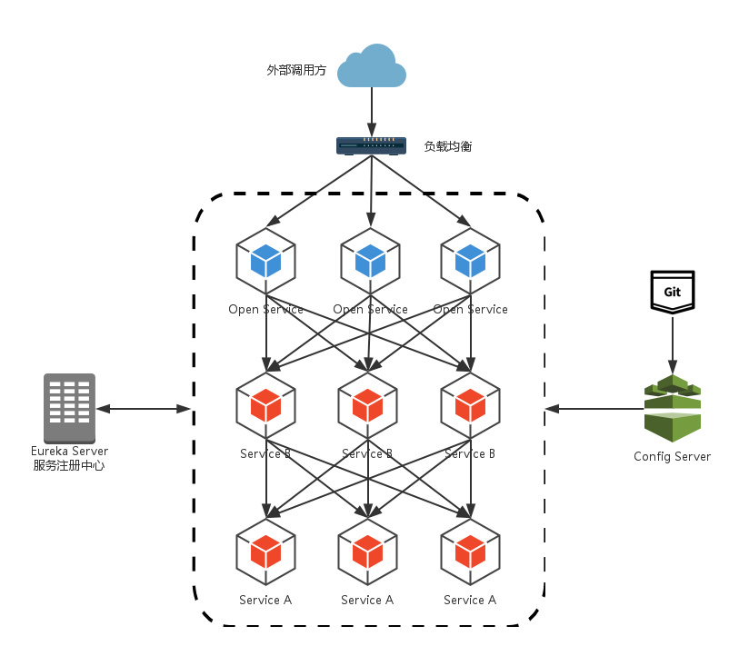
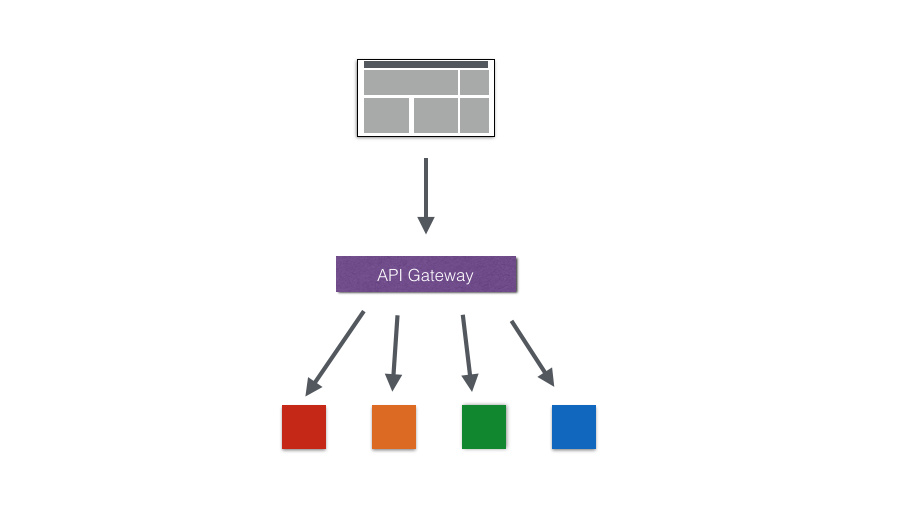
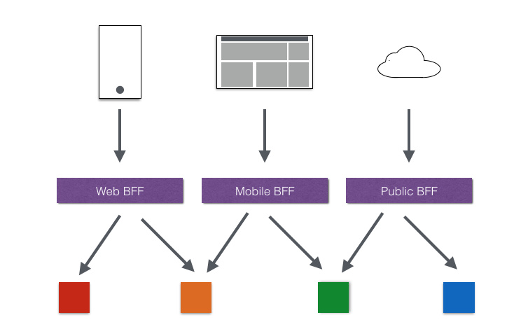
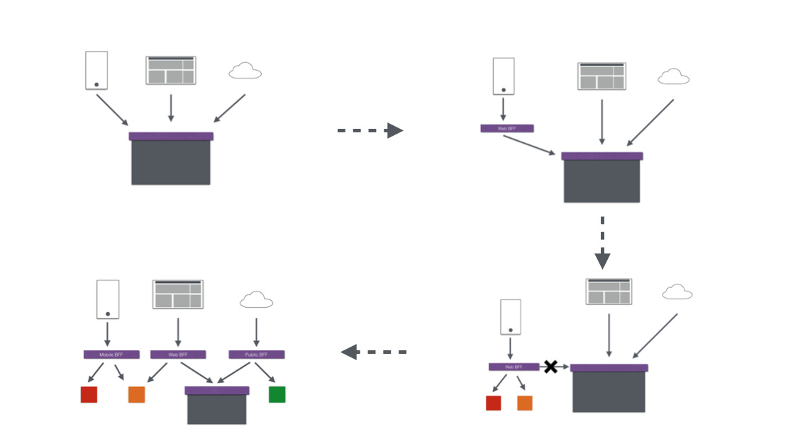
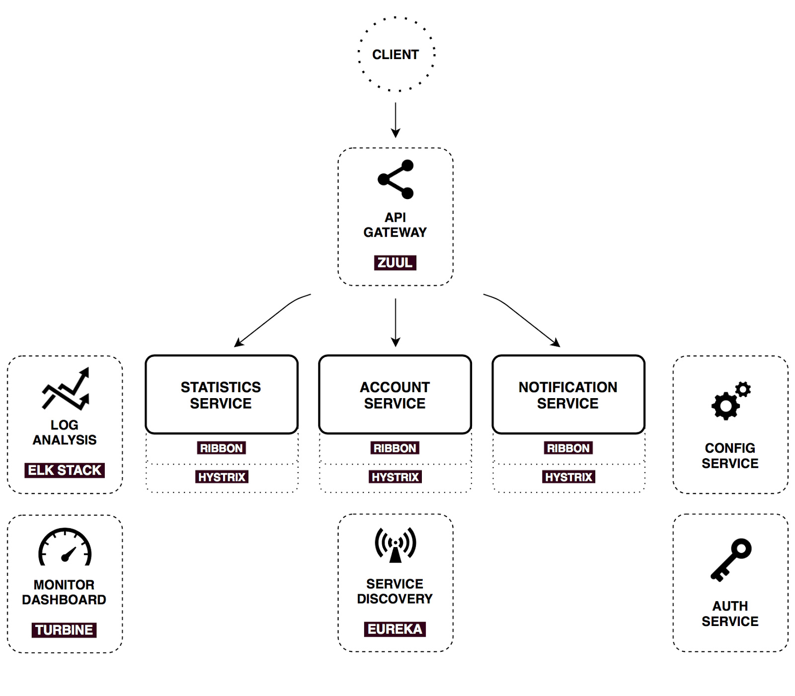
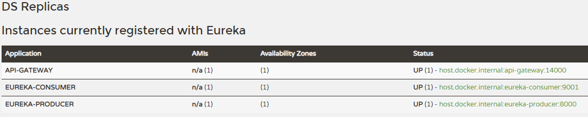
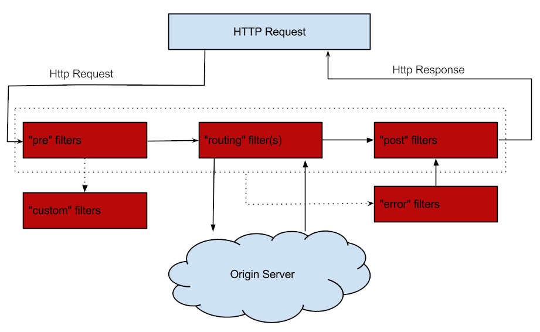

# Spring Cloud Zuul

<font style="color:rgb(44, 62, 80);">通过之前几篇 Spring Cloud 中几个核心组件的介绍，我们已经可以构建一个简略的微服务架构了，可能像下图这样：</font>



<font style="color:rgb(44, 62, 80);">我们使用</font><code><font style="color:rgb(44, 62, 80);"> Spring Cloud Netflix</font></code><font style="color:rgb(44, 62, 80);"> 中的 </font><code><font style="color:rgb(44, 62, 80);">Eureka </font></code><font style="color:rgb(44, 62, 80);">实现了服务注册中心以及服务注册与发现；而服务间通过 </font><code><font style="color:rgb(44, 62, 80);">Ribbon </font></code><font style="color:rgb(44, 62, 80);">或 </font><code><font style="color:rgb(44, 62, 80);">Feign </font></code><font style="color:rgb(44, 62, 80);">实现服务的消费以及均衡负载；通过 </font><code><font style="color:rgb(44, 62, 80);">Spring Cloud Config</font></code><font style="color:rgb(44, 62, 80);"> 实现了应用多环境的外部化配置以及版本管理。为了使得服务集群更为健壮，使用 </font><code><font style="color:rgb(44, 62, 80);">Hystrix </font></code><font style="color:rgb(44, 62, 80);">的融断机制来避免在微服务架构中个别服务出现异常时引起的故障蔓延。似乎一个微服务框架已经完成了。</font>

<font style="color:rgb(44, 62, 80);">我们还是少考虑了一个问题，外部的应用如何来访问内部各种各样的微服务呢？在微服务架构中，后端服务往往不直接开放给调用端，而是通过一个 API 网关根据请求的 URL，路由到相应的服务。当添加 API 网关后，在第三方调用端和服务提供方之间就创建了一面墙，这面墙直接与调用方通信进行权限控制，后将请求均衡分发给后台服务端。</font>

<font style="color:rgb(44, 62, 80);"></font>

## 一、为什么使用 API Gateway

### 1、简化客户端调用复杂度

<font style="color:rgb(44, 62, 80);">在微服务架构模式下后端服务的实例数一般是动态的，对于客户端而言很难发现动态改变的服务实例的访问地址信息。因此在基于微服务的项目中为了简化前端的调用逻辑，通常会引入 API Gateway 作为轻量级网关，同时 API Gateway 中也会实现相关的认证逻辑从而简化内部服务之间相互调用的复杂度。</font>



### 2、数据裁剪以及聚合

<font style="color:rgb(44, 62, 80);">通常而言不同的客户端对于显示时对于数据的需求是不一致的，比如手机端或者 Web 端又或者在低延迟的网络环境或者高延迟的网络环境。</font>

<font style="color:rgb(44, 62, 80);">因此为了优化客户端的使用体验，API Gateway 可以对通用性的响应数据进行裁剪以适应不同客户端的使用需求。同时还可以将多个 API 调用逻辑进行聚合，从而减少客户端的请求数，优化客户端用户体验。</font>

### 3、多渠道支持

<font style="color:rgb(44, 62, 80);">当然我们还可以针对不同的渠道和客户端提供不同的 API Gateway, 对于该模式的使用由另外一个大家熟知的方式叫 </font><code><font style="color:rgb(44, 62, 80);">Backend for front-end</font></code><font style="color:rgb(44, 62, 80);">, 在 </font><code><font style="color:rgb(44, 62, 80);">Backend for front-end</font></code><font style="color:rgb(44, 62, 80);"> 模式当中，我们可以针对不同的客户端分别创建其 BFF，进一步了解 BFF 可以参考这篇文章：</font>[Pattern: Backends For Frontends](http://samnewman.io/patterns/architectural/bff/)



### 4、遗留系统的微服务化改造

<font style="color:rgb(44, 62, 80);">对于系统而言进行微服务改造通常是由于原有的系统存在或多或少的问题，比如技术债务，代码质量，可维护性，可扩展性等等。API Gateway 的模式同样适用于这一类遗留系统的改造，通过微服务化的改造逐步实现对原有系统中的问题的修复，从而提升对于原有业务响应力的提升。通过引入抽象层，逐步使用新的实现替换旧的实现。</font>



<font style="color:rgb(44, 62, 80);">在 Spring Cloud 体系中， </font><code><font style="color:rgb(44, 62, 80);">Spring Cloud Zuul </font></code><font style="color:rgb(44, 62, 80);">就是提供负载均衡、反向代理、权限认证的一个 </font><code><font style="color:rgb(44, 62, 80);">API Gateway</font></code><font style="color:rgb(44, 62, 80);">。</font>

> 我们这篇说的 Zuul 是 Zuul 1，实际上 Netflix 已经发布了 Zuul 2，不过 Spring 好像并没有将 Zuul 2 整合到 Spring Cloud 生态中的意思，因为它自己做了一个 Spring Cloud Gateway（估计是因为之前 Zuul 2 一直跳票导致等不及了吧）。关于 Spring Cloud Gateway 这个高性能的网关我们以后再说。

## 二、Spring Cloud Zuul

<font style="color:rgb(44, 62, 80);">Spring Cloud Zuul 路由是微服务架构的不可或缺的一部分，提供动态路由、监控、弹性、安全等的边缘服务。Zuul 是 Netflix 出品的一个基于 JVM 路由和服务端的负载均衡器。</font>



<font style="color:rgb(44, 62, 80);">下面我们通过代码来了解 Zuul 是如何工作的</font>

<font style="color:rgb(44, 62, 80);"></font>

### 1、准备工作

<font style="color:rgb(44, 62, 80);">在构建服务网关之前，我们先准备一下网关内部的微服务，可以直接使用前几篇编写的内容，比如：</font>

* <font style="color:rgb(44, 62, 80);">eureka</font>
* <font style="color:rgb(44, 62, 80);">producer</font>
* <font style="color:rgb(44, 62, 80);">consumer</font>

<font style="color:rgb(44, 62, 80);">在启动了 eureka、producer 和 consumer 的实例之后，所有的准备工作就以就绪。</font>

<font style="color:rgb(44, 62, 80);"></font>

<font style="color:rgb(44, 62, 80);">首先创建一个基础的 Spring Boot 项目，命名为：</font><code><font style="color:rgb(44, 62, 80);">api-gateway</font></code><font style="color:rgb(44, 62, 80);">。</font>

<font style="color:rgb(44, 62, 80);"></font>

### 2、pom配置

```xml
<dependency>
    <groupId>org.springframework.cloud</groupId>
    <artifactId>spring-cloud-starter-netflix-zuul</artifactId>
</dependency>
<dependency>
    <groupId>org.springframework.cloud</groupId>
    <artifactId>spring-cloud-starter-netflix-eureka-client</artifactId>
</dependency>
```

### 3、配置文件

<font style="color:rgb(44, 62, 80);">在配置文件 </font><code><font style="color:rgb(44, 62, 80);">application.yml</font></code><font style="color:rgb(44, 62, 80);"> 中加入服务名、端口号、</font><code><font style="color:rgb(44, 62, 80);">Eureka </font></code><font style="color:rgb(44, 62, 80);">注册中心的地址：</font>

```xml
spring:
  application:
    name: api-gateway
server:
  port: 14000
eureka:
  client:
    service-url:
      defaultZone: http://localhost:7000/eureka/
```

### 4、启动类

<font style="color:rgb(44, 62, 80);">使用 </font><code><font style="color:rgb(44, 62, 80);">@EnableZuulProxy</font></code><font style="color:rgb(44, 62, 80);"> 注解开启 Zuul 的功能</font>

```xml
@EnableZuulProxy
@SpringBootApplication
public class ApiGatewayApplication {

    public static void main(String[] args) {
        SpringApplication.run(ApiGatewayApplication.class, args);
    }
}
```

<font style="color:rgb(44, 62, 80);">到这里，一个基于</font><code><font style="color:rgb(44, 62, 80);"> Spring Cloud Zuul</font></code><font style="color:rgb(44, 62, 80);"> 服务网关就已经构建完毕。启动该应用，一个默认的服务网关就构建完毕了，同时能在 </font><code><font style="color:rgb(44, 62, 80);">Eureka </font></code><font style="color:rgb(44, 62, 80);">里看到这个服务。</font>



### 5、测试

<font style="color:rgb(44, 62, 80);">由于 </font><code><font style="color:rgb(44, 62, 80);">Spring Cloud Zuul </font></code><font style="color:rgb(44, 62, 80);">在整合了 </font><code><font style="color:rgb(44, 62, 80);">Eureka </font></code><font style="color:rgb(44, 62, 80);">之后，具备默认的服务路由功能，即：当我们这里构建的</font><code><font style="color:rgb(44, 62, 80);">api-gateway</font></code><font style="color:rgb(44, 62, 80);">应用启动并注册到 Eureka 之后，服务网关会发现上面我们启动的两个服务 </font><code><font style="color:rgb(44, 62, 80);">producer</font></code><font style="color:rgb(44, 62, 80);"> 和</font><code><font style="color:rgb(44, 62, 80);">consumer</font></code><font style="color:rgb(44, 62, 80);">，这时候 </font><code><font style="color:rgb(44, 62, 80);">Zuul </font></code><font style="color:rgb(44, 62, 80);">就会创建两个路由规则。每个路由规则都包含两部分，一部分是外部请求的匹配规则，另一部分是路由的服务 ID。针对当前示例的情况，Zuul 会创建下面的两个路由规则：</font>

* <font style="color:rgb(44, 62, 80);">转发到 </font>`producer `<font style="color:rgb(44, 62, 80);">服务的请求规则为：</font>`/producer/**`
* <font style="color:rgb(44, 62, 80);">转发到 </font>`consumer `<font style="color:rgb(44, 62, 80);">服务的请求规则为：</font>`/consumer/**`

<font style="color:rgb(44, 62, 80);"></font>

<font style="color:rgb(44, 62, 80);">最后，我们可以通过访问</font><code><font style="color:rgb(44, 62, 80);">14000</font></code><font style="color:rgb(44, 62, 80);">端口的服务网关来验证上述路由的正确性：访问：</font><http://localhost:14000/eureka-consumer/hello/?name=qwe><font style="color:rgb(44, 62, 80);">，该请求将最终被路由到</font>`consumer`<font style="color:rgb(44, 62, 80);">的</font>`/hello`<font style="color:rgb(44, 62, 80);">接口上。</font>

```xml
Hello, qwe! Fri Jun 11 16:20:07 GMT+08:00 2021
```

## 三、Spring Cloud Zuul 过滤器

在上节我们了解了 `Spring Cloud Zuul `作为网关所具备的最基本功能：路由（`Router`）。这一节<font style="color:rgb(44, 62, 80);">我们将关注 </font><code><font style="color:rgb(44, 62, 80);">Spring Cloud Zuul</font></code><font style="color:rgb(44, 62, 80);"> 的另一核心功能：过滤器（</font><code><font style="color:rgb(44, 62, 80);">Filter</font></code><font style="color:rgb(44, 62, 80);">）。</font>

<font style="color:rgb(44, 62, 80);"></font>

### 1、Filter 的作用

<font style="color:rgb(44, 62, 80);">我们已经能够实现请求的路由功能，所以我们的微服务应用提供的接口就可以通过统一的 API 网关入口被客户端访问到了。\ </font><font style="color:rgb(44, 62, 80);">但是，每个客户端用户请求微服务应用提供的接口时，它们的访问权限往往都需要有一定的限制，系统并不会将所有的微服务接口都对它们开放。然而，目前的服务路由并没有限制权限这样的功能，所有请求都会被毫无保留地转发到具体的应用并返回结果。\ </font><font style="color:rgb(44, 62, 80);">为了实现对客户端请求的安全校验和权限控制，最简单和粗暴的方法就是为每个微服务应用都实现一套用于校验签名和鉴别权限的过滤器或拦截器。不过，这样的做法并不可取，它会增加日后的系统维护难度，因为同一个系统中的各种校验逻辑很多情况下都是大致相同或类似的，这样的实现方式会使得相似的校验逻辑代码被分散到了各个微服务中去，冗余代码的出现是我们不希望看到的。所以，比较好的做法是将这些校验逻辑剥离出去，构建出一个独立的鉴权服务。在完成了剥离之后，有不少开发者会直接在微服务应用中通过调用鉴权服务来实现校验，但是这样的做法仅仅只是解决了鉴权逻辑的分离，并没有在本质上将这部分不属于业余的逻辑拆分出原有的微服务应用，冗余的拦截器或过滤器依然会存在。</font>

<font style="color:rgb(44, 62, 80);">对于这样的问题，更好的做法是通过前置的网关服务来完成这些非业务性质的校验。由于网关服务的加入，外部客户端访问我们的系统已经有了统一入口，既然这些校验与具体业务无关，那何不在请求到达的时候就完成校验和过滤，而不是转发后再过滤而导致更长的请求延迟。同时，通过在网关中完成校验和过滤，微服务应用端就可以去除各种复杂的过滤器和拦截器了，这使得微服务应用的接口开发和测试复杂度也得到了相应的降低。</font>

<font style="color:rgb(44, 62, 80);">为了在 API 网关中实现对客户端请求的校验，我们将需要使用到 Spring Cloud Zuul 的另外一个核心功能：</font>**<font style="color:rgb(44, 62, 80);">过滤器</font>**<font style="color:rgb(44, 62, 80);">。</font>

<font style="color:rgb(44, 62, 80);">Zuul 允许开发者在 API 网关上通过定义过滤器来实现对请求的拦截与过滤，实现的方法非常简单。</font>

<font style="color:rgb(44, 62, 80);"></font>

### 2、Filter 的生命周期

<font style="color:rgb(44, 62, 80);">Filter 的生命周期有 4 个，分别是“</font><code><font style="color:rgb(44, 62, 80);">PRE</font></code><font style="color:rgb(44, 62, 80);">”、“</font><code><font style="color:rgb(44, 62, 80);">ROUTING</font></code><font style="color:rgb(44, 62, 80);">”、“</font><code><font style="color:rgb(44, 62, 80);">POST</font></code><font style="color:rgb(44, 62, 80);">”和“</font><code><font style="color:rgb(44, 62, 80);">ERROR</font></code><font style="color:rgb(44, 62, 80);">”，整个生命周期可以用下图来表示：</font>



<code><font style="color:rgb(44, 62, 80);">Zuul </font></code><font style="color:rgb(44, 62, 80);">大部分功能都是通过过滤器来实现的，这些过滤器类型对应于请求的典型生命周期。</font>

<font style="color:rgb(44, 62, 80);"></font>

* **<font style="color:rgb(44, 62, 80);">PRE：</font>**<font style="color:rgb(44, 62, 80);">这种过滤器在请求被路由之前调用。我们可利用这种过滤器实现身份验证、在集群中选择请求的微服务、记录调试信息等。</font>
* **<font style="color:rgb(44, 62, 80);">ROUTING：</font>**<font style="color:rgb(44, 62, 80);">这种过滤器将请求路由到微服务。这种过滤器用于构建发送给微服务的请求，并使用 </font><code><font style="color:rgb(44, 62, 80);">Apache HttpClient</font></code><font style="color:rgb(44, 62, 80);"> 或 </font><code><font style="color:rgb(44, 62, 80);">Netfilx Ribbon</font></code><font style="color:rgb(44, 62, 80);"> 请求微服务。</font>
* **<font style="color:rgb(44, 62, 80);">POST：</font>**<font style="color:rgb(44, 62, 80);">这种过滤器在路由到微服务以后执行。这种过滤器可用来为响应添加标准的 </font><code><font style="color:rgb(44, 62, 80);">HTTP Header</font></code><font style="color:rgb(44, 62, 80);">、收集统计信息和指标、将响应从微服务发送给客户端等。</font>
* **<font style="color:rgb(44, 62, 80);">ERROR：</font>**<font style="color:rgb(44, 62, 80);">在其他阶段发生错误时执行该过滤器。</font>
* <font style="color:rgb(44, 62, 80);">除了默认的过滤器类型，</font><code><font style="color:rgb(44, 62, 80);">Zuul </font></code><font style="color:rgb(44, 62, 80);">还允许我们创建自定义的过滤器类型。例如，我们可以定制一种 </font><code><font style="color:rgb(44, 62, 80);">STATIC </font></code><font style="color:rgb(44, 62, 80);">类型的过滤器，直接在 </font><code><font style="color:rgb(44, 62, 80);">Zuul </font></code><font style="color:rgb(44, 62, 80);">中生成响应，而不将请求转发到后端的微服务。</font>

<font style="color:rgb(44, 62, 80);"></font>

### 3、Zuul 中默认实现的 Filter

| **<font style="color:rgb(44, 62, 80);">类型</font>** | **<font style="color:rgb(44, 62, 80);">顺序</font>** | **<font style="color:rgb(44, 62, 80);">过滤器</font>** | **<font style="color:rgb(44, 62, 80);">功能</font>** |
| :--- | :--- | :--- | :--- |
| <font style="color:rgb(44, 62, 80);">pre</font> | <font style="color:rgb(44, 62, 80);">-3</font> | <font style="color:rgb(44, 62, 80);">ServletDetectionFilter</font> | <font style="color:rgb(44, 62, 80);">标记处理 Servlet 的类型</font> |
| <font style="color:rgb(44, 62, 80);">pre</font> | <font style="color:rgb(44, 62, 80);">-2</font> | <font style="color:rgb(44, 62, 80);">Servlet30WrapperFilter</font> | <font style="color:rgb(44, 62, 80);">包装 HttpServletRequest 请求</font> |
| <font style="color:rgb(44, 62, 80);">pre</font> | <font style="color:rgb(44, 62, 80);">-1</font> | <font style="color:rgb(44, 62, 80);">FormBodyWrapperFilter</font> | <font style="color:rgb(44, 62, 80);">包装请求体</font> |
| <font style="color:rgb(44, 62, 80);">route</font> | <font style="color:rgb(44, 62, 80);">1</font> | <font style="color:rgb(44, 62, 80);">DebugFilter</font> | <font style="color:rgb(44, 62, 80);">标记调试标志</font> |
| <font style="color:rgb(44, 62, 80);">route</font> | <font style="color:rgb(44, 62, 80);">5</font> | <font style="color:rgb(44, 62, 80);">PreDecorationFilter</font> | <font style="color:rgb(44, 62, 80);">处理请求上下文供后续使用</font> |
| <font style="color:rgb(44, 62, 80);">route</font> | <font style="color:rgb(44, 62, 80);">10</font> | <font style="color:rgb(44, 62, 80);">RibbonRoutingFilter</font> | <font style="color:rgb(44, 62, 80);">serviceId 请求转发</font> |
| <font style="color:rgb(44, 62, 80);">route</font> | <font style="color:rgb(44, 62, 80);">100</font> | <font style="color:rgb(44, 62, 80);">SimpleHostRoutingFilter</font> | <font style="color:rgb(44, 62, 80);">url 请求转发</font> |
| <font style="color:rgb(44, 62, 80);">route</font> | <font style="color:rgb(44, 62, 80);">500</font> | <font style="color:rgb(44, 62, 80);">SendForwardFilter</font> | <font style="color:rgb(44, 62, 80);">forward 请求转发</font> |
| <font style="color:rgb(44, 62, 80);">post</font> | <font style="color:rgb(44, 62, 80);">0</font> | <font style="color:rgb(44, 62, 80);">SendErrorFilter</font> | <font style="color:rgb(44, 62, 80);">处理有错误的请求响应</font> |
| <font style="color:rgb(44, 62, 80);">post</font> | <font style="color:rgb(44, 62, 80);">1000</font> | <font style="color:rgb(44, 62, 80);">SendResponseFilter</font> | <font style="color:rgb(44, 62, 80);">处理正常的请求响应</font> |

### 4、禁用指定的 Filter

<font style="color:rgb(44, 62, 80);">可以在 </font><code><font style="color:rgb(44, 62, 80);">application.yml</font></code><font style="color:rgb(44, 62, 80);"> 中配置需要禁用的 </font><code><font style="color:rgb(44, 62, 80);">filter</font></code><font style="color:rgb(44, 62, 80);">，格式为</font>

```plain
zuul.<SimpleClassName>.<filterType>.disable=true
```

<font style="color:rgb(44, 62, 80);">比如要禁用</font><code><font style="color:rgb(44, 62, 80);">endResponseFilter</font></code><font style="color:rgb(44, 62, 80);">就设置</font>

```yaml
zuul:
  SendResponseFilter:
    post:
      disable: true
```

## 四、自定义 Filter

<font style="color:rgb(44, 62, 80);"></font>

<font style="color:rgb(44, 62, 80);">我们假设有这样一个场景，因为服务网关应对的是外部的所有请求，为了避免产生安全隐患，我们需要对请求做一定的限制，比如请求中含有 </font><code><font style="color:rgb(44, 62, 80);">Token </font></code><font style="color:rgb(44, 62, 80);">便让请求继续往下走，如果请求不带 </font><code><font style="color:rgb(44, 62, 80);">Token </font></code><font style="color:rgb(44, 62, 80);">就直接返回并给出提示。</font>

<font style="color:rgb(44, 62, 80);">首先自定义一个 </font><code><font style="color:rgb(44, 62, 80);">Filter</font></code><font style="color:rgb(44, 62, 80);">，继承 </font><code><font style="color:rgb(44, 62, 80);">ZuulFilter </font></code><font style="color:rgb(44, 62, 80);">抽象类，在 </font><code><font style="color:rgb(44, 62, 80);">run()</font></code><font style="color:rgb(44, 62, 80);"> 方法中验证参数是否含有 </font><code><font style="color:rgb(44, 62, 80);">Token</font></code><font style="color:rgb(44, 62, 80);">，具体如下：</font>

```java
public class TokenFilter extends ZuulFilter {

    /**
     * 过滤器的类型，它决定过滤器在请求的哪个生命周期中执行。
     * 这里定义为pre，代表会在请求被路由之前执行。
     *
     * @return
     */
    @Override
    public String filterType() {
        return "pre";
    }

    /**
     * filter执行顺序，通过数字指定。
     * 数字越大，优先级越低。
     *
     * @return
     */
    @Override
    public int filterOrder() {
        return 0;
    }

    /**
     * 判断该过滤器是否需要被执行。这里我们直接返回了true，因此该过滤器对所有请求都会生效。
     * 实际运用中我们可以利用该函数来指定过滤器的有效范围。
     *
     * @return
     */
    @Override
    public boolean shouldFilter() {
        return true;
    }

    /**
     * 过滤器的具体逻辑
     *
     * @return
     */
    @Override
    public Object run() {
        RequestContext ctx = RequestContext.getCurrentContext();
        HttpServletRequest request = ctx.getRequest();

        String token = request.getParameter("token");
        if (token == null || token.isEmpty()) {
            ctx.setSendZuulResponse(false);
            ctx.setResponseStatusCode(401);
            ctx.setResponseBody("token is empty");
        }
        return null;
    }
}
```

<font style="color:rgb(44, 62, 80);">在上面实现的过滤器代码中，我们通过继承</font>`ZuulFilter`<font style="color:rgb(44, 62, 80);">抽象类并重写了下面的四个方法来实现自定义的过滤器。这四个方法分别定义了：</font>

* `filterType()`<font style="color:rgb(44, 62, 80);">：过滤器的类型，它决定过滤器在请求的哪个生命周期中执行。这里定义为</font>`pre`<font style="color:rgb(44, 62, 80);">，代表会在请求被路由之前执行。</font>
* `filterOrder()`<font style="color:rgb(44, 62, 80);">：过滤器的执行顺序。当请求在一个阶段中存在多个过滤器时，需要根据该方法返回的值来依次执行。通过数字指定，数字越大，优先级越低。</font>
* `shouldFilter()`<font style="color:rgb(44, 62, 80);">：判断该过滤器是否需要被执行。这里我们直接返回了</font>true<font style="color:rgb(44, 62, 80);">，因此该过滤器对所有请求都会生效。实际运用中我们可以利用该函数来指定过滤器的有效范围。</font>
* `run()`<font style="color:rgb(44, 62, 80);">：过滤器的具体逻辑。这里我们通过</font>`ctx.setSendZuulResponse(false)`<font style="color:rgb(44, 62, 80);">令 Zuul 过滤该请求，不对其进行路由，然后通过</font>`ctx.setResponseStatusCode(401)`<font style="color:rgb(44, 62, 80);">设置了其返回的错误码，当然我们也可以进一步优化我们的返回，比如，通过</font>`ctx.setResponseBody(body)`<font style="color:rgb(44, 62, 80);">对返回 body 内容进行编辑等。</font>

<font style="color:rgb(44, 62, 80);"></font>

<font style="color:rgb(44, 62, 80);">在实现了自定义过滤器之后，它并不会直接生效，我们还需要为其创建具体的 </font><code><font style="color:rgb(44, 62, 80);">Bean </font></code><font style="color:rgb(44, 62, 80);">才能启动该过滤器，比如，在应用主类中增加如下内容：</font>

```java
@EnableZuulProxy
@SpringBootApplication
public class ApiGatewayApplication {

    public static void main(String[] args) {
        SpringApplication.run(ApiGatewayApplication.class, args);
    }

    @Bean
    public TokenFilter tokenFilter() {
        return new TokenFilter();
    }
}
```

<font style="color:rgb(44, 62, 80);">在对</font>`api-gateway`<font style="color:rgb(44, 62, 80);">服务完成了上面的改造之后，我们可以重新启动它，并发起下面的请求，对上面定义的过滤器做一个验证：</font>

* <font style="color:rgb(44, 62, 80);">访问 </font><http://localhost:14000/eureka-consumer/hello/?name=qwe><font style="color:rgb(44, 62, 80);"> 返回 </font><code><font style="color:rgb(44, 62, 80);">401</font></code><font style="color:rgb(44, 62, 80);"> 错误和 </font>`token is empty`
* <font style="color:rgb(44, 62, 80);">访问 </font><http://localhost:14000/eureka-consumer/hello/?name=qwe&token=token><font style="color:rgb(44, 62, 80);"> 正确路由到 </font>`consumer `<font style="color:rgb(44, 62, 80);">的 </font>`/hello` <font style="color:rgb(44, 62, 80);">接口，并返回 </font>`Hello, qwe`

<font style="color:rgb(44, 62, 80);">我们可以根据自己的需要在服务网关上定义一些与业务无关的通用逻辑实现对请求的过滤和拦截，比如：签名校验、权限校验、请求限流等功能。</font>

<font style="color:rgb(44, 62, 80);"></font>

## 参考

* <https://www.haoyizebo.com/posts/97b1391c/>


> 更新: 2022-04-09 16:53:04  
> 原文: <https://www.yuque.com/thinkspace/afrw3l/mtpykx>