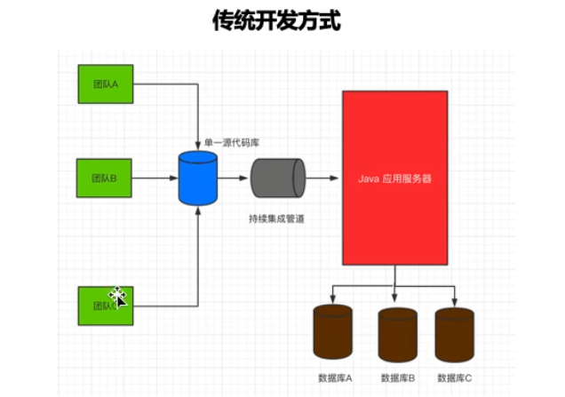
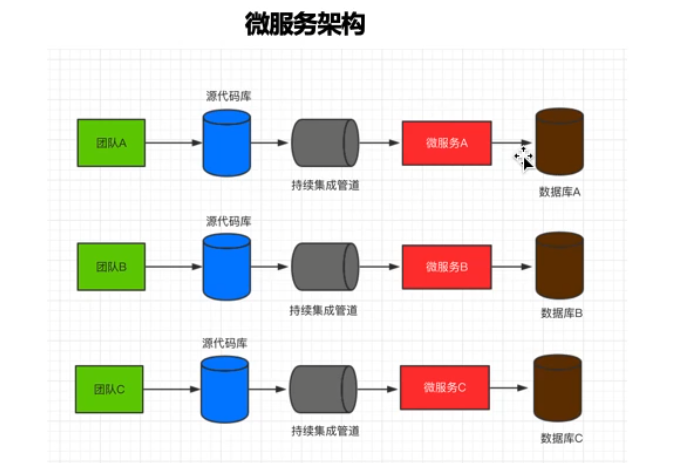
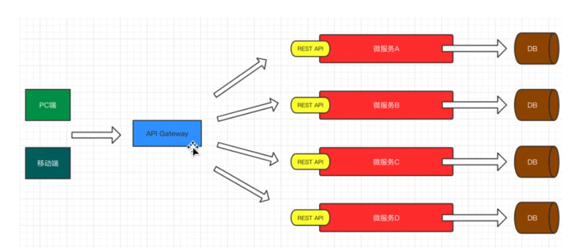
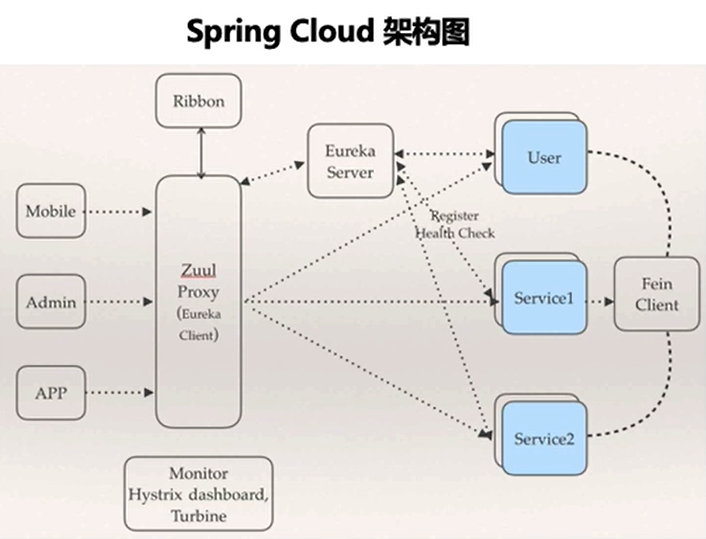
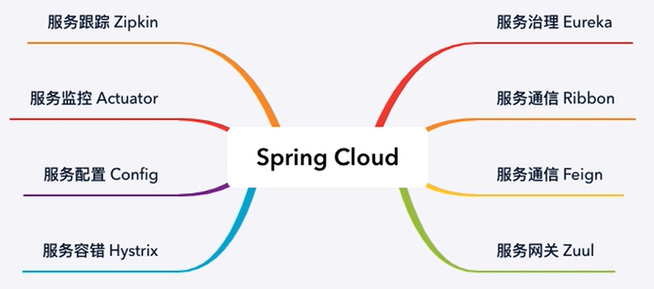

# Spring Cloud 微服务概述

## 一、什么是微服务

    微服务是一种架构风格，是一种架构设计方式，一个大型复杂软件应用由一个或多个微服务组成。系统中的各个微服务可被独立部署，各个微服务之间是松耦合的。每个微服务仅关注于完成一件任务并很好地完成该任务。在所有情况下，每个任务代表着一个小的业务能力。

## 二、为什么需要微服务
    传统开发模式下，绝大多数的web应用都是单体架构的风格来进行构建，这就使得所有的接口，业务逻辑层，数据持久层全部都被打包在一个web应用中，并且布置在一台服务器上，使得不同的模块之前也高耦合在一起，这种开发模式使得多团队协作开发的开发成本极高。

### 1、单体应用存在的问题
+ 随着业务的发展，开发变得越来越复杂
+ 修改、新增某个功能，需要对整个系统进行测试、重新部署。
+ 一个模块出现问题，很可能导致整个系统崩溃。
+ 多个安全团队同时对数据进行管理，容易·产生安全漏洞。
+ 各个模块使用同一种技术进行开发，各个模块很难根据实际情况选择更合适的技术框架，局限性很大。
+ 模块内容过于复杂，如果员工离职，可能需要很长时间才能完成工作交接。

### 2、分布式和集群
+ 集群：一台服务器无法负荷高并发的数据访问，需要设置更多的服务器一起分担压力。从物理层面解决高并发的问题，例如春运期间火车站多开购票窗口等。
+  分布式：将一个大型的项目架构拆分为若干个微服务来协同完成。从软件设计层面解决问题，将一个庞大的工作拆分成若干个小步骤，分别由不同的人完成这些小步骤，最终将所有的结果进行整合实现更大的需求。

### 3、微服务的优点

1. 各个服务的开发、测试、部署都是相互独立的。比如用户服务就可以拆分作为一个单独的服务，而它的开发也不用依赖于其他服务，如果用户量很大，我们可以很容易对其负载均衡。
2. 当有一个新的需求加入时，传统项目需要结合各方面考虑影响等，微服务就不存在这样的问题，省事省力又省心。 
3. 使用微服务将项目拆分后，只需要保证对外接口的正常运行，至于使用什么语言、什么框架通通不关心，大大降低了各个模块之间的耦合性，极大的提高开发效率。

### 4、微服务的弊端
1. 微服务的拆分基于业务，不能随心所欲的拆分，所以如何拆分，对于项目架构来说是非常重要且极具挑战的任务。
2. 涉及到服务之间的调用时，常常需要和另外一个服务的提供方进行沟通，若是两个完全不同的公司或者部门，沟通成本比较大；某服务的对外接口要进行修改，也需要与其他服务调用方进行沟通。
3. 由于各个服务相互独立，数据也是独立，当多个服务的接口进行操作时，如何保证数据的一致性是一个难点。数据统一性是微服务里面的一个难题。

## 三、Spring Cloud

### 1、为什么选择Spring Cloud

    虽然微服务也有很多缺点，但是瑕不掩瑜，总体来讲，微服务还是实现分布式架构的一个非常好的方式。是当下非常热点的技术，也是未来技术发展的趋势。当下较为常见的微服务框架是 Spring Cloud 和 dubbo 。那我们为什么选择 Spring Cloud 呢，原因如下：

+ Spring Cloud是完全基于Spring Boot，服务调用是基于REST API，整合了各种成熟的产品和架构，同时基于Spring Boot也使得整体的开发、配置、部署都非常的方便。
+ Spring系列的产品具备功能齐全、简单好用、性能优美、文档规范等优点。

### 2、**Spring Cloud的整体架构**

### 3、**Spring Cloud的核心组件**

**   ** Spring Cloud包含多个组件，主要是服务治理Eureka、服务通信Ribbon、服务通信Feign、服务网关Zuul、服务容错Hystrix、服务配置Config、服务监控Actuator、服务跟踪Zipkin等8大组件。 Spring Cloud的学习主要就是学习这些组件的使用以及这些组件之间的整合。

## 参考
+ [https://www.cnblogs.com/skabyy/p/11396571.html](https://www.cnblogs.com/skabyy/p/11396571.html)
+ [https://my.oschina.net/qq785482254/blog/3187900](https://my.oschina.net/qq785482254/blog/3187900)

> 更新: 2022-04-09 16:52:55  
> 原文: <https://www.yuque.com/thinkspace/afrw3l/sbbei0>