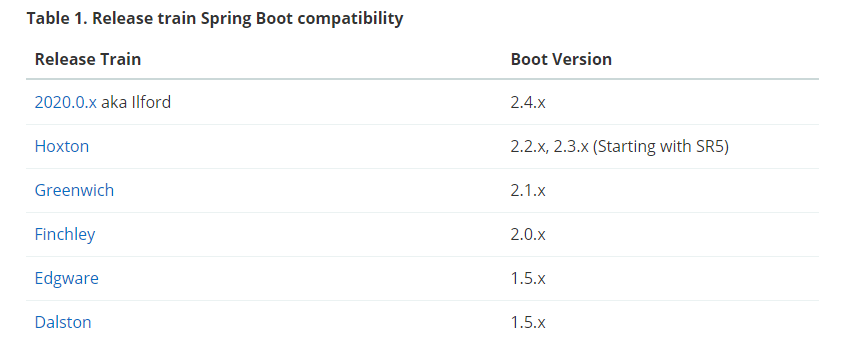

# Spring Cloud 版本

## 一、版本表



> <font style="color:rgb(51, 51, 51);background-color:rgb(235, 242, 242);">Spring Cloud Dalston, Edgware, Finchley, and Greenwich have all reached end of life status and are no longer supported.</font>

## 一、更新日志

### 1、Spring Cloud 2020.0.0

> 从 Spring Cloud 2020.0.0-M1 开始，Spring Cloud 废除了英国伦敦地铁站的命名方式，<font style="color:rgb(0, 0, 0);">从而使用了全新的 "日历化" 版本命名方式</font>

**<font style="color:rgb(0, 0, 0);">(1) 从 </font>**<code>**<font style="color:rgb(36, 41, 46);">spring-cloud-netflix</font>**</code>**<font style="color:rgb(36, 41, 46);"> 中移除了以下模块。</font>**

```plain
spring-cloud-netflix-archaius
spring-cloud-netflix-concurrency-limits
spring-cloud-netflix-core
spring-cloud-netflix-dependencies
spring-cloud-netflix-hystrix
spring-cloud-netflix-hystrix-contract
spring-cloud-netflix-hystrix-dashboard
spring-cloud-netflix-hystrix-stream
spring-cloud-netflix-ribbon
spring-cloud-netflix-sidecar
spring-cloud-netflix-turbine
spring-cloud-netflix-turbine-stream
spring-cloud-netflix-zuul
spring-cloud-starter-netflix-archaius
spring-cloud-starter-netflix-hystrix
spring-cloud-starter-netflix-hystrix-dashboard
spring-cloud-starter-netflix-ribbon
spring-cloud-starter-netflix-turbine
spring-cloud-starter-netflix-turbine-stream
spring-cloud-starter-netflix-zuul
Support for ribbon, hystrix and zuul was removed across the release train projects.
```

## 参考

* <https://github.com/spring-cloud/spring-cloud-release/wiki>


> 更新: 2022-04-09 16:53:00  
> 原文: <https://www.yuque.com/thinkspace/afrw3l/lal7bi>