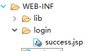

# SpringMVC配置

[Spring Docs](https://docs.spring.io/spring/docs/5.0.16.RELEASE/spring-framework-reference/web.html#mvc-config)

> MVC config提供适用于大多数应用的默认配置，此外你也可以configuration API 来自定义配置。

## 一、Enable MVC Config

使用Java配置类的方式开启 MVC config，只需要加上 `@EnableWebMvc`注解

```java
@Configuration
@EnableWebMvc
public class WebConfig {
}
```

使用XML的方式， 只需要添加 `<mvc:annotation-driven>`标签:

```xml
<?xml version="1.0" encoding="UTF-8"?>
<beans xmlns="http://www.springframework.org/schema/beans"
    xmlns:mvc="http://www.springframework.org/schema/mvc"
    xmlns:xsi="http://www.w3.org/2001/XMLSchema-instance"
    xsi:schemaLocation="
        http://www.springframework.org/schema/beans
        https://www.springframework.org/schema/beans/spring-beans.xsd
        http://www.springframework.org/schema/mvc
        https://www.springframework.org/schema/mvc/spring-mvc.xsd">

    <mvc:annotation-driven/>

</beans>
```

开启 MVC config 会注册一系列的 Spring MVC 基础 beans，这些beans是SpringMVC得以运行的基础: [Special Bean Types](https://docs.spring.io/spring/docs/5.0.16.RELEASE/spring-framework-reference/web.html#mvc-servlet-special-bean-types)。

## 二、自定义 MVC config

使用 Java 配置类时，实现 `WebMvcConfigurer` 接口:

```java
@Configuration
@EnableWebMvc
public class WebConfig implements WebMvcConfigurer {

    // Implement configuration methods...
}
```

使用XML方式时：使用`<mvc:annotation-driven/>`的属性或子标签来自定义MVC config。

### 2、mvc:view-controller

对应WEB-INF目录下面的JSP页面，我们知道是不能直接使用URL访问到。需要通过转发的方式，而我们一般都是在控制器中做转发映射，具体操作如下：

uccess.jsp页面的目录如下：



一般我们需要配置一个spring配置文件中配置一个视图解析器

```bash
1 <bean class="org.springframework.web.servlet.view.InternalResourceViewResolver">
2     <property name="prefix" value="/WEB-INF/"/>
3     <property name="suffix" value=".jsp"></property>
4 </bean>
```

然后在配置一个控制器

```java
1 @Controller
2 public class UserController {
3 
4     @RequestMapping("/toSuccess")
5     public String update(){
6         return "success";
7     }
8     
9 }
```

这里使用http://localhost:8080/springmvcdemo/toSuccess 可以正确得到页面。

但是对应一些我们不需要其他操作的JSP页面，我们可以使用\<mvc:view-controller path=""/>来配置，这样就可以不用再控制器中再去做转发映射。具体操作如下：

在springmvc配置文件中配置

1 \<mvc:view-controller path="/login/success"/>

注意：path是JSP页面相对WEB-INF的路径

下面我们使用http://localhost:8080/springmvc-1/login/success来访问，同样可以得到正确页面。

现实开发中一定要开启\<mvc:annotation-driven />注解。不然会报404。


> 更新: 2022-04-09 16:52:45  
> 原文: <https://www.yuque.com/thinkspace/afrw3l/kfu6dq>