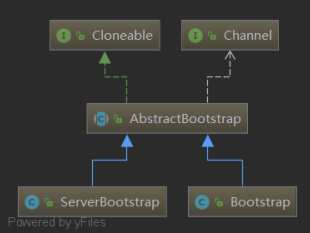
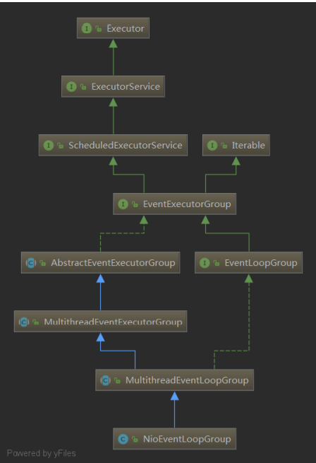
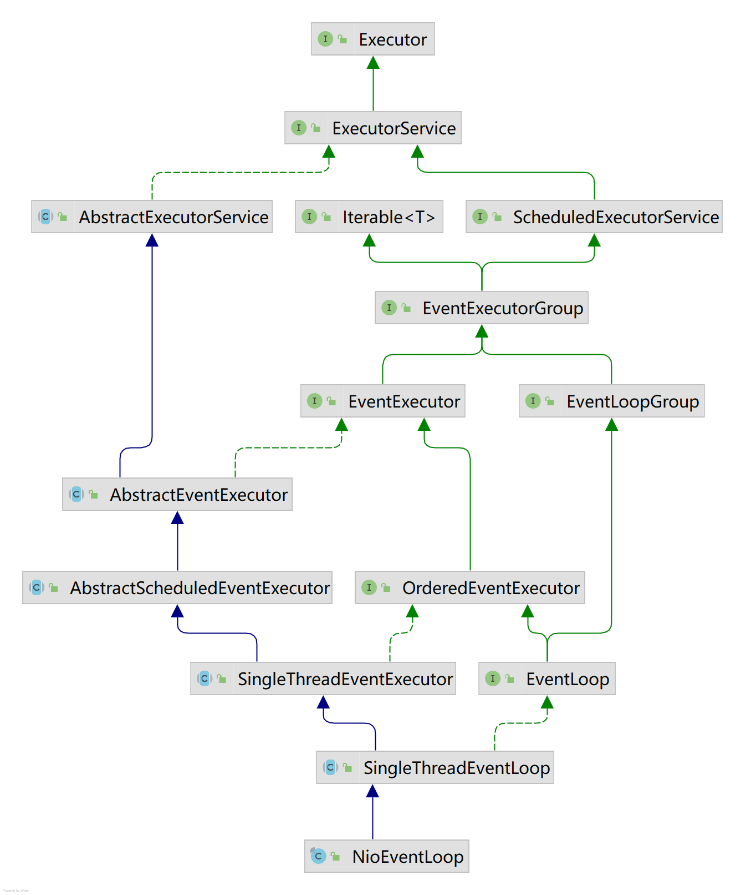
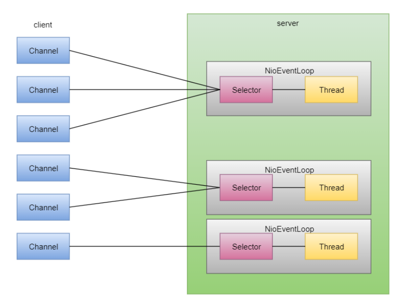
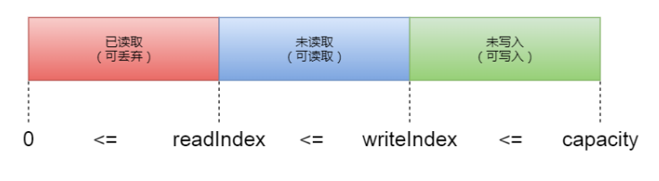
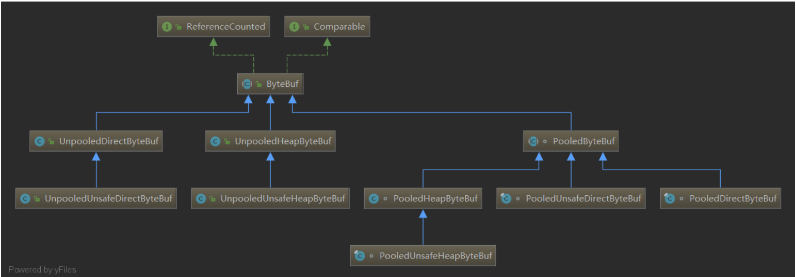
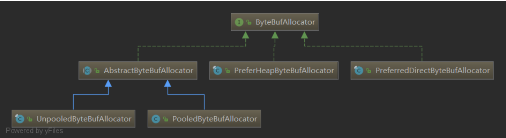
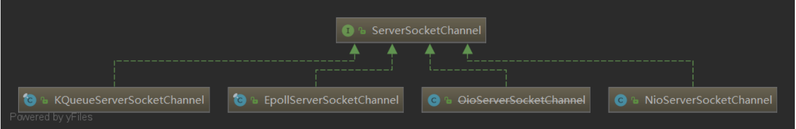
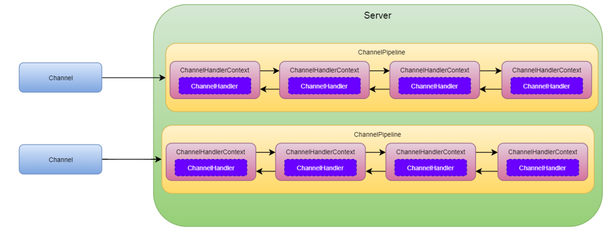

# Netty 核心组件

## 一、Bootstrap 与 ServerBootstrap

`Bootstrap` 与 `ServerBootstrap `是 Netty 程序的引导类，主要用于配置各种参数，并启动整个 Netty 服务。它们俩都 继承自 `AbstractBootstrap `抽象类，不同的是，`Bootstrap `用于客户端引导，而 `ServerBootstrap `用于服务端引导。



相对于 `Bootstrap`，`ServerBootstrap `多了一个维度，用于处理 `Accept `事件，所以它的很多方法都会多一份 `childXxx()` ，比如， `childHandler()` 、 `childOption()` 等，但是，没有 `childChannel()` 这个方法哦 ^^，因为子 `Channel `是通过 `ServerSocketChannel `创建出来的，跟踪源码会发现 `ServerSocketChannel `读取到消息的时候会把这个消息转换成 连接，即 `SocketChannel`，具体的源码分析我们后面再详细介绍。

## 二、EventLoopGroup

`EventLoopGroup` 可以理解为一个线程池，对于服务端程序，我们一般会绑定两个线程池，一个用于处理 Accept 事件，一个用于处理读写事件。   我们以 `NioEventLoopGroup `这个实现类为例看看它的继承体系：



细心的同学会发现，上面四个接口好熟悉：

* `Iterable`，迭代器的接口，说穿 `EventLoopGroup` 是一个容器，可以通过迭代的方式查看里面的元素。
* `Executor`，线程池的顶级接口，包含一个 `execute ()` 方法，用于提交任务到线程池中。
* `ExecutorService`，扩展自 `Executor` 接口，提供了通过 `submit ()` 方法提交任务的方式，并增加了 `shutdown()` 等其它方法。
* `ScheduledExecutorService`，扩展自 `ExecutorService`，增加了定时任务执行相关的方法。

  其中，后面三个都是线程池中的接口，位于著名的 `java.util.concurrent` 包下面。

下面的几个接口或者类自然就属于 Netty 了：

* `EventExecutorGroup`，扩展自 `ScheduledExecutorService`，并增加了两大功能，一是提供了 `next()` 方法用于获取一个 `EventExecutor`，二是管理这些 `EventExecutor` 的生命周期。
* `EventLoopGroup`，扩展自 `EventExecutorGroup`，并增加或修改了两大功能，一是提供了 `next()` 方法用于获取 一个 `EventLoop`，二是提供了注册 `Channel` 到事件轮询器中。
* `MultithreadEventLoopGroup`，抽象类，`EventLoopGroup` 的所有实现类都继承自这个类，可以看作是一种模 板，从名字也可以看出来它里面包含多个线程来处理任务。
* `NioEventLoopGroup`，具体实现类，使用 NIO 形式（多路复用中的 `select`）工作的 `EventLoopGroup`。更换前缀就可以得到不同的实现类，比如 `EpollEventLoopGroup` 专门用于 Linux 平台，`KQueueEventLoopGroup` 专门用于 MacOS/BSD 平台。

> `select`/`epoll`/`kqueue`，它们是实现 IO 多路复用的不同形式，`select` 支持的平台比较广泛，`epoll` 和 `kqueue` 比 `select `更高效，`epoll` 只支持 `linux`，`kqueue` 只支持 BSD 平台，其中 MacOS 衍生自 BSD，所以 `kqueue `也支持 MacOS。Netty 专门为两个平台做了的不同实现，也是对性能的极致追求，而且，我们服 务端通常都是运行在 Linux 系统上，所以在上线的时候完全可以使用 `EpollEventLoopGroup `来代替 `NioEventLoopGroup`。

## 三、EventLoop

`EventLoop` 可以理解为是 `EventLoopGroup` 中的工作线程，类似于 `ThreadPoolExecutor` 中的 Worker，但是，实际 上，它并不是一个线程，它里面包含了一个线程，控制着这个线程的生命周期。 让我们以 `NioEventLoop` 为例看看它的继承体系。



可以看到这个继承体系比 `EventLoopGroup` 还复杂，不用过于纠结，这里，我们介绍几个关键的接口或类：

* `EventExecutor`，扩展自 `EventExecutorGroup`，主要增加了判断一个线程是不是在 `EventLoop` 中的方法。
* `OrderedEventExecutor`，扩展自 `EventExecutor`，这是一个标记接口，标志着里面的任务都是按顺序执行的。
* `EventLoop`，扩展自 `EventLoopGroup`，它将为已注册进来的 `Channel` 处理所有的 IO 事件，另外，它还扩展自 `OrderedEventExecutor `接口，说明里面的任务是按顺序执行的。]
* `SingleThreadEventLoop`，抽象类，`EventLoop` 的所有实现类都继承自这个类，可以看作是一种模板，从名字也可以看出来它是使用单线程处理的。
* `NioEventLoop`，具体实现类，绑定到一个 `Selector` 上，同时可以注册多个 `Channel` 到 `Selector`上，同时，它继承自 `SingleThreadEventLoop`，也就说明了一个 `Selector` 对应一个线程。同样地，更换前缀就可以得到不同的实现，比如 `EpollEventLoop`、`KQueueEventLoop`。



## 四、ByteBuf

`ByteBuf`，咋一看名字跟 `ByteBuffer` 还挺像，还记得 `ByteBuffer` 吗？没错，既然 Java NIO 中已经定义处理字节的缓冲区，为什么 Netty 还要另辟蹊径，再搞一个 ByteBuf 出来呢？

让我们先来回忆一下 Buffer 的基本内容：

* 它包含三个主要属性：`position`、`limit`、`capacity`。
* 写模式，`position` 从 0 开始，表示下一个可写的位置，`limit` 等于 `capacity`。
* 读模式，`position` 重置为 0，表示下一个可读的位置，`limit` 等于切换之前 `position` 的位置，`capacity` 不变。
* 通过 `flip()` 方法切换为读模式
* 通过 `clean()` 方法或 `compact()` 方法清除（部分）数据
* 通过 `rewind()` 方法重新读取或重新写入数据
* 通过 `buf.put ()` 或者 `channel.read (buf)` 方法写入数据
* 通过 `buf.read()` 或者 `channel.write (buf)`方法读取数据

上面的内容你还记得哪些呢？是不是很复杂？Java NIO 自带的 Buffer 操作起来特别繁琐，一会儿切换成写模式， 一会儿切换在读模式，`position` 的位置在哪，是个正常人都会被绕进去。Netty 的作者也是一样，他也被绕进去了， 索性，他就创建了一个新的 `ByteBuf` 来处理缓冲区数据。

那么 Netty 是怎么实现的呢？让我们一起来看看吧。 `ByteBuf` 声明了两个指针：一个读指针 `readIndex` 用于读取数据，一个写指针` writeIndex` 用于写数据 。



使用读写指针分离带来的好处是明显的，彻底解决了读写模式切换来切换去、`position` 指针变来变去的问题。那 么，新的 `ByteBuf` 都有哪些特性呢？

首先，让我们看看 ByteBuf 的分类，常见的分类方式有三种：

（1）<code>**Pooled**</code>\*\* 和 **<code>**Unpooled**</code>**，池化和非池化\*\*

* 池化，即初始化时分配好一块内存作为内存池，每次创建 `ByteBuf` 时从这个内存池中分配一块连续的内存给这个 `ByteBuf` 使用，待这个 `ByteBuf` 使用完了之后再放回内存池中，供后续的 `ByteBuf` 使用。利用池化技术，可 以减少虚拟机频繁的内存回收带来的性能开销及资源消耗。池化技术在很多场景中都有使用到，比如，数据库连接池、线程池等，它们都有一些共同的特点，就是创建对象比较耗费资源。
* 非池化，即完全利用 JVM 本身的内存管理能力来管理对象的生命周期，即我们平时开发使用的模式，对象的 内存分配完全交给 JVM 来管理，我们不用管对象内存的管理和回收。

**（2）**<code>**Heap**</code>\*\* 和 **<code>**Direct**</code>**，堆内存和直接内存\*\*

* 堆内存，比较好理解，即 JVM 本身的堆内存。
* 直接内存，独立于 JVM 内存之外的内存空间，直接向操作系统申请一块内存。

**（3）Safe 和 Unsafe，安全和非安全**

***

* Unsafe，底层使用 Java 本身的 Unsafe 来操作底层的数据结构，即直接利用对象在内存中的指针来操作对 象，所以，比较危险

基于以上三个维度，而且是完全不相干的三个维度，就形成了 8 种完全不一样的 ByteBuf，即 `PooledHeapByteBuf`、`PooledUnsafeHeapByteBuf`、`PooledDirectByteBuf`、`PooledUnsafeDirectByteBuf`、 `UnpooledHeapByteBuf`、`UnpooledUnsafeHeapByteBuf`、`UnpooledDirectByteBuf`、`UnpooledUnsafeDirectByteBuf`。



好了，上面介绍了 `ByteBuf` 的分类，你一定会说，这么多 `ByteBuf`，到底用哪个呢？怎么使用呢？ 其实，Netty 都已经为我们想好了，关于上面八种 `ByteBuf`，我们并不需要显式地去调用它们的构造方法，而是使用一种叫作 `ByteBufAllocator` 分配器的东西来为我们创建 ByteBuf 对象，而这种分配器又有四种不同的类型：

* `PooledByteBufAllocator`，使用池化技术，内部会根据平台特性自行决定使用哪种 ByteBuf
* `UnpooledByteBufAllocator`，不使用池化技术，内部会根据平台特性自行决定使用哪种 ByteBuf
* `PreferHeapByteBufAllocator`，更偏向于使用堆内存，即除了显式地指明了使用直接内存的方法都使用堆内存
* `PreferDirectByteBufAllocator`，更偏向于使用直接内存，即除了显式地指明了使用堆内存的方法都使用直接内存



看到这里，你可能已经想骂粗口了，别急，淡定，八种 ByteBuf，四种 Allocator，对于拥有选择恐惧症的我该怎么办？  Netty 真的为你想好了，只需要简单地调用如下几行代码，Netty 就可以帮你创建最适合当前平台的 `ByteBuf`：

```java
ByteBufAllocator allocator = ByteBufAllocator.DEFAULT;
ByteBuf buffer = allocator.buffer(length);
buffer.writeXxx(xxx)
```

是不是很贴心呢？ 默认地，Netty 将 最大努力地使用池化、Unsafe、直接内存的方式为你创建 `ByteBuf`，为什么说是最大努力呢？因 为在有些平台下某种特性支持地不是很好，所以 Netty 默认不会开启，比如 Android 平台下不会使用 Unsafe。

```java
// io.netty.util.internal.PlatformDependent#unsafeUnavailabilityCause0
if (isAndroid()) {
	logger.debug("sun.misc.Unsafe: unavailable (Android)");
	return new UnsupportedOperationException("sun.misc.Unsafe: unavailable (Android)");
}

```

## 五、Channel

上面我们介绍了 `ByteBuf`，它是 Netty 在 Java NIO 的 Buffer 之上创造的一个新的缓冲区，比 Java 自带的语义清晰很多，也好用很多。那么，`Channel` 是不是也是凌驾于 Java NIO 的 Channel 之上的一个新事物呢？ 答案是肯定的，Netty 的 Channel 是对 Java 原生 Channel 的进一步封装，不仅封装了原生 Channel 操作的复杂性，还提供了一些很酷且实用的功能，比如：

* 可以获取当前连接的状态及配置参数
* 通过 `ChannelPipeline` 来处理 IO 事件
* 在 Netty 中的所有 IO 操作都是异步的
* 可继承的 Channel 体系

与原生 Channel 对应，Netty 的 Channel 都有相应的包装类，并且还扩展了其它协议的实现：

* `DatagramChannel`：UDP 协议的支持
* `SocketChannel`：TCP 协议的支持
* `ServerSocketChannel`：TCP 协议的支持
* `SctpChannel`：SCTP 协议的支持
* `SctpServerChannel`：SCTP 协议的支持
* `RxtxChannel`：RXTX 协议的支持，已废弃
* `UdtChannel`：UDT 协议的支持，已废弃

可以看到，对各种协议的支持在 Netty 中很容易实现，且它很擅长。 Netty 不仅支持这些协议的 NIO 通用平台实现，还支持特定平台的实现，而且只需要简单地更换前缀就可以达到对不同平台的支持，比如，`ServerSocketChannel` 的通用实现为 `NioServerSocketChannel`，在 Linux 下完全可以更换 成 `EpollServerSocketChannel`，代码只需要做很小的修改，就可以达到平台级的性能提升。



## 六、ChannelHandler

`ChannelHandler` 是核心业务处理接口，用于处理或拦截 IO 事件，并将其转发到 `ChannelPipeline` 中的下一个`ChannelHandler`，运用的是责任链设计模式。

`ChannelHandler` 分为入站和出站两种：`ChannelInboundHandler` 和 `ChannelOutboundHandler`，不过一般不建议直接\
实现这两个接口，而是它们的抽象类：

* `SimpleChannelInboundHandler`：处理入站事件，不建议直接使用 `ChannelInboundHandlerAdapter`
* `ChannelOutboundHandlerAdapter`：处理出站事件
* `ChannelDuplexHandler`：双向的

其中，`SimpleChannelInboundHandler` 相比于 `ChannelInboundHandlerAdapter` 优势更明显，它可以帮我们做资源的自动释放等操作。

## 七、ChannelHandlerContext

`ChannelHandlerContext` 保存着 `Channel` 的上下文，同时关联着一个 `ChannelHandler`，通过 `ChannelHandlerContext`，`ChannelHandler` 方能与 `ChannelPipeline` 或者其它 `ChannelHandler` 进行交 互，`ChannelHandlerContext` 是它们之间的纽带。

## 八、ChannelFuture

我们上面说了 Netty 中所有的 IO 操作都是异步的，既然是异步的就会返回在将来用来获取返回值的对象，也就是 Future，在 Netty 中，这个 Future 我们称之为 `ChannelFuture`，因为是跟 Channel 的 IO 事件相关联的，当然，Netty 中还有其它各种各样的 Future。 通过 `ChannelFuture`，可以查看 IO 操作是否已完成、是否成功、是否已取消等等。

## 九、ChannelPipeline

`ChannelPipeline` 是 `ChannelHandler` 的集合，它负责处理和拦截入站和出站的事件和操作，每个 Channel 都有一个 `ChannelPipeline` 与之对应，会自动创建。

更确切地说，`ChannelPipeline` 中存储的是 `ChannelHandlerContext` 链，通过这个链把 `ChannelHandler` 连接起来， 让我们仔细研究一下几者之间的关系：

* 一个 Channel 对应一个 ChannelPipeline
* 一个 ChannelPipeline 包含一条双向的 ChannelHandlerContext 链
* 一个 ChannelHandlerContext 中包含一个 ChannelHandler
* 一个 Channel 会绑定到一个 EventLoop 上
* 一个 NioEventLoop 维护了一个 Selector（使用的是 Java 原生的 Selector）
* 一个 NioEventLoop 相当于一个线程

通过以上分析，可以得出，ChannelPipeline、ChannelHandlerContext 都是线程安全的，因为同一个 Channel 的事 件都会在一个线程中处理完毕（假设用户不自己启动线程）。但是，ChannelHandler 却不一定，ChannelHandler 类 似于 Spring MVC 中的 Service 层，专门处理业务逻辑的地方，一个 ChannelHandler 实例可以供多个 Channel 使 用，所以，不建议把有状态的变量放在 ChannelHandler 中，而是放在消息本身或者 ChannelHandlerContext 中。

好了，上面的关系已经描述清楚，让我们画个图直观地感受一下：



## 十、ChannelOption

`ChannelOption` 严格来说不算是一种组件，它保存了很多我们拿来即用的参数，使用这些参数能够让我们以类型安 全地方式来配置 Channel，比如，我们前面使用过的 `ChannelOption.SO_BACKLOG`，Netty 还提供了很多这种类似 的参数，使得我们能够以更精细地方式控制程序正确、正常、高性能地运行。

## 后记

本节，我们一起学习了 Netty 的十大核心组件，理解了这些组件的含义和使用方式，相信你一定能够从宏观上对 Netty 有一个更高的认识，这些组件看似散乱，其实内含逻辑，如果非要给它们归类的话，我认为可以分成以下四 类：

1. 引导相关：Bootstrap 和 ServerBootstrap

2. 线程相关：EventLoopGroup、EventLoop（EventExecutorGroup、EventExecutor）

3. Buffer 相关：ByteBuf

4. Channel 相关：Channel、ChannelHandler、ChannelHandlerContext、ChannelFuture、ChannelPipeline、 ChannelOption

其实，每一块甚至每一个类拿出来讲，都能讲很多内容，本节只是从宏观上认识这些组件，待后面分析源码的时候 再来深入了解它们。


> 更新: 2022-04-09 16:53:19  
> 原文: <https://www.yuque.com/thinkspace/ulag78/obb2mq>