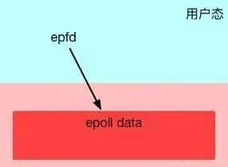
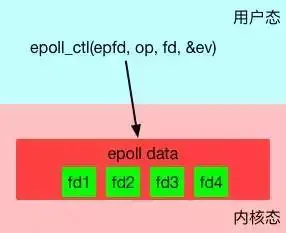
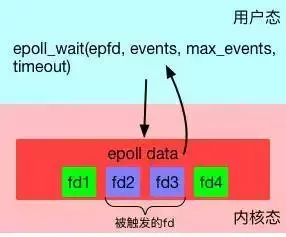
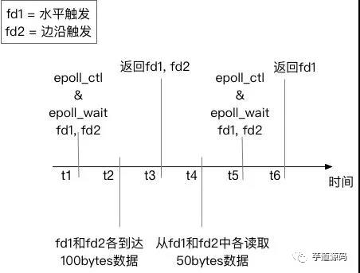

# 网络 IO 浅析（一）

本文从操作系统的角度来解释BIO，NIO，AIO的概念，含义和背后的那些事。本文主要分为3节。

* 第一节 讲解BIO和NIO以及IO多路复用
* 第二节 讲解磁盘IO和AIO
* 第三节 讲解在这些机制上的一些应用的实现方式，如Java NIO。

## 一、到底什么是“IO Block”

很多人说BIO不好，会“block”，但到底什么是IO的Block呢？考虑下面两种情况：

* 用系统调用`read`从socket里读取一段数据
* 用系统调用`read`从一个磁盘文件读取一段数据到内存

如果你的直觉告诉你，这两种都算“Block”，那么很遗憾，你的理解与Linux不同。Linux认为：

* 对于第一种情况，算作 block，因为Linux无法知道网络上对方是否会发数据。如果没数据发过来，对于调用`read`的程序来说，就只能“等”。
* 对于第二种情况，**不算做block**。

是的，对于磁盘文件IO，Linux总是不视作Block。\
你可能会说，这不科学啊，磁盘读写偶尔也会因为硬件而卡壳啊，怎么能不算Block呢？但实际就是不算。

> 一个解释是，所谓“Block”是指操作系统可以预见这个Block会发生才会主动Block。例如当读取TCP连接的数据时，如果发现Socket buffer里没有数据就可以确定定对方还没有发过来，于是Block；而对于普通磁盘文件的读写，也许磁盘运作期间会抖动，会短暂暂停，但是操作系统无法预见这种情况，只能视作不会Block，照样执行。

基于这个基本的设定，在讨论IO时，一定要严格区分网络IO和磁盘文件IO。NIO和后文讲到的IO多路复用只对网络IO有意义。

> 严格的说，`O_NONBLOCK` 和 IO 多路复用，对标准输入输出描述符、管道和 FIFO 也都是有效的。但本文侧重于讨论高性能网络服务器下各种IO的含义和关系，所以本文做了简化，只提及网络IO和磁盘文件IO两种情况。

本节先着重讲一下网络IO。

## 二、BIO

有了Block的定义，就可以讨论BIO和NIO了。BIO是 Blocking IO 的意思。在类似于网络中进行`read`, `write`, `connect`一类的系统调用时会被卡住。\
举个例子，当用`read`去读取网络的数据时，是无法预知对方是否已经发送数据的。因此在收到数据之前，能做的只有等待，直到对方把数据发过来，或者等到网络超时。\
对于单线程的网络服务，这样做就会有卡死的问题。因为当等待时，整个线程会被挂起，无法执行，也无法做其他的工作。

> 顺便说一句，这种Block是不会影响同时运行的其他程序（进程）的，因为现代操作系统都是多任务的，任务之间的切换是抢占式的。这里 Block 只是指 Block 当前的进程。

于是，网络服务为了同时响应多个并发的网络请求，必须实现为多线程的。每个线程处理一个网络请求。线程数随着并发连接数线性增长。这的确能奏效。实际上 2000 年之前很多网络服务器就是这么实现的。但这带来两个问题：

* 线程越多，Context Switch 就越多，而 Context Switch 是一个比较重的操作，会无谓浪费大量的CPU。
* 每个线程会占用一定的内存作为线程的栈。比如有1000个线程同时运行，每个占用1MB内存，就占用了1个G 的内存。

问题的关键在于，当调用`read`接受网络请求时，有数据到了就用，没数据到时，实际上是可以干别的。使用大量线程，仅仅是因为 Block 发生，没有其他办法。\
当然你可能会说，是不是可以弄个线程池呢？这样既能并发的处理请求，又不会产生大量线程。但这样会限制最大并发的连接数。比如你弄4个线程，那么最大4个线程都 Block 了就没法响应更多请求了。\
要是操作IO接口时，操作系统能够总是直接告诉有没有数据，而不是 Block 去等就好了。于是，NIO登场。

## 三、NIO

NIO是指将IO模式设为“Non-Blocking”模式。在Linux下，一般是这样：

```c
void setnonblocking(int fd) {
    int flags = fcntl(fd, F_GETFL, 0);
    fcntl(fd, F_SETFL, flags | O_NONBLOCK);
}
```

> 再强调一下，以上操作只对socket对应的文件描述符有意义；对磁盘文件的文件描述符做此设置总会成功，但是会直接被忽略。

这时，BIO和NIO的区别是什么呢？

* 在BIO模式下，调用`read`，如果发现没数据已经到达，就会 Block 住。
* 在NIO模式下，调用`read`，如果发现没数据已经到达，就会立刻返回`-1`, 并且`errno`被设为`EAGAIN`。

> 在有些文档中写的是会返回`EWOULDBLOCK`。实际上，在Linux下`EAGAIN`和`EWOULDBLOCK`是一样的，即`#define EWOULDBLOCK EAGAIN`

于是，一段NIO的代码，大概就可以写成这个样子。

```c
struct timespec sleep_interval{.tv_sec = 0, .tv_nsec = 1000};
ssize_t nbytes;
while (1) {
    /* 尝试读取 */
    if ((nbytes = read(fd, buf, sizeof(buf))) < 0) {
        if (errno == EAGAIN) { // 没数据到
            perror("nothing can be read");
        } else {
            perror("fatal error");
            exit(EXIT_FAILURE);
        }
    } else { // 有数据
        process_data(buf, nbytes);
    }
    // 处理其他事情，做完了就等一会，再尝试
    nanosleep(sleep_interval, NULL);
}
```

这段代码很容易理解，就是轮询，不断的尝试有没有数据到达，有了就处理，没有(得到`EWOULDBLOCK`或者`EAGAIN`)就等一小会再试。这比之前 BIO 好多了，起码程序不会被卡死了。\
但这样会带来两个新问题：

* 如果有大量文件描述符都要等，那么就得一个一个的read。这会带来大量的Context Switch（`read`是系统调用，每调用一次就得在用户态和核心态切换一次）
* 休息一会的时间不好把握。这里是要猜多久之后数据才能到。等待时间设的太长，程序响应延迟就过大；设的太短，就会造成过于频繁的重试，干耗CPU而已。

要是操作系统能一口气告诉程序，哪些数据到了就好了。于是IO多路复用被搞出来解决这个问题。

## 四、IO 多路复用

IO多路复用（IO Multiplexing) 是这么一种机制：程序注册一组socket文件描述符给操作系统，表示“我要监视这些fd是否有IO事件发生，有了就告诉程序处理”。

IO 多路复用是要和 NIO 一起使用的。尽管在操作系统级别，NIO 和 IO 多路复用是两个相对独立的事情。NIO 仅仅是指 IO API 总是能立刻返回，不会被 Blocking；而 IO 多路复用仅仅是操作系统提供的一种便利的通知机制。操作系统并不会强制这俩必须得一起用——你可以用 NIO，但不用 IO 多路复用，就像上一节中的代码；也可以只用 IO 多路复用 + BIO，这时效果还是当前线程被卡住。但是，**IO多路复用和 NIO 是要配合一起使用才有实际意义**。因此，在使用IO多路复用之前，请总是先把`fd`设为`O_NONBLOCK`。

对IO多路复用，还存在一些常见的误解，比如：

* \*\*❌\*\***IO多路复用是指多个数据流共享同一个Socket**。其实IO多路复用说的是多个Socket，只不过操作系统是一起监听他们的事件而已。

> \*\*“\*\*多个数据流共享同一个TCP连接的场景的确是有，比如 Http2 Multiplexing 就是指Http2通讯中中多个逻辑的数据流共享同一个TCP连接。但这与IO多路复用是完全不同的问题。

* \*\*❌\*\***IO多路复用是NIO，所以总是不Block的**。其实IO多路复用的关键API调用(`select`，`poll`，`epoll_wait`）总是Block的，正如下文的例子所讲。
* ❌**IO多路复用和NIO一起减少了IO**。实际上，IO本身（网络数据的收发）无论用不用IO多路复用和NIO，都没有变化。请求的数据该是多少还是多少；网络上该传输多少数据还是多少数据。IO多路复用和NIO一起仅仅是解决了调度的问题，避免CPU在这个过程中的浪费，使系统的瓶颈更容易触达到网络带宽，而非CPU或者内存。要提高IO吞吐，还是提高硬件的容量（例如，用支持更大带宽的网线、网卡和交换机）和依靠并发传输（例如 HDFS 的数据多副本并发传输）。

操作系统级别提供了一些接口来支持IO多路复用，最老掉牙的是`select`和`poll`。

### 1、select

`select` 长这样：

```c
int select(int nfds, fd_set *readfds, fd_set *writefds, 
           fd_set *exceptfds, struct timeval *timeout);
```

它接受3个文件描述符的**数组**，分别监听读取(`readfds`)，写入(`writefds`)和异常(`expectfds`)事件。那么一个 IO多路复用的代码大概是这样：

```c
struct timeval tv = {.tv_sec = 1, .tv_usec = 0};

ssize_t nbytes;
while(1) {
    FD_ZERO(&read_fds);
    setnonblocking(fd1);
    setnonblocking(fd2);
    FD_SET(fd1, &read_fds);
    FD_SET(fd2, &read_fds);
    // 把要监听的fd拼到一个数组里，而且每次循环都得重来一次...
    if (select(FD_SETSIZE, &read_fds, NULL, NULL, &tv) < 0) { // block住，直到有事件到达
        perror("select出错了");
        exit(EXIT_FAILURE);
    }
    for (int i = 0; i < FD_SETSIZE; i++) {
        if (FD_ISSET(i, &read_fds)) {
            //检测到第[i]个读取fd已经收到了，这里假设buf总是大于到达的数据，所以可以一次read完
            if ((nbytes = read(i, buf, sizeof(buf))) >= 0) {
                process_data(nbytes, buf);
            } else {
                perror("读取出错了");
                exit(EXIT_FAILURE);
            }
        }
    }
}
```

首先，为了`select`需要构造一个`fd`数组（这里为了简化，没有构造要监听写入和异常事件的fd数组）。之后，用`select`监听了`read_fds`中的多个 socket 的读取时间。调用`select`后，程序会 Block住，直到一个事件发生了，或者等到最大1秒钟(`tv`定义了这个时间长度）就返回。之后，需要遍历所有注册的 `fd`，挨个检查哪个`fd`有事件到达(`FD_ISSET`返回true)。如果是，就说明数据已经到达了，可以读取`fd`了。读取后就可以进行数据的处理。

select有一些发指的缺点：

* `select` 能够支持的最大的`fd`数组的长度是1024。这对要处理高并发的web服务器是不可接受的。
* `fd`数组按照监听的事件分为了3个数组，为了这3个数组要分配3段内存去构造，而且每次调用`select`前都要重设它们（因为`select`会改这3个数组)；调用`select`后，这3数组要从用户态复制一份到内核态；事件到达后，要遍历这3数组。很不爽。
* `select`返回后要挨个遍历`fd`，找到被“SET”的那些进行处理。这样比较低效。
* `select`是无状态的，即每次调用`select`，内核都要重新检查所有被注册的`fd`的状态。`select`返回后，这些状态就被返回了，内核不会记住它们；到了下一次调用，内核依然要重新检查一遍。于是查询的效率很低。

### 2、poll

`poll`与`select`类似于。它大概长这样：、

```c
int poll(struct pollfd *fds, nfds_t nfds, int timeout);
```

`poll`的代码例子和`select`差不多，因此也就不赘述了。有意思的是`poll`这个单词的意思是“轮询”，所以很多中文资料都会提到对IO进行“轮询”。

> 上面说的`select`和下文说的`epoll`本质上都是轮询。

`poll`优化了`select`的一些问题。比如不再有3个数组，而是1个`polldfd`结构的数组了，并且也不需要每次重设了。数组的个数也没有了1024的限制。但其他的问题依旧：

* 依然是无状态的，性能的问题与`select`差不多一样；
* 应用程序仍然无法很方便的拿到那些“有事件发生的fd“，还是需要遍历所有注册的`fd`。

目前来看，高性能的web服务器都不会使用`select`和`poll`。他们俩存在的意义仅仅是“兼容性”，因为很多操作系统都实现了这两个系统调用。

如果是追求性能的话，在 BSD/macOS 上提供了 kqueue api；在 Salorias 中提供了 /dev/poll（可惜该操作系统已经凉凉)；而在 Linux 上提供了 epoll api。它们的出现彻底解决了`select`和`poll`的问题。Java NIO，nginx 等在对应的平台的上都是使用这些api实现。

因为大部分情况下我会用 Linux 做服务器，所以下文以 Linux epoll 为例子来解释多路复用是怎么工作的。

### 3、epoll

epoll是 Linux 下的IO多路复用的实现。与`select`和`poll`不同，要使用epoll是需要先创建一下的。

```c
int epfd = epoll_create(10);
```

`epoll_create` 在内核层创建了一个数据表，接口会返回一个“epoll的文件描述符”指向这个表。注意，接口参数是一个表达要监听事件列表的长度的数值。但不用太在意，因为 epoll 内部随后会根据事件注册和事件注销动态调整 epoll 中表格的大小。\
\
为什么`epoll`要创建一个用文件描述符来指向的表呢？这里有两个好处：

* `epoll`是有状态的，不像`select`和`poll`那样每次都要重新传入所有要监听的 `fd`，这避免了很多无谓的数据复制。`epoll` 的数据是用接口 `epoll_ctl` 来管理的（增、删、改）。
* `epoll` 文件描述符在进程被 `fork` 时，子进程是可以继承的。这可以给对多进程共享一份 `epoll` 数据，实现并行监听网络请求带来便利。但这超过了本文的讨论范围，就此打住。

`epoll` 创建后，第二步是使用`epoll_ctl`接口来注册要监听的事件。

```c
int epoll_ctl(int epfd, int op, int fd, struct epoll_event *event);
```

其中第一个参数就是上面创建的`epfd`。第二个参数`op`表示如何对文件名进行操作，共有3种。

* `EPOLL_CTL_ADD` - 注册一个事件
* `EPOLL_CTL_DEL`- 取消一个事件的注册
* `EPOLL_CTL_MOD`- 修改一个事件的注册

第三个参数是要操作的`fd`，这里必须是支持`NIO`的`fd`（比如`socket`）。\
第四个参数是一个`epoll_event`的类型的数据，表达了注册的事件的具体信息。

```c
typedef union epoll_data {
    void    *ptr;
    int      fd;
    uint32_t u32;
    uint64_t u64;
} epoll_data_t;

struct epoll_event {
    uint32_t     events;    /* Epoll events */
    epoll_data_t data;      /* User data variable */
};
```

比方说，想关注一个`fd1`的读取事件事件，并采用边缘触发(下文会解释什么是边缘触发），大概要这么写：

```c
struct epoll_data ev;
ev.events = EPOLLIN | EPOLLET; // EPOLLIN表示读事件；EPOLLET表示边缘触发
ev.data.fd = fd1;
```

通过`epoll_ctl`就可以灵活的注册/取消注册/修改注册某个`fd`的某些事件。\
\
第三步，使用`epoll_wait`来等待事件的发生。

```c
int epoll_wait(int epfd, struct epoll_event *evlist, int maxevents, int timeout);
```

特别留意，这一步是"block"的。只有当注册的事件至少有一个发生，或者`timeout`达到时，该调用才会返回。这与`select`和`poll`几乎一致。但不一样的地方是`evlist`，它是`epoll_wait`的返回数组，里面**只包含那些被触发的事件对应的fd**，而不是像`select`和`poll`那样返回所有注册的fd。\
\
综合起来，一段比较完整的epoll代码大概是这样的。

```c
#define MAX_EVENTS 10
struct epoll_event ev, events[MAX_EVENTS];
int nfds, epfd, fd1, fd2;

// 假设这里有两个socket，fd1和fd2，被初始化好。
// 设置为non blocking
setnonblocking(fd1);
setnonblocking(fd2);

// 创建epoll
epfd = epoll_create(MAX_EVENTS);
if (epollfd == -1) {
    perror("epoll_create1");
    exit(EXIT_FAILURE);
}

//注册事件
ev.events = EPOLLIN | EPOLLET;
ev.data.fd = fd1;
if (epoll_ctl(epollfd, EPOLL_CTL_ADD, fd1, &ev) == -1) {
    perror("epoll_ctl: error register fd1");
    exit(EXIT_FAILURE);
}
if (epoll_ctl(epollfd, EPOLL_CTL_ADD, fd2, &ev) == -1) {
    perror("epoll_ctl: error register fd2");
    exit(EXIT_FAILURE);
}

// 监听事件
for (;;) {
    nfds = epoll_wait(epdf, events, MAX_EVENTS, -1);
    if (nfds == -1) {
        perror("epoll_wait");
        exit(EXIT_FAILURE);
    }

    for (n = 0; n < nfds; ++n) { // 处理所有发生IO事件的fd
        process_event(events[n].data.fd);
        // 如果有必要，可以利用epoll_ctl继续对本fd注册下一次监听，然后重新epoll_wait
    }
}
```

此外，`epoll`的手册 中也有一个简单的例子。

所有的基于 IO多路复用的代码都会遵循这样的写法：注册——监听事件——处理——再注册，无限循环下去。

**epoll 的优势**

为什么`epoll`的性能比`select`和`poll`要强呢？`select`和`poll`每次都需要把完成的`fd`列表传入到内核，迫使内核每次必须从头扫描到尾。而`epoll`完全是反过来的。`epoll`在内核的数据被建立好了之后，每次某个被监听的`fd`一旦有事件发生，内核就直接标记之。`epoll_wait`调用时，会尝试直接读取到当时已经标记好的fd列表，如果没有就会进入等待状态。\
同时，`epoll_wait`直接只返回了被触发的fd列表，这样上层应用写起来也轻松愉快，再也不用从大量注册的`fd`中筛选出有事件的`fd`了。于是，高性能网络服务器的场景特别适合用`epoll`来实现——因为大多数网络服务器都有这样的模式：同时要监听大量（几千，几万，几十万甚至更多）的网络连接，但是短时间内发生的事件非常少。\
但是，假设发生事件的`fd`的数量接近所有注册事件`fd`的数量，那么`epoll`的优势就没有了，其性能表现会和`poll`和`select`差不多。\
`epoll`除了性能优势，还有一个优点——同时支持水平触发`(Level Trigger`)和边沿触发(`Edge Trigger`)。

## 五、水平触发和边沿触发

默认情况下，`epoll`使用水平触发，这与`select`和`poll`的行为完全一致。在水平触发下，`epoll`顶多算是一个“跑得更快的`poll`”。\
而一旦在注册事件时使用了`EPOLLET`标记（如上文中的例子），那么将其视为边沿触发（或者有地方叫边缘触发，一个意思）。那么到底什么水平触发和边沿触发呢？

考虑下图中的例子。有两个`socket`的`fd`——`fd1`和`fd2`。我们设定监听`fd1`的“水平触发读事件“，监听`fd2`的”边沿触发读事件“。我们在时刻`t1`，使用`epoll_wait`监听他们的事件。在时刻 t2时，两个`fd`都到了 100bytes 数据，于是在时刻 t3, `epoll_wait`返回了两个`fd`进行处理。在 t4，我们故意不读取所有的数据出来，只各自读 50bytes。然后在 t5 重新注册两个事件并监听。在 t6 时，只有 fd1 会返回，因为 fd1 里的数据没有读完，仍然处于“被触发”状态；而 fd2 不会被返回，因为没有新数据到达。



这个例子很明确的显示了水平触发和边沿触发的区别。

* 水平触发只关心文件描述符中是否还有没完成处理的数据，如果有，不管怎样`epoll_wait`，总是会被返回。简单说——水平触发代表了一种“状态”。
* 边沿触发只关心文件描述符是否有**新**的事件产生，如果有，则返回；如果返回过一次，不管程序是否处理了，只要没有新的事件产生，`epoll_wait`不会再认为这个fd被“触发”了。简单说——边沿触发代表了一个“事件”。

那么边沿触发怎么才能迫使新事件产生呢？一般需要反复调用`read/write`这样的 IO 接口，直到得到了`EAGAIN`错误码，再去尝试`epoll_wait`才有可能得到下次事件。

那么为什么需要边沿触发呢？

边沿触发把如何处理数据的控制权完全交给了开发者，提供了巨大的灵活性。比如，读取一个 http 的请求，开发者可以决定只读取 http 中的 headers 数据就停下来，然后根据业务逻辑判断是否要继续读。而不是次次被 socket 尚有数据的状态烦扰；写入数据时也是如此。比如希望将一个资源A 写入到socket。当 socket 的 buffer 充足时，`epoll_wait`会返回这个`fd`是准备好的。但是资源A 此时不一定准备好。如果使用水平触发，每次经过`epoll_wait`也总会被打扰。在边沿触发下，开发者有机会更精细的定制这里的控制逻辑。\
但不好的一面时，边沿触发也大大的提高了编程的难度。一不留神，可能就会miss掉处理部分 socket数据的机会。如果没有很好的根据`EAGAIN`来“重置”一个`fd`，就会造成此`fd`永远没有新事件产生，进而导致饿死相关的处理代码。

## 六、再来思考什么是“Block”

上面的所有介绍都在围绕如何让网络 IO 不会被 Block。但是网络IO 处理仅仅是整个数据处理中的一部分。如果你留意到上文例子中的“处理事件”代码，就会发现这里可能是有问题的。

* 处理代码有可能需要读写文件，可能会很慢，从而干扰整个程序的效率；
* 处理代码有可能是一段复杂的数据计算，计算量很大的话，就会卡住整个执行流程；
* 处理代码有bug，可能直接进入了一段死循环……

这时你会发现，这里的 Block 和本文之初讲的 `O_NONBLOCK` 是不同的事情。在一个网络服务中，如果处理程序的延迟远远小于网络IO，那么这完全不成问题。但是如果处理程序的延迟已经大到无法忽略了，就会对整个程序产生很大的影响。这时IO多路复用已经不是问题的关键。\
试分析和比较下面两个场景：

* web proxy。程序通过IO多路复用接收到了请求之后，直接转发给另外一个网络服务。
* web server。程序通过IO多路复用接收到了请求之后，需要读取一个文件，并返回其内容。

它们有什么不同？它们的瓶颈可能出在哪里？

## 总结

小结一下本文：

* 对于`socket`的文件描述符才有所谓BIO和NIO。
* 多线程+BIO模式会带来大量的资源浪费，而 NIO+IO多路复用可以解决这个问题。
* 在Linux下，基于`epoll`的IO多路复用是解决这个问题的最佳方案；`epoll`相比`select`和`poll`有很大的性能优势和功能优势，适合实现高性能网络服务。


> 更新: 2022-11-22 16:43:14  
> 原文: <https://www.yuque.com/thinkspace/ulag78/zrylb0>