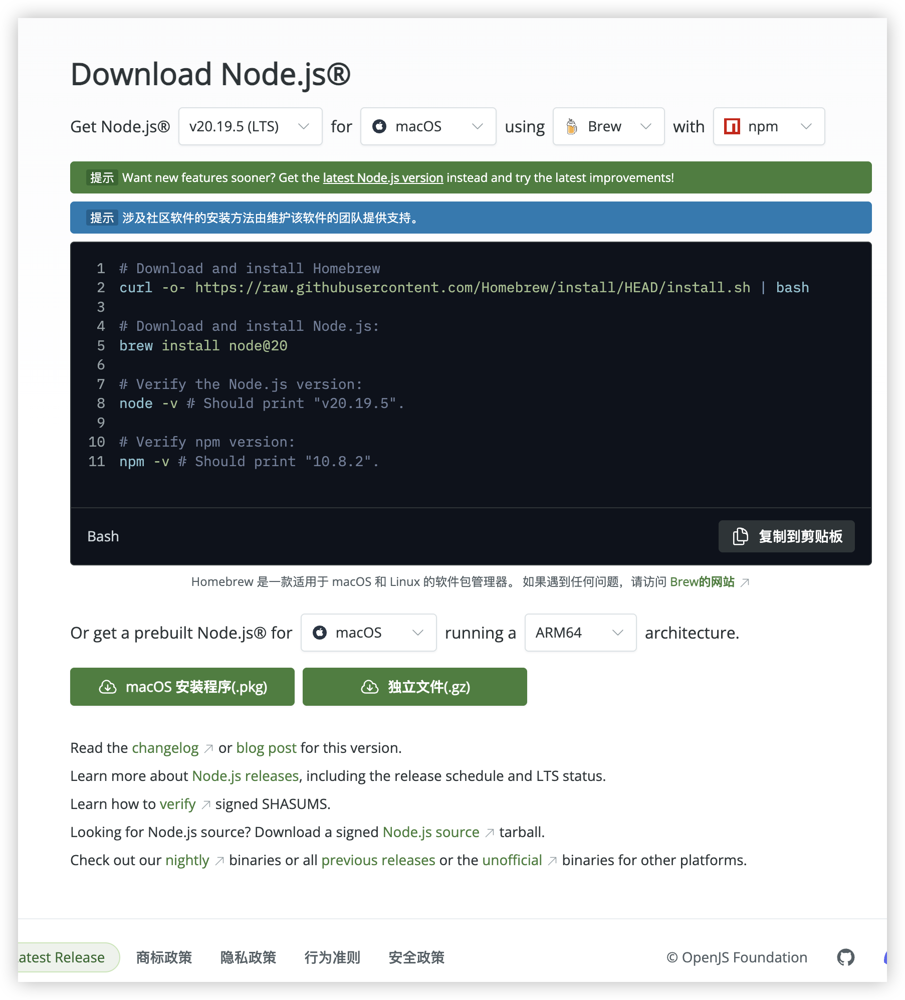
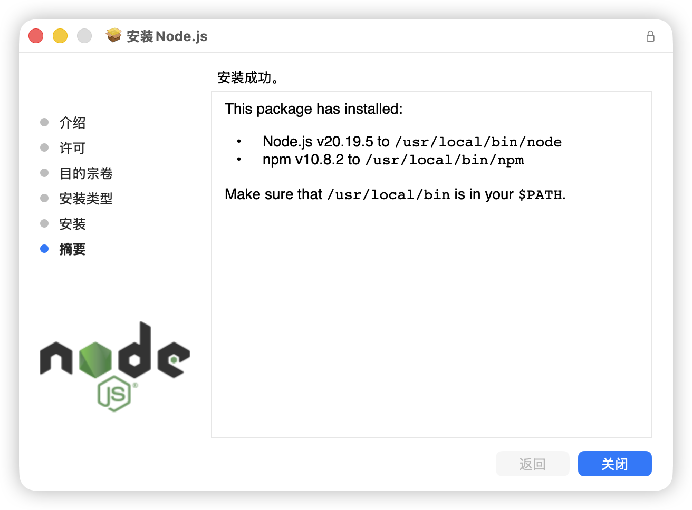

# NodeJS 安装

官网提供了命令行和安装包两种方式安装，官网：[https://nodejs.org/zh-cn/download](https://nodejs.org/zh-cn/download)



安装包安装后，会提示安装的位置。



执行以下命令验证

```plain
node -v
npm -v
```


> 更新: 2025-09-12 10:06:57  
> 原文: <https://www.yuque.com/thinkspace/du51gc/woqm07o2lszoq6m8>