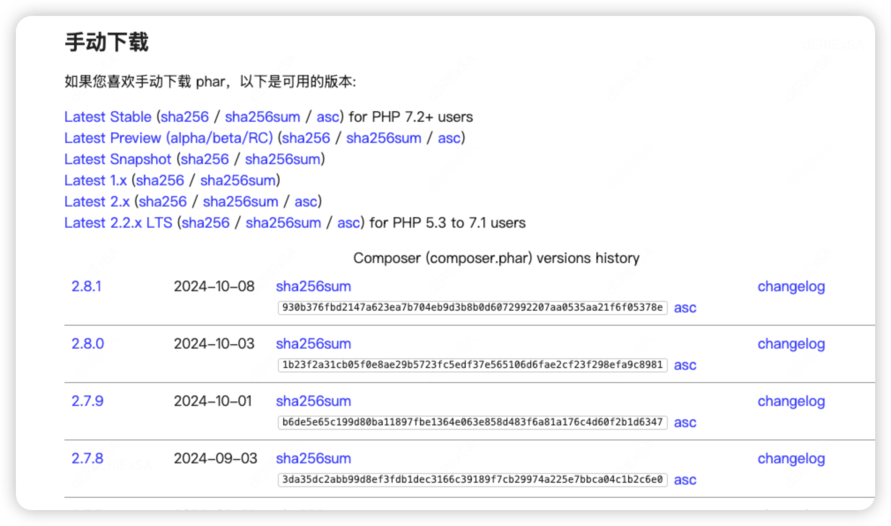

# Composer 使用

## 一、安装

### 1、Mac 系统

* 从<https://composer.p2hp.com/download/>选择手动下载



* 执行`mv composer.phar /usr/local/bin/composer`

### 2、使用镜像

使用阿里云镜像：<https://developer.aliyun.com/composer>

```plain
$ composer config -g repo.packagist composer https://mirrors.aliyun.com/composer/
```

<font style="color:rgb(36, 41, 47);background-color:rgb(244, 246, 248);">要查看 Composer 使用的镜像源，可以使用以下命令：</font>

```plain
composer config --global repositories
```

### 3、更新 composer：

```plain
$ composer selfupdate
```

## 二、使用

要使用 Composer，我们需要先在项目的目录下创建一个 composer.json 文件，文件描述了项目的依赖关系。

文件格式如下：

```plain
{
    "require": {
        "monolog/monolog": "1.2.*"
    }
}
```

以上文件说明我们需要下载从 1.2 开始的任何版本的 monolog。

接下来只要运行以下命令即可安装依赖包：

```plain
composer install
```

## 参考

* <https://www.phpcomposer.com/>
* <https://composer.p2hp.com/>


> 更新: 2024-10-09 16:15:44  
> 原文: <https://www.yuque.com/thinkspace/du51gc/le4t12c9tn11mqzg>