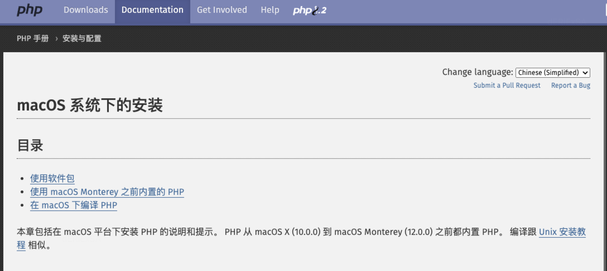
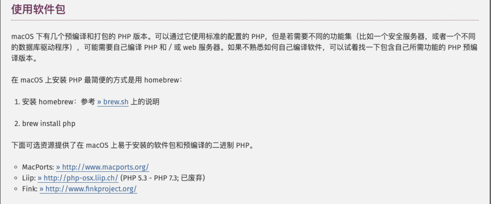

# PHP 开发环境

## 一、PHP 安装
PHP官网提供了三种方法，下面使用第一种方法（使用软件包的方式）。





### 1、使用 Homebrew 安装 PHP
直接使用brew安装过时的PHP版本时，提示“Error: php@7.4 has been disabled because it is a versioned formula!”错误。 因为过时的PHP版本官方已经不再维护，所以Hombrew将该PHP版本移出了repository，所以安装不了。解决办法如下：

+ **搜索 php 相关的包：**直接用 search 命令搜素：

```plain
# 1. 添加tap formulae
brew tap shivammathur/php

# 2. 安装
brew install shivammathur/php/php@7.4
```

**如果 brew install报错"fatal: not in a git directory"可以参考：**[https://zhuanlan.zhihu.com/p/614891398](https://zhuanlan.zhihu.com/p/614891398)

至此，你已经成功在 macOS 上安装了 PHP7.4。

### 2、选择版本
查看是否安装了多个版本的 php

```plain
cd /opt/homebrew/Cellar

ls -l
drwxr-xr-x  3 didi  admin   96 Jun  7 13:38 php@7.4
drwxr-xr-x  3 didi  admin   96 Jun  7 13:38 php@8.1
```

如果当前php版本是php@7.4，想切换到php@8.1

```plain
brew unlink php 
brew link php@8.1
```

### 3、其他（看看即可）
```plain
To enable PHP in Apache add the following to httpd.conf and restart Apache:
    LoadModule php7_module /opt/homebrew/opt/php@7.4/lib/httpd/modules/libphp7.so

    <FilesMatch \.php$>
        SetHandler application/x-httpd-php
    </FilesMatch>

Finally, check DirectoryIndex includes index.php
    DirectoryIndex index.php index.html

The php.ini and php-fpm.ini file can be found in:
    /opt/homebrew/etc/php/7.4/

php@7.4 is keg-only, which means it was not symlinked into /opt/homebrew,
because this is an alternate version of another formula.

If you need to have php@7.4 first in your PATH, run:
  echo 'export PATH="/opt/homebrew/opt/php@7.4/bin:$PATH"' >> ~/.profile
  echo 'export PATH="/opt/homebrew/opt/php@7.4/sbin:$PATH"' >> ~/.profile

For compilers to find php@7.4 you may need to set:
  export LDFLAGS="-L/opt/homebrew/opt/php@7.4/lib"
  export CPPFLAGS="-I/opt/homebrew/opt/php@7.4/include"

To start shivammathur/php/php@7.4 now and restart at login:
  brew services start shivammathur/php/php@7.4
Or, if you don't want/need a background service you can just run:
  /opt/homebrew/opt/php@7.4/sbin/php-fpm --nodaemonize
```

## 参考
+ [Homebrew国内如何自动安装（国内地址）（Mac & Linux）](https://zhuanlan.zhihu.com/p/111014448)
+ [brew安装PHP@7.4时报错](https://www.jianshu.com/p/c8c833b85b3b)
+ [https://github.com/shivammathur/homebrew-php](https://github.com/shivammathur/homebrew-php)


> 更新: 2024-10-09 17:06:55  
> 原文: <https://www.yuque.com/thinkspace/du51gc/sxge1zvi9vb5bvyr>