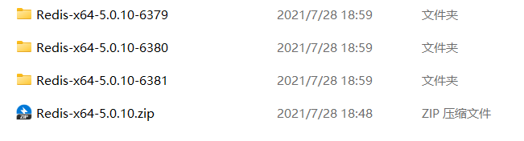
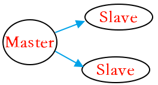

# Redis 主从复制

主从复制可以在一定程度上扩展 `redis`性能，`redis`的主从复制和关系型数据库的主从复制类似，从机能够精确的复制主机上的内容。实现了主从复制之后，一方面能够实现数据的读写分离，降低 `master`的压力，另一方面也能实现数据的备份。

## 一、配置方式

假设我有三个 redis 实例，地址分别如下：

```xml
192.168.248.128:6379  
192.168.248.128:6380  
192.168.248.128:6381
```

即同一台服务器上三个实例，以`windows`平台为例，配置方式如下：

* 复制两份 Redis 文件作为从库。为了方便区分，文件夹命名如下图：



分别在`redis.windows.conf`中将端口修改为`6379 | 6380 | 6381`

```bash
port 6379
```

* 输入如下命令，启动三个 `redis` 实例：

```bash
E:\developer\Redis-x64-5.0.10-6379> redis-server.exe redis.windows.conf
E:\developer\Redis-x64-5.0.10-6380> redis-server.exe redis.windows.conf
E:\developer\Redis-x64-5.0.10-6381> redis-server.exe redis.windows.conf
```

* 输入如下命令，分别进入三个实例的控制台：

```bash
E:\developer\Redis-x64-5.0.10-6379> redis-cli -p 6379
E:\developer\Redis-x64-5.0.10-6380> redis-cli -p 6380
E:\developer\Redis-x64-5.0.10-6381> redis-cli -p 6381
```

此时我就成功配置了三个 redis 实例了。

* 假设在这三个实例中，`6379`是主机，即 `master`，`6380`和 `6381`是从机，即 `slave`，那么如何配置这种实例关系呢，很简单，分别在 `6380`和 `6381`上执行如下命令：

```bash
127.0.0.1:6381> SLAVEOF 127.0.0.1 6379
OK
```

这一步也可以通过在两个从机的`redis.conf`中添加如下配置来解决：

```bash
slaveof 127.0.0.1 6379
```

OK，主从关系搭建好后，我们可以通过如下命令可以查看每个实例当前的状态，如下:

```bash
127.0.0.1:6379> info replication
# Replication
role:master
connected_slaves:2
slave0:ip=127.0.0.1,port=6380,state=online,offset=28,lag=1
slave1:ip=127.0.0.1,port=6381,state=online,offset=28,lag=0
master_replid:489f968667184a4bf616108f97bdacb6d9a379ec
master_replid2:0000000000000000000000000000000000000000
master_repl_offset:28
second_repl_offset:-1
repl_backlog_active:1	
repl_backlog_size:1048576
repl_backlog_first_byte_offset:1
repl_backlog_histlen:28
```

我们可以看到 `6379` 是一个主机，上面挂了两个从机，两个从机的地址、端口等信息都展现出来了。如果我们在 `6380`上执行 `INFO replication` ，显示信息如下:

```bash
127.0.0.1:6380> info replication
# Replication
role:slave
master_host:127.0.0.1
master_port:6379
master_link_status:up
master_last_io_seconds_ago:7
master_sync_in_progress:0
slave_repl_offset:42
slave_priority:100
slave_read_only:1
connected_slaves:0
master_replid:489f968667184a4bf616108f97bdacb6d9a379ec
master_replid2:0000000000000000000000000000000000000000
master_repl_offset:42
second_repl_offset:-1
repl_backlog_active:1
repl_backlog_size:1048576
repl_backlog_first_byte_offset:1
repl_backlog_histlen:42
```

我们可以看到 `6380`是一个从机，从机的信息以及它的主机的信息都展示出来了。

* 此时，我们在主机中存储一条数据，在从机中就可以 `get`到这条数据了。

## 二、主从复制注意点

1. 如果主机已经运行了一段时间了，并且了已经存储了一些数据了，此时从机连上来，那么从机会将主机上所有的数据进行备份，而不是从连接的那个时间点开始备份。
2. 配置了主从复制之后，主机上可读可写，但是从机只能读取不能写入（可以通过修改 `redis.conf` 中 `slave-read-only` 的值让从机也可以执行写操作）。
3. 在整个主从结构运行过程中，如果主机不幸挂掉，重启之后，他依然是主机，主从复制操作也能够继续进行。

## 三、复制原理

每一个 `master`都有一个`replication ID` ，这是一个较大的伪随机字符串，标记了一个给定的数据集。每个 `master` 也持有一个偏移量，`master`将自己产生的复制流发送给 `slave` 时，发送多少个字节的数据，自身的偏移量就会增加多少，目的是当有新的操作修改自己的数据集时，它可以以此更新 `slave`的状态。复制偏移量即使在没有一个 `slave`连接到 `master`时，也会自增，所以基本上每一对给定的 `Replication ID`, `offset`都会标识一个 `master`数据集的确切版本。当 `slave`连接到 `master`时，它们使用 `PSYNC`命令来发送它们记录的旧的 `master replication ID` 和它们至今为止处理的偏移量。通过这种方式，`master` 能够仅发送 `slave`所需的增量部分。但是如果 `master`的缓冲区中没有足够的命令积压缓冲记录，或者如果 `slave` 引用了不再知道的历史记录 （`replication ID`） ，则会转而进行一个全量重同步：在这种情况下，`slave`会得到一个完整的数据集副本，从头开始(参考 redis 官网)。\
简单来说，就是以下几个步骤：

1. `slave`启动成功连接到 `master`后会发送一个 `sync` 命令。
2. `Master`接到命令启动后台的存盘进程，同时收集所有接收到的用于修改数据集命令。
3. 在后台进程执行完毕之后，`master`将传送整个数据文件到 `slave`,以完成一次完全同步。
4. 全量复制：而 `slave`服务在接收到数据库文件数据后，将其存盘并加载到内存中。
5. 增量复制：`Master` 继续将新的所有收集到的修改命令依次传给 slave ,完成同步。
6. 但是只要是重新连接 `master`,一次完全同步（全量复制)将被自动执行。

## 四、一场接力赛

在上面，我们搭建的主从复制模式是下面这样的：

\
实际上，一主二仆的主从复制，我们可以搭建成下面这种结构：\
\
搭建方式很简单，在前文基础上，我们只需要修改 `6381`的 `master`即可，在 `6381`实例上执行如下命令，让 `6381` 从 `6380`实例上复制数据，如下：

```bash
127.0.0.1:6381> SLAVEOF 127.0.0.1 6380
OK
```

此时，我们再看 `6379`的 `slave` ，如下：

```bash
127.0.0.1:6379> info replication
# Replication
role:master
connected_slaves:1
slave0:ip=127.0.0.1,port=6380,state=online,offset=4826,lag=0
master_replid:489f968667184a4bf616108f97bdacb6d9a379ec
master_replid2:0000000000000000000000000000000000000000
master_repl_offset:4826
second_repl_offset:-1
repl_backlog_active:1
repl_backlog_size:1048576
repl_backlog_first_byte_offset:1
repl_backlog_histlen:4826
```

只有一个 `slave`，就 `6380`，我们再看 `6380`的信息，如下：

```bash
127.0.0.1:6380> info replication
# Replication
role:slave
master_host:127.0.0.1
master_port:6379
master_link_status:up
master_last_io_seconds_ago:1
master_sync_in_progress:0
slave_repl_offset:4896
slave_priority:100
slave_read_only:1
connected_slaves:1
slave0:ip=127.0.0.1,port=6381,state=online,offset=4896,lag=0
master_replid:489f968667184a4bf616108f97bdacb6d9a379ec
master_replid2:0000000000000000000000000000000000000000
master_repl_offset:4896
second_repl_offset:-1
repl_backlog_active:1
repl_backlog_size:1048576
repl_backlog_first_byte_offset:1
repl_backlog_histlen:4896
```

`6380`此时的角色是一个从机，它的主机是 `6379`，但是 `6380`自己也有一个从机，那就是 `6381`.此时我们的主从结构如下图：\


> 更新: 2022-06-16 21:46:00  
> 原文: <https://www.yuque.com/thinkspace/lcb0zg/yhv5zx>