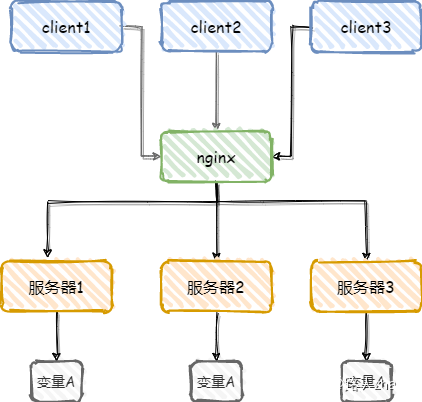
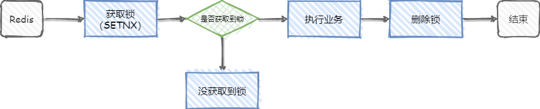

# Redis 分布式锁

## 一、什么是分布式锁

相信大家对程序中的锁并不陌生，无论是在并发编程或者Java虚拟机都有学到过。

锁在程序中的作用主要是同步，就是保证共享资源在同一时刻只能被同一个线程访问。

分布式锁则是为了保证在分布式场景下，共享资源在同一时刻只能被同一个线程访问，或者说是用来控制分布式系统之间同步访问共享资源。举个简单例子，如下图

从上图可以看出，变量A在三个服务器中都有涉及到，如果不对其进行控制的话，三个服务器中的变量A很难做到同步，解决这个问题的方法就是分布式锁。

## 二、分布式锁的特性

* 互斥性：在任意时刻，同一条数据只能被一台机器上的一个线程执行
* 高可用性：当部分节点宕机后，客户端仍可以正常地获取锁和释放锁
* 独占性：加锁和解锁必须同一台服务器执行，不能在一个服务器上加锁，在另一个服务器上释放锁
* 防锁超时：如果客户端没有主动释放锁，服务器会在一定时间后自动释放锁， 防止客户端宕机或者网络异常导致宕机

## 三、分布式锁的实现方法

基本思路就是要在整个系统中提供一个全局、唯一的获取锁的“东西”，然后每个系统在需要加锁时，都去问这个“东西”拿到一把锁，这样不同的系统拿到的就可以认为是同一把锁。

常见的分布式锁实现方案有三种：

### 基于关系型数据库：

优点：直接借助数据库容易理解

缺点：在使用关系型数据库实现分布式锁的过程中会出现各种问题，例如数据库单点问题和可重入问题，并且在解决过程中会使得整个方案越来越复杂

### 基于Redis

**优点**：性能好，实现起来较为方便

缺点：

key的过期时间设置难以确定，如何设置的失效时间太短，方法没等执行完，锁就自动释放了，那么就会产生并发问题。如果设置的时间太长，其他获取锁的线程就可能要平白的多等一段时间。

Redis的集群部署虽然能解决单点问题，但是并不是强一致性的，锁的不够健壮

### 基于zookeeper

优点：有效地解决单点问题，不可重入问题，非阻塞问题以及锁无法释放的问题，实现起来较为简单。

\*\*缺点：\*\*性能上不如使用缓存实现分布式锁

三种方案的对比\

## 四、Redis 如何实现分布式锁

前面讲过了分布式锁的特性，其实实现分布式锁就是围绕着这些展开的

Redis实现分布式锁的主要命令：`SETNX`，该命令的作用是当key不存在时设置key的值，当Key存在时，什么都不做。\
先来看最简单的实现方式，如下图\

从上图可以看到主要两个关键步骤，加锁和解锁。

但是这个简陋的分布式锁存在很多问题，并不能满足上述介绍的分布式锁的特性，

比如，当线程1执行到上图中执行业务这步时，业务代码突然出现异常了，无法进行删除锁这一步，那就完犊子了，死锁了，其他线程也无法获取到锁了（因为SETNX的特性）。

### 改进方案1

那咋整呢？

一提到异常，有人想起了try-catch-finally了，把删除锁的操作放到finally代码块中，就算出现异常，也是能正常释放锁的，执行业务出现异常这个问题确实解决了。但这玩意并不靠谱，如果Redis在执行业务这步宕机了呢，finally代码块也不会执行了

### 改进方案2

其实这个问题很好解决，只需给锁设置一个过期时间就可以了，对key设置过期时间在Redis中是常规操作了。就是这个命令 `SET key value [EX seconds][PX milliseconds] [NX|XX]`

* EX second: 设置键的过期时间为second秒；
* PX millisecond：设置键的过期时间为millisecond毫秒；
* NX：只在键不存在时，才对键进行设置操作；
* XX：只在键已经存在时，才对键进行设置操作；
* SET操作完成时，返回OK，否则返回nil。

那现在这个方案就完美了吗？显然没有

例如，线程1获取到了锁，并设置了有效时间10秒，但线程1在执行业务时超过了10秒，锁到期自动释放了，在锁释放后，线程2又获取了锁，在线程2执行业务时，线程1执行完了，随后执行了删除锁这一步，但是线程1的锁早就到期自动释放了，他删除的是线程2的锁！！！

### 改进方案3

其实看起来方案2的问题很容易解决，只需要把锁的过期时间设置的非常长，就可以避免这两个问题，但是这样并不可行，因为这样相当于回到最简陋的方案（会导致李四一直上不到厕所）。

那如何能让李四上到厕所，还不会让自己锁的门被张三打开门呢？

很简单，为锁加一个标识，例如生成一个UUID，作为锁的标识，每个线程获取锁时都会生成一个不同的UUID作为锁的标识，在进行删除锁时会进行判断，锁的标识和自己生成UUID相等时才进行删除操作，这样就避免线程1释放了线程2的锁。

那怎么解决线程2未等线程1执行完就进厕所呢？（如何确定锁的过期时间）

可以在加锁时，先设置一个预估的过期时间，然后开启一个守护线程，定时去检测这个锁的失效时间，如果锁快要过期了，操作共享资源还未完成，那么就自动对锁进行续期，重新设置过期时间。

那方案3就没有其他问题了吗？其实还是有的，比如目前的分布式锁还不具备可重入性（同一线程可以重复获取锁，解决线程需要多次进入锁内执行任务的问题）

### 改进方案4

参考其他重入锁的实现，可以通过对锁进行重入计数，加锁时加 1，解锁时减 1，当计数归 0 时才能释放锁。

那现在方案就没有问题了吗，其实还有

比如，线程1获取了锁，线程2没有获取到锁，那么线程2怎么知道线程1啥时候释放了锁，进而再去获取锁呢？

### 改进方案5

方案4中问题的解决方案，一般以下两种解决方案：

可以通过客户端轮询的方式，就是线程2过一会就来看看是不是能获取锁了。这种方式比较消耗服务器资源，当并发量比较大时，会影响服务器的效率。

通过Redis的发布订阅功能，当获取锁失败时，订阅锁释放消息，获取锁成功后释放时，发送锁释放消息。

那现在这个方案完美了吗？也还没有

目前讨论的都是redis是单节点的情况，如果这个节点挂了，那么所有的客户端都获取不到锁了

### 改进方案6

为了实现多节点Redis的分布式锁，Redis的作者提出了RedLock算法。

> 转自： [Redis高频面试题](https://www.nowcoder.com/discuss/848513?type=all\&order=recall\&pos=\&page=1\&ncTraceId=\&channel=-1\&source_id=search_all_nctrack\&gio_id=7C94B78E08B4B215B28EDA5D86ABB02E-1646581113575)

> 更新: 2022-06-17 14:31:59  
> 原文: <https://www.yuque.com/thinkspace/lcb0zg/fkht2r>