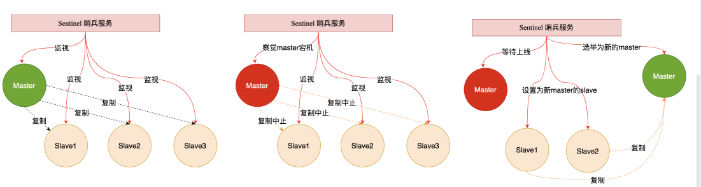
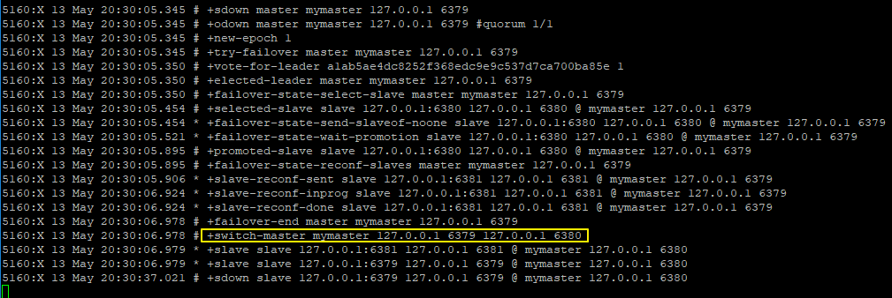

# Redis 哨兵模式

## 一、哨兵Sentinel机制

在上篇文章，我们介绍了两种主从模式了，但是这两种，不管是哪一种，都会存在这样一个问题，那就是当主机宕机时，就会发生群龙无首的情况，如果在主机宕机时，能够从从机中选出一个来充当主机，那么就不用我们每次去手动重启主机了，这就涉及到一个新的话题，那就是哨兵模式。



## 二、实战哨兵架构

所谓的哨兵模式，其实并不复杂，我们还是在我们前面的基础上来搭建哨兵模式。假设现在我的 `master`是 `6379`，两个从机分别是 `6380`和 `6381`，两个从机都是从 `6379`上复制数据。先按照上文的步骤，我们配置好一主二仆，然后在主节点（master）目录下打开 `sentinel.conf` （如果没有就手动创建）文件，做如下配置：

```bash
sentinel monitor mymaster 127.0.0.1 6379 1
```

其中 `mymaster`是给要监控的主机取的名字，随意取，后面是主机地址，最后面的数字表示有多少个 `sentinel`认为主机挂掉了，就进行切换（我这里只有一个，因此设置为1）。好了，配置完成后，输入如下命令启动哨兵：

```bash
redis-sentinel sentinel.conf
```

然后启动我们的一主二仆架构，启动成功后，关闭 master，观察哨兵窗口输出的日志，如下：\
\
可以看到，`6379`挂掉之后，redis 内部重新举行了选举，`6380`重新上位。此时，如果 `6379`重启，也不再主节点了，只能屈身做一个 `slave` 了。


> 更新: 2022-06-16 23:38:44  
> 原文: <https://www.yuque.com/thinkspace/lcb0zg/vb0qpo>