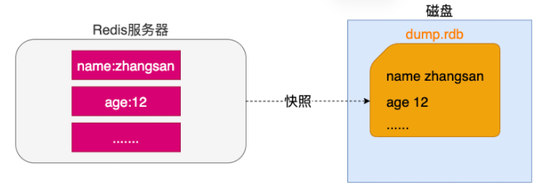
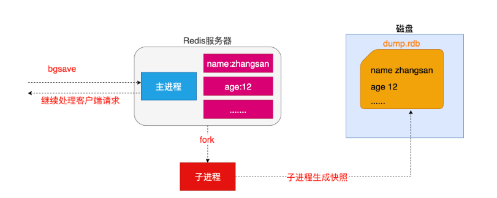
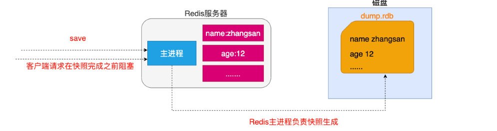
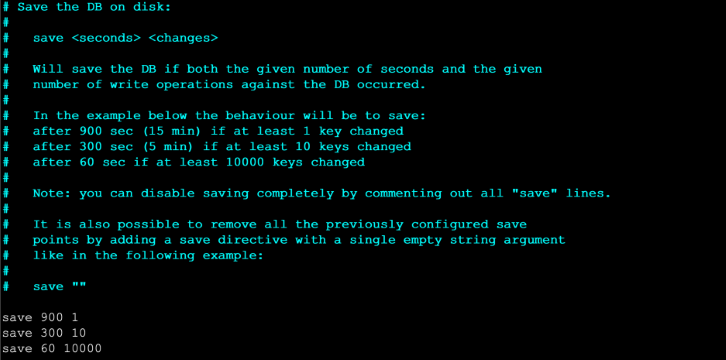
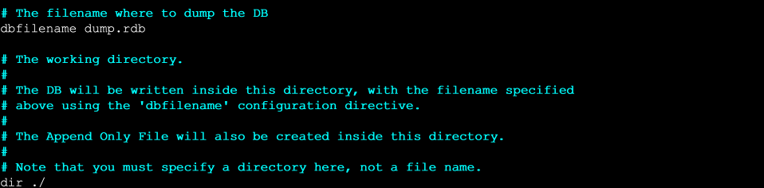
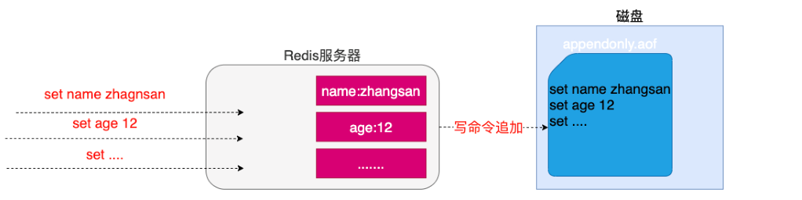
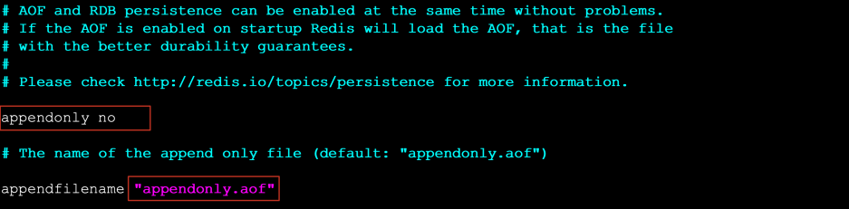
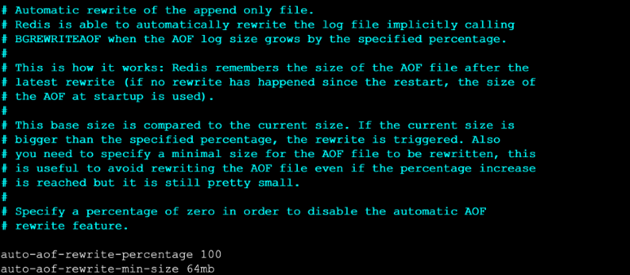
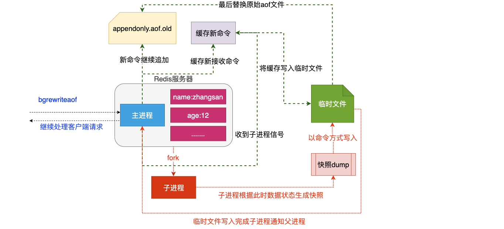

# Redis 持久化

Redis官方提供了两种不同的持久化方法来将数据存储到硬盘里面分别是:

* 快照(`Snapshot`)
* `AOF`(`Append Only File`) 只追加日志文件

## 一、快照(Snapshot)

### 1. 特点

这种方式可以将某一时刻的所有数据都写入硬盘中,当然这也是**redis的默认开启持久化方式**,保存的文件是以`.rdb`形式结尾的文件因此这种方式也称之为`RDB`方式。

### 2.快照生成方式

* 客户端方式: `BGSAVE` 和 `SAVE`指令
* 服务器配置自动触发

#### （1）客户端方式之BGSAVE

* 客户端可以使用`BGSAVE`命令来创建一个快照,当接收到客户端的`BGSAVE`命令时,`redis`会调用`fork`来创建一个子进程,然后子进程负责将快照写入磁盘中,而父进程则继续处理命令请求。

#### （2）客户端方式之SAVE

* 客户端还可以使用`SAVE`命令来创建一个快照,接收到`SAVE`命令的`redis`服务器在快照创建完毕之前将不再响应任何其他的命令。
* **注意: SAVE命令并不常用,使用SAVE命令在快照创建完毕之前,redis处于阻塞状态,无法对外服务**\
  

#### （3）服务器配置自动触发

* 如果用户在`redis.conf`中设置了`save`配置选项,`redis`会在`save`选项条件满足之后自动触发一次`BGSAVE`命令,如果设置多个`save`配置选项,当任意一个`save`配置选项条件满足,`redis`也会触发一次`BGSAVE`命令

#### （4）客户端 shutdown 指令

* 当`redis`通过`shutdown`指令接收到关闭服务器的请求时,会执行一个`save`命令,阻塞所有的客户端,不再执行客户端执行发送的任何命令,并且在`save`命令执行完毕之后关闭服务器

### 3.配置生成快照名称和位置

* 修改生成快照名称\
  ：`dbfilename dump.rdb`
* 修改生成位置\
  ：`dir ./`

## 二、AOF 只追加日志文件

### 1、特点

这种方式可以将所有客户端执行的写命令记录到日志文件中,`AOF`持久化会将被执行的写命令写到`AOF`的文件末尾,以此来记录数据发生的变化,因此只要`redis`从头到尾执行一次`AOF`文件所包含的所有写命令,就可以恢复`AOF`文件的记录的数据集。

### 2、开启AOF持久化

在`redis`的默认配置中`AOF`持久化机制是没有开启的，需要在配置中开启

* 开启`AOF`持久化
  * 修改 `appendonly yes` 开启持久化
  * 修改 `appendfilename "appendonly.aof"`指定生成文件名称

### 3、日志追加频率

#### （1）always【谨慎使用】

* 说明: 每个`redis`写命令都要同步写入硬盘,严重降低`redis`速度
* 解释: 如果用户使用了`always`选项,那么每个`redis`写命令都会被写入硬盘,从而将发生系统崩溃时出现的数据丢失减到最少;遗憾的是,因为这种同步策略需要对硬盘进行大量的写入操作,所以`redis`处理命令的速度会受到硬盘性能的限制;
* 注意: 转盘式硬盘在这种频率下200左右个命令每秒; 固态硬盘几百万个命令每秒;
* 警告: 使用SSD用户请谨慎使用`always`选项,这种模式不断写入少量数据的做法有可能会引发严重的写入放大问题,导致将固态硬盘的寿命从原来的几年降低为几个月。

#### （2）everysec【推荐】

* 说明: 每秒执行一次同步显式的将多个写命令同步到磁盘
* 解释： 为了兼顾数据安全和写入性能,用户可以考虑使用`everysec`选项,让`redis`每秒一次的频率对`AOF`文件进行同步;`redis`每秒同步一次`AOF`文件时性能和不使用任何持久化特性时的性能相差无几,而通过每秒同步一次`AOF`文件,`redis`可以保证,即使系统崩溃,用户最多丢失一秒之内产生的数据。

#### （3）no【不推荐】

* 说明: 由操作系统决定何时同步
* 解释：最后使用`no`选项,将完全有操作系统决定什么时候同步`AOF`日志文件,这个选项不会对`redis`性能带来影响但是系统崩溃时,会丢失不定数量的数据,另外如果用户硬盘处理写入操作不够快的话,当缓冲区被等待写入硬盘数据填满时,`redis`会处于阻塞状态,并导致`redis`的处理命令请求的速度变慢。

### 4、修改同步频率

* 修改日志同步频率\
  ：修改`appendfsync everysec|always|no` 指定

## 三、AOF文件的重写

### 1、AOF带来的问题

AOF的方式也同时带来了另一个问题。持久化文件会变的越来越大。例如我们调用`incr test`命令100次，文件中必须保存全部的100条命令，其实有99条都是多余的。因为要恢复数据库的状态其实文件中保存一条`set test 100`就够了。为了压缩`aof`的持久化文件`Redis`提供了AOF重写(`ReWriter`)机制。

### 2、AOF重写

用来在一定程度上减小AOF文件的体积

### 3、触发重写方式

#### （1）客户端方式触发重写

* 执行`BGREWRITEAOF`命令  不会阻塞redis的服务

#### （2）服务器配置方式自动触发

* 配置`redis.conf`中的`auto-aof-rewrite-percentage`选项
* 如果设置`auto-aof-rewrite-percentage`值为100和`auto-aof-rewrite-min-size 64mb`,并且启用的AOF持久化时,那么当AOF文件体积大于64M,并且AOF文件的体积比上一次重写之后体积大了至少一倍(100%)时,会自动触发,如果重写过于频繁,用户可以考虑将`auto-aof-rewrite-percentage`设置为更大

### 4、重写原理

> 注意：重写`aof`文件的操作，并没有读取旧的`aof`文件，而是将整个内存中的数据库内容用命令的方式重写了一个新的`aof`文件,替换原有的文件这点和快照有点类似。

**重写流程**

* `redis`调用`fork` ，现在有父子两个进程 子进程根据内存中的数据库快照，往临时文件中写入重建数据库状态的命令
* 父进程继续处理`client`请求，除了把写命令写入到原来的`aof`文件中。同时把收到的写命令缓存起来。这样就能保证如果子进程重写失败的话并不会出问题。
* 当子进程把快照内容写入已命令方式写到临时文件中后，子进程发信号通知父进程。然后父进程把缓存的写命令也写入到临时文件。
* 现在父进程可以使用临时文件替换老的`aof`文件，并重命名，后面收到的写命令也开始往新的`aof`文件中追加。

## 四、持久化总结

* 两种持久化方案既可以同时使用,又可以单独使用,在某种情况下也可以都不使用,具体使用那种持久化方案取决于用户的数据和应用决定。
* 无论使用`AOF`还是快照机制持久化,将数据持久化到硬盘都是有必要的,除了持久化外,用户还应该对持久化的文件进行备份(最好备份在多个不同地方)。

> 更新: 2022-06-12 23:28:21  
> 原文: <https://www.yuque.com/thinkspace/lcb0zg/fzmcgv>