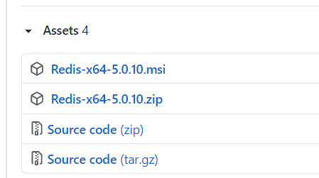
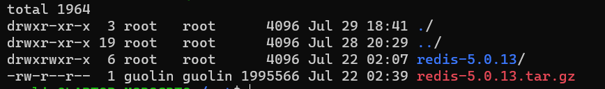
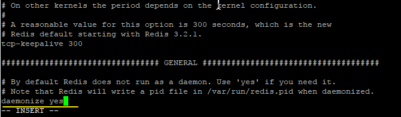
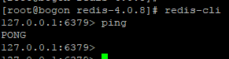

# Redis 的安装

## 一、Windows 下安装

下载地址：<https://github.com/tporadowski/redis/releases>\


下载 `msi`安装包即可。安装后，进行测试：

```powershell
PS C:\Users\ms201> redis-cli
127.0.0.1:6379> set name xiaoming
OK
127.0.0.1:6379> get name
"xiaoming"
```

## 二、Linux 下安装

1. 首先下载 `Redis`，下载地址`https://redis.io/`，下载获得 `redis-5.0.13.tar.gz` 后将它放入我们的 Linux 目录 `/opt`，并对文件进行解压。

```bash
wget https://download.redis.io/releases/redis-5.0.13.tar.gz

tar -zxvf redis-4.0.8.tar.gz
```



2. 解压完成后进入到该解压后目录中，进行编译安装:

```bash
cd redis-4.0.8

apt install gcc

make

make install
```

至此，我们的 redis 就算安装成功了。

3. 在我们启动之前，需要先做一个简单的配置：修改 `redis.conf` 文件，将里面的 `daemonize no` 改成 `yes`，让服务在后台启动，如下：



4. 启动，通过`redis-server redis.conf`命令启动 redis，如下：

```bash
lin@LAPTOP-M9B8CBTQ:/opt/redis-5.0.13$ ./src/redis-server redis.conf
9823:C 29 Jul 2021 19:03:51.142 # oO0OoO0OoO0Oo Redis is starting oO0OoO0OoO0Oo
9823:C 29 Jul 2021 19:03:51.142 # Redis version=5.0.13, bits=64, commit=00000000, modified=0, pid=9823, just started
9823:C 29 Jul 2021 19:03:51.142 # Configuration loaded
```

5. 测试

首先我们可以通过`redis-cli`命令进入到控制台，然后通过 `ping`命令进行连通性测试，如果看到 `pong`，表示连接成功了，如下：\


## 三、Docker 下安装

```json
docker pull redis:latest
docker run -itd --name redis-test -p 6379:6379 redis
docker exec -it redis-test /bin/bash
redis-cli
```

### 参考

* <https://www.cnblogs.com/liuqingzheng/p/9831331.html>
* [Docker 安装 Redis](https://www.runoob.com/docker/docker-install-redis.html)


> 更新: 2022-06-03 18:17:49  
> 原文: <https://www.yuque.com/thinkspace/lcb0zg/szq434>