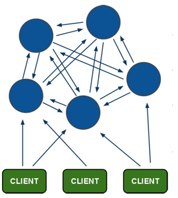
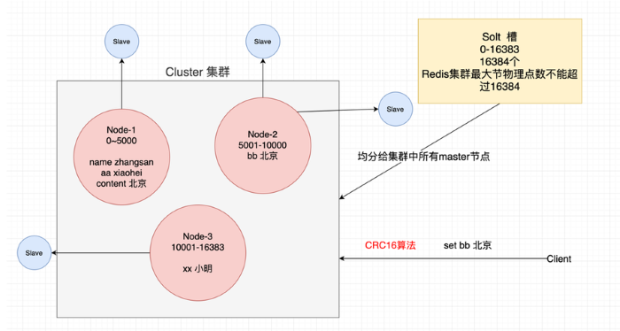
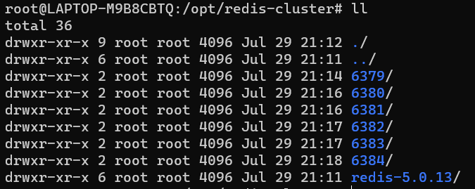
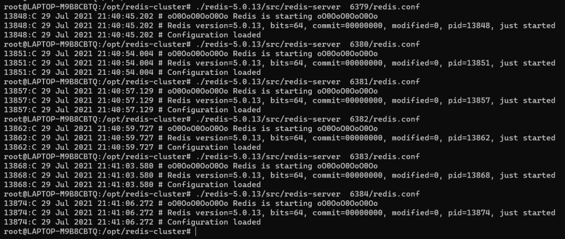
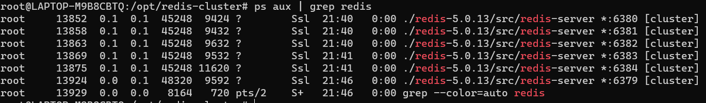

# Redis 集群

## 一、集群原理

`Redis`在`3.0`后开始支持Cluster(模式)模式,目前`redis`的集群支持节点的自动发现,支持`slave-master`选举和容错,支持在线分片`(sharding shard` )等特性。`Redis`集群架构如下图：



### 1、运行原理

Redis 集群运行原理如下：

1. 所有的 Redis 节点彼此互联( `PING-PONG` 机制),内部使用二进制协议优化传输速度和带宽
2. 节点的 `fail`是通过集群中超过半数的节点检测失效时才生效。检测过程是集群中所有 master 参与,如果半数以上 master 节点与 master 节点通信超过 `cluster-node-timeout` 设置的时间,认为当前 master 节点挂掉。
3. 客户端与 Redis 节点直连,不需要中间 `proxy` 层，客户端不需要连接集群所有节点，连接集群中任何一个可用节点即可
4. `Redis-cluster` 把所有的**物理节点**映射到 `[0-16383]` **slot** 上, `cluster`(簇)负责维护 `node<->slot<->value` 。



5. Redis 集群中内置了 `16384`个哈希槽，当需要在 Redis 集群中放置一个`key-value`时，Redis 先对 `key`使用 `crc16`算法算出一个结果，然后把结果对 `16384`求余数，这样每个 `key`都会对应一个编号在 `0-16383` 之间的哈希槽，Redis 会根据节点数量大致均等的将哈希槽映射到不同的节点。

### 2、一些细节

**（1）怎么样判定节点不可用**

* 如果集群任意 `master`挂掉,且当前 `master` 没有 `slave`， 集群进入 `fail`状态,也可以理解成集群的 `slot` 映射`[0-16383]` 不完整时进入 `fail`状态。
* 如果集群超过半数以上 `master` 挂掉，无论是否有 `slave`,集群进入 fail 状态，当集群不可用时,所有对集群的操作做都不可用，收到 `((error) CLUSTERDOWN The cluster is down)`错误。

## 二、集群搭建

判断一个是集群中的节点是否可用,是集群中的所用主节点选举过程,如果半数以上的节点认为当前节点挂掉,那么当前节点就是挂掉了,所以搭建redis集群时建议节点数最好为奇数，**搭建集群至少需要三个主节点,三个从节点,至少需要6个节点**。

### 1、Ruby 环境

Redis 集群管理工具 `redis-trib.rb` 依赖 `ruby` 环境，首先需要安装 `ruby`环境：

```bash
apt install ruby
apt install rubygems
```

> **注意**：  `Redis Cluster` 在`5.0`之后取消了ruby脚本`**redis-trib.rb**`的支持，集合到redis-cli里，不用再安装`ruby`的相关环境。直接使用`redis-clit`的参数`--cluster` 来取代。

### 2、准备节点

* 首先创建 `redis-cluster` 文件夹，在该文件夹下分别创建 6379、6380、6381、6382、6383、6384 文件夹，用来存放我的 Redis 配置文件，如下：



* 将 Redis 也在`redis-cluster` 目录下安装一份，然后将`redis.conf` 文件向 `6379-6384` 这 6 个文件夹中分别拷贝一份。

```shell
sudo cp redis-5.0.13/redis.conf 6379/
sudo cp redis-5.0.13/redis.conf 6379/
sudo cp redis-5.0.13/redis.conf 6379/
sudo cp redis-5.0.13/redis.conf 6379/
sudo cp redis-5.0.13/redis.conf 6379/
sudo cp redis-5.0.13/redis.conf 6379/
```

* 拷贝完成后，分别修改如下参数：

```shell
port 6379 ...                 # 修改端口
# bind 127.0.0.1              # 注释掉，允许远程连接
cluster-enabled yes						# 开启集群模式
cluster-config-file  nodes-xxxx.conf       # 集群节点配置文件
daemonize yes						允许后台运行/
```

* 修改完成后，进入到 redis 安装目录中，分别启动各个 redis ，使用刚刚修改过的配置文件，如下：

\
启动成功后，我们可以查看 redis 进程，如下：\
\
这个表示各个节点都启动成功了。

### 3、搭建集群

接下来我们就可以进行集群的创建了，首先将 `redis/src` 目录下的 `redis-trib.rb` 文件拷贝到 `redis-cluster` 目录下，然后在 `redis-cluster` 目录下执行如下命令：

```shell
./redis-trib.rb create --replicas 1 127.0.0.1:6379 127.0.0.1:6380 127.0.0.1:6381 127.0.0.1:6382 127.0.0.1:6383 127.0.0.1:6384
```

> 如果使用的是Redis 的版本 `>=5.0` ，使用以下命令：

```shell
redis-cli --cluster create 127.0.0.1:6379 127.0.0.1:6380 127.0.0.1:6381 127.0.0.1:6382 127.0.0.1:6383 127.0.0.1:6384 --cluster-replicas 1
```

注意，replicas 后面的 `1`表示每个主机都带有`1` 个从机，执行过程如下：

```shell
>>> Performing hash slots allocation on 6 nodes...
Master[0] -> Slots 0 - 5460
Master[1] -> Slots 5461 - 10922
Master[2] -> Slots 10923 - 16383
Adding replica 127.0.0.1:6383 to 127.0.0.1:6379
Adding replica 127.0.0.1:6384 to 127.0.0.1:6380
Adding replica 127.0.0.1:6382 to 127.0.0.1:6381
>>> Trying to optimize slaves allocation for anti-affinity
[WARNING] Some slaves are in the same host as their master
M: 2c7d8c0f9ccaf575166e1b6c0547fe27801e80f3 127.0.0.1:6379
   slots:[0-5460] (5461 slots) master
M: 3d97e6591b590af617bf8224e50707fa9c1f10ca 127.0.0.1:6380
   slots:[5461-10922] (5462 slots) master
M: 162308b8db6b85b8ed3032242271fd868b6b72ce 127.0.0.1:6381
   slots:[10923-16383] (5461 slots) master
S: 6e5a3384128803abf0cd7ef4b2e05069b4c92cd3 127.0.0.1:6382
   replicates 2c7d8c0f9ccaf575166e1b6c0547fe27801e80f3
S: c54e8b19c733612dad2dd96cf898d45bc1da8ca1 127.0.0.1:6383
   replicates 3d97e6591b590af617bf8224e50707fa9c1f10ca
S: a15c9188d92024dbfb70139386cba486ffd9031b 127.0.0.1:6384
   replicates 162308b8db6b85b8ed3032242271fd868b6b72ce

>>> Performing Cluster Check (using node 127.0.0.1:6379)
M: 2c7d8c0f9ccaf575166e1b6c0547fe27801e80f3 127.0.0.1:6379
   slots:[0-5460] (5461 slots) master
   1 additional replica(s)
S: c54e8b19c733612dad2dd96cf898d45bc1da8ca1 127.0.0.1:6383
   slots: (0 slots) slave
   replicates 3d97e6591b590af617bf8224e50707fa9c1f10ca
M: 3d97e6591b590af617bf8224e50707fa9c1f10ca 127.0.0.1:6380
   slots:[5461-10922] (5462 slots) master
   1 additional replica(s)
S: a15c9188d92024dbfb70139386cba486ffd9031b 127.0.0.1:6384
   slots: (0 slots) slave
   replicates 162308b8db6b85b8ed3032242271fd868b6b72ce
...

[OK] All nodes agree about slots configuration.
>>> Check for open slots...
>>> Check slots coverage...
[OK] All 16384 slots covered.
root@LAPTOP-M9B8CBTQ:/opt/redis-cluster#
```

注意创建过程的日志，每个 `redis`都获得了一个编号，同时日志也说明了哪些实例做主机，哪些实例做从机，每个从机的主机是谁，每个主机所分配到的 `hash` 槽范围等等。

## 三、集群操作

### 1、查询集群信息

集群创建成功后，我们可以登录到 `Redis`控制台查看集群信息，注意登录时要添加`-c`参数，表示以集群方式连接，如下：

```shell
root@LAPTOP-M9B8CBTQ:/opt/# redis-cli -p 6379 -c
127.0.0.1:6379> CLUSTER INFO
cluster_state:ok
cluster_slots_assigned:16384
cluster_slots_ok:16384
cluster_slots_pfail:0
cluster_slots_fail:0
cluster_known_nodes:6
cluster_size:3
cluster_current_epoch:6
cluster_my_epoch:1
cluster_stats_messages_ping_sent:442
cluster_stats_messages_pong_sent:471
cluster_stats_messages_sent:913
cluster_stats_messages_ping_received:466
cluster_stats_messages_pong_received:442
cluster_stats_messages_meet_received:5
cluster_stats_messages_received:913


127.0.0.1:6379> CLUSTER NODES
2c7d8c0f9ccaf575166e1b6c0547fe27801e80f3 127.0.0.1:6379@16379 myself,master - 0 1627613929000 1 connected 0-5460
c54e8b19c733612dad2dd96cf898d45bc1da8ca1 127.0.0.1:6383@16383 slave 3d97e6591b590af617bf8224e50707fa9c1f10ca 0 1627613930687 5 connected
3d97e6591b590af617bf8224e50707fa9c1f10ca 127.0.0.1:6380@16380 master - 0 1627613929681 2 connected 5461-10922
a15c9188d92024dbfb70139386cba486ffd9031b 127.0.0.1:6384@16384 slave 162308b8db6b85b8ed3032242271fd868b6b72ce 0 1627613927671 6 connected
6e5a3384128803abf0cd7ef4b2e05069b4c92cd3 127.0.0.1:6382@16382 slave 2c7d8c0f9ccaf575166e1b6c0547fe27801e80f3 0 1627613929000 4 connected
162308b8db6b85b8ed3032242271fd868b6b72ce 127.0.0.1:6381@16381 master - 0 1627613928677 3 connected 10923-16383
```

### 2、添加主节点

首先我们准备一个端口为 6379 的主节点并启动，准备方式和前面步骤一样，启动成功后，通过如下命令添加主节点：

```shell
root@LAPTOP:/opt/redis-cluster# cp -r 6379/ 6385

cd 6385/

vim redis.conf  # 修改 port 6385 & cluster-config-file  nodes-6385.conf

root@LAPTOP:/opt/redis-cluster# ./redis-5.0.13/src/redis-server 6385/redis.conf

./redis-trib.rb add-node  127.0.0.1:6385 127.0.0.1:6379 # add-node [新加入节点] [原始集群中任意节点]

redis-cli --cluster add-node 127.0.0.1:6385 127.0.0.1:6379 # 如果 redis 版本 >=5.0 使用该命令
```

> 注意：添加的节点必须以集群模式启动。默认情况下，新添加的节点以master节点形式添加。

主节点添加之后，我们可以通过 cluster nodes 命令查看主节点是否添加成功，此时我们发现新添加的节点没有分配到 `slot`，如下：

```shell
127.0.0.1:6379> CLUSTER NODES
2c7d8c0f9ccaf575166e1b6c0547fe27801e80f3 127.0.0.1:6379@16379 myself,master - 0 1627615108000 1 connected 0-5460
ac0fec5728bfbfde57f6611e7aec359cd7eb3235 127.0.0.1:6385@16385 master - 0 1627615110000 0 connected
c54e8b19c733612dad2dd96cf898d45bc1da8ca1 127.0.0.1:6383@16383 slave 3d97e6591b590af617bf8224e50707fa9c1f10ca 0 1627615110000 5 connected
3d97e6591b590af617bf8224e50707fa9c1f10ca 127.0.0.1:6380@16380 master - 0 1627615110085 2 connected 5461-10922
a15c9188d92024dbfb70139386cba486ffd9031b 127.0.0.1:6384@16384 slave 162308b8db6b85b8ed3032242271fd868b6b72ce 0 1627615109080 6 connected
6e5a3384128803abf0cd7ef4b2e05069b4c92cd3 127.0.0.1:6382@16382 slave 2c7d8c0f9ccaf575166e1b6c0547fe27801e80f3 0 1627615111090 4 connected
162308b8db6b85b8ed3032242271fd868b6b72ce 127.0.0.1:6381@16381 master - 0 1627615109000 3 connected 10923-16383
```

没有分配到 slot 将不能存储数据，此时我们需要手动分配 slot，分配命令如下：

```shell
./redis-trib.rb reshard 127.0.0.1:6379  # reshark [原始集群中任意节点]

redis-cli --cluster reshard 127.0.0.1:6379  # 如果 redis 版本 >=5.0 使用该命令
```

在分配的过程中，我们一共要输入如下几个参数：

1. 一共要划分多少个 hash 槽出来？就是我们总共要给新添加的节点分多少 hash 槽，这个参数依实际情况而定，如下：

```shell
How many slots do you want to move (from 1 to 16384)? 2384
```

2. 这些划分出来的槽要给谁，这里输入 6385 节点的编号，如下：

```shell
What is the receiving node ID? ac0fec5728bfbfde57f6611e7aec359cd7eb3235
```

3. 要让谁出血？因为 `hash`槽目前已经全部分配完毕，要重新从已经分好的节点中拿出来一部分给 `6385`，必然要让另外三个节点把吃进去的吐出来，这里我们可以输入多个节点的编号，每次输完一个点击回车，输完所有的输入 `done`表示输入完成，这样就让这几个节点让出部分 `slot`，如果要让所有具有 `slot`的节点都参与到此次 `slot` 重新分配的活动中，那么这里直接输入 `all`即可，如下：

```shell
Please enter all the source node IDs.
  Type 'all' to use all the nodes as source nodes for the hash slots.
  Type 'done' once you entered all the source nodes IDs.
Source node #1: all
```

主要就是这几个参数，输完之后进入到 slot 重新分配环节，分配完成后，通过`cluster nodes` 命令，我们可以发现 `6385`已经具有 `slot`了，如下：

```shell
127.0.0.1:6379> CLUSTER NODES
2c7d8c0f9ccaf575166e1b6c0547fe27801e80f3 127.0.0.1:6379@16379 myself,master - 0 1627615794000 1 connected 794-5460
ac0fec5728bfbfde57f6611e7aec359cd7eb3235 127.0.0.1:6385@16385 master - 0 1627615793563 7 connected 0-793 5461-6255 10923-11716
c54e8b19c733612dad2dd96cf898d45bc1da8ca1 127.0.0.1:6383@16383 slave 3d97e6591b590af617bf8224e50707fa9c1f10ca 0 1627615795571 5 connected
3d97e6591b590af617bf8224e50707fa9c1f10ca 127.0.0.1:6380@16380 master - 0 1627615794000 2 connected 6256-10922
a15c9188d92024dbfb70139386cba486ffd9031b 127.0.0.1:6384@16384 slave 162308b8db6b85b8ed3032242271fd868b6b72ce 0 1627615792000 6 connected
6e5a3384128803abf0cd7ef4b2e05069b4c92cd3 127.0.0.1:6382@16382 slave 2c7d8c0f9ccaf575166e1b6c0547fe27801e80f3 0 1627615794568 4 connected
162308b8db6b85b8ed3032242271fd868b6b72ce 127.0.0.1:6381@16381 master - 0 1627615794000 3 connected 11717-16383
```

### 3、添加从节点

```shell
./redis-trib.rb  add-node --slave 127.0.0.1:6386 127.0.0.1:6385  #  add-node --slave [新加入节点] [集群中任意节点]
```

注意:当添加副本节点时没有指定主节点,`redis`会随机给副本节点较少的主节点添加当前副本节点。我们也可以为确定的`master`节点添加主节点

```shell
./redis-trib.rb  add-node --slave --master-id ac0fec5728bfbfde57f6611e7aec359cd7eb3235 127.0.0.1:6386  127.0.0.1:6379   # add-node --slave --master-id master节点id [新加入节点] [集群任意节点]
```

### 4、删除副本节点

```shell
# 1.删除节点 del-node [集群中任意节点] [删除节点id]

- ./redis-trib.rb  del-node 127.0.0.1:6379 0ca3f102ecf0c888fc7a7ce43a13e9be9f6d3dd1
```

> 注意:\
> 被删除的节点必须是从节点或没有被分配`hash slots`的节点，对于已经占有 hash 槽的结点，可以使用上面的方法将 hash 槽分配出去后再删除。


> 更新: 2022-06-16 23:42:31  
> 原文: <https://www.yuque.com/thinkspace/lcb0zg/vc6pri>