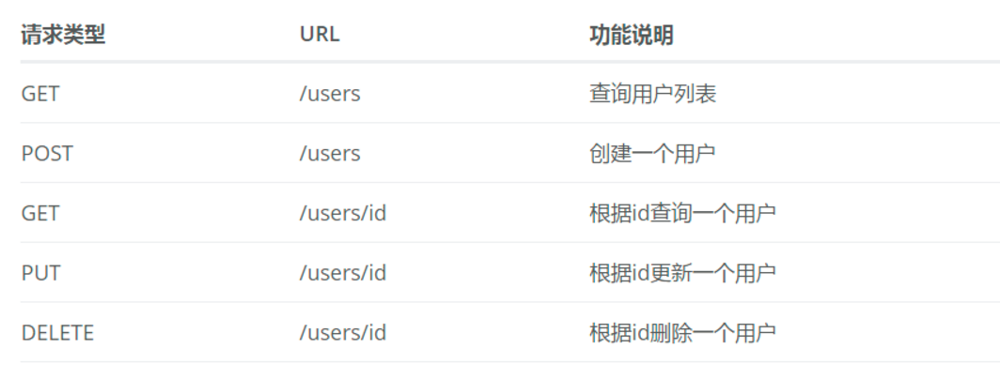

# Spring Boot RESTful API

<font style="color:#565A5F;">首先，回顾并详细说明一下在</font>快速入门<font style="color:#565A5F;">中使用的</font>`@Controller`<font style="color:#565A5F;">、</font>`@RestController`<font style="color:#565A5F;">、</font>`@RequestMapping`<font style="color:#565A5F;">注解。</font>

<font style="color:#565A5F;"></font>

* `@Controller`：修饰class，用来创建处理http请求的对象
* `@RestController`：Spring4之后加入的注解，原来在`@Controller`中返回json需要`@ResponseBody`来配合，如果直接用`@RestController`替代`@Controller`就不需要再配置`@ResponseBody`，默认返回json格式
* `@RequestMapping`：配置url映射。现在更多的也会直接用以Http Method直接关联的映射注解来定义，比如：`GetMapping`、`PostMapping`、`DeleteMapping`、`PutMapping`等

<font style="color:#565A5F;">下面我们通过使用Spring MVC来实现一组对User对象操作的RESTful API，配合注释详细说明在Spring MVC中如何映射HTTP请求、如何传参、如何编写单元测试。</font>

***

**RESTful API具体设计如下：**



## 一、定义User实体

```java
@Data
public class User {

    private Long id;
    private String name;
    private Integer age;

}
```

<font style="color:#565A5F;">这里使用</font>`@Data`<font style="color:#565A5F;">注解可以实现在编译器自动添加set和get函数的效果。该注解是lombok提供的，只需要在pom中引入加入下面的依赖就可以支持：</font>

```xml
<dependency>
    <groupId>org.projectlombok</groupId>
    <artifactId>lombok</artifactId>
</dependency>
```

## 二、实现对User对象的操作接口

```java
@RestController
@RequestMapping(value = "/users")     // 通过这里配置使下面的映射都在/users下
public class UserController {

    // 创建线程安全的Map，模拟users信息的存储
    static Map<Long, User> users = Collections.synchronizedMap(new HashMap<Long, User>());

    /**
     * 处理"/users/"的GET请求，用来获取用户列表
     *
     * @return
     */
    @GetMapping("/")
    public List<User> getUserList() {
        // 还可以通过@RequestParam从页面中传递参数来进行查询条件或者翻页信息的传递
        List<User> r = new ArrayList<User>(users.values());
        return r;
    }

    /**
     * 处理"/users/"的POST请求，用来创建User
     *
     * @param user
     * @return
     */
    @PostMapping("/")
    public String postUser(@RequestBody User user) {
        // @RequestBody注解用来绑定通过http请求中application/json类型上传的数据
        users.put(user.getId(), user);
        return "success";
    }

    /**
     * 处理"/users/{id}"的GET请求，用来获取url中id值的User信息
     *
     * @param id
     * @return
     */
    @GetMapping("/{id}")
    public User getUser(@PathVariable Long id) {
        // url中的id可通过@PathVariable绑定到函数的参数中
        return users.get(id);
    }

    /**
     * 处理"/users/{id}"的PUT请求，用来更新User信息
     *
     * @param id
     * @param user
     * @return
     */
    @PutMapping("/{id}")
    public String putUser(@PathVariable Long id, @RequestBody User user) {
        User u = users.get(id);
        u.setName(user.getName());
        u.setAge(user.getAge());
        users.put(id, u);
        return "success";
    }

    /**
     * 处理"/users/{id}"的DELETE请求，用来删除User
     *
     * @param id
     * @return
     */
    @DeleteMapping("/{id}")
    public String deleteUser(@PathVariable Long id) {
        users.remove(id);
        return "success";
    }

}
```

> <font style="color:#565A5F;background-color:#FCFCFC;">这里相较 </font><code><font style="color:#565A5F;background-color:#FCFCFC;">Springboot 1.x</font></code> <font style="color:#565A5F;background-color:#FCFCFC;">，用更细化的</font>`@GetMapping`<font style="color:#565A5F;background-color:#FCFCFC;">、</font>`@PostMapping`<font style="color:#565A5F;background-color:#FCFCFC;">等系列注解替换了以前的</font>`@RequestMaping`<font style="color:#565A5F;background-color:#FCFCFC;">注解；另外，还使用</font>`@RequestBody`<font style="color:#565A5F;background-color:#FCFCFC;">替换了</font>`@ModelAttribute`<font style="color:#565A5F;background-color:#FCFCFC;">的参数绑定。</font>

## 三、测试

使用 API 测试工具，进行请求提交验证。

## 参考

* <https://blog.didispace.com/spring-boot-learning-21-2-1/>

## 源代码

<https://github.com/lin546/springboot-demos/tree/main/demo2>


> 更新: 2022-04-09 16:52:55  
> 原文: <https://www.yuque.com/thinkspace/gs6fp8/hnaghb>