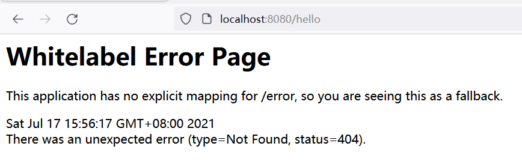
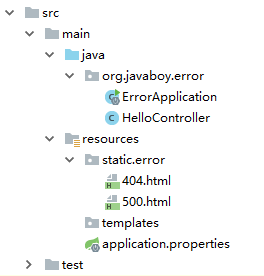

# Spring Boot 异常处理

在 Spring Boot 项目中 ，异常统一处理，可以使用 Spring 中 <code>@ControllerAdvice </code>来统一处理，也可以自己来定义异常处理方案。Spring Boot 中，对异常的处理有一些默认的策略，我们分别来看。

默认情况下，Spring Boot 中的异常页面 是这样的：

我们从这个异常提示中，也能看出来，之所以用户看到这个页面，是因为开发者没有明确提供一个 `/error` 路径，如果开发者提供了 `/error` 路径 ，这个页面就不会展示出来，不过在 Spring Boot 中，提供 `/error` 路径实际上是下下策，Spring Boot 本身在处理异常时，也是当所有条件都不满足时，才会去找 `/error` 路径。那么我们就先来看看，在 Spring Boot 中，如何自定义 `error` 页面，整体上来说，可以分为两种，一种是静态页面，另一种是动态页面。

## 一、静态异常页面

自定义静态异常页面，又分为两种，第一种 是使用 HTTP 响应码来命名页面，例如 `404.html`、`405.html`、`500.html` ….，另一种就是直接定义一个 `4xx.html`，表示`400-499` 的状态都显示这个异常页面，`5xx.html` 表示 `500-599` 的状态显示这个异常页面。

默认是在 `classpath:/static/error/` 路径下定义相关页面：

此时，启动项目，如果项目抛出 `500 `请求错误，就会自动展示`500.html`这个页面，发生 `404 `就会展示 `404.html` 页面。如果异常展示页面既存在 `5xx.html`，也存在 `500.html` ，此时，发生`500`异常时，优先展示 `500.html` 页面。

## 二、动态异常页面

动态的异常页面定义方式和静态的基本一致，可以采用的页面模板有 `jsp`、`freemarker`、`thymeleaf`。动态异常页面，也支持 `404.html` 或者 `4xx.html` ，但是一般来说，由于动态异常页面可以直接展示异常详细信息，所以就没有必要挨个枚举错误了 ，直接定义 `4xx.html`（这里使用`thymeleaf`模板）或者 `5xx.html` 即可。

> 更新: 2022-04-09 16:53:08  
> 原文: <https://www.yuque.com/thinkspace/gs6fp8/kfynon>