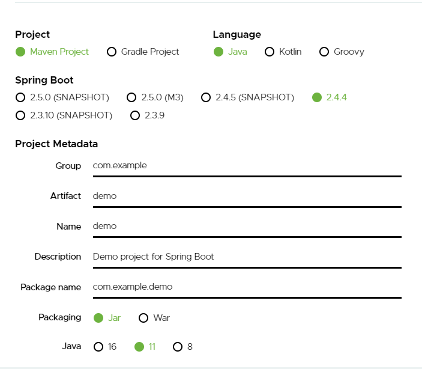
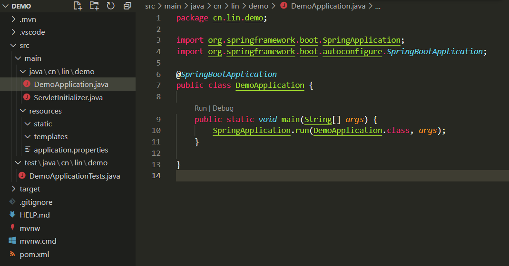
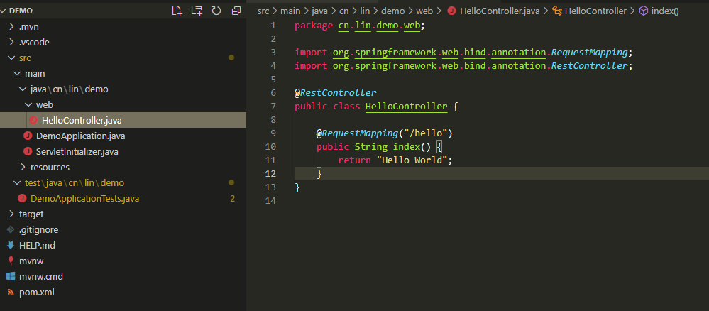

# Spring Boot 快速入门

## 一、创建基础项目

<font style="color:#565A5F;">Spring官方提供了非常方便的工具</font>[Spring Initializr](https://start.spring.io/)<font style="color:#565A5F;">来帮助我们创建Spring Boot应用。</font>



## 二、项目结构解析



<font style="color:#565A5F;">通过上面步骤完成了基础项目的创建。如上图所示，Spring Boot的基础结构共三个文件：</font>

<font style="color:#565A5F;"></font>

* `src/main/java`下的程序入口：`DemoApplication`
* `src/main/resources`下的配置文件：`application.properties`
* `src/test/`下的测试入口： `DemoApplicationTests` 

<font style="color:#565A5F;">生成的</font><code><font style="color:#565A5F;">DemoApplication</font></code> <font style="color:#565A5F;">和</font>`DemoApplicationTests`<font style="color:#565A5F;">类都可以直接运行来启动当前创建的项目，由于目前该项目未配合任何数据访问或Web模块，程序会在加载完Spring之后结束运行。</font>

## 三、编写一个HTTP接口



* 创建`HelloController`类，内容如下：

```java
@RestController
public class HelloController {
    
    @RequestMapping("/hello")
    public String index() {
        return "Hello World";
    }
}
```

* 启动主程序,发起请求：`http://localhost:8080/hello`，可以看到页面返回：Hello World

## 四、测试类

**Spring Initializr** 为我们提供了一个测试类作为起步。

```java
@RunWith(SpringRunner.class)
@SpringBootTest
class DemoApplicationTests {

	@Test
	void contextLoads() {
	}

}
```

这个类中只有一个空的测试方法。即便如此，这个测试类还是会执行必要的检测，确保 Spring 应用上下文能够成功加载。

## 五、修改Maven仓库

在`<build>`标签后加上：

```shell
<repositories>
        <repository>
            <id>aliyun-repos</id>
            <url>http://maven.aliyun.com/nexus/content/groups/public/</url>
            <releases>
                <enabled>true</enabled>
            </releases>
            <snapshots>
                <enabled>false</enabled>
            </snapshots>
        </repository>
</repositories>
 
    <pluginRepositories>
        <pluginRepository>
            <id>aliyun-plugin</id>
            <url>http://maven.aliyun.com/nexus/content/groups/public/</url>
            <releases>
                <enabled>true</enabled>
            </releases>
            <snapshots>
                <enabled>false</enabled>
            </snapshots>
        </pluginRepository>
    </pluginRepositories>
```


> 更新: 2024-08-27 19:53:20  
> 原文: <https://www.yuque.com/thinkspace/gs6fp8/tn23cc>