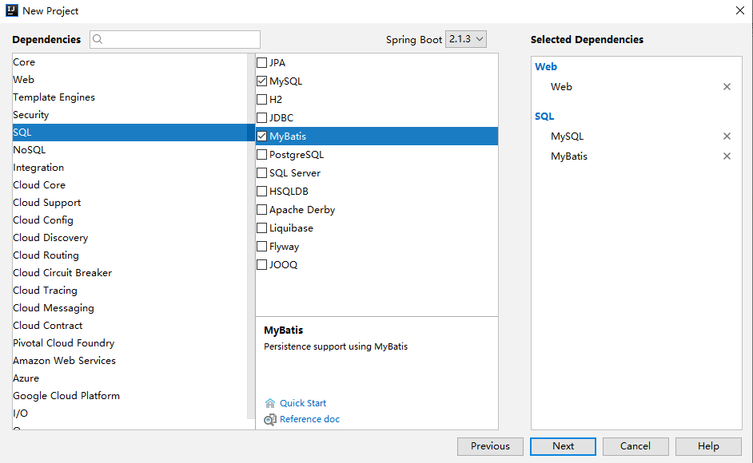
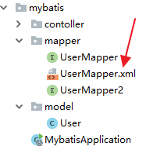
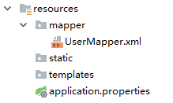

# Spring Boot 数据库访问

## 一、SpringBoot  JdbcTemplate

### 1、数据源配置

在我们访问数据库的时候，需要先配置一个数据源，下面分别介绍一下几种不同的数据库配置方式。

首先，为了连接数据库需要引入jdbc支持，在`pom.xml`中引入如下配置：

```xml
<dependency>
    <groupId>org.springframework.boot</groupId>
    <artifactId>spring-boot-starter-jdbc</artifactId>
</dependency>
```

#### （1）嵌入式数据库支持

嵌入式数据库通常用于开发和测试环境，不推荐用于生产环境。Spring Boot提供自动配置的嵌入式数据库有H2、HSQL、Derby，你不需要提供任何连接配置就能使用。

比如，我们可以在`pom.xml`中引入如下配置使用HSQL

```xml
<dependency>
    <groupId>org.hsqldb</groupId>
    <artifactId>hsqldb</artifactId>
    <scope>runtime</scope>
</dependency>
```

#### （2）连接生产数据源

<font style="color:#565A5F;">以MySQL数据库为例，先引入MySQL连接的依赖包，在</font>`pom.xml`<font style="color:#565A5F;">中加入：</font>

```xml
<dependency>
    <groupId>mysql</groupId>
    <artifactId>mysql-connector-java</artifactId>
</dependency>
```

<font style="color:#565A5F;">在</font>`src/main/resources/application.properties`<font style="color:#565A5F;">中配置数据源信息</font>

```xml
spring.datasource.url=jdbc:mysql://localhost/test
spring.datasource.username=dbuser
spring.datasource.password=dbpass
spring.datasource.driver-class-name=com.mysql.cj.jdbc.Driver
```

**注意：因为Spring Boot 2.1.x +默认使用了MySQL 8.0的驱动，所以这里采用**<code>**com.mysql.cj.jdbc.Driver**</code>**，而不是老的**<code>**com.mysql.jdbc.Driver**</code>**。**

#### （3）连接JNDI数据源

当你将应用部署于应用服务器上的时候想让数据源由应用服务器管理，那么可以使用如下配置方式引入JNDI数据源。

```plain
spring.datasource.jndi-name=java:jboss/datasources/customers
```

### 2、使用 JdbcTemplate

<font style="color:#565A5F;">Spring的JdbcTemplate是自动配置的，你可以直接使用</font>`@Autowired`<font style="color:#565A5F;">或构造函数（推荐）来注入到你自己的bean中来使用。</font>

<font style="color:#565A5F;">下面就来一起完成一个增删改查的例子：</font>

#### （1）准备数据库

<font style="color:#565A5F;">先创建</font>`User`<font style="color:#565A5F;">表，包含属性</font>`name`<font style="color:#565A5F;">、</font>`age`<font style="color:#565A5F;">。可以通过执行下面的建表语句：：</font>

```sql
CREATE TABLE `User` (
  `name` varchar(100) COLLATE utf8mb4_general_ci NOT NULL,
  `age` int NOT NULL
) ENGINE=InnoDB DEFAULT CHARSET=utf8mb4 COLLATE=utf8mb4_general_ci

```

#### （2）编写领域对象

<font style="color:#565A5F;">根据数据库中创建的</font>`User`<font style="color:#565A5F;">表，创建领域对象：</font>

```java
@Data
@NoArgsConstructor
public class User {

    private String name;
    private Integer age;

}
```

<font style="color:#565A5F;">这里使用了Lombok的</font>`@Data`<font style="color:#565A5F;">和</font>`@NoArgsConstructor`<font style="color:#565A5F;">注解来自动生成各参数的Set、Get函数以及不带参数的构造函数。</font>

#### （3）编写数据访问对象

* 定义包含有插入、删除、查询的抽象接口 UserService

```java
public interface UserService {

    /**
     * 新增一个用户
     *
     * @param name
     * @param age
     */
    int create(String name, Integer age);

    /**
     * 根据name查询用户
     *
     * @param name
     * @return
     */
    List<User> getByName(String name);

    /**
     * 根据name删除用户
     *
     * @param name
     */
    int deleteByName(String name);

    /**
     * 获取用户总量
     */
    int getAllUsers();

    /**
     * 删除所有用户
     */
    int deleteAllUsers();

}
```

* 通过JdbcTemplate实现UserService中定义的数据访问操作

```java
@Service
public class UserServiceImpl implements UserService {

    private JdbcTemplate jdbcTemplate;

    UserServiceImpl(JdbcTemplate jdbcTemplate) {
        this.jdbcTemplate = jdbcTemplate;
    }

    @Override
    public int create(String name, Integer age) {
        return jdbcTemplate.update("insert into USER(NAME, AGE) values(?, ?)", name, age);
    }

    @Override
    public List<User> getByName(String name) {
        List<User> users = jdbcTemplate.query("select NAME, AGE from USER where NAME = ?", (resultSet, i) -> {
            User user = new User();
            user.setName(resultSet.getString("NAME"));
            user.setAge(resultSet.getInt("AGE"));
            return user;
        }, name);
        return users;
    }

    @Override
    public int deleteByName(String name) {
        return jdbcTemplate.update("delete from USER where NAME = ?", name);
    }

    @Override
    public int getAllUsers() {
        return jdbcTemplate.queryForObject("select count(1) from USER", Integer.class);
    }

    @Override
    public int deleteAllUsers() {
        return jdbcTemplate.update("delete from USER");
    }

}
```

#### （4）编写单元测试用例

* <font style="color:rgb(86, 90, 95);">创建对UserService的单元测试用例，通过创建、删除和查询来验证数据库操作的正确性。</font>

```java
@RunWith(SpringRunner.class)
@SpringBootTest
public class Chapter31ApplicationTests {

    @Autowired
    private UserService userSerivce;

    @Before
    public void setUp() {
        // 准备，清空user表
        userSerivce.deleteAllUsers();
    }

    @Test
    public void test() throws Exception {
        // 插入5个用户
        userSerivce.create("Tom", 10);
        userSerivce.create("Mike", 11);
        userSerivce.create("Didispace", 30);
        userSerivce.create("Oscar", 21);
        userSerivce.create("Linda", 17);

        // 查询名为Oscar的用户，判断年龄是否匹配
        List<User> userList = userSerivce.getByName("Oscar");
        Assert.assertEquals(21, userList.get(0).getAge().intValue());

        // 查数据库，应该有5个用户
        Assert.assertEquals(5, userSerivce.getAllUsers());

        // 删除两个用户
        userSerivce.deleteByName("Tom");
        userSerivce.deleteByName("Mike");

        // 查数据库，应该有3个用户
        Assert.assertEquals(3, userSerivce.getAllUsers());

    }

}
```

*<font style="color:rgb(86, 90, 95);">上面介绍的</font>**<font style="color:rgb(233, 105, 0);background-color:rgb(248, 248, 248);">JdbcTemplate</font>**<font style="color:rgb(86, 90, 95);">只是最基本的几个操作，更多其他数据访问操作的使用请参考：</font>*[JdbcTemplate API](https://docs.spring.io/spring/docs/current/javadoc-api/org/springframework/jdbc/core/JdbcTemplate.html)

<font style="color:rgb(86, 90, 95);">通过上面这个简单的例子，我们可以看到在Spring Boot下访问数据库的配置依然秉承了框架的初衷：简单。我们只需要在pom.xml中加入数据库依赖，再到application.properties中配置连接信息，不需要像Spring应用中创建JdbcTemplate的Bean，就可以直接在自己的对象中注入使用</font>

\[

]\(https://blog.didispace.com/spring-boot-learning-21-3-1/)

## 二、SpringBoot整合 Mybatis

### 1、工程创建

<font style="color:rgb(74, 74, 74);">首先创建一个基本的Spring Boot工程，添加Web依赖，MyBatis依赖以及MySQL驱动依赖，如下：</font>



<font style="color:rgb(74, 74, 74);">创建成功后，添加Druid依赖，并且锁定 MySQL 驱动版本，完整的依赖如下：</font>

```xml
<dependency>
    <groupId>org.springframework.boot</groupId>
    <artifactId>spring-boot-starter-web</artifactId>
</dependency>
<dependency>
    <groupId>org.mybatis.spring.boot</groupId>
    <artifactId>mybatis-spring-boot-starter</artifactId>
    <version>2.0.0</version>
</dependency>
<dependency>
    <groupId>com.alibaba</groupId>
    <artifactId>druid-spring-boot-starter</artifactId>
    <version>1.1.10</version>
</dependency>
<dependency>
    <groupId>mysql</groupId>
    <artifactId>mysql-connector-java</artifactId>
    <version>5.1.28</version>
    <scope>runtime</scope>
</dependency>
```

<font style="color:rgb(74, 74, 74);">如此，工程就算是创建成功了。读者注意，MyBatis和Druid依赖的命名和其他库的命名不太一样，是属于xxx-spring-boot-stater 模式的，这表示该starter是由第三方提供的。</font>

<font style="color:rgb(74, 74, 74);"></font>

### 2、基本用法

<font style="color:rgb(74, 74, 74);">MyBatis 的使用和 JdbcTemplate 基本一致，首先也是在 </font><code><font style="color:rgb(74, 74, 74);">application.properties</font></code><font style="color:rgb(74, 74, 74);"> 中配置数据库的基本信息：</font>

```plain
spring.datasource.url=jdbc:mysql:///test01?useUnicode=true&characterEncoding=utf-8
spring.datasource.username=root
spring.datasource.password=root
spring.datasource.type=com.alibaba.druid.pool.DruidDataSource
```

<font style="color:rgb(74, 74, 74);">配置完成后，MyBatis 就可以创建 Mapper 来使用了，例如我这里直接创建一个 UserMapper2，如下：</font>

```java
public interface UserMapper2 {
    @Select("select * from user")
    List<User> getAllUsers();

    @Results({
            @Result(property = "id", column = "id"),
            @Result(property = "username", column = "u"),
            @Result(property = "address", column = "a")
    })
    @Select("select username as u,address as a,id as id from user where id=#{id}")
    User getUserById(Long id);

    @Select("select * from user where username like concat('%',#{name},'%')")
    List<User> getUsersByName(String name);

    @Insert({"insert into user(username,address) values(#{username},#{address})"})
    @SelectKey(statement = "select last_insert_id()", keyProperty = "id", before = false, resultType = Integer.class)
    Integer addUser(User user);

    @Update("update user set username=#{username},address=#{address} where id=#{id}")
    Integer updateUserById(User user);

    @Delete("delete from user where id=#{id}")
    Integer deleteUserById(Integer id);
}
```

<font style="color:rgb(74, 74, 74);">这里是通过全注解的方式来写SQL，不写XML文件，</font><code><font style="color:rgb(74, 74, 74);">@Select</font></code><font style="color:rgb(74, 74, 74);">、</font><code><font style="color:rgb(74, 74, 74);">@Insert</font></code><font style="color:rgb(74, 74, 74);">、</font><code><font style="color:rgb(74, 74, 74);">@Update</font></code><font style="color:rgb(74, 74, 74);">以及</font><code><font style="color:rgb(74, 74, 74);">@Delete</font></code><font style="color:rgb(74, 74, 74);">四个注解分别对应XML中的</font><code><font style="color:rgb(74, 74, 74);">select</font></code><font style="color:rgb(74, 74, 74);">、</font><code><font style="color:rgb(74, 74, 74);">insert</font></code><font style="color:rgb(74, 74, 74);">、</font><code><font style="color:rgb(74, 74, 74);">update</font></code><font style="color:rgb(74, 74, 74);">以及</font><code><font style="color:rgb(74, 74, 74);">delete</font></code><font style="color:rgb(74, 74, 74);">标签，</font><code><font style="color:rgb(74, 74, 74);">@Results</font></code><font style="color:rgb(74, 74, 74);">注解类似于XML中的</font><code><font style="color:rgb(74, 74, 74);">ResultMap</font></code><font style="color:rgb(74, 74, 74);">映射文件（getUserById方法给查询结果的字段取别名主要是向小伙伴们演示下</font>`@Results`<font style="color:rgb(74, 74, 74);">注解的用法），另外使用</font><code><font style="color:rgb(74, 74, 74);">@SelectKey</font></code><font style="color:rgb(74, 74, 74);">注解可以实现主键回填的功能，即当数据插入成功后，插入成功的数据id会赋值到user对象的id属性上。</font>

<font style="color:rgb(74, 74, 74);">UserMapper2创建好之后，还要配置mapper扫描，有两种方式，一种是直接在UserMapper2上面添加</font>`@Mapper`<font style="color:rgb(74, 74, 74);">注解，这种方式有一个弊端就是所有的 Mapper 都要手动添加，要是落下一个就会报错，还有一个一劳永逸的办法就是直接在启动类上添加 Mapper 扫描，如下：</font>

```java
@SpringBootApplication
@MapperScan(basePackages = "org.sang.mybatis.mapper")
public class MybatisApplication {
    public static void main(String[] args) {
        SpringApplication.run(MybatisApplication.class, args);
    }
}
```

<font style="color:rgb(74, 74, 74);">好了，做完这些工作就可以去测试Mapper的使用了。</font>

<font style="color:rgb(74, 74, 74);"></font>

### 3、mapper映射

<font style="color:rgb(74, 74, 74);">当然，开发者也可以在XML中写SQL，例如创建一个 UserMapper，如下：</font>

```java
public interface UserMapper {
    List<User> getAllUser();

    Integer addUser(User user);

    Integer updateUserById(User user);

    Integer deleteUserById(Integer id);
}
```

<font style="color:rgb(74, 74, 74);">然后创建UserMapper.xml文件，如下：</font>

```java
<?xml version="1.0" encoding="UTF-8" ?>
<!DOCTYPE mapper
        PUBLIC "-//mybatis.org//DTD Mapper 3.0//EN"
        "http://mybatis.org/dtd/mybatis-3-mapper.dtd">
<mapper namespace="org.sang.mybatis.mapper.UserMapper">
    <select id="getAllUser" resultType="org.sang.mybatis.model.User">
        select * from t_user;
    </select>
    <insert id="addUser" parameterType="org.sang.mybatis.model.User">
        insert into user (username,address) values (#{username},#{address});
    </insert>
    <update id="updateUserById" parameterType="org.sang.mybatis.model.User">
        update user set username=#{username},address=#{address} where id=#{id}
    </update>
    <delete id="deleteUserById">
        delete from user where id=#{id}
    </delete>
</mapper>
```

<font style="color:rgb(74, 74, 74);">将接口中方法对应的SQL直接写在XML文件中。</font>

<font style="color:rgb(74, 74, 74);">那么这个</font><code><font style="color:rgb(74, 74, 74);">UserMapper.xml</font></code><font style="color:rgb(74, 74, 74);">到底放在哪里呢？有两个位置可以放，第一个是直接放在UserMapper所在的包下面：</font>



<font style="color:rgb(74, 74, 74);">放在这里的 </font><code><font style="color:rgb(74, 74, 74);">UserMapper.xml</font></code><font style="color:rgb(74, 74, 74);">会被自动扫描到，但是有另外一个Maven带来的问题，就是java目录下的 xml资源在项目打包时会被忽略掉，所以，如果</font><code><font style="color:rgb(74, 74, 74);">UserMapper.xml</font></code><font style="color:rgb(74, 74, 74);">放在包下，需要在</font><code><font style="color:rgb(74, 74, 74);">pom.xml</font></code><font style="color:rgb(74, 74, 74);">文件中再添加如下配置，避免打包时java目录下的XML文件被自动忽略掉：</font>

```java
<build>
    <resources>
        <resource>
            <directory>src/main/java</directory>
            <includes>
                <include>**/*.xml</include>
            </includes>
        </resource>
        <resource>
            <directory>src/main/resources</directory>
        </resource>
    </resources>
</build>
```

<font style="color:rgb(74, 74, 74);">当然，</font><code><font style="color:rgb(74, 74, 74);">UserMapper.xml</font></code><font style="color:rgb(74, 74, 74);">也可以直接放在</font><code><font style="color:rgb(74, 74, 74);">resources</font></code><font style="color:rgb(74, 74, 74);">目录下，这样就不用担心打包时被忽略了，但是放在</font><code><font style="color:rgb(74, 74, 74);">resources</font></code><font style="color:rgb(74, 74, 74);">目录下，又不能自动被扫描到，需要添加额外配置。例如我在</font><code><font style="color:rgb(74, 74, 74);">resources</font></code><font style="color:rgb(74, 74, 74);">目录下创建</font><code><font style="color:rgb(74, 74, 74);">mapper</font></code><font style="color:rgb(74, 74, 74);">目录用来放mapper文件，如下：</font>



<font style="color:rgb(74, 74, 74);">此时在</font><code><font style="color:rgb(74, 74, 74);">application.properties</font></code><font style="color:rgb(74, 74, 74);">中告诉mybatis去哪里扫描 mapper：</font>

```plain
mybatis.mapper-locations=classpath:mapper/*.xml
```

<font style="color:rgb(74, 74, 74);">如此配置之后，mapper就可以正常使用了。注意第二种方式不需要在pom.xml文件中配置文件过滤。</font>

<font style="color:rgb(74, 74, 74);"></font>

### 4、原理分析

<font style="color:rgb(74, 74, 74);">在SSM整合中，开发者需要自己提供两个 Bean，一个</font><code><font style="color:rgb(74, 74, 74);">SqlSessionFactoryBean</font></code><font style="color:rgb(74, 74, 74);">，另一个是</font><code><font style="color:rgb(74, 74, 74);">MapperScannerConfigurer</font></code><font style="color:rgb(74, 74, 74);">，在 Spring Boot 中，这两个东西虽然不用开发者自己提供了，但是并不意味着这两个Bean不需要了，在</font>`org.mybatis.spring.boot.autoconfigure.MybatisAutoConfiguration`<font style="color:rgb(74, 74, 74);">类中，我们可以看到Spring Boot 提供了这两个Bean，部分源码如下：</font>

```java
@org.springframework.context.annotation.Configuration
@ConditionalOnClass({ SqlSessionFactory.class, SqlSessionFactoryBean.class })
@ConditionalOnSingleCandidate(DataSource.class)
@EnableConfigurationProperties(MybatisProperties.class)
@AutoConfigureAfter(DataSourceAutoConfiguration.class)
public class MybatisAutoConfiguration implements InitializingBean {

  @Bean
  @ConditionalOnMissingBean
  public SqlSessionFactory sqlSessionFactory(DataSource dataSource) throws Exception {
    SqlSessionFactoryBean factory = new SqlSessionFactoryBean();
    factory.setDataSource(dataSource);
    return factory.getObject();
  }
  @Bean
  @ConditionalOnMissingBean
  public SqlSessionTemplate sqlSessionTemplate(SqlSessionFactory sqlSessionFactory) {
    ExecutorType executorType = this.properties.getExecutorType();
    if (executorType != null) {
      return new SqlSessionTemplate(sqlSessionFactory, executorType);
    } else {
      return new SqlSessionTemplate(sqlSessionFactory);
    }
  }
  @org.springframework.context.annotation.Configuration
  @Import({ AutoConfiguredMapperScannerRegistrar.class })
  @ConditionalOnMissingBean(MapperFactoryBean.class)
  public static class MapperScannerRegistrarNotFoundConfiguration implements InitializingBean {

    @Override
    public void afterPropertiesSet() {
      logger.debug("No {} found.", MapperFactoryBean.class.getName());
    }
  }
}
```

<font style="color:rgb(74, 74, 74);">从类上的注解可以看出，当当前类路径下存在</font><code><font style="color:rgb(74, 74, 74);">SqlSessionFactory</font></code><font style="color:rgb(74, 74, 74);">、 </font><code><font style="color:rgb(74, 74, 74);">SqlSessionFactoryBean</font></code><font style="color:rgb(74, 74, 74);">以及</font><code><font style="color:rgb(74, 74, 74);">DataSource</font></code><font style="color:rgb(74, 74, 74);">时，这里的配置才会生效，</font><code><font style="color:rgb(74, 74, 74);">SqlSessionFactory</font></code><font style="color:rgb(74, 74, 74);">和</font><code><font style="color:rgb(74, 74, 74);">SqlTemplate</font></code><font style="color:rgb(74, 74, 74);">都被提供了。</font>

<font style="color:rgb(74, 74, 74);"></font>

## 三、使用mybatis-generator

### 1、引入插件

```xml
<plugin>
  <groupId>org.mybatis.generator</groupId>
  <artifactId>mybatis-generator-maven-plugin</artifactId>
  <version>1.3.5</version>
  <dependencies>
    <dependency>
      <groupId>org.mybatis.generator</groupId>
      <artifactId>mybatis-generator-core</artifactId>
      <version>1.3.5</version>
    </dependency>
    <dependency>
      <groupId>mysql</groupId>
      <artifactId>mysql-connector-java</artifactId>
      <version>5.1.41</version>
    </dependency>
  </dependencies>
  <executions>
    <execution>
      <id>mybatis generator</id>
      <phase>package</phase>
      <goals>
        <goal>generate</goal>
      </goals>
    </execution>
  </executions>
  <configuration>
    <verbose>true</verbose>
    <overwrite>false</overwrite>
    <configurationFile>src/main/resources/mybatis-generator.xml</configurationFile>
  </configuration>
</plugin>
```

### 2、<font style="color:rgb(68, 68, 68);">配置 Mybatis-Generator</font>

根据上面插件中配置的路径新建 `mybatis-generator.xml`。

```xml
<?xml version="1.0" encoding="UTF-8"?>
<!DOCTYPE generatorConfiguration
        PUBLIC "-//mybatis.org//DTD MyBatis Generator Configuration 1.0//EN"
        "http://mybatis.org/dtd/mybatis-generator-config_1_0.dtd">
<!-- 配置生成器 -->
<generatorConfiguration>
    <!--执行generator插件生成文件的命令： call mvn mybatis-generator:generate -e -->
    <!-- 引入配置文件 -->
    <properties resource="application.properties"/>
    <!--classPathEntry:数据库的JDBC驱动,换成你自己的驱动位置 可选 -->
    <!--<classPathEntry location="D:generator_mybatismysql-connector-java-5.1.24-bin.jar" /> -->

    <!-- 一个数据库一个context -->
    <!--defaultModelType="flat" 大数据字段，不分表 -->
    <context id="weibotopic" targetRuntime="MyBatis3Simple" defaultModelType="flat">
        <!-- 自动识别数据库关键字，默认false，如果设置为true，根据SqlReservedWords中定义的
				关键字列表；一般保留默认值，遇到数据库关键字（Java关键字），使用columnOverride覆盖 -->
        <property name="autoDelimitKeywords" value="true" />
        
      	<!-- 生成的Java文件的编码 -->
        <property name="javaFileEncoding" value="utf-8" />
      
        <!-- beginningDelimiter和endingDelimiter：指明数据库的用于标记数据库对象名的符号，
																						比如ORACLE就是双引号，MYSQL默认是`反引号； -->
        <property name="beginningDelimiter" value="`" />
        <property name="endingDelimiter" value="`" />

        <!-- 格式化java代码 -->
        <property name="javaFormatter" value="org.mybatis.generator.api.dom.DefaultJavaFormatter"/>
        <!-- 格式化XML代码 -->
        <property name="xmlFormatter" value="org.mybatis.generator.api.dom.DefaultXmlFormatter"/>
        
      	<plugin type="org.mybatis.generator.plugins.SerializablePlugin" />
        <plugin type="org.mybatis.generator.plugins.ToStringPlugin" />

        <!-- 注释 -->
        <commentGenerator >
            <property name="suppressAllComments" value="false"/><!-- 是否取消注释 -->
            <property name="suppressDate" value="true" /> <!-- 是否生成注释代时间戳-->
        </commentGenerator>

        <!-- jdbc连接 -->
        <jdbcConnection driverClass="${spring.datasource.driver-class-name}" 
                        connectionURL="${spring.datasource.url}"
                        userId="${spring.datasource.username}" 
                        password="${spring.datasource.password}" />
       
      	<!-- 类型转换 -->
        <javaTypeResolver>
            <!-- 是否使用bigDecimal， false可自动转化以下类型（Long, Integer, Short, etc.）-->
            <property name="forceBigDecimals" value="false"/>
        </javaTypeResolver>

        <!-- 生成实体类地址 -->
        <javaModelGenerator targetPackage="cn.lin.wbtopic.model" 
                            targetProject="src/main/java" >
            <property name="enableSubPackages" value="false"/>
            <property name="trimStrings" value="true"/>
        </javaModelGenerator>
      
        <!-- 生成mapxml文件 -->
        <sqlMapGenerator targetPackage="mapper" targetProject="src/main/resources/mappers" >
            <property name="enableSubPackages" value="false" />
        </sqlMapGenerator>
      
        <!-- 生成mapxml对应client，也就是接口dao -->
        <javaClientGenerator targetPackage="cn.lin.wbtopic.mapper" 
                             targetProject= "src/main/java" type="XMLMAPPER" >
            <property name="enableSubPackages" value="false" />
        </javaClientGenerator>
      
        <!-- table可以有多个,每个数据库中的表都可以写一个table，tableName表示要匹配的数据库表,
				也可以在tableName属性中通过使用%通配符来匹配所有数据库表,只有匹配的表才会自动生成文件 -->
        <table tableName="user_info" domainObjectName="User" enableCountByExample="true" 
               	enableUpdateByExample="true"	enableDeleteByExample="true" 
                enableSelectByExample="true" selectByExampleQueryId="true">
            <property name="useActualColumnNames" value="false" />
            <!-- 数据库表主键 -->
            <generatedKey column="id" sqlStatement="Mysql" identity="true" />
        </table>
    </context>
</generatorConfiguration>
```

## 参考

* [SpringBoot Docs](https://docs.spring.io/spring-boot/docs/2.2.2.RELEASE/reference/html/spring-boot-features.html#boot-features-sql)
* <https://blog.didispace.com/spring-boot-learning-21-3-1/>
* <http://www.javaboy.org/2019/0407/springboot-mybatis.html>


> 更新: 2022-04-09 16:52:47  
> 原文: <https://www.yuque.com/thinkspace/gs6fp8/wussn4>