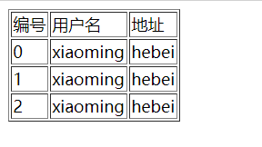

# Spring Boot 整合 Thymeleaf

## 一、模板引擎

<font style="color:rgb(74, 74, 74);">虽然现在慢慢在流行前后端分离开发，但是还是有一些公司在做前后端不分的开发，而在前后端不分的开发中，我们就会需要后端页面模板（实际上，即使前后端分离，也会在一些场景下需要使用页面模板，例如邮件发送模板）。</font>

<font style="color:rgb(86, 90, 95);">Spring Boot提供了自动化配置模块的模板引擎主要有以下几种：</font>

* <font style="color:rgb(86, 90, 95);">Thymeleaf</font>
* <font style="color:rgb(86, 90, 95);">FreeMarker</font>
* <font style="color:rgb(86, 90, 95);">Groovy</font>

<font style="color:rgb(86, 90, 95);">当然，作为最基本的页面模板 JSP，SpringBoot也是支持的，只是使用比较麻烦。当你使用上述模板引擎中的任何一个，它们默认的模板配置路径为：</font><font style="color:rgb(233, 105, 0);background-color:rgb(248, 248, 248);">src/main/resources/templates</font><font style="color:rgb(86, 90, 95);">。</font>

## 二、实战

<font style="color:rgb(74, 74, 74);"></font>

### 1、引入依赖

```xml
<dependency>
    <groupId>org.springframework.boot</groupId>
    <artifactId>spring-boot-starter-thymeleaf</artifactId>
</dependency>
<dependency>
    <groupId>org.springframework.boot</groupId>
    <artifactId>spring-boot-starter-web</artifactId>
</dependency>
```

<font style="color:rgb(74, 74, 74);"></font>

<font style="color:rgb(74, 74, 74);">当然，Thymeleaf 不仅仅能在 Spring Boot 中使用，也可以使用在其他地方，只不过 Spring Boot 针对 Thymeleaf 提供了一整套的自动化配置方案，这一套配置类的属性在 </font><code><font style="color:rgb(255, 56, 96);">org.springframework.boot.autoconfigure.thymeleaf.ThymeleafProperties</font></code><font style="color:rgb(74, 74, 74);"> 中，部分源码如下：</font>

```java
@ConfigurationProperties(prefix = "spring.thymeleaf")
public class ThymeleafProperties {
        private static final Charset DEFAULT_ENCODING = StandardCharsets.UTF_8;
        public static final String DEFAULT_PREFIX = "classpath:/templates/";
        public static final String DEFAULT_SUFFIX = ".html";
        private boolean checkTemplate = true;
        private boolean checkTemplateLocation = true;
        private String prefix = DEFAULT_PREFIX;
        private String suffix = DEFAULT_SUFFIX;
        private String mode = "HTML";
        private Charset encoding = DEFAULT_ENCODING;
        private boolean cache = true;
        //...
}
```

1. <font style="color:rgb(74, 74, 74);">首先通过</font><font style="color:rgb(74, 74, 74);"> </font><font style="color:rgb(255, 56, 96);">@ConfigurationProperties</font><font style="color:rgb(74, 74, 74);"> </font><font style="color:rgb(74, 74, 74);">注解，将</font><font style="color:rgb(74, 74, 74);"> </font><font style="color:rgb(255, 56, 96);">application.properties</font><font style="color:rgb(74, 74, 74);"> </font><font style="color:rgb(74, 74, 74);">前缀为</font><font style="color:rgb(74, 74, 74);"> </font><font style="color:rgb(255, 56, 96);">spring.thymeleaf</font><font style="color:rgb(74, 74, 74);"> </font><font style="color:rgb(74, 74, 74);">的配置和这个类中的属性绑定。</font>
2. <font style="color:rgb(74, 74, 74);">前三个</font><font style="color:rgb(74, 74, 74);"> </font><font style="color:rgb(255, 56, 96);">static</font><font style="color:rgb(74, 74, 74);"> </font><font style="color:rgb(74, 74, 74);">变量定义了默认的编码格式、视图解析器的前缀、后缀等。</font>
3. <font style="color:rgb(74, 74, 74);">从前三行配置中，可以看出来，</font><font style="color:rgb(255, 56, 96);">Thymeleaf</font><font style="color:rgb(74, 74, 74);"> </font><font style="color:rgb(74, 74, 74);">模板的默认位置在</font><font style="color:rgb(74, 74, 74);"> </font><font style="color:rgb(255, 56, 96);">resources/templates</font><font style="color:rgb(74, 74, 74);"> </font><font style="color:rgb(74, 74, 74);">目录下，默认的后缀是</font><font style="color:rgb(74, 74, 74);"> </font><font style="color:rgb(255, 56, 96);">html</font><font style="color:rgb(74, 74, 74);"> </font><font style="color:rgb(74, 74, 74);">。</font>
4. <font style="color:rgb(74, 74, 74);">这些配置，如果开发者不自己提供，则使用 默认的，如果自己提供，则在 </font><font style="color:rgb(255, 56, 96);">application.properties</font><font style="color:rgb(74, 74, 74);"> 中以 </font><font style="color:rgb(255, 56, 96);">spring.thymeleaf</font><font style="color:rgb(74, 74, 74);"> 开始相关的配置。</font>

<font style="color:rgb(74, 74, 74);"></font>

### 2、创建 Controller

<font style="color:rgb(74, 74, 74);">接下来我们就可以创建 Controller 了，实际上引入 Thymeleaf 依赖之后，我们可以不做任何配置。新建的 </font><code><font style="color:rgb(74, 74, 74);">IndexController </font></code><font style="color:rgb(74, 74, 74);">如下：</font>

```java
@Controller
public class IndexController {
    public  String index(Model model){
        List<User> users = new ArrayList<>();
        for (int i = 0; i < 10; i++) {
            User u = new User();
            u.setId((long) i);
            u.setName("xiaoming");
            u.setAddress("hebei");
            users.add(u);
        }
        model.addAttribute("users",users);
        return "index";
    }
}
```

<font style="color:rgb(74, 74, 74);">在 </font><font style="color:rgb(255, 56, 96);">IndexController</font><font style="color:rgb(74, 74, 74);"> 中返回逻辑视图名+数据，逻辑视图名为 </font><font style="color:rgb(255, 56, 96);">index</font><font style="color:rgb(74, 74, 74);"> ，意思我们需要在 </font><font style="color:rgb(255, 56, 96);">resources/templates</font><font style="color:rgb(74, 74, 74);"> 目录下提供一个名为 </font><font style="color:rgb(255, 56, 96);">index.html</font><font style="color:rgb(74, 74, 74);"> 的 </font><font style="color:rgb(255, 56, 96);">Thymeleaf</font><font style="color:rgb(74, 74, 74);"> 模板文件。</font>

<font style="color:rgb(74, 74, 74);"></font>

### 3、创建 Thymeleaf

```java
<!DOCTYPE html>
<html lang="en" xmlns:th="http://www.thymeleaf.org">
<head>
    <meta charset="UTF-8">
    <title>Title</title>
</head>
<body>
<table border="1">
    <tr>
        <td>编号</td>
        <td>用户名</td>
        <td>地址</td>
    </tr>
    <tr th:each="user : ${users}">
        <td th:text="${user.id}"></td>
        <td th:text="${user.name}"></td>
        <td th:text="${user.address}"></td>
    </tr>
</table>
</body>
</html>
```

<font style="color:rgb(74, 74, 74);">在</font><font style="color:rgb(74, 74, 74);"> </font><font style="color:rgb(255, 56, 96);">Thymeleaf</font><font style="color:rgb(74, 74, 74);"> </font><font style="color:rgb(74, 74, 74);">中，通过</font><font style="color:rgb(74, 74, 74);"> </font><font style="color:rgb(255, 56, 96);">th:each</font><font style="color:rgb(74, 74, 74);"> </font><font style="color:rgb(74, 74, 74);">指令来遍历一个集合，数据的展示通过</font><font style="color:rgb(74, 74, 74);"> </font><font style="color:rgb(255, 56, 96);">th:text</font><font style="color:rgb(74, 74, 74);"> </font><font style="color:rgb(74, 74, 74);">指令来实现，</font>

<font style="color:rgb(74, 74, 74);">注意 </font><font style="color:rgb(255, 56, 96);">index.html</font><font style="color:rgb(74, 74, 74);"> 最上面要引入 </font><font style="color:rgb(255, 56, 96);">thymeleaf</font><font style="color:rgb(74, 74, 74);"> 名称空间。</font>

<font style="color:rgb(74, 74, 74);"></font>

<font style="color:rgb(74, 74, 74);">配置完成后，就可以启动项目了，访问 /index 接口，就能看到集合中的数据了：</font>

'

<font style="color:rgb(74, 74, 74);">另外，</font><font style="color:rgb(255, 56, 96);">Thymeleaf</font><font style="color:rgb(74, 74, 74);"> 支持在 </font><font style="color:rgb(255, 56, 96);">js</font><font style="color:rgb(74, 74, 74);"> 中直接获取 </font><font style="color:rgb(255, 56, 96);">Model</font><font style="color:rgb(74, 74, 74);"> 中的变量。例如，在 </font><font style="color:rgb(255, 56, 96);">IndexController</font><font style="color:rgb(74, 74, 74);"> 中有一个变量 </font><font style="color:rgb(255, 56, 96);">username</font><font style="color:rgb(74, 74, 74);"> ：</font>

```java
@Controller
public class IndexController {
    @GetMapping("/index")
    public String index(Model model) {
        model.addAttribute("username", "李四");
        return "index";
    }
}
```

<font style="color:rgb(74, 74, 74);">在页面模板中，可以直接在 js 中获取到这个变量：</font>

```java
<script th:inline="javascript">
    var username = [[${username}]];
    console.log(username)
</script>
```

<font style="color:rgb(74, 74, 74);">这个功能算是 Thymeleaf 的特色之一吧。</font>

<font style="color:rgb(74, 74, 74);"></font>

## 参考

* <http://www.javaboy.org/2019/0613/springboot-thymeleaf.html>


> 更新: 2025-11-19 21:02:04  
> 原文: <https://www.yuque.com/thinkspace/gs6fp8/dortmx>