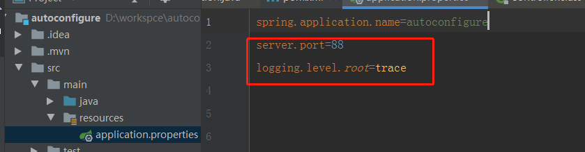
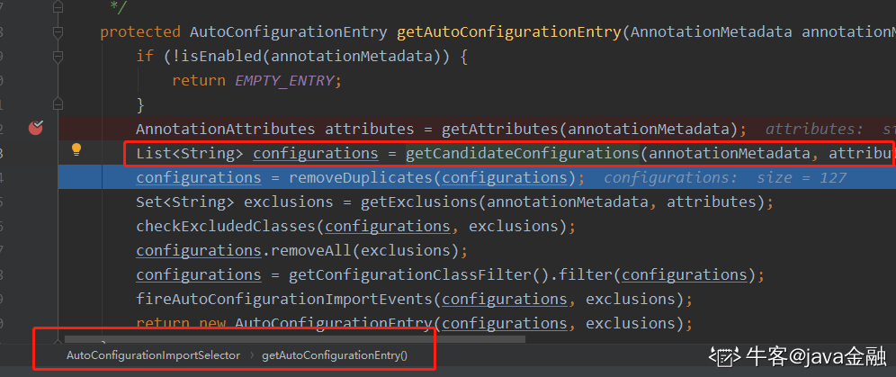
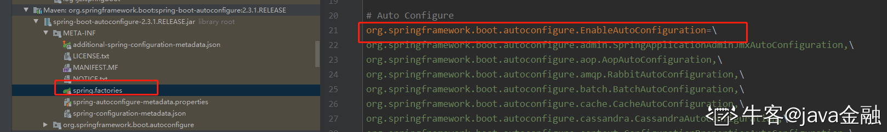
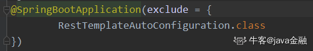
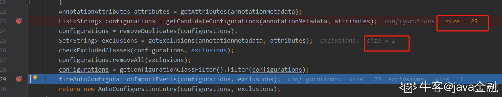
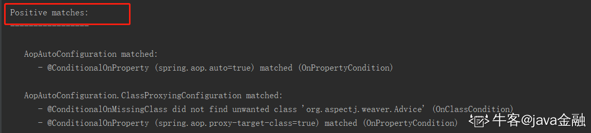
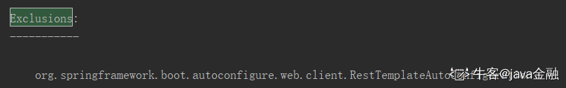
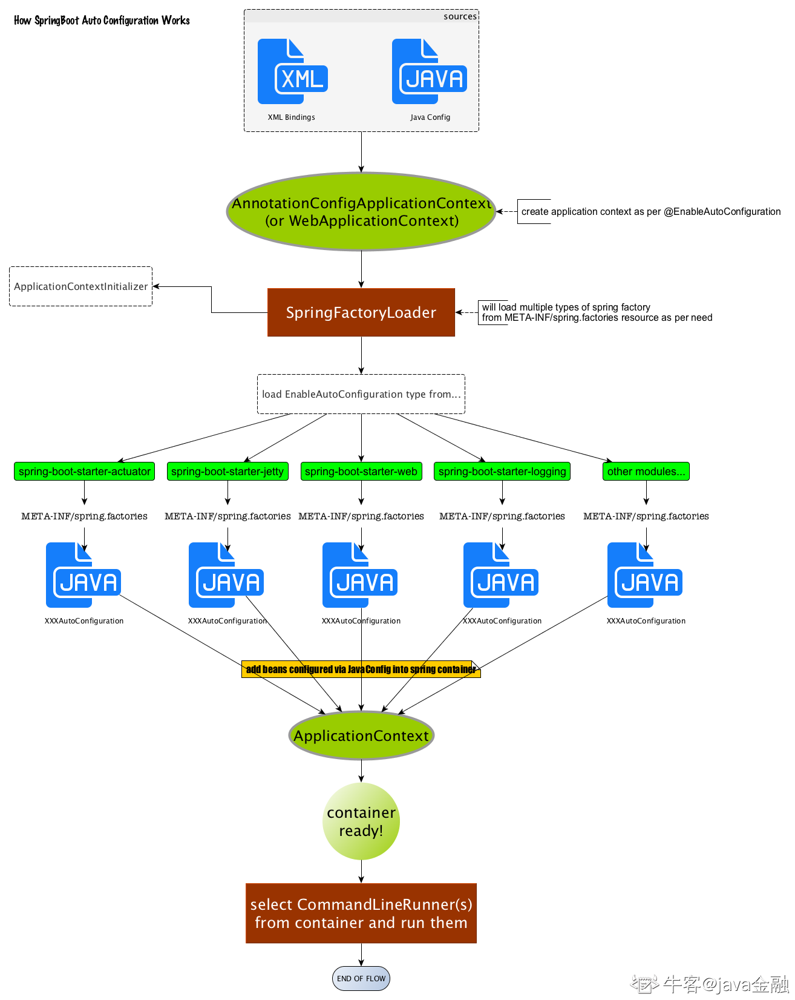

# SpringBoot 自动配置

<font style="color:rgb(51, 51, 51);">首先我们回顾下原来搭建一个</font><font style="color:rgb(255, 86, 27);background-color:rgb(255, 238, 232);">springmvc</font><font style="color:rgb(51, 51, 51);">的</font><font style="color:rgb(255, 86, 27);background-color:rgb(255, 238, 232);">hello-word</font><font style="color:rgb(51, 51, 51);">的</font><font style="color:rgb(255, 86, 27);background-color:rgb(255, 238, 232);">web</font><font style="color:rgb(51, 51, 51);">项目（</font><font style="color:rgb(255, 86, 27);background-color:rgb(255, 238, 232);">xml</font><font style="color:rgb(51, 51, 51);">配置的）我们是不是要在</font><font style="color:rgb(255, 86, 27);background-color:rgb(255, 238, 232);">pom</font><font style="color:rgb(51, 51, 51);">中导入各种依赖，然后各个依赖有可能还会存在版本冲突需要各种排除。当你历尽千辛万苦的把依赖解决了，然后还需要编写</font><font style="color:rgb(255, 86, 27);background-color:rgb(255, 238, 232);">web.xml、springmvc.xml</font><font style="color:rgb(51, 51, 51);">配置文件等。我们只想写</font><font style="color:rgb(255, 86, 27);background-color:rgb(255, 238, 232);">个hello-word</font><font style="color:rgb(51, 51, 51);">项目而已，确把一大把的时间都花在了配置文件和</font><font style="color:rgb(255, 86, 27);background-color:rgb(255, 238, 232);">jar</font><font style="color:rgb(51, 51, 51);">包的依赖上面。大大的影响了我们开发的效率，以及加大了</font><font style="color:rgb(255, 86, 27);background-color:rgb(255, 238, 232);">web</font><font style="color:rgb(51, 51, 51);">开发的难度。为了简化这复杂的配置、以及各个版本的冲突依赖关系，</font><font style="color:rgb(255, 86, 27);background-color:rgb(255, 238, 232);">springBoot</font><font style="color:rgb(51, 51, 51);">就应运而生。我们现在通过</font><font style="color:rgb(255, 86, 27);background-color:rgb(255, 238, 232);">idea</font><font style="color:rgb(51, 51, 51);">创建一个</font><font style="color:rgb(255, 86, 27);background-color:rgb(255, 238, 232);">springboot</font><font style="color:rgb(51, 51, 51);">项目只要分分钟就解决了，你不需要关心各种配置（基本实现零配置）。让你真正的实现了开箱即用。</font>

## <font style="color:rgb(51, 51, 51);">一、SpringBoot 自动配置</font>

<font style="color:rgb(51, 51, 51);">既然</font><font style="color:rgb(255, 86, 27);background-color:rgb(255, 238, 232);">Springboot</font><font style="color:rgb(51, 51, 51);">尽管这么好用，但是作为一个使用者，我们还是比较好奇它是怎么帮我们实现开箱即用的。</font><font style="color:rgb(255, 86, 27);background-color:rgb(255, 238, 232);">Spring Boot</font><font style="color:rgb(51, 51, 51);">有一个全局配置文件：</font><font style="color:rgb(255, 86, 27);background-color:rgb(255, 238, 232);">application.properties或application.yml</font><font style="color:rgb(51, 51, 51);">。在这个全局文件里面可以配置各种各样的参数比如你想改个端口啦</font><font style="color:rgb(255, 86, 27);background-color:rgb(255, 238, 232);">server.port</font><font style="color:rgb(51, 51, 51);"> 或者想调整下日志的级别啦通通都可以配置。更多其他可以配置的属性可以参照官网。</font>[common-application-properties](https://docs.spring.io/spring-boot/docs/2.3.0.RELEASE/reference/htmlsingle/#common-application-properties)



<font style="color:rgb(51, 51, 51);">这么多属性，这些属性在项目是怎么起作用的呢？</font><font style="color:rgb(255, 86, 27);background-color:rgb(255, 238, 232);">SpringBoot</font><font style="color:rgb(51, 51, 51);">项目看下来啥配置也没有，配置”（</font><font style="color:rgb(255, 86, 27);background-color:rgb(255, 238, 232);">application.properties或application.yml</font><font style="color:rgb(51, 51, 51);">除外），既 然从配置上面找不到突破口，那么我们就只能从启动类上面找入口了。启动类也就一个光秃秃的一个</font><font style="color:rgb(255, 86, 27);background-color:rgb(255, 238, 232);">main</font><font style="color:rgb(51, 51, 51);">方法，类上面仅有一个注解 </font><font style="color:rgb(255, 86, 27);background-color:rgb(255, 238, 232);">SpringBootApplication</font> ，<font style="color:rgb(51, 51, 51);">这个注解是</font><font style="color:rgb(255, 86, 27);background-color:rgb(255, 238, 232);">Spring Boot</font><font style="color:rgb(51, 51, 51);">项目必不可少的注解。那么自动配置原理一定和这个注解有着千丝万缕的联系！我们下面来一起看看这个注解吧。</font>

## <font style="color:rgb(51, 51, 51);">二、</font>**<font style="color:rgb(51, 51, 51);">@SpringBootApplication</font>**

```java
@Target(ElementType.TYPE)
@Retention(RetentionPolicy.RUNTIME)
@Documented
@Inherited
@SpringBootConfiguration
@EnableAutoConfiguration
@ComponentScan(excludeFilters = { @Filter(type = FilterType.CUSTOM, classes = TypeExcludeFilter.class),
        @Filter(type = FilterType.CUSTOM, classes = AutoConfigurationExcludeFilter.class) })
public @interface SpringBootApplication {
```

<font style="color:rgb(51, 51, 51);">这里最上面四个注解的话没啥好说的，基本上自己实现过自定义注解的话，都知道分别是什么意思。</font>

* <font style="color:rgb(255, 86, 27);background-color:rgb(255, 238, 232);">@SpringBootConfiguration</font><font style="color:rgb(51, 51, 51);">继承自</font><font style="color:rgb(255, 86, 27);background-color:rgb(255, 238, 232);">@Configuration</font><font style="color:rgb(51, 51, 51);">，二者功能也一致，标注当前类是配置类。</font>
* <font style="color:rgb(255, 86, 27);background-color:rgb(255, 238, 232);">@ComponentScan</font><font style="color:rgb(51, 51, 51);">用于类或接口上主要是指定扫描路径，跟Xml里面的</font><font style="color:rgb(255, 86, 27);background-color:rgb(255, 238, 232);">\<context:component-scan base-package="" /></font><font style="color:rgb(51, 51, 51);">配置一样。</font><font style="color:rgb(255, 86, 27);background-color:rgb(255, 238, 232);">springboot</font><font style="color:rgb(51, 51, 51);">如果不写这个扫描路径的话，默认就是启动类的路径。</font>
* <font style="color:rgb(255, 86, 27);background-color:rgb(255, 238, 232);">@EnableAutoConfiguration</font>

```java
@Target(ElementType.TYPE)
@Retention(RetentionPolicy.RUNTIME)
@Documented
@Inherited
@AutoConfigurationPackage
@Import(AutoConfigurationImportSelector.class)
public @interface EnableAutoConfiguration {
```

<font style="color:rgb(51, 51, 51);">这个注解我们重点看下</font><font style="color:rgb(255, 86, 27);background-color:rgb(255, 238, 232);">AutoConfigurationImportSelector</font><font style="color:rgb(51, 51, 51);">这个类 </font><font style="color:rgb(255, 86, 27);background-color:rgb(255, 238, 232);">getCandidateConfigurations</font> <font style="color:rgb(51, 51, 51);">这个方法里面通过</font><code><font style="color:rgb(255, 86, 27);background-color:rgb(255, 238, 232);">SpringFactoriesLoader.loadFactoryNames() </font></code><font style="color:rgb(51, 51, 51);">扫描所有具有 </font><code><font style="color:rgb(255, 86, 27);background-color:rgb(255, 238, 232);">META-INF/spring.factories</font></code><font style="color:rgb(51, 51, 51);">的</font><code><font style="color:rgb(255, 86, 27);background-color:rgb(255, 238, 232);">jar</font></code><font style="color:rgb(51, 51, 51);">包（ </font><code><font style="color:rgb(51, 51, 51);">spring.factories</font></code><font style="color:rgb(51, 51, 51);"> 我们可以理解成 </font><font style="color:rgb(255, 86, 27);background-color:rgb(255, 238, 232);">Spring Boot</font><font style="color:rgb(51, 51, 51);"> 自己的 </font><font style="color:rgb(255, 86, 27);background-color:rgb(255, 238, 232);">SPI</font><font style="color:rgb(51, 51, 51);"> 机制）。</font>



<code><font style="color:rgb(255, 86, 27);background-color:rgb(255, 238, 232);">spring-boot-autoconfigure-x.x.x.x.jar</font></code><font style="color:rgb(51, 51, 51);">里就有一个</font><code><font style="color:rgb(51, 51, 51);">spring.factories</font></code><font style="color:rgb(51, 51, 51);">文件。</font><font style="color:rgb(255, 86, 27);background-color:rgb(255, 238, 232);">spring.factories</font><font style="color:rgb(51, 51, 51);">文件由一组一组的</font><font style="color:rgb(255, 86, 27);background-color:rgb(255, 238, 232);">Key = value</font><font style="color:rgb(51, 51, 51);">的形式，其中一个</font><font style="color:rgb(255, 86, 27);background-color:rgb(255, 238, 232);">key</font><font style="color:rgb(51, 51, 51);">是EnableAutoConfiguration类的全类名，而它的value是一个以</font><font style="color:rgb(255, 86, 27);background-color:rgb(255, 238, 232);">AutoConfiguration</font><font style="color:rgb(51, 51, 51);">结尾的类名的列表，有</font><code>redis<font style="color:rgb(255, 86, 27);background-color:rgb(255, 238, 232);">、mq</font></code><font style="color:rgb(51, 51, 51);">等这些类名以逗号分隔。</font>



<font style="color:rgb(51, 51, 51);">我们在回到</font><code><font style="color:rgb(255, 86, 27);background-color:rgb(255, 238, 232);">getAutoConfigurationEntry</font></code><font style="color:rgb(51, 51, 51);">这个方法当执行完</font><code><font style="color:rgb(255, 86, 27);background-color:rgb(255, 238, 232);">getCandidateConfigurations</font></code><font style="color:rgb(51, 51, 51);">这个方法的时候我们可以看到此时总共加载了</font><font style="color:rgb(255, 86, 27);background-color:rgb(255, 238, 232);">127</font><font style="color:rgb(51, 51, 51);">个自动配置类。</font>


<font style="color:rgb(51, 51, 51);">这些类难道都要加载进去吗？</font><code><font style="color:rgb(255, 86, 27);background-color:rgb(255, 238, 232);">springboot</font></code><font style="color:rgb(51, 51, 51);">还是没有那么傻的，它提倡的话是按需加载。</font>

* <font style="color:rgb(51, 51, 51);">它会去掉重复的类</font>
* <font style="color:rgb(51, 51, 51);">过滤掉我们配置了</font><font style="color:rgb(255, 86, 27);background-color:rgb(255, 238, 232);">exclude</font><font style="color:rgb(51, 51, 51);">注解的类，下面配置就会过滤掉</font><code><font style="color:rgb(255, 86, 27);background-color:rgb(255, 238, 232);">RestTemplateAutoConfiguration</font></code><font style="color:rgb(51, 51, 51);">这个类</font>



* <font style="color:rgb(51, 51, 51);">经过上面的处理，剩下的这些自动配置的类如果要起作用的话，是需要满足一定的条件的。这些条件的满足</font><font style="color:rgb(255, 86, 27);background-color:rgb(255, 238, 232);">spring boot</font><font style="color:rgb(51, 51, 51);">是通过条件注解来实现的。</font>

```java
@ConditionalOnBean：当容器里有指定Bean的条件下
@ConditionalOnClass：当类路径下有指定的类的条件下
@ConditionalOnExpression：基于SpEL表达式为true的时候作为判断条件才去实例化
@ConditionalOnJava：基于JVM版本作为判断条件
@ConditionalOnJndi：在JNDI存在的条件下查找指定的位置
@ConditionalOnMissingBean：当容器里没有指定Bean的情况下
@ConditionalOnMissingClass：当容器里没有指定类的情况下
@ConditionalOnWebApplication：当前项目是Web项目的条件下
@ConditionalOnNotWebApplication：当前项目不是Web项目的条件下
@ConditionalOnProperty：指定的属性是否有指定的值
@ConditionalOnResource：类路径是否有指定的值
@ConditionalOnOnSingleCandidate：当指定Bean在容器中只有一个，或者有多个但是指定首选的Bean
```

<font style="color:rgb(51, 51, 51);">这些注解都组合了</font><font style="color:rgb(255, 86, 27);background-color:rgb(255, 238, 232);">@Conditional</font><font style="color:rgb(51, 51, 51);">注解，只是使用了不同的条件组合最后为true时才会去实例化需要实例化的类，否则忽略过滤掉。我们在回到代码可以看到经过了条件判断过滤后我们剩下符合条件的自动配置类只剩23个了。其他的都是因为不满足条件注解而被过滤了。</font>



<font style="color:rgb(51, 51, 51);">如果我们想知道哪些自动配置类被过滤了，是由于什么原因被过滤了，以及加载了哪些类等。</font><font style="color:rgb(255, 86, 27);background-color:rgb(255, 238, 232);">spring boot</font><font style="color:rgb(51, 51, 51);">都为我们记录了日志。还是非常贴心的。我们可以调整下我们日志的级别改为</font><font style="color:rgb(255, 86, 27);background-color:rgb(255, 238, 232);">debug</font><font style="color:rgb(51, 51, 51);">。然后我们就能看到以下日志了</font>





<font style="color:rgb(51, 51, 51);">这里就截取了部分日志。总共分别有下面四部分日志：</font>

* <font style="color:rgb(255, 86, 27);background-color:rgb(255, 238, 232);">Positive matches</font><font style="color:rgb(51, 51, 51);">：</font><font style="color:rgb(255, 86, 27);background-color:rgb(255, 238, 232);">@Conditional</font><font style="color:rgb(51, 51, 51);">条件为真，配置类被Spring容器加载。</font>
* <font style="color:rgb(255, 86, 27);background-color:rgb(255, 238, 232);">Negative matches:</font><font style="color:rgb(51, 51, 51);"> </font><font style="color:rgb(255, 86, 27);background-color:rgb(255, 238, 232);">@Conditional</font><font style="color:rgb(51, 51, 51);">条件为假，配置类未被Spring容器加载。</font>
* <font style="color:rgb(255, 86, 27);background-color:rgb(255, 238, 232);">Exclusions</font><font style="color:rgb(51, 51, 51);">： 我们明确了不需要加载的类。比如在上面启动类配置的</font><font style="color:rgb(255, 86, 27);background-color:rgb(255, 238, 232);">RestTemplateAutoConfiguration</font><font style="color:rgb(51, 51, 51);">类</font>
* <font style="color:rgb(255, 86, 27);background-color:rgb(255, 238, 232);">Unconditional classes</font><font style="color:rgb(51, 51, 51);">： 自动配置类不包含任何类级别的条件，也就是说，类始终会被自动加载。</font>

## <font style="color:rgb(51, 51, 51);">三、自动配置生效</font>

<font style="color:rgb(51, 51, 51);">我们以</font><code><font style="color:rgb(255, 86, 27);background-color:rgb(255, 238, 232);">ServletWebServerFactoryAutoConfiguration</font></code><font style="color:rgb(51, 51, 51);">配置类为例，解释一下全局配置文件中的属性如何生效，比如：</font><code><font style="color:rgb(255, 86, 27);background-color:rgb(255, 238, 232);">server.port=88</font></code><font style="color:rgb(51, 51, 51);">，是如何生效的（当然不配置也会有默认值，这个默认值来自于</font><code><font style="color:rgb(255, 86, 27);background-color:rgb(255, 238, 232);">org.apache.catalina.startup.Tomcat</font></code><font style="color:rgb(51, 51, 51);">）。</font>

```java
// 标记为配置类
@Configuration(proxyBeanMethods = false)
@AutoConfigureOrder(Ordered.HIGHEST_PRECEDENCE)
// 如果有ServletRequest.class 才会生效
@ConditionalOnClass(ServletRequest.class)
@ConditionalOnWebApplication(type = Type.SERVLET)
// 把@ConfigurationProperties注解的类注入为Spring容器的Bean。
@EnableConfigurationProperties(ServerProperties.class)
@Import({ ServletWebServerFactoryAutoConfiguration.BeanPostProcessorsRegistrar.class,
        ServletWebServerFactoryConfiguration.EmbeddedTomcat.class,
        ServletWebServerFactoryConfiguration.EmbeddedJetty.class,
        ServletWebServerFactoryConfiguration.EmbeddedUndertow.class })
public class ServletWebServerFactoryAutoConfiguration {
```

<font style="color:rgb(51, 51, 51);">我们可以发现</font><font style="color:rgb(255, 86, 27);background-color:rgb(255, 238, 232);">EnableConfigurationProperties</font><font style="color:rgb(51, 51, 51);">注解里面配置的</font><font style="color:rgb(255, 86, 27);background-color:rgb(255, 238, 232);">ServerProperties.class</font>

```java
@ConfigurationProperties(prefix = "server", ignoreUnknownFields = true)
public class ServerProperties {

    /**
     * Server HTTP port.
     */
    private Integer port;
```

<font style="color:rgb(51, 51, 51);">在这个类上有一个注解：</font><font style="color:rgb(255, 86, 27);background-color:rgb(255, 238, 232);">@ConfigurationProperties</font><font style="color:rgb(51, 51, 51);">，它的作用就是从配置文件中绑定属性到对应的bean上(也就是把我们</font><font style="color:rgb(255, 86, 27);background-color:rgb(255, 238, 232);">application.properties</font><font style="color:rgb(51, 51, 51);">对应的server.port映射到</font><font style="color:rgb(255, 86, 27);background-color:rgb(255, 238, 232);">ServerProperties</font><font style="color:rgb(51, 51, 51);"> 类中的</font><font style="color:rgb(255, 86, 27);background-color:rgb(255, 238, 232);">port</font><font style="color:rgb(51, 51, 51);">属性)。而@</font><font style="color:rgb(255, 86, 27);background-color:rgb(255, 238, 232);">EnableConfigurationProperties</font><font style="color:rgb(51, 51, 51);">这个注解就是把已经绑定了属性的</font><font style="color:rgb(255, 86, 27);background-color:rgb(255, 238, 232);">bean</font><font style="color:rgb(51, 51, 51);">（</font><font style="color:rgb(255, 86, 27);background-color:rgb(255, 238, 232);">ServerProperties</font><font style="color:rgb(51, 51, 51);">）注入到</font><font style="color:rgb(255, 86, 27);background-color:rgb(255, 238, 232);">spring</font><font style="color:rgb(51, 51, 51);">容器中（相当于@</font><font style="color:rgb(255, 86, 27);background-color:rgb(255, 238, 232);">Component</font><font style="color:rgb(51, 51, 51);">注解一样）。</font>

<font style="color:rgb(51, 51, 51);">所有在配置文件中能配置的属性都是在</font><font style="color:rgb(255, 86, 27);background-color:rgb(255, 238, 232);">xxxxPropertites</font><font style="color:rgb(51, 51, 51);">类中封装着，配置文件能配置什么就可以参照某个功能对应的这个属性类。</font>

## 四、总结

<font style="color:rgb(51, 51, 51);">面试的时候应该不需要回答的这么详细可以参考下以下答案：</font>

<font style="color:rgb(51, 51, 51);background-color:rgb(233, 248, 245);">Spring Boot启动的时候会通过</font><code><font style="color:rgb(51, 51, 51);background-color:rgb(233, 248, 245);">@EnableAutoConfiguration</font></code><font style="color:rgb(51, 51, 51);background-color:rgb(233, 248, 245);">注解找到所有 jar 包中</font><code><font style="color:rgb(51, 51, 51);background-color:rgb(233, 248, 245);">META-INF/spring.factories</font></code><font style="color:rgb(51, 51, 51);background-color:rgb(233, 248, 245);">配置文件中的所有自动配置类，并对其进行加载，而这些自动配置类都是以</font><code><font style="color:rgb(51, 51, 51);background-color:rgb(233, 248, 245);">AutoConfiguration</font></code><font style="color:rgb(51, 51, 51);background-color:rgb(233, 248, 245);">结尾来命名的，它实际上就是一个</font><code><font style="color:rgb(51, 51, 51);background-color:rgb(233, 248, 245);">JavaConfig</font></code><font style="color:rgb(51, 51, 51);background-color:rgb(233, 248, 245);">形式的Spring容器配置类，它能通过以</font><code><font style="color:rgb(51, 51, 51);background-color:rgb(233, 248, 245);">Properties</font></code><font style="color:rgb(51, 51, 51);background-color:rgb(233, 248, 245);">结尾命名的类中取得在全局配置文件中配置的属性如：</font><code><font style="color:rgb(51, 51, 51);background-color:rgb(233, 248, 245);">server.port</font></code><font style="color:rgb(51, 51, 51);background-color:rgb(233, 248, 245);">，而</font><code><font style="color:rgb(51, 51, 51);background-color:rgb(233, 248, 245);">XxxxProperties</font></code><font style="color:rgb(51, 51, 51);background-color:rgb(233, 248, 245);">类是通过</font><code><font style="color:rgb(51, 51, 51);background-color:rgb(233, 248, 245);">@ConfigurationProperties</font></code><font style="color:rgb(51, 51, 51);background-color:rgb(233, 248, 245);">注解与全局配置文件中对应的属性进行绑定的。</font>



* <font style="color:rgb(255, 86, 27);background-color:rgb(255, 238, 232);">SpringBoot</font><font style="color:rgb(51, 51, 51);">启动会加载大量的自动配置类（通过“</font><font style="color:rgb(255, 86, 27);background-color:rgb(255, 238, 232);">SPI</font><font style="color:rgb(51, 51, 51);">”的方式），然后会根据条件注解保留一些需要的类。</font>
* <font style="color:rgb(51, 51, 51);">我们新引入一个组件，可以先看看springBoot是否已经有默认的提供。</font>
* <font style="color:rgb(255, 86, 27);background-color:rgb(255, 238, 232);">SpringBoot</font><font style="color:rgb(51, 51, 51);">基本实现了“零配置“，并且开箱即用。</font>


> 更新: 2022-04-30 21:24:29  
> 原文: <https://www.yuque.com/thinkspace/gs6fp8/pfz3gf>