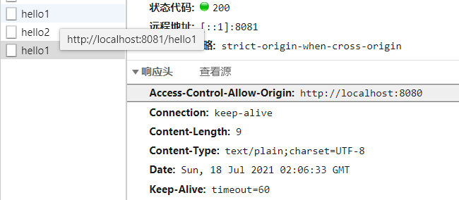

# Spring Boot 跨域问题

## 一、同源策略

同源策略是由 `Netscape `提出的一个著名的安全策略，它是浏览器最核心也最基本的安全功能，现在所有支持 `JavaScript `的浏览器都会使用这个策略。所谓同源是指**协议**、**域名**以及**端口**要相同。

同源策略是基于安全方面的考虑提出来的，这个策略本身没问题，但是我们在实际开发中，由于各种原因又经常有跨域的需求，传统的跨域方案是` JSONP`，`JSONP `虽然能解决跨域但是有一个很大的局限性，那就是只支持 `GET `请求，不支持其他类型的请求，而今天我们说的 `CORS`（跨域源资源共享）（`CORS`，`Cross-origin resource sharing`）是一个 W3C 标准，它是一份浏览器技术的规范，提供了 Web 服务从不同网域传来沙盒脚本的方法，以避开浏览器的同源策略，这是 `JSONP `模式的现代版。

在 Spring 框架中，对于 `CORS `也提供了相应的解决方案，今天我们就来看看 SpringBoot 中如何实现 `CORS `。

## 二、实践

首先创建两个普通的 Spring Boot 项目，第一个命名为 `provider `提供服务，第二个命名为 `consumer `消费服务，第一个配置端口为 `8080 `，第二个配置配置为 `8081 `，然后在 provider 上提供两个接口，一个 `get `，一个 `post `，如下：

```java
@RestController
public class HelloController {

    @GetMapping("/hello1")
    public String hello1(){
        return "get hello";
    }

    @PostMapping("hello2")
    public String hello2(){
        return "post hello";
    }
}

```

在 `consumer `的 `resources/static` 目录下创建一个 html 文件，发送一个简单的 ajax 请求，如下：

```html
<!DOCTYPE html>
<html lang="en">
<head>
    <meta charset="UTF-8">
    <title>Title</title>
    <script src="https://cdn.staticfile.org/jquery/1.10.2/jquery.min.js"></script>
</head>
<body>
<div id="app"></div>
<input type="button" onclick="btnClick()" value="get_button">
<input type="button" onclick="btnClick2()" value="post_button">
<script>
    function btnClick() {
        $.get('http://localhost:8081/hello1', function (msg) {
            $("#app").html(msg);
        });
    }

    function btnClick2() {
        $.post('http://localhost:8081/hello2', function (msg) {
            $("#app").html(msg);
        });
    }
</script>

</body>
</html>
```

然后分别启动两个项目，访问 <http://localhost:8080/hello.html> 点击发送请求按钮，观察浏览器控制台如下：

```plain
Access to XMLHttpRequest at 'http://localhost:8080/hello' from origin 'http://localhost:8081' has been blocked by CORS policy: No 'Access-Control-Allow-Origin' header is present on the requested resource.
```

可以看到，由于同源策略的限制，请求无法发送成功。

使用 CORS 可以在前端代码不做任何修改的情况下，实现跨域，那么接下来看看在 `provider` 中如何配置。首先可以通过 `@CrossOrigin` 注解配置某一个方法接受某一个域的请求，如下：

```java
@RestController
public class HelloController {

    @CrossOrigin(value = "http://localhost:8080")
    @GetMapping("/hello1")
    public String hello1(){
        return "get hello";
    }

    @CrossOrigin(value = "http://localhost:8080")
    @PostMapping("hello2")
    public String hello2(){
        return "post hello";
    }
}

```

这个注解表示这两个接口接受来自 `http://localhost:8080` 地址的请求，配置完成后，重启 `provider `，再次发送请求，浏览器控制台就不会报错了，`consumer` 也能拿到数据了。

此时观察浏览器请求网络控制台，可以看到响应头中多了如下信息：



这个表示服务端愿意接收来自 <http://localhost:8081> 的请求，拿到这个信息后，浏览器就不会再去限制本次请求的跨域了。

## 参考

* <http://www.javaboy.org/2019/0613/springboot-cors.html>


> 更新: 2022-04-09 16:53:08  
> 原文: <https://www.yuque.com/thinkspace/gs6fp8/okbn9h>